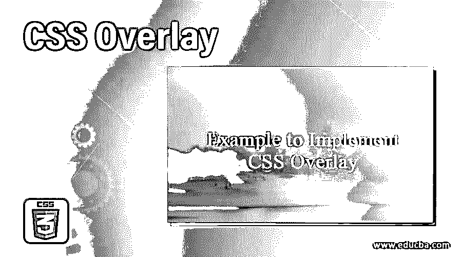
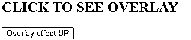
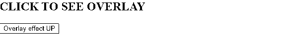

# CSS 覆盖

> 原文：<https://www.educba.com/css-overlay/>




## CSS 覆盖介绍

有很多时候，我们点击一个页面，屏幕上弹出另一个页面，点击就消失了。这些弹出窗口可以是广告、表格、通知或任何其他东西，这取决于页面的要求。这种屏幕对屏幕的效果被称为叠加。它使用 html、CSS 和 JavaScript 的组合来实现。这在创建动态页面时很有用，用户可以控制他们是否想看到弹出屏幕。当我们一步一步地研究如何实现它时，叠加的概念将会得到更好的理解。

**语法**

<small>网页开发、编程语言、软件测试&其他</small>

实现覆盖的过程分三步完成。首先是覆盖层的 CSS 编码。在这里，我们可以定义所需的覆盖类型，并相应地设置样式。接下来，我们称之为 HTML 页面的样式。最后，我们使用 JavaScript 函数实现覆盖图的可见性。

CSS 覆盖样式示例如下:

```
#overlayCSS{
position: fixed;
display: none;
height: 50%;
width: 50%;
background-color: wheat;
opacity: 50%;
cursor: pointer;
}
```

**Note:** That additional features can be added in the styling of the overlay element. It totally depends upon the choice of the developers, how they want to design their page. Let’s look into some examples and see how overlay screens work.

### 实现 CSS 覆盖的示例

以下是要实施的示例:

#### 1.使用 JavaScript 和外部 CSS 覆盖屏幕

*   由于我们使用外部 CSS，我们将首先创建 CSS 文件。
*   在 CSS 文件中，我们将只定义 ID，它具有覆盖元素的样式属性。
*   最终的 CSS 文件应该如下所示:

**代码:**

```
#overlayCSS{
position: fixed;
display: none;
height: 50%;
width: 50%;
background-color: wheat;
opacity: 50%;
cursor: pointer;
}
```

*   接下来，我们将编写 HTML 页面。请注意，所有的魔法都发生在 HTML 页面中，所以我们需要仔细编码。
*   首先，在 head 部分，我们将像这样调用外部样式表:

**代码:**

```
<head>
<title>Overlay Demo</title>
<link rel = "stylesheet" href = "overlay.css">
</head>
```

*   接下来，在主体部分，我们将首先定义 JavaScript 函数，它将处理覆盖屏幕的出现和消失。脚本应该是这样的:

**代码:**

```
<script>
function up() {
document.getElementById("overlayCSS").style.display = "block";
}
function down() {
document.getElementById("overlayCSS").style.display = "none";
}
</script>
```

*   现在我们将最终调用 CSS 文件中创建的 ID，使用一个元素。我们将定义它的 on-click 属性，这样，单击覆盖屏幕将使它消失。
*   接下来，我们将创建一个按钮，其 click 属性调用负责覆盖屏幕可见性的函数。以上两点的代码应该是这样的:

**代码:**

```
<div id="overlayCSS" onclick="down()"></div>
<h2>CLICK TO SEE OVERLAY</h2>
<button onclick="up()">Overlay effect UP</button>
```

*   最终的 HTML 文件应该如下所示:

**代码:**

```
<html>
<head>
<title>Overlay Demo</title>
<link rel = "stylesheet" href = "overlay.css">
</head>
<body>
<script>
function up() {
document.getElementById("overlayCSS").style.display = "block";
}
function down() {
document.getElementById("overlayCSS").style.display = "none";
}
</script>
<div id="overlayCSS" onclick="down()"></div>
<h2>CLICK TO SEE OVERLAY</h2>
<button onclick="up()">Overlay effect UP</button>
</body>
</html>
```

*   我们将保存这个 html 页面，并通过浏览器打开它。初始页面将如下所示:




*   点击该按钮将显示该叠加屏幕:




*   点击覆盖屏幕上的任何地方都会使覆盖屏幕消失。

#### 2.使用内部 CSS 通过 JavaScript 覆盖

*   在这个例子中，我们使用了内部 CSS。所以所有的功能都在 HTML 文件中。
*   首先，在页面的 head 部分，我们将通过创建一个 ID 来定义覆盖屏幕的样式。我们还将创建一个类来设计覆盖屏幕上的内容。样式标签的编码如下:

**代码:**

```
<style>
#overlayCSS{
position: fixed;
display: none;
height: 50%;
width:50%;
background-color: cyan;
opacity: 50%;
cursor: default;
}
.content{
font-family: 'Segoe UI', Tahoma, Geneva, Verdana, sans-serif;
color: darkblue;
margin: 100px;
}
</style>
```

*   接下来，在主体部分，我们将创建 JavaScript 函数来显示和隐藏覆盖屏幕。脚本标记应编码如下:

**代码:**

```
<script>
function up(){
document.getElementById("overlayCSS").style.display="block";
}
function down(){
document.getElementById("overlayCSS").style.display="none";
}
</script>
```

*   最后，我们将使用上面定义的样式和脚本创建内容。我们将调用 div 元素，并使用 ID、类和函数来创建叠加效果。编码应该如下所示:

**代码:**

```
<div id="overlayCSS">
<div class="content">TEXT ON THE OVERLAY SCREEN
<br><button onclick="down()">Click to Close overlay</button>
</div>
</div>
<h2>CLICK TO SEE OVERLAY</h2>
<button onclick="up()">Overlay Up</button>
```

*   最终的 HTML 页面应该是这样的:

**代码:**

```
<html>
<head>
<title>Overlay Using Internal CSS</title>
<style>
#overlayCSS{
position: fixed;
display: none;
height: 50%;
width:50%;
background-color: cyan;
opacity: 50%;
cursor: default;
}
.content{
font-family: 'Segoe UI', Tahoma, Geneva, Verdana, sans-serif;
color: darkblue;
margin: 100px;
}
</style>
</head>
<body>
<script>
function up(){
document.getElementById("overlayCSS").style.display="block";
}
function down(){
document.getElementById("overlayCSS").style.display="none";
}
</script>
<div id="overlayCSS">
<div class="content">TEXT ON THE OVERLAY SCREEN
<br><button onclick="down()">Click to Close overlay</button>
</div>
</div>
<h2>CLICK TO SEE OVERLAY</h2>
<button onclick="up()">Overlay Up</button>
</body>
</html>
```

*   保存此 html 页面并通过浏览器打开它，将获取以下页面作为结果:


*   单击该按钮，将弹出一个覆盖屏幕，如下所示:


*   点击第二个按钮将关闭覆盖屏幕并返回初始页面。

**解释:**在上面的例子中，我们探讨了叠加屏幕的基本用法。HTML 和 CSS 的这个特性或属性非常关键。这可以在单击任何元素时创建弹出窗口时使用。这个弹出窗口可以是广告、用户要填写的表格、任何通知，甚至是警告。开发人员可以使用这些基本代码，并对其进行相应的调整，以生成他们选择的覆盖图。弹出或覆盖屏幕上也可以有图像和其他内容。确保你已经探索了所有提供的选项。

### 推荐文章

这是一个 CSS 覆盖的指南。为了更好地理解，我们在这里用适当的语法和相应的例子来讨论 CSS 覆盖的介绍。您也可以浏览我们的其他相关文章，了解更多信息——

1.  [CSS 边框样式](https://www.educba.com/css-border-style/)
2.  [CSS 行](https://www.educba.com/css-row/)
3.  [CSS 内边框](https://www.educba.com/css-inner-border/)
4.  [CSS 背景色](https://www.educba.com/css-background-color/)


