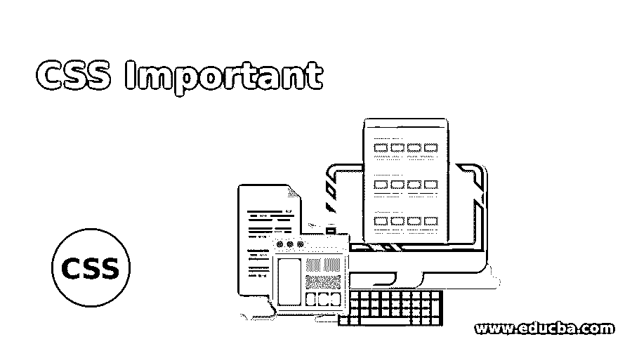
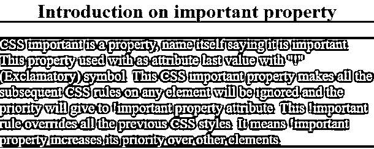
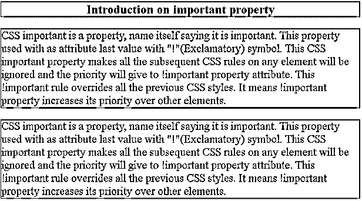
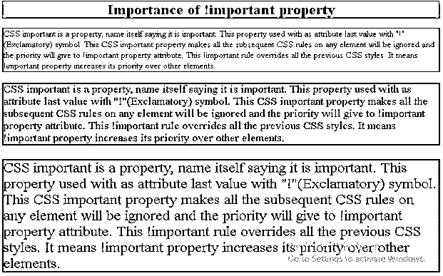

# CSS 很重要

> 原文：<https://www.educba.com/css-important/>




## CSS 简介重要

CSS important 是一个属性，名字本身就说明它很重要。此属性与一起使用，作为属性的最后一个值(感叹号)符号。这个属性使得所有后续 CSS 规则中的任何元素都将被忽略，而优先级将给予！重要的财产属性。这个！重要规则覆盖所有以前的样式。意思是！重要属性增加了它相对于其他元素的优先级。

**优势:**

<small>网页开发、编程语言、软件测试&其他</small>

*   容易覆盖任何元素属性。

### CSS 中的重要属性是如何工作的？

这个 CSS！重要属性应用在分号(；属性值结尾的)。!重要的是将该元素优先于所有其他后续元素。

**语法:**

```
element {
attribute: value !important;//As you see !important property always at the end of the attribute value means just before semicolon(;)
}
Consider below Example for illustration:
p {
color: blue !important;
}
#id {
color: red;
}
<p id="id">I am Paramesh</p>
```

**解释:**在上面的例子中，段落将是蓝色的，即使“id”选择器具有更高的优先级。这就结束了！重要属性会覆盖 id 选择器属性。

### CSS 的例子很重要

下面举几个例子

#### 示例#1

具有重要属性的颜色和背景色:

**代码:**

```
<!DOCTYPE html>
<html>
<head>
<title>Important Property</title>
<style>
h1
{
color: green !important;
background-color: gray !important;
text-align: center !important;
}
p{
background-color: fuchsia !important;
color: white !important;
font-size: 23px !important;
}
#impID
{
background-color: red;
color: blue;
}
</style>
</head>
<body>
<h1 id="impID">Introduction on important property</h1>
<p id="impID">CSS important is a property, name itself saying it is important. This property used with as attribute last value with "!"(Exclamatory) symbol. This CSS important property makes all the subsequent CSS rules on any element will be ignored and the priority will give to !important property attribute. This !important rule overrides all the previous CSS styles. It means !important property increases its priority over other elements.</p>
</body>
</html>
```

**输出:**




**说明:**如你所见，上面的代码颜色和背景颜色得到了优先考虑！仅重要属性，但它不应用 impID 中给定的颜色和背景色。

#### 实施例 2

与...接壤！重要属性示例:

**代码:**

```
<!DOCTYPE html>
<html>
<head>
<title>Important Property</title>
<style>
h1
{
color: green !important;/*All the h1 tags will be applied by only green color*/
text-align: center;
border: solid 2px red !important;/*All the h1 tags will be applied by only red color, solid border and 2px size*/
}
p{
border: solid 2px red !important;/*All the h1 tags will be applied by only red color, solid border and 2px size*/
color: blue !important;/*All the h1 tags will be applied by only green color*/
font-size: 30px !important;
}
/*This styles will not apply because this are overide by above !important property*/
#h1, #p1, #p2
{
border: solid 10px brown;
color: pink;
}
</style>
</head>
<body>
<h1 id="h1">Introduction on important property</h1>
<p id="p1">CSS important is a property, name itself saying it is important. This property used with as attribute last value with "!"(Exclamatory) symbol. This CSS important property makes all the subsequent CSS rules on any element will be ignored and the priority will give to !important property attribute. This !important rule overrides all the previous CSS styles. It means !important property increases its priority over other elements.</p>
<p id="p2">CSS important is a property, name itself saying it is important. This property used with as attribute last value with "!"(Exclamatory) symbol. This CSS important property makes all the subsequent CSS rules on any element will be ignored and the priority will give to !important property attribute. This !important rule overrides all the previous CSS styles. It means !important property increases its priority over other elements.</p>
</body>
</html>
```

**输出:**




**说明:**如你所见，上面的代码颜色和边框得到了优先！仅重要属性，但它不应用 h1、p1 和 p2 IDs 中给定的颜色和边框。

#### 实施例 3

字体大小和颜色不用！重要属性示例:

**代码:**

```
<!DOCTYPE html>
<html>
<head>
<title>Important Property</title>
<style>
h1
{
color: blue !important;/*All the h1 tags will be applied by only blue color*/
text-align: center;
border: solid 2px green !important;/*All the h1 tags will be applied by only red color, solid border and 2px size*/
}
p{
border: solid 2px red !important;/*All the h1 tags will be applied by only red color, solid border and 2px size*/
color: red !important;/*All the h1 tags will be applied by only green color*/
font-size: 30px;/*This we have not taken important so if some where we have this font-size property then this will be overridden*/
}
/*This styles will not apply because this are overide by above !important property*/
#p1
{
font-size: 20px;/*30px font-size will be overridden by 20px*/
background-color: lightgreen;/*background color we have not taken in the above so this background color applied*/
color: blue;/*This will not overridden becuase already above "p" color taken as important*/
}
#p2
{
font-size: 25px;/*30px font-size will be overridden by 25px*/
background-color: lightgray;/*background color we have not taken in the above so this background color applied*/
color: blue;
}
#p3
{
font-size: 32px;/*30px font-size will be overridden by 32px*/
background-color: lightpink;/*background color we have not taken in the above so this background color applied*/
color: blue;
}
</style>
</head>
<body>
<h1 id="h1">Importance of !important property</h1>
<p id="p1">CSS important is a property, name itself saying it is important. This property used with as attribute last value with "!"(Exclamatory) symbol. This CSS important property makes all the subsequent CSS rules on any element will be ignored and the priority will give to !important property attribute. This !important rule overrides all the previous CSS styles. It means !important property increases its priority over other elements.</p>
<p id="p2">CSS important is a property, name itself saying it is important. This property used with as attribute last value with "!"(Exclamatory) symbol. This CSS important property makes all the subsequent CSS rules on any element will be ignored and the priority will give to !important property attribute. This !important rule overrides all the previous CSS styles. It means !important property increases its priority over other elements.</p>
<p id="p3">CSS important is a property, name itself saying it is important. This property used with as attribute last value with "!"(Exclamatory) symbol. This CSS important property makes all the subsequent CSS rules on any element will be ignored and the priority will give to !important property attribute. This !important rule overrides all the previous CSS styles. It means !important property increases its priority over other elements.</p>
</body>
</html>
```

**输出:**




**说明:**第一个 CSS 编译器应用全部！重要的属性样式。如果我们两次都没有任何重要的属性，那么第二个选择器属性将被自动应用。在上面的颜色，边框，页眉都是从 h1 和 p 选择器中应用的！重要财产。而 p 选择器中的字体大小则不是！重要属性因此 p1、p2 和 p3 下面的 id 选择器覆盖了该属性。我们在 h1、p 选择器中没有背景色，所以在 p1、p2 和 p3 id 选择器中应用了自己的背景色。

### 结论

!重要属性用于将任何属性视为比所有其他现有属性都重要。最初！稍后应用的重要属性将应用其余的属性样式。

### 推荐文章

这是一本重要的 CSS 指南。为了更好地理解，我们在这里讨论 CSS 中的重要属性是如何工作的。您也可以阅读以下文章，了解更多信息——

1.  [CSS 边框颜色](https://www.educba.com/css-border-color/)
2.  [CSS 边框生成器](https://www.educba.com/css-border-generator/)
3.  [CSS 颜色透明](https://www.educba.com/css-color-transparent/)
4.  [带 CSS 的 XML](https://www.educba.com/xml-with-css/)


