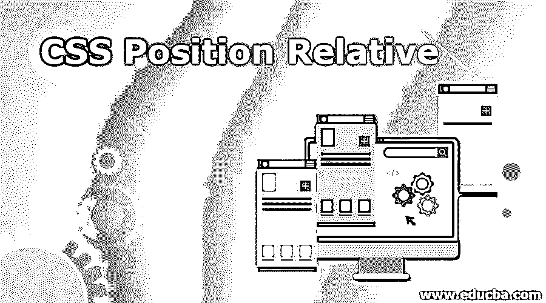
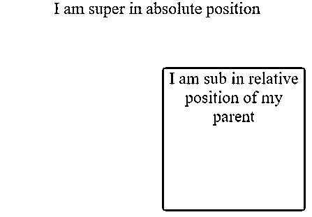
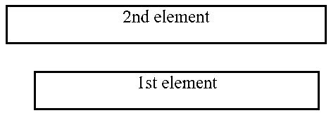
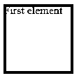
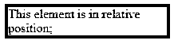
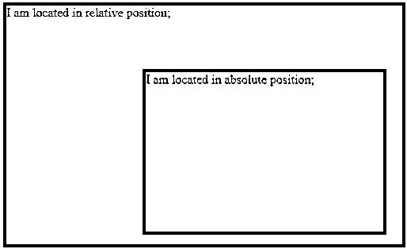

# CSS 相对位置

> 原文：<https://www.educba.com/css-position-relative/>

## CSS 相对位置介绍

在 HTML 中设计页面时，您可能希望根据页面或布局更改页面所有元素的位置。例如，当页面被加载时，一个元素将被放置在一个位置，另一个元素将被放置在另一个位置，或者两个元素应该彼此相对放置。为了实现这一点，位置属性允许您根据所需的场景(如“固定”、“相对”、“粘性”、“绝对”等)来指示元素应该具有的位置类型。在您的 HTML 代码中。在 CSS Position Relative 中，我们将通过一些例子来看看如何使用 CSS 的 Position 属性来定位 HTML 页面中的不同元素。

**语法:**

<small>网页开发、编程语言、软件测试&其他</small>

`position: value;`

现在的问题是有哪些不同的可用值？这些基本上是不同类型的职位。为此，您可以参考下面的值表，其中描述了各种职位类型。

| **值** | **描述** |
| **静态** | 如果一个元素被定义为静态的，那么该元素将总是具有与正常页面流一致的位置。这是 HTML 页面设计中没有定义任何元素的情况。这也是默认值。静态元素不会改变它的位置。 |
| **固定** | 如果一个元素被定义为静态的，那么该元素将总是具有相对于视点或页面固定的位置。即使我们滚动页面，它也总是停留在同一个地方。 |
| **绝对** | 尽管名称是绝对的，但是如果一个元素被定义为绝对的，那么该元素将总是具有相对于其最近的相邻元素而不是视点或页面的位置。如果没有邻居，它将相对于文档的主体定位，并且它的移动与页面的滚动相联系 |
| **相对** | 如果一个元素被定义为相对的，那么该元素将总是具有根据其位置的定义值的位置，如:相对于正常位置的左、右、上、下，并且其移动与页面的滚动相联系。 |
| **粘粘的** | 如果一个元素被定义为相对的，那么这个元素将总是跟随页面的滚动并坚持滚动。当用户滚动网页时，粘性元素不会离开用户。 |

### CSS 中位置相对是如何做到的？

您只需要按照 HTML 代码中的语法提到所需的位置值，就可以在输出中获得该位置。

您可以参考带有代码的示例部分，了解如何通过使用 CSS 的不同位置值在 HTML 代码中实现一个或多个元素的相对位置。

### CSS 相对位置的实现示例

以下是 CSS 相对位置的示例:

#### 示例#1

在这个例子中，你将看到如何根据另一个元素的绝对位置来排列一个元素的相对位置。

**代码:**

`<!DOCTYPE html>
<html>
<head>

</head>
<body>

 I am sub in relative position of my parent

I am super in absolute position

</body>
</html>`

**输出:**

#### 实施例 2

在本例中，您将看到两个不同的元素是如何相对排列的。我们将第二个元素放置在第一个元素左侧 40 px 处。第二个元素也比第一个元素高 150 px。当我们在 CSS 的位置值的帮助下设计 HTNL 页面时，请仔细阅读代码，以了解如何根据我们的要求在一个页面中排列多个元素。

**代码:**

`<!DOCTYPE html>
<html>
<head>

</head>
<body>

1st element

2nd element

</body>
</html>`

**输出:**

#### 实施例 3

在本例中，您会看到有一个元素是根据所需的 px 值相对于页面布局定位的。

**代码:**

`<!DOCTYPE html>
<html>
<head&gt

</head>
<body>

First element

</body>
</html>`

**输出:**

#### 实施例 4

在本例中，您将看到根据所需的 px 值相对于页面布局定位的另一个元素。该元素还设计有边框值和其他值，如 top、bottom、height 和 width，以定义其形状和位置。

**代码:**

`<!DOCTYPE html>
<html>
<head>

</head>
<body>

This element is in relative position;

</body>
</html>`

**输出:**

#### 实施例 5

在本例中，您将再次看到另一种情况，其中两个不同的元素相对排列，另一个元素具有绝对位置。当我们在 CSS 的位置值的帮助下设计一个 HTML 页面时，请仔细阅读代码，了解如何根据我们的要求在一个页面中排列一个绝对元素并定位一个相对元素。

**代码:**

`<!DOCTYPE html>
<html>
<head>

</head>
<body>

I am located in relative position;

I am located in absolute position;

</body>
</html>`

**输出:**

### 结论

我们对“CSS 相对位置”主题的学习到此结束。如你所见，我们是如何通过 CSS 在 HTML 代码示例中实现不同位置的。这篇文章将对那些使用 CSS 设计网页的人有所帮助。如果你不自己写代码，对代码的学习将是不完整的。编码快乐！!

### 推荐文章

这是一个 CSS 相对位置的指南。在这里，我们讨论一个 CSS 位置相对的简要概述，以及它的工作与例子和代码实现。您也可以浏览我们推荐的其他文章，了解更多信息——

1.  [CSS 命令](https://www.educba.com/css-commands/)
2.  [CSS 颜色图表](https://www.educba.com/css-color-chart/)
3.  [CSS 面试问题](https://www.educba.com/css-interview-questions/)
4.  [CSS 阴影](https://www.educba.com/css-drop-shadow/)

