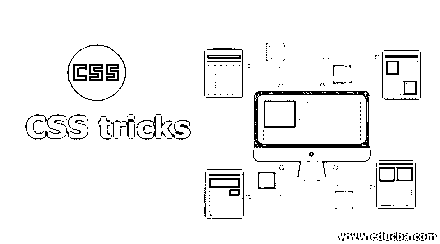
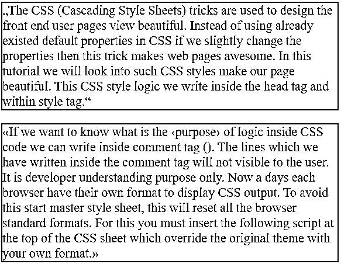
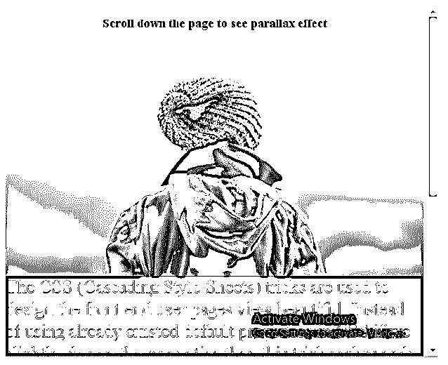
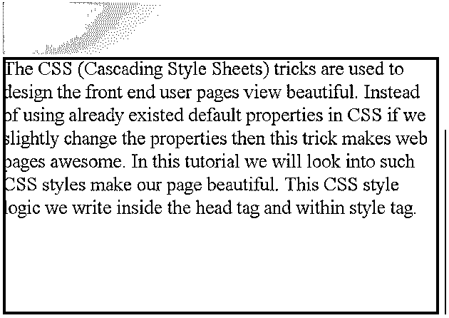
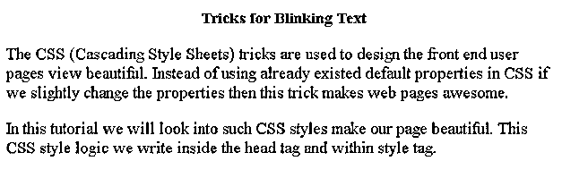

# CSS 技巧

> 原文：<https://www.educba.com/css-tricks/>




## CSS 技巧介绍

CSS(层叠样式表)的技巧被用来设计前端用户页面的漂亮视图。如果我们稍微改变属性，而不是使用 CSS 中已经存在的默认属性，那么这个技巧会让网页变得很棒。在本教程中，我们将研究这样的 CSS 样式，使我们的页面更加漂亮。这个 CSS 样式的逻辑我们写在标签和

**语法:**

<small>网页开发、编程语言、软件测试&其他</small>

```
@import url("fileName.css");
```

### CSS 中的技巧是如何工作的？

这个 CSS 技巧基于我们给定的样式和属性及其值。只需观察下面的一些 CSS 技巧。

#### 1.用智能引号替换正常值

这在任何网站中都是非常重要的因素。为了定义坐标，我们简单地使用键盘上的引号(" ")。

但是如果你只是简单地将它们插入到你的文本中来表示引用，那么它将会变成一个不寻常的外观，这会扰乱专业开发人员的视线。这就是我们强烈推荐使用“q”标签的原因。

**语法:**

```
q {
quotes: "“" "”";//normal way
}
```

**语法:**

```
q:lang(de) {
quotes: "„" "“";//professional way
}
```

#### 2.滚动效果

现在使用视差滚动效果使滚动变得很棒。要使用它，我们必须使用“URL(http://fonts . Google APIs . com/CSS？)”JavaScript 库。

**语法:**

```
@import url(http://fonts.googleapis.com/css?);
```

#### 3.多重背景

我们见过这么多背景多样的网站。下面将给出所使用的语法。

**语法:**

```
selector
{
width: 100%;
height: 400px;
background-image: url(image url), url(image url), linear-gradient(to right, rgba(values), rgba(values));
}
```

#### 4.闪烁文本

为了引起用户的注意，我们简单地使用闪烁的文本。下面给出了语法。

**语法:**

```
@keyframes blink {
percentage {
background: color name;
}
}
@-webkit-keyframes blink {
{
percentage {
background: color name;
}
}
```

### CSS 技巧的例子

下面举几个例子

#### 示例#1

引用段落

**代码:**

```
<!DOCTYPE html>
<html>
<head>
<style>
.q1{
quotes: "„" "“" "‚" "‘";/*This quotes applied to first paragrph*/
}
p
{
color: green;
border: solid 2px red;
font-size: 22px;
}
.q2 {
quotes: "«" "»" "‹" "›";/*This quotes applied to second paragrph*/
}
</style>
</head>
<body>
<p><q class="q1">The CSS (Cascading Style Sheets) tricks are used to design the front end user pages view beautiful. Instead of using already existed default properties in CSS if we slightly change the properties then this trick makes web pages awesome. In this tutorial we will look into such CSS styles make our page beautiful. This CSS style logic we write inside the head tag and within style tag.</q></p>
<p><q class="q2">If we want to know what is the <q>purpose</q> of logic inside CSS code we can write inside comment tag (<! ---->).  The lines which we have written inside the comment tag will not visible to the user. It is developer understanding purpose only. Now a days each browser have their own format to display CSS output. To avoid this start master style sheet, this will reset all the browser standard formats. For this you must insert the following script at the top of the CSS sheet which override the original theme with your own format.</q></p>
</body>
</html>
```

**输出:**




#### 实施例 2

视差滚动效果

**代码:**

```
<!DOCTYPE html>
<html>
<head>
<meta name="viewport" content="width=device-width, initial-scale=1">
<style>
.p {
/* Image used for parallax demo */
background-image: url("img_parallax.jpg");
/* Set the min height */
min-height: 450px;
/* This will create parallax effect in CSS */
background-repeat: no-repeat;
background-size: cover;
background-attachment: fixed;
background-position: center;
}
h2
{
color: green;
text-align: center;
}
.div
{
height:700px;
background-color:blue;
font-size:36px;
}
</style>
</head>
<body>
<h2>Scroll down the page to see parallax effect</h2>
<div class="p"></div>
<div class="div">
The CSS (Cascading Style Sheets) tricks are used to design the front end user pages view beautiful. Instead of using already existed default properties in CSS if we slightly change the properties then this trick makes web pages awesome. In this tutorial we will look into such CSS styles make our page beautiful. This CSS style logic we write inside the head tag and within style tag.
</div>
</body>
</html>
```

**输出:**

**滚动前:**




**滚动后:**




#### 实施例 3

闪烁文本

**代码:**

```
<!DOCTYPE html>
<html>
<head>
<meta charset="ISO-8859-1">
<title>Blinking Text</title>
<style>
h2{
color: green;
text-align: center;
}
.b1, .b2{
animation:blinking 1.6s infinite;
font-size: 25px;
}
@keyframes blinking{
0%{     color: red;    }
46%{    color: #000; }
61%{    color: transparent; }
95%{    color:transparent;  }
100%{   color: #000;    }
}
</style>
</head>
<body>
<h2>Tricks for Blinking Text</h2>
<p class="b1">The CSS (Cascading Style Sheets) tricks are used to design the front end user pages view beautiful. Instead of using already existed default properties in CSS if we slightly change the properties then this trick makes web pages awesome.
</p>
<p class="b2">In this tutorial we will look into such CSS styles make our page beautiful. This CSS style logic we write inside the head tag and within style tag.</p>
</body>
</html>
```

**输出:**




### 结论

CSS 的招数是用来美化网页的。引号、闪烁的文本和视差滚动文本是让网页变得令人敬畏的一些技巧。

### 推荐文章

这是一个 CSS 技巧的指南。在这里，我们讨论了 CSS 技巧的介绍，以及它的工作，适当的语法和相应的例子，以便更好地理解。您也可以阅读以下文章，了解更多信息——

1.  [CSS 溢出](https://www.educba.com/css-overflow/)
2.  [CSS 边框颜色](https://www.educba.com/css-border-color/)
3.  [CSS 验证器](https://www.educba.com/css-validator/)
4.  [CSS 梯度发生器](https://www.educba.com/css-gradient-generator/)


