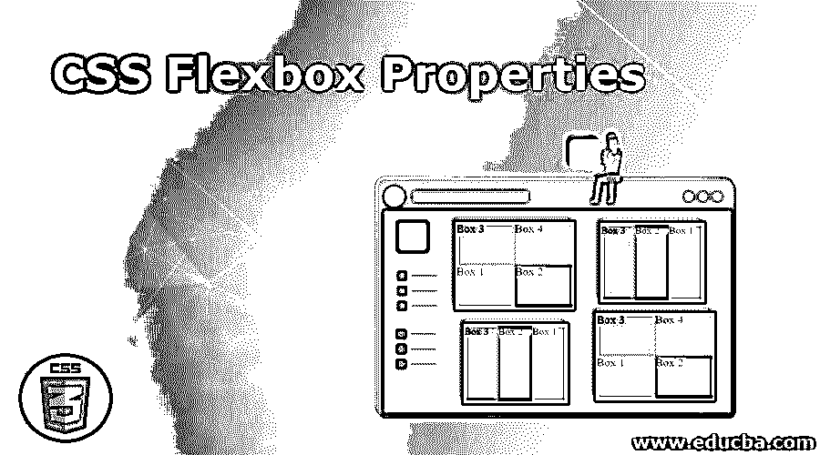
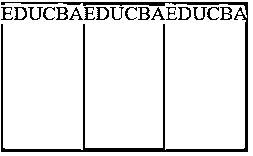
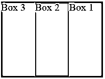
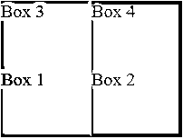
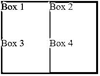
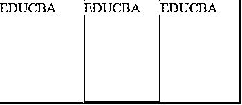
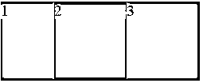

# CSS Flexbox 属性

> 原文：<https://www.educba.com/css-flexbox-properties/>




## CSS Flexbox 属性介绍

Flexbox 结构旨在提供一种更有效的方式来组织、对齐和分配容器中元素之间的空间，即使它们的大小是未指定的或动态的。flexbox 模块通常被称为 flexbox，其已经被开发为一维布局模型，并且还被开发为可以在应用中的元素之间提供空间分布和高效对齐功能的方法。在这个主题中，我们将学习 CSS Flexbox 属性。

flex 布局背后的基本思想是为容器提供改变其项目的宽度/高度的能力，以最好地填充可用空间(通常容纳各种显示设备和屏幕尺寸)。如果正常布局在块和内联流动方向上居中，则柔性布局将在柔性流动方向上居中

<small>网页开发、编程语言、软件测试&其他</small>

### 带有示例的 CSS Flexbox 属性

我们将借助例子讨论如何使用 flexbox 属性。

#### 示例# 1–弹性属性

CSS flex 属性定义了可变长度的组件。即测量柔性物品的柔性长度。

**语法**

```
flex: [ flex-grow flex-shrink flex-basis] | auto | initial | inherit;
```

**代码:**

```
<!DOCTYPE html>
<html>
<head>
<meta http-equiv="Content-Type" content="text/html; charset=windows-1252">
<title> CSS Flexbox Property Example </title>
<style>
.flex-container {
width: 50px;
height: 150px;
font-size: 20px;
display: flex; /* It defines the flex container */
}
.flex-container div {
-webkit-flex: 1; /* This is for safari */
-ms-flex: 1; /* This is for IE 10 */
flex: 1; /* This is standard syntax setting flex to 1*/
}
.class1 {
background: #FF6347;
}
.class2 {
background: #228B22;
}
.class3 {
background: #20B2AA;
}
</style>
</head>
<body><br>
<div class="flex-container">
<div class="class1">EDUCBA</div>
<div class="class2">EDUCBA</div>
<div class="class3">EDUCBA</div>
</div>
</body>
</html>
```

**输出:**




在接下来的例子中，使用上面的步骤来显示 html 页面的结果。

#### 示例# 2–弯曲方向属性

CSS flex-direction 属性通过指定 flex 容器主轴的方向来定义 flex 项目在 flex 容器中的定位方式。

**语法**

```
flex-direction: row | row-reverse | column | column-reverse | initial | inherit
```

**代码:**

```
<!DOCTYPE html>
<html>
<head>
<meta http-equiv="Content-Type" content="text/html; charset=windows-1252">
<title> CSS Flexbox Property Example </title>
<style>
.flex-container {
width: 200px;
height: 150px;
font-size: 20px;
display: flex; /* It defines the flex container */
flex-direction: row-reverse; /* CSS property */
}
.flex-container div {
-webkit-flex: 1; /* This is for safari */
-ms-flex: 1; /* This is for IE 10 */
flex: 1; /* This is standard syntax setting flex to 1*/
}
.class1 {
background: #FF6347;
}
.class2 {
background: #228B22;
}
.class3 {
background: #20B2AA;
}
</style>
</head>
<body><br>
<div class="flex-container">
<div class="class1">Box 1</div>
<div class="class2">Box 2</div>
<div class="class3">Box 3</div>
</div>
</body>
</html>
```

**输出:**




#### 示例# 3–柔性包装特性

CSS flex-wrap 属性根据 flex 容器的可用空间确定是将 flex 对象推入一行还是换行到几行或几列。

**语法**

```
flex-wrap: nowrap | wrap | wrap-reverse | initial | inherit
```

**代码:**

```
<!DOCTYPE html>
<html>
<head>
<meta http-equiv="Content-Type" content="text/html; charset=windows-1252">
<title> CSS Flexbox Property Example </title>
<style>
.flex-container {
width: 200px;
height: 150px;
font-size: 20px;
display: flex; /* It defines the flex container */
flex-wrap: wrap-reverse; /* CSS property */
}
.flex-container div {
width: 100px;
}
.class1 {
background: #FF6347;
}
.class2 {
background: #228B22;
}
.class3 {
background: #20B2AA;
}
.class4 {
background: #9932CC;
}
</style>
</head>
<body><br>
<div class="flex-container">
<div class="class1">Box 1</div>
<div class="class2">Box 2</div>
<div class="class3">Box 3</div>
<div class="class4">Box 4</div>
</div>
</body>
</html>
```

**输出:**




#### 示例# 4–弹性流动特性

flex-flow CSS 属性是一个简化的属性，用于在设置 flex-direction 和 flex-wrap 的同时设置各个属性。

**语法**

```
flex-flow: [ flex-direction flex-wrap ] | initial | inherit
```

**代码:**

```
<!DOCTYPE html>
<html>
<head>
<meta http-equiv="Content-Type" content="text/html; charset=windows-1252">
<title> CSS Flexbox Property Example </title>
<style>
.flex-container {
width: 200px;
height: 150px;
font-size: 20px;
display: flex; /* It defines the flex container */
flex-flow: row wrap; /* CSS property */
}
.flex-container div {
width: 100px;
}
.class1 {
background: #FF6347;
}
.class2 {
background: #228B22;
}
.class3 {
background: #20B2AA;
}
.class4 {
background: #9932CC;
}
</style>
</head>
<body><br>
<div class="flex-container">
<div class="class1">Box 1</div>
<div class="class2">Box 2</div>
<div class="class3">Box 3</div>
<div class="class4">Box 4</div>
</div>
</body>
</html>
```

**输出:**




#### 示例 5–弹性增长特性

flex-grow CSS 属性确定 flex 容器中的 flex 元素应该如何相对于内部的其他项目展开。

**语法**

```
flex-grow: number | initial | inherit
```

**代码:**

```
<!DOCTYPE html>
<html>
<head>
<meta http-equiv="Content-Type" content="text/html; charset=windows-1252">
<title> CSS Flexbox Property Example </title>
<style>
.flex-container {
width: 350px;
height: 150px;
font-size: 20px;
display: flex; /* It defines the flex container */
}
.class1 {
background: #FF6347;
width: 100px;
flex-grow: 4; /* CSS property */
}
.class2 {
background: #228B22;
width: 100px;
flex-grow: 2; /* CSS property */
}
.class3 {
background: #20B2AA;
width: 100px;
flex-grow: 3; /* CSS property */
}
</style>
</head>
<body><br>
<div class="flex-container">
<div class="class1">EDUCBA</div>
<div class="class2">EDUCBA</div>
<div class="class3">EDUCBA</div>
</div>
</body>
</html>
```

**输出:**




#### 示例# 6–伸缩性能

flex-shrink CSS 属性确定 flex 容器中的 flex 元素应该如何根据内部的其他元素收缩。

**语法**

```
flex-shrink: number | initial | inherit
```

**代码:**

```
<!DOCTYPE html>
<html>
<head>
<meta http-equiv="Content-Type" content="text/html; charset=windows-1252">
<title> CSS Flexbox Property Example </title>
<style>
.flex-container {
width: 250px;
height: 100px;
font-size: 20px;
display: flex; /* It defines the flex container */
}
.class1 {
background: #FF6347;
width: 100px;
flex-shrink: 4; /* CSS property */
}
.class2 {
background: #228B22;
width: 100px;
flex-shrink: 1; /* CSS property */
}
.class3 {
background: #20B2AA;
width: 100px;
flex-shrink: 1; /* CSS property */
}
</style>
</head>
<body><br>
<div class="flex-container">
<div class="class1">1</div>
<div class="class2">2</div>
<div class="class3">3</div>
</div>
</body>
</html>
```

**输出:**




### 结论

在本文中，我们详细讨论了 flexbox 属性，以便更好地理解它们是如何工作的。flexbox 模型最适合应用程序的元素和小型设计。flex 特性非常灵敏，非常适合移动使用。它提供了一个简单而强大的属性，以 web 应用程序和复杂网页经常需要的方式来分配空间和协调内容。

### 推荐文章

这是 ac，您也可以查看以下文章以了解更多信息——

1.  [CSS 颜色图表](https://www.educba.com/css-color-chart/)
2.  CSS 中的[按钮](https://www.educba.com/button-in-css/)
3.  [CSS 边框生成器](https://www.educba.com/css-border-generator/)
4.  [CSS 光标](https://www.educba.com/css-cursor/)


