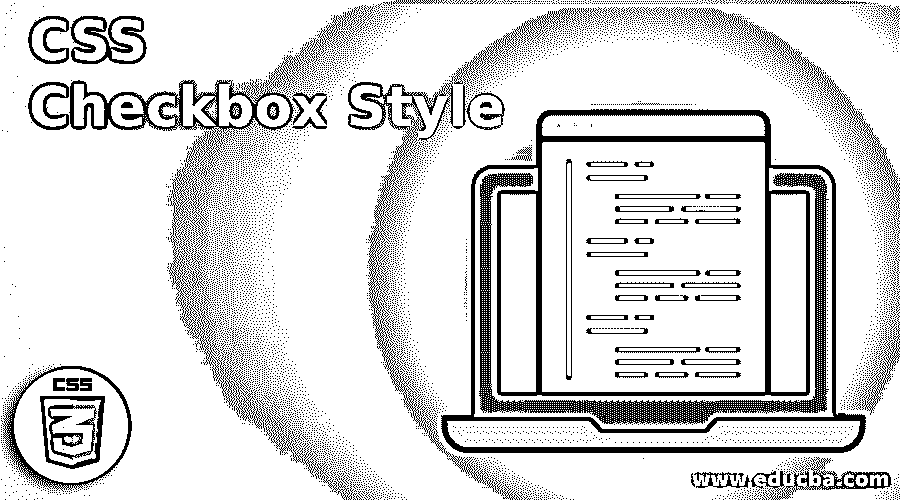
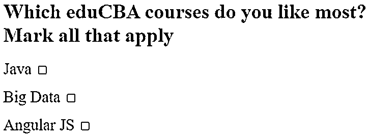
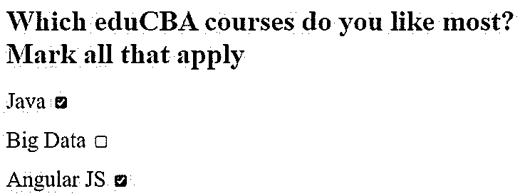
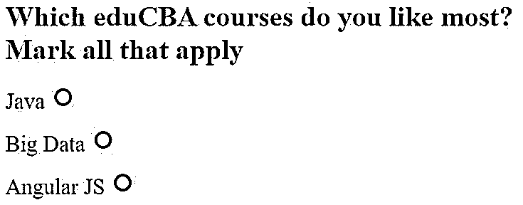
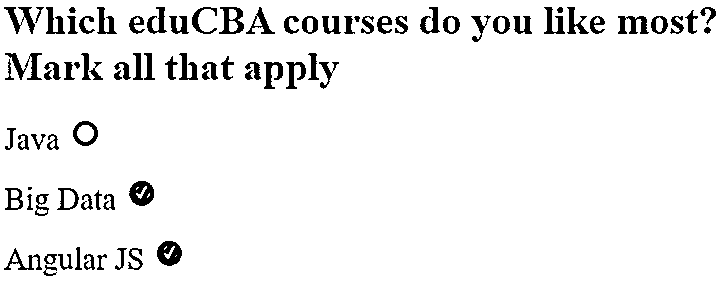
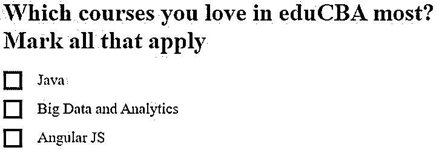
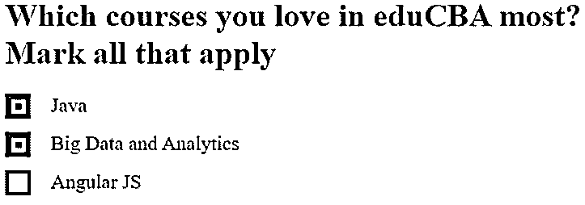

# CSS 复选框样式

> 原文：<https://www.educba.com/css-checkbox-style/>




## CSS 复选框样式介绍

在 HTML 中设计页面时，您可能想要更改所有或某些元素的样式，如复选框、单选按钮等。的页面。CSS Checkbox 样式是应用于 HTML 代码的 Checkbox 组件中的样式，通过调整不同的属性值来实现 HTML UI 设计的丰富现代外观，从而对最终用户更具吸引力，最终增加网页的参与度。

**语法:**

<small>网页开发、编程语言、软件测试&其他</small>

CSS 复选框样式没有明确的语法，因为这些是通用的 CSS 参数，需要根据您的要求进行更改。您可以在

**举例:**

**代码:**

```
input[type="checkbox"] {
height:1.5em;
width:1.5em;
cursor:pointer;
position:relative;
-webkit-transition: .10s;
border-radius:4em;
background-color:red;
}
```

### CSS 复选框样式如何工作？

*   你只需要根据你的需要在样式标签下的 CSS 部分或者外部 CSS 中按照你的 HTML 代码中的语法提到需要的值，就可以在输出中得到那个样式。
*   您可以查看示例部分的代码，了解如何通过在 CSS 部分使用不同的参数值，在 HTML 代码中实现一个或多个元素的不同样式。

### CSS 复选框样式的示例

下面是提到的例子:

#### 示例#1

在第一个例子中，我们将看到一个默认的复选框，这是我们在一个典型的 HTML 页面中常见的，没有与复选框相关联的特殊样式。

**代码:**

```
<html>
<body>
<h1>Which eduCBA courses do you like most? Mark all that apply</h1>
<label style = "font-size: 25px" >
Java
<input type="checkbox">
</label><p></p>
<label style = "font-size: 25px" >
Big Data
<input type="checkbox">
</label><p></p>
<label style = "font-size: 25px" >
Angular JS
<input type="checkbox">
</label><p></p>
</body>
</html>
```

**输出:**

如果您运行上面的代码，您将会看到下面作为默认 HTML 复选框的输出。




一旦你点击复选框，你会看到下面的输出。




在接下来的例子中，你将看到我们如何通过调整 CSS 中的不同参数来改变复选框的样式。

#### 实施例 2

在第二个例子中，我们将看到，一个默认复选框的样式将如何使用不同的 CSS 属性。单击链接后，复选框的样式和颜色也会根据 CSS 代码中的值而改变。

**代码:**

```
<!DOCTYPE html>
<html>
<style>
body {
padding:1em;
}
input[type="checkbox"] {
-webkit-appearance:none;
height:1.5em;
width:1.5em;
cursor:pointer;
position:relative;
-webkit-transition: .10s;
border-radius:4em;
background-color:red;
}
input[type="checkbox"]:checked {
background-color:blue;
}
input[type="checkbox"]:before, input[type="checkbox"]:checked:before {
position:absolute;
top:0;
left:0;
width:100%;
height:100%;
line-height:1.5em;
text-align:center;
color:white;
}
input[type="checkbox"]:checked:before {
content: '✔';
}
</style>
<body>
<h1>Which eduCBA courses do you like most? Mark all that apply</h1>
<label style = "font-size: 25px" >
Java
<input type="checkbox">
</label><p></p>
<label style = "font-size: 25px" >
Big Data
<input type="checkbox">
</label><p></p>
<label style = "font-size: 25px" >
Angular JS
<input type="checkbox">
</label><p></p>
</body>
</html>
```

**输出:**

这些不是单选按钮，实际上是复选框。我们通过调整不同 CSS 属性的值来改变复选框的样式。

将输出与上一个示例中的默认输出进行比较，以便可以比较自定义样式。




现在，当你点击复选框时，它们会改变颜色，这是因为 CSS 属性值的调整。

再次将输出与上一个示例中的默认输出进行比较，以便可以比较自定义样式。




#### 实施例 3

在这个例子中，我们将看到一个不同风格的默认复选框，这是通过使用不同的 CSS 属性实现的。单击链接后，复选框的样式和颜色也会根据 HTML 代码的 CSS 部分中的属性值而改变。

**代码:**

```
<!DOCTYPE html>
<html>
<head>
<style>
/*create basic style*/
.styl {
display: block;
position: relative;
padding-left: 45px;
margin-bottom: 15px;
cursor: pointer;
font-size: 20px;
}
/* Hide the checkbox which is default*/
input[type=checkbox] {
visibility: hidden;
}
/* now create a custom checkbox based
on requirement */
.chkmrk {
position: absolute;
top: 0;
left: 0;
height: 25px;
width: 25px;
background-color: blue;
}
/* mention the background color to be
shown when it is checked */
.styl input:checked ~ .chkmrk {
background-color: green;
}
/* do not show when the checkbox is not checked */
.chkmrk:after {
content: "";
position: absolute;
display: none;
}
/* showthe checkmark when it is checked */
.styl input:checked ~ .chkmrk:after {
display: block;
}
/* now create a square to be the sign as
when checkbox is checked */
.styl .chkmrk:after {
left: 6px;
bottom: 5px;
width: 6px;
height: 6px;
border: solid white;
border-width: 4px 4px 4px 4px;
}
</style>
</head>
<body>
<h1>Which courses you love in eduCBA most? Mark all that apply</h1>
<label class="styl" style = "color:black;">
Java
<input type="checkbox">

</label>
<label class="styl" style = "color:black;">
Big Data and Analytics
<input type="checkbox" >

</label>
<label class="styl" style = "color:black;">
Angular JS
<input type="checkbox" >

</label>
</body>
</html>
```

**输出:**

我们通过调整不同 CSS 属性的值来改变复选框的样式。

将该输出与前面示例中的其他输出进行比较。




现在，当您单击复选框时，它们会再次改变样式。再次将输出与前面示例中的输出进行比较，看看这一次当复选框被单击时样式是如何改变的。




### 结论

“CSS 复选框样式”主题到此结束。这篇文章将有助于那些与 HTML 设计相关的人。实际上，复选框中的这种样式赋予了 HTML 页面丰富的外观和感觉，这实质上增加了更多的用户参与。

### 推荐文章

这是一个 CSS 复选框样式的指南。这里我们讨论一下入门，CSS 复选框样式是如何工作的？并分别举例说明。您也可以看看以下文章，了解更多信息–

1.  [CSS 禁用](https://www.educba.com/css-disabled/)
2.  [CSS 标题设计](https://www.educba.com/css-header-design/)
3.  [CSS 变换](https://www.educba.com/css-transform/)
4.  [CSS 相对位置](https://www.educba.com/css-position-relative/)


