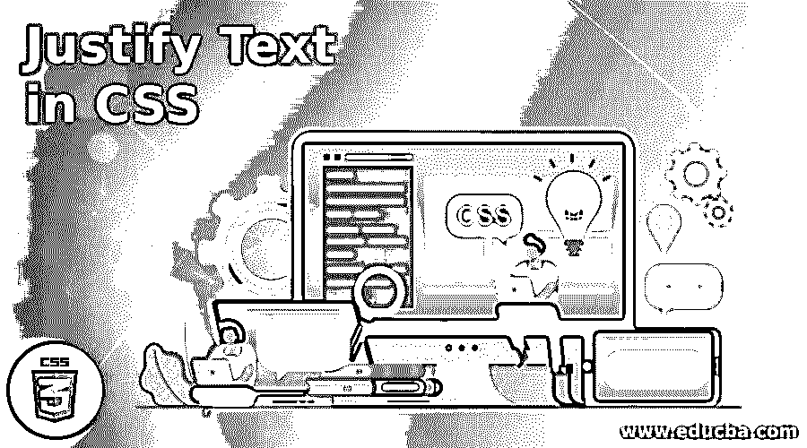
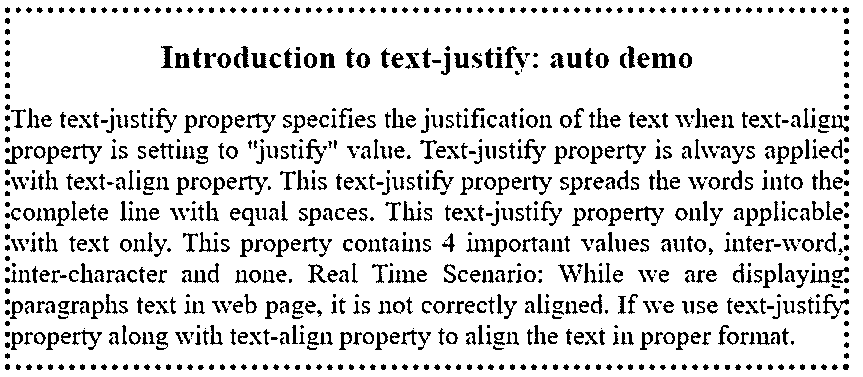
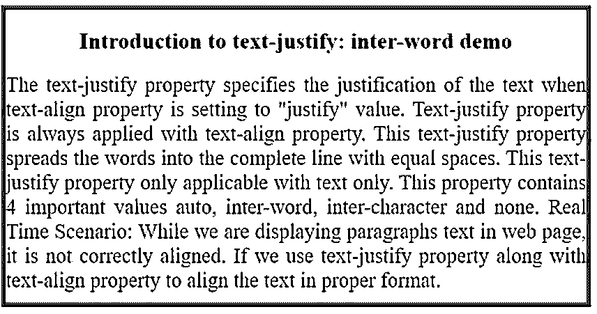
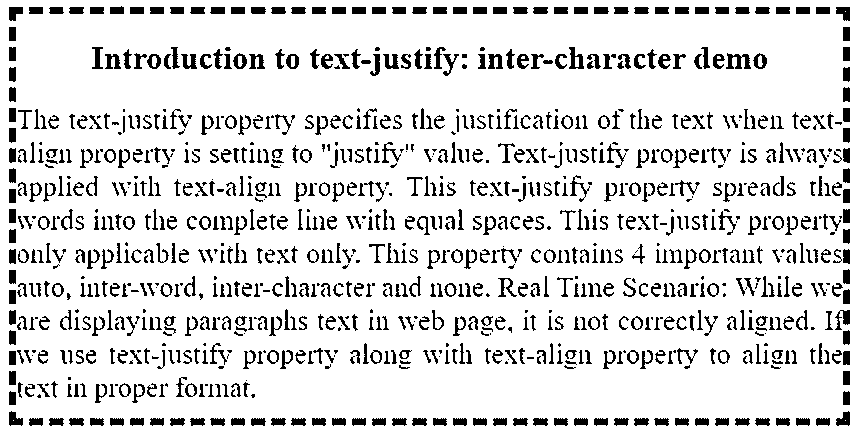
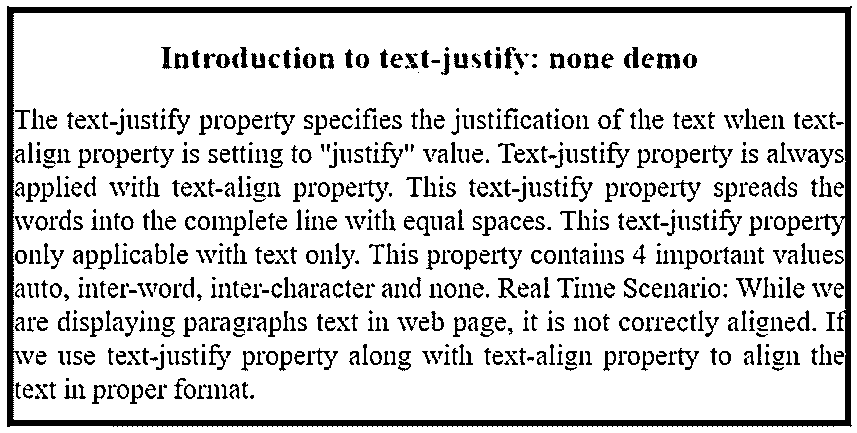

# 在 CSS 中对齐文本

> 原文：<https://www.educba.com/justify-text-in-css/>




## CSS 中对齐文本的介绍

以下文章提供了在 CSS 中对齐文本的概述。当 text-align 属性设置为“justify”值时，text-justify 属性指定文本的对齐方式。Text-justify 属性始终与 text-align 属性一起应用。这个 text-justify 属性将单词以相等的间距展开成完整的一行。此文本对齐属性仅适用于文本。该属性包含 4 个重要值 auto、inter-word、inter-character 和 none。

**实时场景:**当我们在网页上显示段落文本时，它没有正确对齐。如果我们使用 text-justify 属性和 text-align 属性以正确的格式对齐文本。用相等的空格对齐文本。

<small>网页开发、编程语言、软件测试&其他</small>

### CSS 中的文本对齐是如何工作的？

Text-justify 属性基于赋予该属性的值工作。该属性包含 4 个核心价值。

#### 1.汽车

这是一个自动值，它自动允许浏览器应用合适的文本样式。

**语法:**

```
Selector
{
Text-justify: auto;
}
```

#### 2.词间

通过减少或增加文本中单个单词之间的间距来调整。

**语法:**

```
Selector
{
Text-justify: inter-word;
}
```

#### 3.字符间

通过减少或增加文本中单个字符之间的间距来调整。

**语法:**

```
Selector
{
Text-justify: inter-character;
}
```

#### 4.没有人

这个 none 值使文本不可修改，因为它没有任何 text-justify 值。

**语法:**

```
Selector
{
Text-justify: none;
}
```

### 例子

下面是提到的例子:

#### 示例#1

文本对齐:自动示例。

**代码:**

```
<!DOCTYPE html>
<html>
<head>
<title>Text-justify Property</title>
<style>
.textMain {
padding-bottom: 10px;
border:4px dotted red;
}
.textPara {
text-align:justify;
text-justify:auto;
color: green;
font-size: 20px;
}
h2{
text-align:center;
color: blue;
}
</style>
</head>
<body>
<div class = "textMain">
<h2>Introduction to text-justify: auto demo</h2>
<div class = "textPara">The text-justify property specifies the justification of the text when text-align property is setting to "justify" value. Text-justify property is always applied with text-align property. This text-justify property spreads the words into the complete line with equal spaces. This text-justify property only applicable with text only. This property contains 4 important values auto, inter-word, inter-character and none.
Real Time Scenario: While we are displaying paragraphs text in web page, it is not correctly aligned. If we use text-justify property along with text-align property to align the text in proper format.
</div>
</div>
</body>
</html>
```

**输出:**




#### 实施例 2

Text-justify:单词间示例。

**代码:**

```
<!DOCTYPE html>
<html>
<head>
<title>Text-justify Property</title>
<style>
.textMain {
padding-bottom: 10px;
border:5px ridge gray;
}
.textPara {
text-align:justify;
text-justify:inter-word;
color: blue;
font-size: 22px;
}
h2{
text-align:center;
color: red;
}
</style>
</head>
<body>
<div class = "textMain">
<h2>Introduction to text-justify: inter-word demo</h2>
<div class = "textPara">The text-justify property specifies the justification of the text when text-align property is setting to "justify" value. Text-justify property is always applied with text-align property. This text-justify property spreads the words into the complete line with equal spaces. This text-justify property only applicable with text only. This property contains 4 important values auto, inter-word, inter-character and none.
Real Time Scenario: While we are displaying paragraphs text in web page, it is not correctly aligned. If we use text-justify property along with text-align property to align the text in proper format.
</div>
</div>
</body>
</html>
```

**输出:**




#### 实施例 3

文本对齐:字符间示例。

**代码:**

```
<!DOCTYPE html>
<html>
<head>
<title>Text-justify Property</title>
<style>
.textMain {
padding-bottom: 10px;
border:5px dashed red;
}
.textPara {
text-align:justify;
text-justify:inter-character;
color: fuchsia;
font-size: 21px;
}
h2{
text-align:center;
color: navy;
}
</style>
</head>
<body>
<div class = "textMain">
<h2>Introduction to text-justify: inter-character demo</h2>
<div class = "textPara">The text-justify property specifies the justification of the text when text-align property is setting to "justify" value. Text-justify property is always applied with text-align property. This text-justify property spreads the words into the complete line with equal spaces. This text-justify property only applicable with text only. This property contains 4 important values auto, inter-word, inter-character and none.
Real Time Scenario: While we are displaying paragraphs text in web page, it is not correctly aligned. If we use text-justify property along with text-align property to align the text in proper format.
</div>
</div>
</body>
</html>
```

**输出:**




#### 实施例 4

文本对齐:无示例。

**代码:**

```
<!DOCTYPE html>
<html>
<head>
<title>Text-justify Property</title>
<style>
.textMain {
padding-bottom: 10px;
border:5px solid brown;
}
.textPara {
text-align:justify;
text-justify:none;
color: black;
font-size: 21px;
}
h2{
text-align:center;
color: orange;
}
</style>
</head>
<body>
<div class = "textMain">
<h2>Introduction to text-justify: none demo</h2>
<div class = "textPara">The text-justify property specifies the justification of the text when text-align property is setting to "justify" value. Text-justify property is always applied with text-align property. This text-justify property spreads the words into the complete line with equal spaces. This text-justify property only applicable with text only. This property contains 4 important values auto, inter-word, inter-character and none.
Real Time Scenario: While we are displaying paragraphs text in web page, it is not correctly aligned. If we use text-justify property along with text-align property to align the text in proper format.
</div>
</div>
</body>
</html>
```

**输出:**




### 结论

Text-justify 用于对齐相等的间距和宽度。该属性允许 4 个值，如自动、单词间、字符间和无。此文本对齐属性始终允许文本对齐属性。

### 推荐文章

这是一个在 CSS 中对齐文本的指南。在这里，我们讨论介绍，文本调整在 CSS 中是如何工作的？和示例。您也可以看看以下文章，了解更多信息–

1.  [CSS 右边距](https://www.educba.com/css-margin-right/)
2.  [CSS 标题设计](https://www.educba.com/css-header-design/)
3.  [CSS 招数](https://www.educba.com/css-tricks/)
4.  [CSS 顺序](https://www.educba.com/css-order/)


