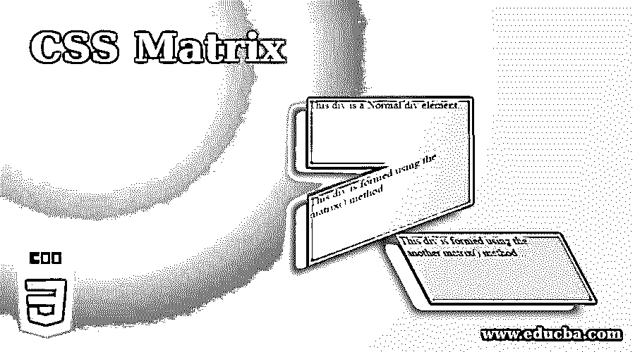
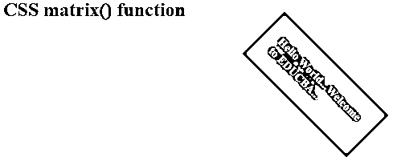
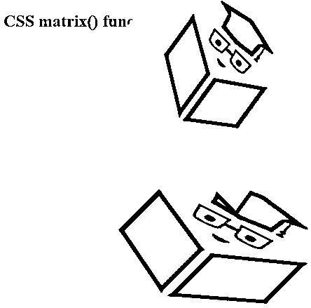
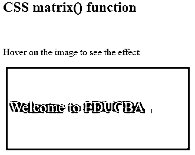
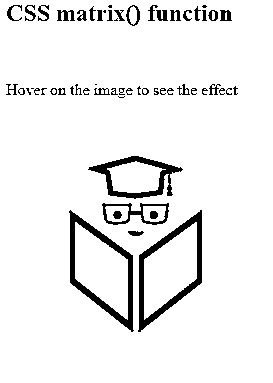
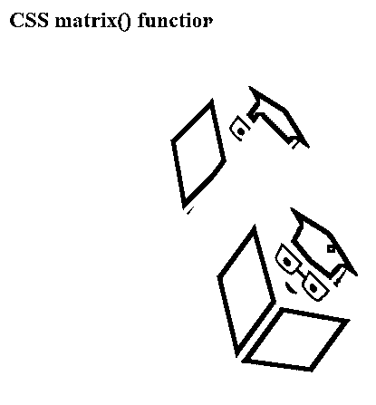
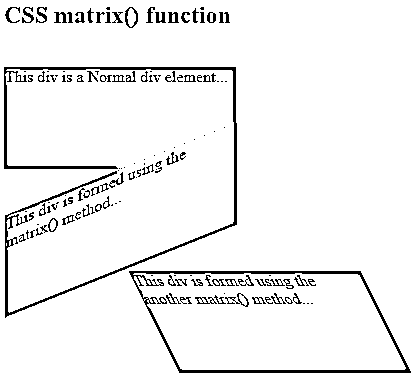

# CSS 矩阵

> 原文：<https://www.educba.com/css-matrix/>




## CSS 矩阵介绍

CSS 函数 matrix()描述了 2D 变换的齐次矩阵。该函数将用于将所有这些转换集成为一个。这有点像转换简写，即它可以将一组转换集成到一个声明矩阵中。设计者可以使用 matrix()函数在任何他们想要的地方放置和构造他们的转换。

transform 属性转换元素的坐标系，导致元素在空间中的变换。变换后的项目不会影响周围的元素，但可能会重叠它们，就像绝对位置中的元素一样。使用变换功能，我们可以对二维空间中的元素执行简单的变换操作，如移动、旋转、缩放和倾斜。

<small>网页开发、编程语言、软件测试&其他</small>

### CSS 中的 Matrix 是如何工作的？

matrix()函数将两个转换合并成一个矩阵。matrix()函数的工作可以用如下所示的六个值来定义:

矩阵(a、b、c、d、tx、ty)

*   **a b c d:** 这些是在<号> s 中定义的线性变换
*   **tx:** 该参数可用于定义线性 x 轴平移。
*   **ty:** 该参数可用于定义线性 y 轴平移。

### 实现 CSS 矩阵的示例

以下是 CSS 矩阵的示例:

#### 示例#1

在此示例中，。matrix_class 用于通过使用 transform 属性来显示矩阵元素。它包括矩阵元素的所有 CSS 样式。

**代码:**

```
<!DOCTYPE html>
<html lang="en">
<head>
<meta charset="utf-8">
<title> CSS Matrix Example </title>
<style>
h2 {
color: green;
}
.matrix_class {
transform-origin: 0 0;
transform: matrix(0.5, 0.5, -0.5, 0.5, 350, -50);
font-size: 20px;
font-weight: bold;
width: 200px;
padding: 30px;
background: grey;
color: white;
}
</style>
</head>
<body>
<h2>CSS matrix() function</h2><br>
<div class="matrix_class">
Hello World...Welcome to EDUCBA...
</div>
</body>
</html>
```

**输出:**




#### 实施例 2

在示例中，我们使用了两个类，即 matrix_class 和 skew_class。skew()函数用于转换 2D 平面中的元素，这意味着我们可以选取一个点，并在不同的方向上推或拉它。

**代码:**

```
<!DOCTYPE html>
<html lang="en">
<head>
<meta charset="utf-8">
<title> CSS Matrix Example </title>
<style>
.matrix_class {
transform: matrix(2, 1, -1, 1, 200, 150);
}
.skew_class {
transform-origin: right;
transform: skew(-0.10turn, 45deg);
}
</style>
</head>
<body>
<h2>CSS matrix() function</h2><br><br>


</body>
</html>
```

**输出:**




#### 实施例 3

在本例中，矩阵平移是(1，0，0，1，150，50)，当用户将鼠标悬停在元素上时，该矩阵平移元素。

**代码:**

```
<!DOCTYPE html>
<html lang="en">
<head>
<meta charset="utf-8">
<title> CSS Matrix Example </title>
<style>
div{
width:300px;
height:130px;
color:#FFDAB9;
background:grey;
margin:5px;
border:1px solid red;
transition-duration:2s;
padding:5px;
-webkit-transition-duration:3s;
line-height:5em;
font-size:25px;
}
.matrix_class:hover{
transform:matrix(1, 0, 0, 1, 150, 50);
-ms-transform:matrix(1, 0, 0, 1, 200, 30); /* It is is used for internet explorer 9*/
-webkit-transform:matrix(1, 0, 0, 1, 150, 50); /* It is used for Safari and Chrome */
}
</style>
</head>
<body>
<h2>CSS matrix() function</h2><br>
<p>Hover on the image to see the effect</p>
<div class="matrix_class"> Welcome to EDUCBA... </div><br>
</body>
</html>
```

**输出:**




#### 实施例 4

在这个例子中，我们使用矩阵来翻转元素。矩阵(-1，0，0，1，1，1)用于当用户悬停在图像上时翻转图像。

**代码:**

```
<!DOCTYPE html>
<html lang="en">
<head>
<meta charset="utf-8">
<title> CSS Matrix Example </title>
<style>
img{
box-shadow:3px 3px 3px #F0E68C;
width:250px;
margin:5px;
transition-duration:3s;
-webkit-transition-duration:3s;
}
#matrix_img:hover{
transform:matrix(-1, 0, 0, 1, 1, 1);
-ms-transform:matrix(-1, 0, 0, 1, 1, 1); /* It is is used for internet explorer 9 */
-webkit-transform:matrix(-1, 0, 0, 1, 1, 1); /* It is used for Safari and Chrome */
}
</style>
</head>
<body>
<h2>CSS matrix() function</h2><br>
<p> Hover on the image to see the effect </p>

</body>
</html>
```

**输出:**




#### 实施例 5

在示例中，我们使用了两个类，即 matrix_class 和 skew_class。skew()函数对 2D 平面中的元素进行变换，在这里，我们按照上面代码中的指定，以 45 度角向不同的方向推或拉它。transform-origin 将给出元素堆叠的点，以便对其进行变换。在这里，它将元素固定在左侧。

**代码:**

```
<!DOCTYPE html>
<html lang="en">
<head>
<meta charset="utf-8">
<title> CSS Matrix Example </title>
<style>
.matrix_class {
transform: matrix(0.9, 0.9, -0.8, 0.8, 150, -50);
}
.skew_class {
transform-origin: left;
transform: skew(-0.10turn, 45deg);
}
</style>
</head>
<body>
<h2>CSS matrix() function</h2><br><br><br><br>


</body>
</html>
```

**输出:**




#### 实施例 6

**代码:**

```
<!DOCTYPE html>
<html lang="en">
<head>
<meta charset="utf-8">
<title> CSS Matrix Example </title>
<style>
div {
width: 230px;
height: 100px;
background-color: #00CED1;
border: 1px dotted grey;
}
div#matrix_class {
-ms-transform: matrix(1, -0.4, 0, 1, 1, 0); /* It is is used for internet explorer 9 */
-webkit-transform: matrix(1, -0.4, 0, 1, 1, 0); /* It is is used for Safari */
transform: matrix(1, -0.4, 0, 1, 1, 0); /* This is standard syntax */
}
div#matrix_class1 {
-ms-transform: matrix(1, 1, 0.5, 1, 120, 0); /* It is is used for internet explorer 9 */
-webkit-transform: matrix(1, 0, 0.5, 1, 150, 0); /* It is is used for Safari */
transform: matrix(1, 0, 0.5, 1, 150, 0); /* This is standard syntax */
}
</style>
</head>
<body>
<h2> CSS matrix() function </h2><br>
<div>
This div is a Normal div element...
</div>
<div id="matrix_class">
This div is formed using the matrix() method...
</div>
<div id="matrix_class1">
This div is formed using the another matrix() method...
</div>
</body>
</html>
```

**输出:**




### 结论

本文概述了 CSS 转换，并描述了如何用一个 CSS 矩阵转换来替换它们。它展示了矩阵 CSS 中数字的来源，矩阵乘法的结果。变换是对象形状或大小的过渡。设计者可以缩放、倾斜、旋转或平移对象。

### 推荐文章

这是一个 CSS 矩阵的指南。在这里，我们讨论一个 CSS 矩阵和它的不同例子及其代码实现的简要概述。您也可以浏览我们推荐的其他文章，了解更多信息——

1.  [CSS 在技术中的应用](https://www.educba.com/what-is-css/)
2.  [使用 CSS 命令的技巧和诀窍](https://www.educba.com/css-commands/)
3.  [CSS 的六大优势介绍](https://www.educba.com/advantages-of-css/)
4.  [CSS 页眉设计(示例)](https://www.educba.com/css-header-design/)


