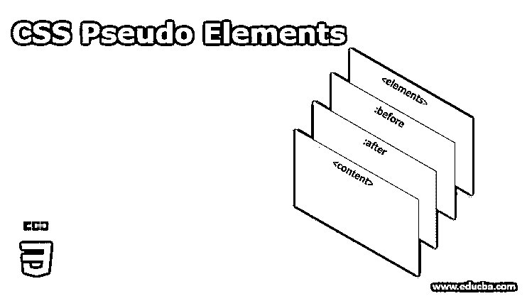
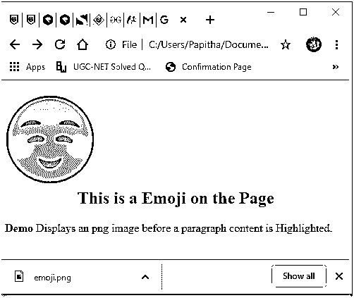
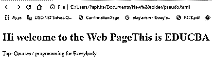
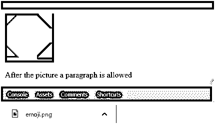
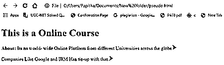
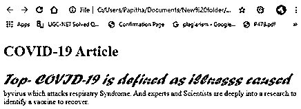
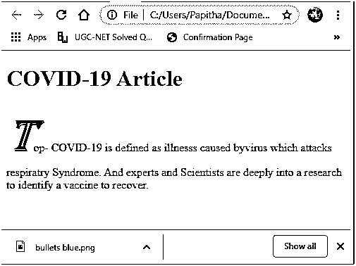
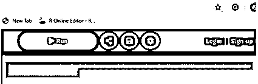

# CSS 伪元素

> 原文：<https://www.educba.com/css-pseudo-elements/>




## CSS 伪元素介绍

CSS 伪元素被定义为一个特殊的选择器，它在不改变任何现有文档的情况下向元素添加特殊的样式。这些伪元素不出现在 DOM 中，但是在各自的网站上是可见的，并且它对 HTML 元素的特定部分进行样式化。这些就像一个虚拟的元素，被当作一个临时的 HTML 元素，所以它们是使用 CSS 创建的。

**语法:**

<small>网页开发、编程语言、软件测试&其他</small>

它采用如下形式，非常容易编码。CSS3 为伪元素引入了一个(:)关键字，以区分伪类。因此，简单的语法应该像创建 CSS 伪元素一样给出:

```
Selector ::pseudo-element { property : value; }
```

**Note:** The Internet Explorer browser supports only single-colon keywords in the selector. next using multiple pseudo-elements, we should write them in selection making sure that it is done in different Lines.

### 各种 CSS 伪元素和描述

下面列出了最常用的伪元素:

| **值** | **描述** |
| **:在**之前 | 该元素用于在需要 HTML 的元素前添加一些内容。特定的插入内容在 DOM 树中不可见，但显示在当前网页中。 |
| **:在**之后 | 这个元素用于在一个元素后添加一些内容。 |
| **:首字母** | 这个元素的作用是:在一个文件中指定的文本框中，将特殊的样式插入到文本的第一个字母中。 |
| **:一线** | 这个元素用于在文本的第一行插入特殊的样式。 |
| **:选择** | 它突出显示内容的选定部分。 |

伪元素允许所有类型使用单个(:)选择器，但::Selection 除外，它需要(::)双点。

### 实现 CSS 伪元素的示例

以下是 CSS 伪元素的示例:

#### 示例 1–之前

这个值可以将计数器、图像和字符串等内容插入到它们的应用程序中。在这里，我创建了一个 HTML 文档，内容图像以 gif 格式封装。内容前会添加一个表情图标。

**代码:**

```
<!DOCTYPE html>
<html lang="en">
<head>
<meta charset="utf-8">
<title>Demo of CSS ::before Pseudo-element</title>
<style>
h2::before {
content: url("emoji.gif");
}
</style>
</head>
<body>
<h2><center>This is a Emoji on the Page</center></h1>
<p><strong>Demo</strong> Displays an png image before a paragraph content<code><heading></code> is Highlighted.</p>
</body>
</html>
```

**输出:**




#### 实施例 2

在元素前添加文本。

**代码:**

```
<!DOCTYPE html>
<html lang="en">
<head>
<meta charset="utf-8">
<title>Example of CSS:: Before Pseudo-element</title>
<style>
h1::before {
content:" Hi welcome to the Web Page";
}
</style>
</head>
<body>
<h1>This is EDUCBA</h1>
<p>Top- Courses / programming for Everybody</p>
</body>
</html>
```

#### **

** 

#### 示例 3–之后

这将在特定元素之后添加内容，除了样式的位置不同之外，它与之前非常相似。这个选择器的另一个有趣的事实是通过避免图像使用 CSS 创建一个不同的复杂形状。

**代码:**

**ff.html**

```
<html>
<div id="octagon"></div>
<body>
<p> After the picture a paragraph is allowed </p>
</html>
```

**。css**

```
#octagon {
width: 98px;
height: 98px;
background: purple;
}
#octagon:before {
height: 0;
width: 38px;
content:"";
position: absolute;
border-bottom: 28px solid purple;
border-left: 28px solid blue;
border-right: 28px solid yellow;
}
#octagon:after {
height: 0;
width: 38px;
content:"";
position: absolute;
border-top: 28px solid purple;
border-left: 28px solid blue;
border-right: 28px solid yellow;
margin: 60px 0 0 0;
}
```

**输出:**




#### 实施例 4

在内容后插入项目符号图标。下面的演示展示了如何在内容旁边添加::after 元素。

**代码:**

**pseudo.html**

```
<!DOCTYPE html>
<html lang="en">
<head>
<meta charset="utf-8">
<title>Example of CSS ::after Pseudo-element</title>
<style>
p::after {
content: url("bullets blue.gif");
}
</style>
</head>
<body>
<h1>This is a Online Course</h1>
<p><strong>About:</strong>Itsan world- wide Online Platform from different Universities across the globe</p>
<p>Companies Like Google and IBM Has tie-up with that.</p>
</body>
</html>
```

**输出:**




同样，我们可以添加边框和引号，这是放置在一些块引号中的一个很好的语义元素。比如通过分配网格-列。在日常应用中，有一些创新的想法可以在之前和之后实现。

#### 示例 5–第一行元素

它只是针对元素的第一行。当它被插入到一个段落中时，第一行是单独样式的

**代码:**

```
<!DOCTYPE html>
<html lang="en">
<head>
<meta charset="utf-8">
<title>Example of CSS ::first-line Pseudo-element</title>
<style>
p::first-line {
font-family: Forte;
font-weight: bold;
font-size: 2em;
font-style: italic;
color: orange;
}
</style>
</head>
<body>
<h1>COVID-19 Article</h1>
<p>Top- COVID-19 is defined as illnesss caused byvirus which attacks respiratry Syndrome. And experts and Scientists are deeply into a research to identify a vaccine to recover.</p>
</body>
</html>
```

**输出:**




#### 示例 6–第一个字母

这将选择文本序列中最适合使用段落的第一个字母。

**代码:**

```
<!DOCTYPE html>
<html lang="en">
<head>
<meta charset="utf-8">
<title>Example of CSS ::first-letter Pseudo-element</title>
<style>
p::first-letter {
font-family: Algerian;
font-weight: bold;
font-size: 4em;
font-style: italic;
color: #3f51b5;
}
</style>
</head>
<body>
<h1>COVID-19 Article</h1>
<p>Top- COVID-19 is defined as illnesss caused byvirus which attacks respiratry Syndrome. And experts and Scientists are deeply into a research to identify a vaccine to recover.</p>
</body>
</html>
```

**输出:**

下面的代码片段显示了–在 HTML 文档的

元素中，它为首字母大写字母“T”添加了一种样式。我们可以用“行高”来调整字体大小。




#### 示例 7–选择

它突出显示用户选择的文本，就像用鼠标指针设备突出显示一样。在这个例子中，我们将它设置为颜色和背景，而其他 CSS 属性如文本对齐也可以被验证。

**代码:**

```
<!DOCTYPE html>
<html>
<head>
<script type="text/javascript" src="scripts.js"></script>
<link rel="stylesheet" href="styles.css">
</head>
<body>
<p>Comics are a great fun And the first nivel Appeared in the Year 1978 and it deals with the current affairs of the world</p>
</body>
</html>
::selection {
color: grey;
background: red;
}
```

**输出:**

下面的输出显示上面的代码用颜色突出显示了内容。




### 结论

因此，我们已经讨论了伪元素的概念，以实际地创建技术，并探索了如何在 CSS 中采用选择器来暗示新内容的内容或样式。这是前端开发一直关注的问题。这个元素非常有用，当需要对元素进行样式设计时，它提供了一些简单的解决方案。

### 推荐文章

这是一个 CSS 伪元素的指南。在这里，我们讨论了 CSS 伪元素及其不同的例子以及代码实现的简要概述。您也可以浏览我们推荐的其他文章，了解更多信息——

1.  [CSS 在技术中的应用](https://www.educba.com/what-is-css/)
2.  [使用 CSS 命令的技巧和诀窍](https://www.educba.com/css-commands/)
3.  [CSS 的六大优势介绍](https://www.educba.com/advantages-of-css/)
4.  [CSS 页眉设计(示例)](https://www.educba.com/css-header-design/)


