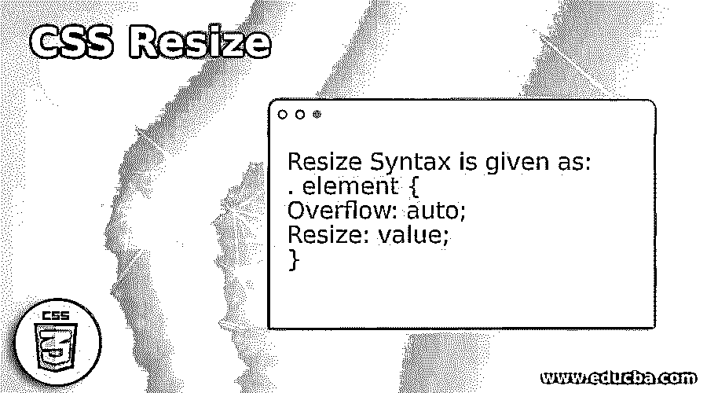
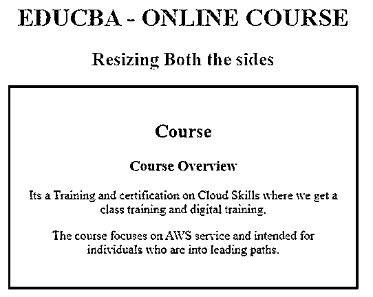
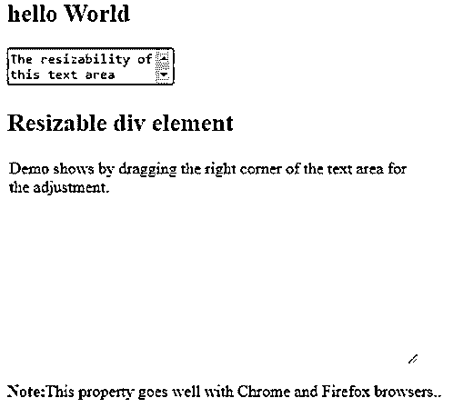
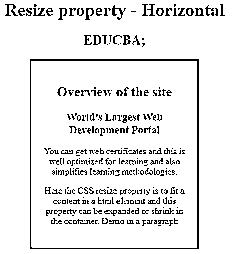
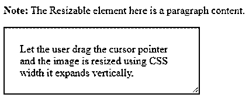

# CSS 调整大小

> 原文：<https://www.educba.com/css-resize/>




## CSS 调整大小的定义

CSS Resize 属性被定义为内置属性，允许开发人员根据用户要求调整 CSS 元素的大小，这是通过改变特定元素的高度和宽度来实现的。调整大小是通过拖动它们的右下角来实现的，或者在大多数情况下被称为可拖动的句柄(一个小的 UI 句柄)来放大网站中的图像，并指定可调整大小的轴。元素应该遵循 CSS 中的溢出属性，而不是作为初始元素组织的 visible。

### 语法和参数

调整大小语法如下所示:

<small>网页开发、编程语言、软件测试&其他</small>

```
. element {
Overflow: auto;
Resize: value;
}
```

**样本代码:**

```
text area {
resize: none;
}
```

该值的属性如下所示，

*   **none:** 元素没有变化，表示没有执行调整大小动作。这是大多数元素的初始值。
*   **Horizontal:** 这里分别调整元素的宽度。
*   **Height:** 这里调整元素的高度。
*   **both:** 该值执行高度和宽度。
*   **initial:** 将属性设为默认值。

### CSS 中如何调整 Property Works 的大小？

工作过程非常简单，它利用了内置属性，但功能有限。resize 属性与不应设置为“visible”的溢出值一起作用。我们可以设置为自动或滚动。正如我之前说过的，它使用 handler(一个时髦的拖拽器)在盒子的右角移动，但是不能在左边或上边移动。要调整边框上手柄的大小，宽度调整很重要。那么，让我们开始，调整一个元素的大小，最基本的事情是扩大一个元素，这意味着我们应该点击并拖动到我们需要的大小，这直接寻求鼠标光标的帮助，将我的指针移到右边。因此，这可以由 vertical 通过将 width 属性设置为“0”来处理。

```
#resize {
--resizable-width: 400px;
height: 150vh;
width: var(--resizable-width);
background-color: red;
}
```

我们的大部分代码都包含了用于大多数浏览器的 CSS，如果使用其他浏览器，它们需要一些代码来给出设计，因此 CSS 并没有带来什么好处。

**注意:**很明显，当我们调整一个元素的大小时，这会影响布局，为了克服这种情况，给出了定位。并且它们不适用于内联元素。

### CSS 调整大小的示例

这里让我们看看在不同情况下 resize 属性值的一些实现。

#### 示例 1–使用值“两者”的示例

在这里，resize 属性被设置为 both，它在元素的角上扩展宽度和高度。

**代码:**

```
<!DOCTYPE html>
<html>
<head>
<style>
div {
border: 3px solid;
padding: 21px;
width: 400px;
color : green;
resize: both;
overflow: auto;
}
h1 {color : red;}
</style>
</head>
<body>
<h1>Example on Resize Property</h1>
<div>
<p>So this Box content makes the user to resize both height and width of this element. </p>
<p>To check with, drag the border at the bottom of the element. </p>
</div>
<p><b>End:</b>This property is not supported by the browser like Edge. </p>
</body>
</html>
```

**输出:**


#### 示例 2–调整大小值“初始”的演示

在这里，resize 值被设置为 initial 意味着它设置了一个默认值。

**代码:**

```
<!DOCTYPE html>
<html>
<head>
<title> Demo on resize property</title>
<style>
.resiz{
border: 3px solid blue;
padding: 23px;
width: 400px;
resize: initial;
overflow: auto;
}
h1, h2 {
color: orange;
}
</style>
</head>
<body>
<center>
<h1>EDUCBA - ONLINE COURSE</h1>
<h2>Resizing Both the sides</h2>
<div class="resize">
<h2 style="color:green;">Course</h2>
<h3>Course Overview</h3>
<p>
Its a Training and certification on Cloud Skills where we get a class training and digital training.
</p>
<p>
The course focuses on AWS service and intended for individuals who are into leading paths.
</p>
</div>
</center>
</body>
</html>
```

**输出:**




#### 示例# 3–在文本区域使用 Resize 属性

在下面的例子中，我们通过不调整文本区域的大小来使用 CSS 属性。

**代码:**

```
<!DOCTYPE html>
<html lang="en">
<head>
<meta charset="utf-8">
<title>Example of CSS resize property</title>
<style>
textarea {
resize: none;
}
div {
resize: both;
overflow: auto;
width: 400px;
height: 200px;
border: 2px solid yellow;
}
</style>
</head>
<body>
<h2>hello World</h2>
<form>
<textarea>The resizability of this text area disabled</textarea>
</form>
<h2>Resizable div element</h2>
<div>Demo shows by dragging the right corner of the text area for the adjustment.</div>
<p><strong>Note:</strong>This property goes well with Chrome and Firefox browsers..</p>
</body>
</html>
```

**输出:**




#### 示例# 4–在调整属性大小时使用水平值

**代码:**

```
<!DOCTYPE html>
<html>
<head>
<title>Resize property - Horizontal</title>
<style>
.hori{
border: 3px ridge green;
padding: 22px;
width: 250px;
resize: horizontal;
overflow: auto;
}
h1, h2 {
color: brown;
}
</style>
</head>
<body>
<center>
<h1>Resize property - Horizontal</h1>
<h2> EDUCBA;</h2>
<div class="hori">
<h2 style="color:red;">Overview of the site</h2>
<h3>World’s Largest Web Development Portal</h3>
<p>
You can get web certificates and this is well optimized for learning and also simplifies learning methodologies.
</p>
<p>
Here the CSS resize property is to fit a content in a html element and this property can be expanded or shrink in the container.Demo in a paragraph
</p>
</div>
</center>
</body>
</html>
```

上面的代码告诉我们，当你点击右下角时，可拖动的处理程序会沿着光标位置的宽度展开。

**输出:**




#### 示例 5–使用值“垂直”

**代码:**

```
<!DOCTYPE html>
<html>
<head>
<style>
div {
border: 3px groove;
padding: 22px;
width: 250px;
resize: vertical;
overflow: auto;
color : green;
}
p { color : blue;}
</style>
</head>
<body>
<p><b>Note:</b> The Resizable element here is a paragraph content.</p>
<div>Let the user drag the cursor pointer and the image is resized using CSS width it expands vertically.</div>
</body>
</html>
```

**输出:**




### 结论

因此，在这里我们已经看到了一个组织良好，易于理解的概念，调整属性的 HTML 和 CSS 的例子。我们已经看到了这些元素是如何在 resize 处理程序的作用下收缩和扩展的。您还可以通过设置最大宽度和高度来调整图像的大小。

### 推荐文章

这是一个 CSS 调整大小的指南。这里我们也讨论 css 中属性的定义和如何调整大小？以及一个不同的示例及其代码实现。您也可以看看以下文章，了解更多信息–

1.  [CSS in React](https://www.educba.com/css-in-react/)
2.  [CSS 背景剪辑](https://www.educba.com/css-background-clip/)
3.  [CSS 文本颜色](https://www.educba.com/css-text-color/)
4.  [CSS Viewport](https://www.educba.com/css-viewport/)


