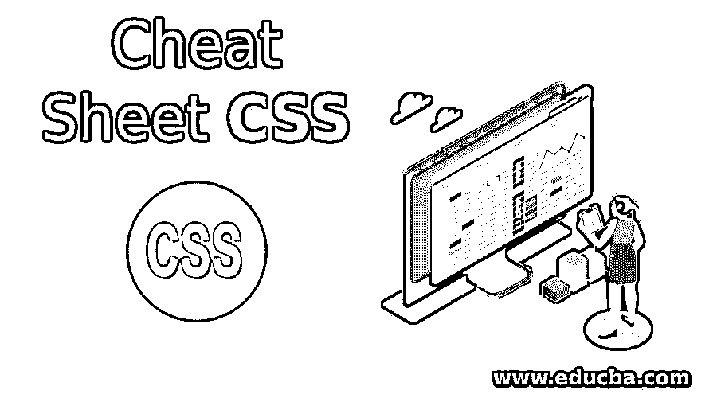
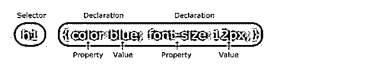

# 备忘单 CSS

> 原文：<https://www.educba.com/cheat-sheet-css/>

## 备忘单 CSS 介绍

级联样式表，也称为 CSS，是一种样式表语言，用于描述以 HTML 等标记语言编写的文档的表示。它基本上简化了网页制作过程。它处理网页的外观，并用于控制网页的功能，如文本颜色、字体样式、段落间距、列对齐、背景图像和颜色以及各种其他效果。CSS 备忘单的优点是节省时间、页面加载速度更快、易于维护、风格出众、多种设备兼容以及全球网络标准。

### 备忘单 CSS 上的命令和内容

备忘单 CSS 的基本语法由选择器和声明组件组成。选择器组件指定需要样式化的 HTML 元素。声明组件包含两个或多个属性及其规范，用分号分隔。声明组件总是以花括号开始和结束。

<small>网页开发、编程语言、软件测试&其他</small>

下面是提到的执行不同类型操作的 Cheatsheet CSS 命令:

| **规格** | **命令** |
| 颜色；色彩；色调 | 使用预定义的颜色名称或 RGB、十六进制、HSL、RGBA、HSLA 值来指定颜色。 |
| 背景 | 元素的背景色由背景色属性指定 |
| 边界 | 

*   Border property sets all border properties.
*   Border Color Sets the color of four borders.
*   Border Radius Sets a border with rounded corners.
*   Border Style Sets the style of four borders.
*   Border Width Sets the width of four borders.

 |
| 利润 | Margin 属性在一个声明中设置边距的属性。 |
| 填料 | 在一个声明中设置填充属性的。 |
| 高度/宽度 | height 和 width 属性用于指定元素的高度和宽度。 |
| 概述 | outline-style 属性指定元素的轮廓类型。 |
| 文本 | color 属性用于设置文本的颜色。 |
| 字体 | font-family 属性用于设置选定文本的字体。 |
| 链接 | text-decoration 属性用于删除链接的下划线，background-color 属性可用于指定链接的背景色。 |
| 列表 | list-style 属性在一个声明中设置列表的属性。list-style-image 指定一个图像作为列表项标记。list-style-position 指定列表项标记的位置。list-style-type 指定列表项标记的类型。 |
| 桌子 | Border 在一个声明中设置所有的边框属性。边框折叠指定是否应该折叠边框。边框间距相邻单元格之间的距离或间距。标题侧指定表格标题的位置。表格布局设置表格布局的算法。 |
| 显示 | display 属性指定元素是否显示以及如何显示。 |
| 最大宽度 | 在指定块元素宽度的过程中，使用 max-width 将改善浏览器对小窗口的处理。 |
| 位置 | position 属性指定元素的位置。 |
| 泛滥 | overflow 属性控制太大而不适合某个区域的文本。 |
| 浮动 | float 属性指定元素应该如何浮动。 |

### 使用备忘单 CSS 命令的免费提示和技巧

备忘单 CSS 的一些基本技巧如下。

*   CSS Box-Model 本质上是一个包装了所有 HTML 元素的盒子。它由边距、边框、填充和内容组成。
*   **Pseudo-Class:** 用于定义元素的特定状态，包括当用户将鼠标放在元素上时对元素进行不同的样式化，对已访问和未访问的链接进行样式化，以及对处于焦点下的元素进行样式化。
*   **伪元素:**用于样式化元素的一部分，如首字母、单词或行。它还有助于在元素内容的前后插入内容。
*   **垂直屏幕高度:**这是指定内容应该占据屏幕的程度。
*   **样式电话链接:**它指定了在电话上作为电话号码打开的链接的属性。
*   **导航栏:**一个网站有好的导航很重要。CSS 将枯燥的 HTML 菜单转化为好看的导航栏。

### 结论

小抄 CSS 作为一个建站工具，非常有效。因为 CSS 提供了更多的选项来更好地展示网站和添加有用的功能，所以它更受欢迎。

### 推荐文章

这是一个备忘单 CSS 的指南，在这里我们讨论了备忘单 CSS 的内容和命令以及免费的提示和技巧，你也可以看看下面的文章来了解更多信息

1.  [备忘单 SQL](https://www.educba.com/cheat-sheet-sql/)
2.  [顶级 CSS 面试问题](https://www.educba.com/css-interview-questions/)
3.  [CSS 与 CSS3 的区别](https://www.educba.com/css-vs-css3/)
4.  [有趣的 UNIX 备忘单](https://www.educba.com/cheat-sheet-for-unix/)

