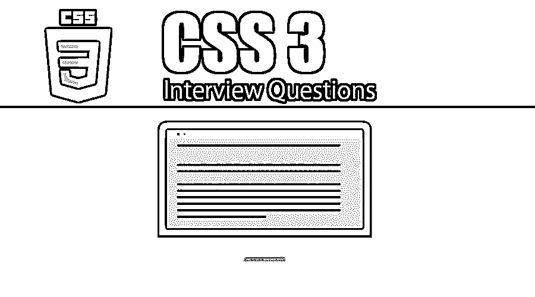

# CSS3 面试问题

> 原文：<https://www.educba.com/css3-interview-questions/>

## CSS3 面试问答介绍

级联样式表是一种样式表语言，描述用标记语言编写的文档的外观和格式。它在网页设计和 XHTML 中很流行。CSS1 于 1996 年 12 月提出了一项建议。这个版本描述了 CSS 语言以及所有 HTML 标签的简单可视化格式模型。CSS3 在 1999 年成为 W3C 推荐标准，它建立在 CSS 的旧版本之上。

风格改变的一个例子可以是

<small>网页开发、编程语言、软件测试&其他</small>

**你好世界**

在标准的 HTML 中，**标签用于使单词加粗。**

这很好。但是过了一段时间后，你想让你的文本带下划线而不是粗体，那么你就需要到每个位置把**标签改成<u>标签。这是一项非常乏味的任务。另外，如果你想改变文本的字体，你需要把 HTML 写成</u>**

 **这是正文**

上面的代码在你的文本中做了你想要的改变，但是它需要写很多包装标签，也使得 HTML 看起来很乱。

使用 CSS，您可以在一个点上定制样式并设置所有属性，给它一个唯一的名称并标记您的 HTML 以应用这些样式属性。CSS 由浏览器解释并应用于文档中相应元素的样式规则组成。样式规则由以下部分组成

*   **选择器**:选择器是一个 HTML 标签，样式将被应用于其上。这可以是任何标签，如< h1 >、< p >等。
*   **属性**:属性是 HTML 标签的一种属性。所有的 [HTML 属性](https://www.educba.com/html-attributes/)都被转换成 CSS 属性。这可以是颜色、边框等。
*   **值**:给属性赋值。例如，颜色属性可以具有红色、绿色等值。

CSS 语法可以如下所示

选择器{property: value}
选择器可以用多种方式定义，如下所示

*   **类型选择器**
    默认选择器
    h1 { color:# ffff；}
*   **通用选择器**
    通用选择器匹配任何元素类型的名称。
    * { color:# ffff；}
*   **后代选择器**
    假设你想只在一个元素位于一个特定的元素内部时对它应用样式。例如
    ul em { color:# ffff；}
    样式将仅在< em >元素位于< ul >标签内时应用于该元素。
*   **类选择器**
    样式规则可以根据元素的类属性来定义。具有该类的所有元素都将根据定义的规则进行格式化。
*   **ID 选择器**
    可以根据元素的 ID 属性定义样式规则。
    h1 #黑色{ color:# ffff；}
    该规则仅将< h1 >元素的内容呈现为黑色。

您可以插入定义新样式的 CSS 代码。用

