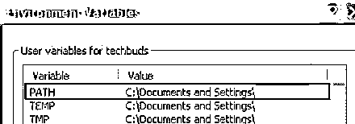
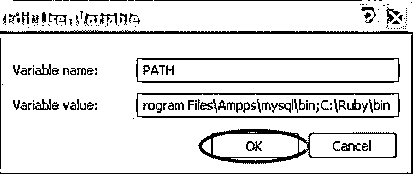
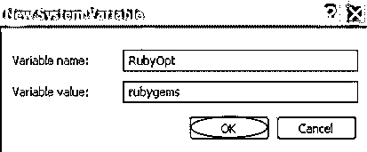
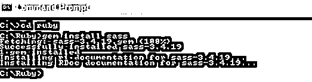

# 如何安装 SASS？

> 原文：<https://www.educba.com/install-sass/>

## SASS 简介

以下文章提供了如何安装 SASS？SASS 或语法上令人敬畏的样式表是 CSS 的扩展，帮助我们编写更灵活的样式。这为 CSS 的基础语言[增加了更多的功能。SASS 是编译成 CSS 的预处理语言，有不同的技术语法。用 SASS 编写代码不会让浏览器像解释 CSS 那样解释代码；相反，我们需要一个编译器来完成我们写入 CSS 的代码，以便浏览器解释和理解它。](https://www.educba.com/css-commands/)

变量、混合、嵌套规则、内联导入等。，可以在兼容 CSS 语法的 SASS 中使用。在 compass 样式库的帮助下，语法上令人敬畏的样式表使大的样式表组织得很好，并在很短的时间内使小的样式表运行起来。除了完全兼容 CSS 的平台和嵌套、mixins、WTC 等语言扩展，它还提供了许多重要的功能来处理颜色和不同的其他值。它还具有其他高级特性，如库的控制指令、正确格式化、可定制的输出等。

<small>网页开发、编程语言、软件测试&其他</small>

下面是语法上令人敬畏的样式表安装的系统要求:

*   **操作系统:**可以是任何跨平台的操作系统。
*   **编程语言:**编程语言为 Ruby。
*   **浏览器:**可以是 google chrome、internet explorer、safari、Mozilla Firefox、Opera 等任何浏览器。

### 安装 SASS 的步骤

下面是在系统中安装语法上很棒的样式表包的步骤:

#### 第一步:

使用下面的链接下载 Ruby 的当前稳定版本。它下载一个 zip 文件，该文件必须被解压缩以便进一步安装。Winzip 或 7zip 可以用来解压文件。

[https://www.ruby-lang.org/en/downloads/](https://www.ruby-lang.org/en/downloads/)

#### 第二步:

解压后，按照标准安装程序将 Ruby 安装到系统中。

#### 第三步:

将 Ruby bin 文件夹添加到 PATH 用户变量和系统变量中，以便它可以使用 gem 命令。

要添加路径变量:

1.  首先，右键单击桌面上的“我的电脑”图标。
2.  从下拉菜单转到属性。
3.  之后，单击高级选项卡，然后单击环境变量。

*   环境变量窗口打开后，双击顶部变量列下的路径。

*   双击路径，将打开编辑用户变量窗口。将 ruby bin 路径作为 C:\Ruby\bin 添加到变量的值字段中。如果为其他文件设置了其他路径，只需放一个分号并添加 ruby 路径。

*   单击确定按钮完成任务。

**设置系统变量:**

*   在系统下，变量选项卡点击新建按钮。
*   之后,“新系统变量”窗口将会打开。在变量名字段中填入 RubyOpt，在变量值字段中填入 RubyGems。接下来，单击 OK 按钮完成任务。

#### 第四步:

在系统的命令提示符下，运行命令 gem install Scss。这将在系统中安装 sass。

#### 第五步:

SASS 成功安装后会出现下面的屏幕。检查一下，确认一下。

**下面的例子显示了 SASS 的基本实现:**

**代码:**

`<html>
<head>
<title> SASS example</title>
<link rel = "stylesheet" type = "text/css" href = "example.css"/>
</head>
<body>
<h1>Example</h1>
<h3>It is a bright and sunny day</h3>
</body>
</html>`

我们将创建一个很好的例子。css 是类似于 CSS 期望的事实，它将与。scss 扩展。这必须在 ruby 文件夹中与。htm 文件。或者，文件 scss 文件也可以用文件夹路径 ruby\lib\scss 保存。在创建 scss 文件之前，在 lib 文件夹中创建文件夹 sass。

**代码:**

`h1{ color: #AF80ED; } h3{ color: #DE5E85; }`

只要 SCSS 文件有任何变化，就可以指示 SASS 监视该文件并更新 CSS。

**代码:**

`sass --watch C:\ruby\lib\sass\ example.scss: example.css`

在运行上面的命令时，它会自动创建一个 example.css 文件。更改 scss 文件时，example.css 文件将自动更新。

运行上述命令时，将创建包含以下内容的 example.css 文件。

**代码:**

`h1{ color: #AF80ED; } h3{ color: #DE5E85; }`

### 安装 SASS 的其他方法

有许多应用程序提供了安装 SASS 的简单且用户友好的方式。这些可以从网上下载。其中，一些是免费的，而其他的是付费的。

如果用户使用 node.js，NPM 也可以用来安装 SASS

因此，在上面的分步指南中，SASS 可以成功地安装在系统中。

**代码:**

`npm install -g sass`

但是请注意，这个安装将安装语法上令人敬畏的样式表的纯 [javascript](https://www.educba.com/install-javascript/) 实现，这比这里给出的其他方法相对要慢，但是它仍然具有与其他方法相同的接口。因此，在缓慢导致任何问题的情况下，在稍后的时间点切换到另一个实现来提高速度将是非常容易的。

如果任何用户运行 Chocolatey package manager for Windows，可以安装 dart SASS。

**代码:**

`choco install sass`

如果任何用户使用 Mac OS X 版的[家酿](https://brew.sh/)软件包管理器，可以安装 dart SASS。

**代码:**

`brew install sass/sass/sass`

因此，除了如此多的特性之外，SASS 或语法上令人敬畏的样式表还提供了广泛的特性，用于更轻松地设计网页。SASS 提供了不同的 CSS 扩展，如嵌套属性、占位符选择等。它还支持 SASS 脚本，为编程提供交互式外壳，并支持不同的变量、数据类型、操作、函数、插值等。安装过程也很容易执行。SASS 增加了它所有的功能，提供了一个非常棒的平台，可以与网页设计和其他人一起工作。

### 推荐文章

这是如何安装 SASS 的指南？在这里，我们已经讨论了以更容易和最简单的方式安装 SASS 的不同步骤。您也可以浏览我们推荐的其他文章，了解更多信息——

1.  [安装。网络](https://www.educba.com/asp-dot-net-page-life-cycle/)
2.  [安装 PostgreSQL](https://www.educba.com/install-postgresql/)
3.  [安装打字稿](https://www.educba.com/install-typescript/)
4.  [安装附件](https://www.educba.com/install-appium/)

