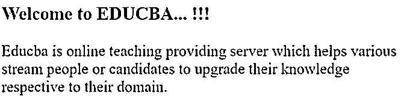
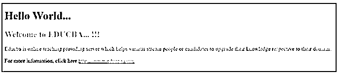

# Sass 变量

> 原文：<https://www.educba.com/sass-variables/>


## Sass 变量简介

SASS 变量可以用来给一个以$符号开始的名字赋值，以后它可以引用名字而不是值。尽管它很简单，SASS 变量被认为是有用的工具之一，它允许我们减少重复，能够进行复杂的计算，配置库等等。像所有的 Sass 标识符一样，Sass 变量认为连字符和下划线是相似的。它表示$font-size 和$font size 指向同一个变量。变量是存储信息的一种方式，以后可以重用。

在 Sass 中，我们可以将信息存储在变量中，例如:

<small>网页开发、编程语言、软件测试&其他</small>

*   布尔型
*   颜色
*   线
*   数字
*   列表
*   无效的

**语法:**

定义 SASS 变量的基本语法可以写成如下所示:

```
$variable_name : value;
```

对于 ex 来说，

```
$var_size: 25px;
```

### Sass 中的变量是如何工作的？

*   SASS 变量可以与用$符号声明的变量名一起使用。
*   这个变量可以用来减少变量值的重复，并执行数学计算，使许多工作更容易。

定义的变量可以在 SCSS 中使用，如下所示:

**代码:**

```
$var_size: 25px;
$var_color: red;
p{
font-size: $var_size;
color: $var_color;
}
```

当你编译 CSS 文件时，我们会得到下面的样式表:

**代码:**

```
p{
font-size: 25px;
color: red;
}
```

### Sass 变量的示例

下面是一些例子:

#### 示例#1

创建名为 sass_import.html 的文件。

**代码:**

sass_var_example.html

```
<!DOCTYPE html>
<html>
<head>
<meta http-equiv="Content-Type" content="text/html; charset=windows-1252">
<title> SASS Variables Example </title>
<link rel="stylesheet" type="text/css" href="sass_var_demo.css"/>
</head>
<body>
<h3>Welcome to EDUCBA... !!!</h3>
<div class="styledemo">
Educba is online teaching providing server which helps various stream people or candidates to upgrade their knowledge respective to their domain.
</div>
</body>
</html>
```

现在创建一个名为 sass_var_demo.scss 的 scss 文件，并放入下面的代码。

**代码:**

sass_var_demo.scss

```
$var_fontweight: 250;
$var_Color: blue;
$var_FontSize: 25px;
$var_Width: 650px;
body {
font-weight: $var_fontweight;
font-size: $var_FontSize;
color: $var_Color;
}
.styledemo {
width: $var_Width;
}
```

将以上两个文件放在已安装的 ruby 文件夹的根文件夹中。现在，打开命令提示符并运行下面的命令来观察文件，并将其传递给 SASS，并在每次 SASS 文件更改时更新 CSS 文件。

**代码:**

```
sass --watch .sass_var_demo.scss: sass_var_demo.css
```

sass_var_demo.css 文件包含以下代码。

**代码:**

```
body {
font-weight: 250;
font-size: 25px;
color: blue;
}
.styledemo {
width: 650px;
}
```

**输出:**




#### 实施例 2

下面的例子定义了标题、段落和超链接的变量。按照上面示例中定义的相同过程执行程序。

**代码:**

```
<!DOCTYPE html>
<html>
<head>
<meta http-equiv="Content-Type" content="text/html; charset=windows-1252">
<title> SASS Variables Example </title>
<link rel="stylesheet" type="text/css" href="sass_var_demo1.css"/>
</head>
<body>
<h1> Hello World...</h1>
<div class="styledemo">
<h2> Welcome to EDUCBA... !!!</h2>
<p>Educba is online teaching providing server which helps various stream people or candidates to upgrade their knowledge respective to their domain.</p>
For more information, click here <a href="example.com/">https://www.educba.com/</a>
</div>
</body>
</html>
```

现在创建一个名为 sass_var_demo1.scss 的 scss 文件，并放入下面的代码。

**代码:**

```
sass_var_demo1.scss
$heading_color: #ADC1CC;
$para_color: #41B15D;
$link_color: #E59D3C;
h2 { color: $heading_color; }
p { color: $para_color; }
a { color: $link_color; }
```

使用 sass–watch 命令编译代码，如上例所示。

sass_var_demo1.css 文件将包含以下代码:

**代码:**

```
sass_var_demo1.css
h2 {
color: #ADC1CC;
}
p {
color: #41B15D;
}
a {
color: #E59D3C;
}
```

**输出:**




#### 实施例 3

如何显示具有高度和宽度变量的图像？

**代码:**

```
<!DOCTYPE html>
<html>
<head>
<meta http-equiv="Content-Type" content="text/html; charset=windows-1252">
<title> SASS Variables Example </title>
<link rel="stylesheet" type="text/css" href="sass_var_demo2.css"/>
</head>
<body>
<div class="styledemo">
<h2> Welcome to EDUCBA... !!!</h2>

</div>
</body>
</html>
```

现在创建一个名为 sass_var_demo.scss 的 scss 文件，并放入下面的代码。

**代码:**

```
sass_var_demo2.scss
$heading_color: #ADC1CC;
$img_width: 250px;
$img_height: 250px;
h2{
color: $heading_color;
}
.style{
width: $img_width;
height: $img_height;
}
```

使用 sass–watch 命令编译代码，如上例所示。

sass_var_demo2.css 文件将包含以下代码:

**代码:**

```
sass_var_demo2.css
h2 {
color: #ADC1CC;
}
.style {
width: 250px;
height: 250px;
}
```

**输出:**


### 结论

到目前为止，我们已经研究了在重复性工作中非常有用的 SASS 变量。当你定义了在文件中重复出现的属性，比如颜色或者大小，可以在其他 CSS 属性中使用。变量使这项工作更快，并允许开发人员非常容易地进行更改。变量可以重用，因此，这使得我们的代码非常容易维护和更改。

### 推荐文章

这是一个 Sass 变量的指南。在这里，我们讨论介绍，变量如何在 Sass 中工作，以及相应的例子。您也可以看看以下文章，了解更多信息–

1.  [什么是 Sass？](https://www.educba.com/what-is-sass/)
2.  [SAS 操作员](https://www.educba.com/sas-operators/)
3.  [SASS if else](https://www.educba.com/sass-if-else/)
4.  [SASS @at-root](https://www.educba.com/sass-at-root/)


