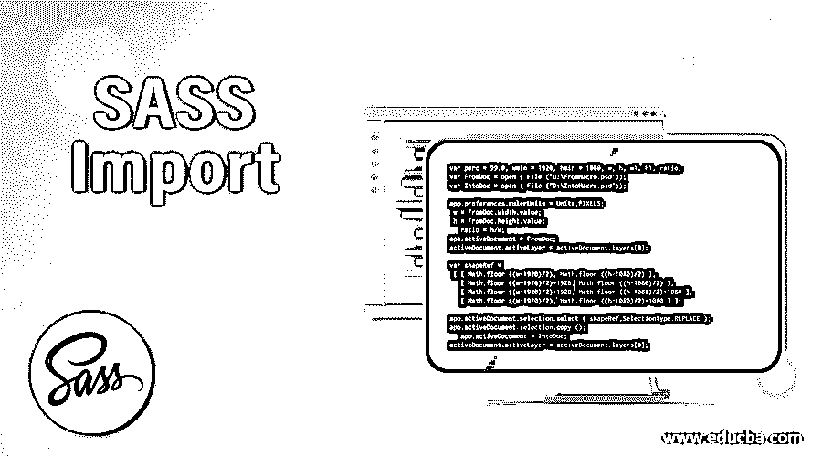
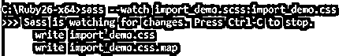
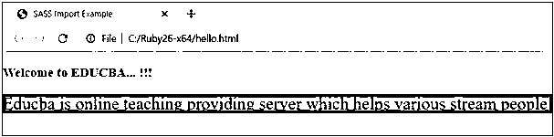
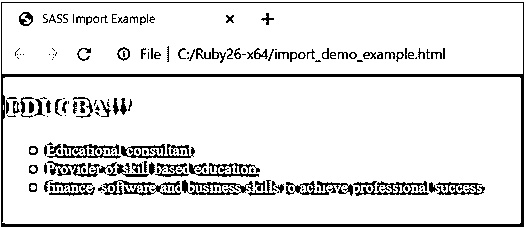

# SASS 导入

> 原文：<https://www.educba.com/sass-import/>




## SASS 导入简介

SASS 代表语法上令人敬畏的样式表，它是一个 css 预处理程序，为您的样式表标记提供一个功能，以不同的方式编写样式。

@import 是 SASS 预处理器中的一个指令，用于将相关代码保存在单独的文件中。它允许我们在一个文件中继续编写代码，而不是在多个文件中保存相同的代码。@import 指令可以用来在我们的主文件中导入 SCSS 文件，因此本质上，我们可以将多个文件组合在一起。

<small>网页开发、编程语言、软件测试&其他</small>

@import 指令将查找要导入的 Sass 文件，但在以下情况下，它将编译为 CSS @import 规则:

*   的。css 将是文件的扩展名
*   http://将是文件名的开头
*   url()可以是文件名
*   可以使用@import 指令来使用媒体查询

### 句法

SASS 中@import 指令的语法可以写成如下所示:

**语法:**

```
@import mystyle.sass;
```

上面一行使用@import 指令将样式表包含到另一个样式表中。例如，让我们用下面的代码将一个文件作为 demo.scss:

**代码:**

```
a {
color: blue;
}
body {
font-size: 15px;
background-color: red;
}
```

现在，用下面的代码创建另一个名为 demo1.scss 的文件:

**代码:**

```
@import "demo.scss";
p {
color: green;
font-weight: 200;
}
```

当您编译代码时，您将获得包含上述两个文件的以下代码:

**代码:** demo2.css

```
a {
color: blue;
}
body {
font-size: 15px;
background-color: red;
}
p {
color: green;
font-weight: 200;
}
```

### SASS 中导入目录的工作

*   import 指令使我们能够添加几个样式，并且可以分解成单独的文件，以便将它们导入到另一个文件中。这样，SASS import 指令可以快速编辑样式表。
*   不同的普通 CSS 导入需要浏览器在显示您的网页时发出多个 HTTP 请求，在编译期间，Sass 导入被完全处理。
*   SASS 在@import CSS 上工作。它不涉及 HTTP 请求。相反，它通常接受我们想要导入的文件，并将其与您要导入的文件集成在一起，因此您可以用单个 CSS 文件来表示 web 浏览器。

### 实现 SASS 导入目录的示例

以下是一些例子:

#### 示例#1

要运行 SASS 文件，需要安装执行 SASS 程序的 Ruby。使用以下代码创建一个名为 sass_import.html 的文件:

**代码:** sass_import.html

```
<!DOCTYPE html>
<html>
<head>
<meta http-equiv="Content-Type" content="text/html; charset=windows-1252">
<title> SASS Import Example </title>
<link rel="stylesheet" type="text/css" href="import_demo.css"/>
</head>
<body>
<h3>Welcome to EDUCBA... !!!</h3>

Educba is online teaching providing server which helps various stream people or candidates to upgrade their knowledge respective to their domain.
</p>
</body>
</html>
```

现在创建一个名为 import_demo.scss 的 scss 文件，并放入下面的代码。

**代码:** import_demo.scss

```
html, body {
margin: 0;
padding: 0;
}
.styledemo {
font-size:25px;
background-color: green;
}
```

将上述两个文件放在已安装的 ruby 文件夹的根文件夹中。现在，打开命令提示符并运行下面的命令来观察文件，并将其传递给 SASS，并在每次 SASS 文件更改时更新 CSS 文件。

**代码:**

```
sass --watch import_demo.scss: import_demo.css
```

**输出:**




上面的命令将在安装 Ruby 的同一个文件夹中创建一个名为 import_demo.css 的 CSS 文件。import_demo.css 文件包含以下代码。

**代码:**

```
html, body {
margin: 0;
padding: 0;
}
.styledemo {
font-size: 25px;
background-color: green;
}
```

**输出:**现在，执行 html 文件并在浏览器中打开，您将获得以下结果:




#### 实施例 2

在这个例子中，我们使用了@import 指令，它将一个文件的内容导入到另一个文件中。让我们创建一个 html 文件，并将下面的代码保存为 import_demo_example.html。

**代码:**

```
<!DOCTYPE html>
<html>
<head>
<meta http-equiv="Content-Type" content="text/html; charset=windows-1252">
<title> SASS Import Example </title>
<link rel = "stylesheet" type = "text/css" href = "sass_import_demo.css"/>
</head>
<body class = "block">
<h2> EDUCBA!!! </h2>
<ul>
<li> Educational consultant... </li>
<li> Provider of skill based education... </li>
<li> finance, software and business skills to achieve professional success... </li>
</ul>
</body>
</html>
```

现在用下面的代码创建一个名为 sass_import.scss 的文件:

**代码:**

```
ul{
margin: 0;
padding: 1;
}
li{
color: #82BBDB;
}
```

接下来，创建名为 sass_import_demo.scss 的 css 文件，并将以下代码添加到其中:

**代码:**

```
@import "sass_import";
.block {
background: #26688D;
}
h2 {
color: #B98D25;
}
```

**解释:**在上面的文件中，我们正在导入一个 sass-import 文件，当您对 scss 文件进行更改时，它会将其内容添加到该文件中。@import 可以将样式表包含在其他样式表中。包含的文件可以放在类似的服务器上，也可以通过 URL 添加到备用服务器上的目录中。

现在，打开命令提示符并运行下面的命令来观察文件，并将其传递给 SASS，并在每次 SASS 文件更改时更新 CSS 文件。

**代码:**

```
sass –watch sass_import_demo.scss: sass_import_demo.css
```

现在，使用上面的命令执行该文件，它将使用下面的代码创建 sass_import_demo.css 文件:

**代码:** sass_import_demo.css

```
ul {
margin: 0;
padding: 1;
}
li {
color: #82BBDB;
}
.block {
background: #26688D;
}
h2 {
color: #B98D25;
}
```

**输出:**现在，执行 html 文件并在浏览器中打开，你会得到下面的结果。




### SASS 导入的好处

使用@import 指令的主要好处是，我们可以使用@import 合并几个文件，然后编译主文件。因此，结果是，我们将只有一个 CSS 文件，因此，浏览器将不必创建多个 HTTP 请求来加载单独的 CSS 文件。

### 结论

@import Sass 指令是 CSS 规则之一，它可以帮助维护代码，将较大的文件分解成小文件，还可以帮助导入其他文件，最终导入一个将被编译成 CSS 的顶级文件。如果您使用 Sass 预处理程序，您将为样式表创建一个良好的结构。Sass 预处理器中没有@import 指令的结构不可能正常工作。

### 推荐文章

这是一份 SASS 导入指南。在这里，我们讨论 SASS 导入的语法、工作方式以及在了解其好处的情况下实现的示例。您也可以浏览我们的其他相关文章，了解更多信息——

1.  [SASS if else](https://www.educba.com/sass-if-else/)
2.  [萨斯嵌套](https://www.educba.com/sass-nesting/)
3.  [SASS @at-root](https://www.educba.com/sass-at-root/)
4.  [萨斯@媒体](https://www.educba.com/sass-media/)


