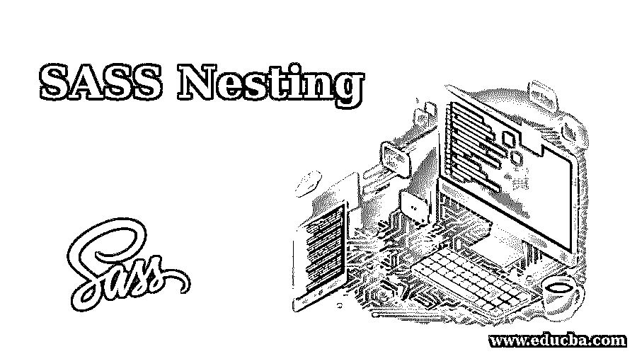
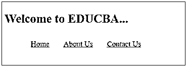
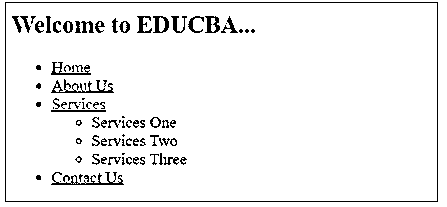

# 萨斯嵌套

> 原文：<https://www.educba.com/sass-nesting/>




## SASS 嵌套的定义

嵌套是不同逻辑结构的合并过程。通过使用 SASS，我们可以将大量的 CSS 规则相互集成。我们还可以在一个选择器中使用另一个选择器，通过使用多个选择器来生成复合选择器。

我们在使用嵌套时必须非常小心，因为过多的嵌套规则会产生歧义，并且很难维护。Sass 经常使用 CSS 名称空间来提供编写样式的快捷方式。通常，当在同一个名称空间中设置属性时，我们必须在样式表中编写单独的属性。例如，对于元素边界，我们可以用 Sass 编写一次名称空间，并嵌套它的属性。

<small>网页开发、编程语言、软件测试&其他</small>

### SASS 嵌套的语法

嵌套样式的使用非常简单，只需将一个或多个选择器放在另一个选择器的花括号内即可。嵌套的深度可以达到我们想要的多级。

**语法:**

```
.class_name_one{
element_one{
// style code
}
element_two{
// style code
}
.class_name_two{
element_three{
// style code
}
element_four{
// style code
}
}
}
```

在上面的语法中，我们可以看到元素名、类名是嵌套在。类别名称选择器。编译 scss 时，css 中会有如下所示的样式代码:

```
.class_name_oneelement_one {
// style code
}
.class_name_oneelement_two{
// style code
}
.class_name_one .class_name_twoelement_three {
// style code
}
.class_name_one .class_name_twoelement_four {
// style code
}
```

**举例:**

让我们来看看 scss 的一小段代码，如下所示:

```
.myheading{
h2{
font-size: 15px;
color: red;
}
p {
font-size: 15px;
color: grey;
}
.myclass{
h3{
font-size: 15px;
color: red;
}
p {
font-size: 15px;
color: grey;
}
}
}
```

编译完文件后，您将获得 css 中的以下代码:

```
.myheading h2 {
font-size: 15px;
color: red;
}
.myheading p {
font-size: 15px;
color: grey;
}
.myheading .myclass h3 {
font-size: 15px;
color: red;
}
.myheading .myclass p {
font-size: 15px;
color: grey;
}
```

### SASS 中的嵌套是如何工作的？

嵌套是创建 CSS 规则的捷径。SASS 中的嵌套就像是多个 CSS 的选择器，将它们组合在一起，而不是编写不同的 CSS 行来精确定义我们想要添加到元素中的样式，我们只是将它嵌套起来。

### 在 SASS 中实现嵌套的示例

让我们创建一个例子来利用 SASS 中的嵌套。这里，我们用下面的代码创建了一个名为 example1.html 的 HTML 文件:

#### 示例#1

**代码:**

```
<!DOCTYPE html>
<html>
<head>
<title> SASS Nesting </title>
<link rel="stylesheet" type="text/css" href="sass_nesting.css"/>
</head>
<body>
<h2> Welcome to EDUCBA... </h2>
<nav>
<ul>
<li><a href="#"> Home </a></li>
<li><a href="#"> About Us </a></li>
<li><a href="#"> Contact Us </a></li>
</ul>
</nav>
</body>
</html>
```

现在用下面的代码创建一个名为 sass _ nesting.scsswith 的文件:

**代码:**

```
nav {
ul {
margin: 5;
padding: 5;
list-style: none;
}
li {
display: inline-block;
}
a {
display: block;
padding: 8px 12px;
text-decoration: underline;
font-size: 15px;
}
}
```

现在，打开命令提示符并运行下面的命令来观察文件，并将其传递给 SASS，并在每次 SASS 文件更改时更新 CSS 文件。

```
sass –watch sass_nesting.scss: sass_nesting.css
```

现在，使用上面的命令执行该文件，它将使用下面的代码创建 sass_nesting.css 文件:

**代码:**

```
nav ul {
margin: 5;
padding: 5;
list-style: none;
}
nav li {
display: inline-block;
}
nav a {
display: block;
padding: 8px 12px;
text-decoration: underline;
font-size: 15px;
}
```

**输出:**

现在，执行 html 文件并在浏览器中打开，您将获得以下结果:




#### 实施例 2

用下面的代码创建一个名为 example2.html 的 HTML 文件:

**代码:**

```
<!DOCTYPE html>
<html>
<head>
<title> SASS Nesting </title>
<link rel="stylesheet" type="text/css" href="sass_nesting1.css"/>
</head>
<body>
<h2> Welcome to EDUCBA... </h2>
<ul>
<li><a href="#"> Home </a></li>
<li><a href="#"> About Us </a></li>
<li><a href="#"> Services </a>
<ul>
<li> Services One </li>
<li> Services Two </li>
<li> Services Three </li>
</ul>
</li>
<li><a href="#"> Contact Us </a></li>
</ul>
</body>
</html>
```

现在用下面的代码创建一个名为 sass_nesting1.scss 的文件:

**代码:**

```
nav {
ul {
margin: 5;
padding: 5;
list-style: none;
}
li { display: inline-block; }
a {
display: block;
padding: 8px 15px;
text-decoration: underline;
}
}
```

使用上面示例中显示的命令执行该文件，它将使用下面的代码创建 sass_nesting1.css 文件:

**代码:**

```
nav ul {
margin: 5;
padding: 5;
list-style: none;
}
nav li {
display: inline-block;
}
nav a {
display: block;
padding: 8px 15px;
text-decoration: underline;
}
```

**输出:**

现在，运行 html 文件并在浏览器中打开，你会得到下面的结果:




#### 实施例 3

用下面的代码创建一个名为 example3.html 的 HTML 文件:

**代码:**

```
<html>
<head>
<title> SASS Nesting </title>
<link rel = "stylesheet" type = "text/css" href = "sass_nesting2.css" />
<link rel = "stylesheet" href = "https://maxcdn.bootstrapcdn.com/bootstrap/3.3.5/css/bootstrap.min.css">
</head>
<body>
<div class = "myheading">
<h2> Welcome to EDUCBA...!!! </h2>
<p> It is a leading global provider of skill based education addressing the needs of 500,000+ members across 40+ Countries. </p>
<p> All our training programs are Job oriented skill based programs demanded by the Industry. </p>
<div class = "myclass">
<h3> Why EDUCBA ?</h3>
<p>  AteduCBA, it is a matter of pride for us to make job oriented hands-on courses available to anyone, any time and anywhere. Therefore we ensure that you can enroll 24 hours a day, seven days a week, 365 days a year. </p>
</div>
</div>
</body>
</html>
```

现在用下面的代码创建一个名为 sass_nesting2.scss 的文件:

**代码:**

```
.myheading{
h2{
font-size: 20px;
color:#FA8072;
}
p{
font-size: 20px;
color:#708090;
}
.myclass{
h3{
font-size: 20px;
color:#FA8072;
}
p{
font-size: 20px;
color:#708090;
}
}
}
```

执行该文件，它将使用以下代码创建 sass_nesting2.css 文件:

**代码:**

```
.myheading h2 {
font-size: 20px;
color: #FA8072;
}
.myheading p {
font-size: 20px;
color: #708090;
}
.myheading .myclass h3 {
font-size: 20px;
color: #FA8072;
}
.myheading .myclass p {
font-size: 20px;
color: #708090;
}
```

**输出:**

运行 html 文件并在浏览器中打开，您将获得以下结果:


### 结论

到目前为止，我们已经学习了 SASS 中的嵌套，它非常有用，可以使我们的 CSS 有组织。因此，这个键以一种不影响输出和维护的方式使用嵌套。嵌套允许你编写模仿 HTML 结构的选择器。这有助于您使用快捷方式构建 CSS。

### 推荐文章

这是一个关于 SASS 嵌套的指南。在这里，我们还将讨论 sass 中嵌套的定义和工作原理。以及不同的示例及其代码实现。您也可以看看以下文章，了解更多信息–

1.  [萨斯对少萨](https://www.educba.com/sass-vs-less/)
2.  [SASS 面试问题](https://www.educba.com/sass-interview-questions/)
3.  [SASS @at-root](https://www.educba.com/sass-at-root/)
4.  [萨斯@媒体？](https://www.educba.com/sass-media/)


