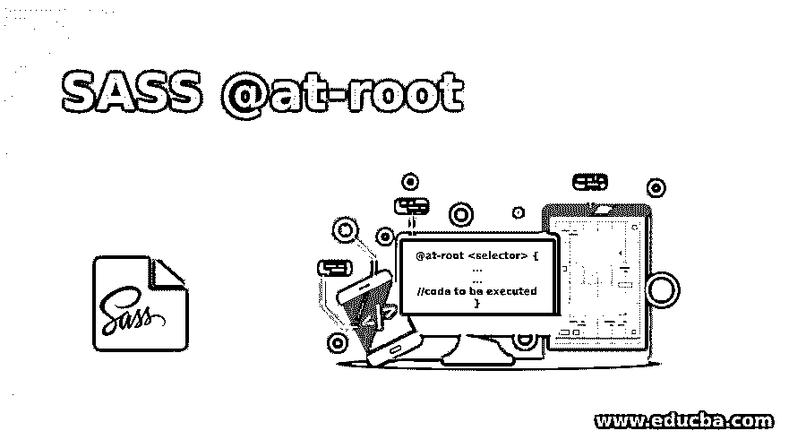
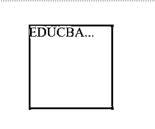
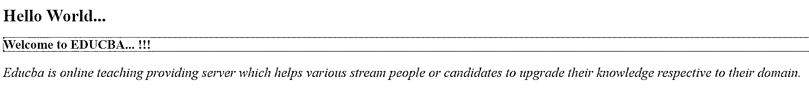

# 萨斯@根

> 原文：<https://www.educba.com/sass-at-root/>




## 根 SASS 的定义

@at-root 指令是一组嵌套规则，可以在文档的根位置呈现样式块。有时候，当我们在 js 中为一个组件创建样式时，我们通常会在根级别添加所有的 variant 类，然后用它来修改 js 中组件的所有元素。如果我们想在名称空间中嵌套样式，使用 sass 会变得更加复杂。

此外，我们必须插入选择器来处理它。就是@at-root 开始玩的时候。@at-root 将移动选择器并将其重新启动到初始嵌套范围之外，使我们能够将变体选择器添加到父类中。

<small>网页开发、编程语言、软件测试&其他</small>

### SASS @at-root 语法

@at-root 指令的语法可以写成:

```
@at-root <selector> {
...
…
//code to be executed
}
```

如上面的语法所示，它允许文档中的所有内容都从根发出，而不是使用常规的嵌套。@at-root 可以写成@at-root {… }，以便在它的作用域内有许多样式规则，将它们全部放在文档的根。

例如:

```
div{
font-size: 10px;
color: red;
@at-root .my_atroot_demo {
background-color: grey;
}
}
```

当您编译上面的 scss 文件时，您将得到下面的 css 代码:

```
div{
font-size: 10px;
color: red;
}
. my_atroot_demo {
background-color: grey;
}
```

### @at-root 指令在 SASS 中是如何工作的？

这最常用于 SassScript 父选择器和选择器函数，同时进行一些高级嵌套。在实现增强的嵌套时，它协助选择器功能。@at-root 指令可以作为单个选择器内嵌使用，甚至可以作为一个包含几个选择器的块使用。

对于内联，它的工作方式如下:

```
.parent_element {
...
…
@at-root .child {
//code for styling the elements
}
}
```

对于具有多个选择器的块，它的工作方式如下:

```
.parent_element {
...
…
@at-root {
.child_element1 {
//code for styling the elements
}
.child_element2 {
//code for styling the elements
}
}
}
```

### 在 SASS 中实现@at-root 指令的示例

让我们创建一个例子来使用 SASS 中的@at-root 指令。这里，我们用下面的代码创建了一个名为 example1.html 的 HTML 文件:

#### 示例#1

**代码:**

```
<html>
<head>
<title> SASS @at-root Directive Example </title>
<link rel = "stylesheet" type = "text/css" href = "sass_atroot.css"/>
</head>
<body>
<h1> Hello World...Welocme to EDUCBA!!!!. </h1>
<h2> It is a leading global provider of skill based education. It is an online learning model along with amazing 2500+ courses prepared by top-notch professionals. </h2>
</body>
</html>
```

现在用下面的代码创建一个名为 sass_atroot.scss 的文件:

**sass _ atrot . SCS**

```
h1 {
color: #A52A2A;
background-color: #DEB887;
@at-root {
h2{
font-size: 22px;
font-style: italic;
color: #1E90FF;
}
}
}
```

现在，打开命令提示符并运行下面的命令来观察文件，并将其传递给 SASS，并在每次 SASS 文件更改时更新 CSS 文件。

```
sass –watch sass_atroot.scss: sass_atroot.css
```

现在，使用上面的命令执行该文件，它将使用下面的代码创建 sass_atroot.css 文件:

**sass_atroot.css**

```
h1 {
color: #A52A2A;
background-color: #DEB887;
}
h2 {
font-size: 22px;
font-style: italic;
color: #1E90FF;
}
```

**输出**:

*   将上面给出的 html 代码保存在 html 文件中。
*   现在，在浏览器中打开上面的 HTML 文件，您将看到下面的输出，如显示的图像所示。


#### 实施例 2

用下面的代码创建一个名为 example2.html 的 HTML 文件:

**代码:**

```
<html>
<head>
<title> SASS @at-root Directive Example </title>
<link rel = "stylesheet" type = "text/css" href = "sass_atroot1.css"/>
</head>
<body>
<div class="myclass"> EDUCBA... </div>
</body>
</html>
```

现在用下面的代码创建一个名为 sass_atroot1.scss 的文件:

**sass _ atrot 1 . SCS**

```
.myclass {
background-color: grey;
height: 100px;
margin: 50px;
width: 100px;
@at-root {
@keyframes fade {
from { transform: scale(1.5); }
to { transform: scale(1.0); }
}
}
&:hover {
animation: fade 5s infinite;
}
}
```

使用前面示例中显示的命令执行该文件，它将使用以下代码创建 sass_atroot1.css 文件:

**sass_atroot1.css**

```
.myclass {
background-color: grey;
height: 100px;
margin: 50px;
width: 100px;
}
@keyframes fade {
from {
transform: scale(1.5);
}
to {
transform: scale(1);
}
}
.myclass:hover {
animation: fade 5s infinite;
}
```

**输出**

*   将上面给出的 html 代码保存在 html 文件中。
*   现在，在浏览器中打开上面的 HTML 文件，您将看到下面的输出，如显示的图像所示。




将光标悬停在某个元素上时，它会从比例 1.5 移动到比例 1。动画效果将持续 5 秒钟。这种效应将会再次开始，并且永远持续下去(无限)。

#### 实施例 3

用下面的代码创建一个名为 example3.html 的 HTML 文件:

**代码:**

```
<!DOCTYPE html>
<html>
<head>
<meta http-equiv="Content-Type" content="text/html; charset=windows-1252">
<title> SASS @at-root Directive Example </title>
<link rel="stylesheet" type="text/css" href="sass_atroot2.css"/>
</head>
<body>
<h1> Hello World...</h1>
<div class="styledemo">
<h2> Welcome to EDUCBA... !!! </h2>
<p>Educba is online teaching providing server which helps various stream people or candidates to upgrade their knowledge respective to their domain.</p>
</div>
</body>
</html>
```

现在用下面的代码创建一个名为 sass_atroot2.scss 的文件:

**sass _ atrot 2 . SCS**

```
h1 {
color: #ff8000;
@at-root {
h2{
color: #A52A2A;
background-color: #DEB887;
}
p{
font-size: 25px;
font-style: italic;
color: #666600;
}
}
}
```

使用前面示例中显示的命令执行该文件，它将使用以下代码创建 sass_atroot2.css 文件:

**sass_atroot2.css**

```
h1 {
color: #ff8000;
}
h2 {
color: #A52A2A;
background-color: #DEB887;
}
p {
font-size: 25px;
font-style: italic;
color: #666600;
}
```

**输出**

*   将上面给出的 html 代码保存在 html 文件中。
*   现在，在浏览器中打开上面的 HTML 文件，您将看到下面的输出，如显示的图像所示。




### 结论

在本文中，我们详细介绍了 SASS 中@at-root 指令的概念，并给出了一些简化工作的例子。@at-root 的明显用途非常有限，但是该指令提供的控制在特定的边缘情况下是有益的。

嵌套可能最常用于创建更具体的选择器。使用@at-root 指令，允许您保持样式分组，而不会创建超出您需要的更多特性。对于任何选择器，我们都可以使用@at-rule 指令在样式表中将它们编译为根选择器，而不是嵌套选择器。

### 推荐文章

这是一个指南 SASS @at-root。在这里，我们还将讨论@at-root 指令在 sass 中的定义和工作原理。以及不同的示例和代码实现。您也可以看看以下文章，了解更多信息–

1.  [SASS if else](https://www.educba.com/sass-if-else/)
2.  [Sass 变量](https://www.educba.com/sass-variables/)
3.  [萨斯评论](https://www.educba.com/sass-comments/)
4.  [萨斯@媒体](https://www.educba.com/sass-media/)


