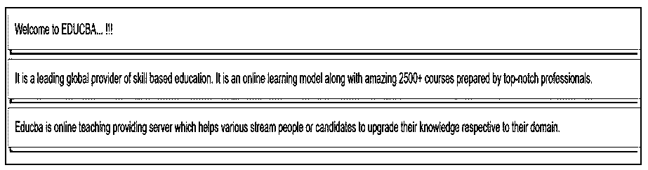
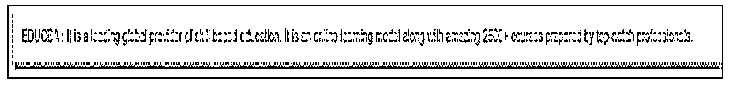
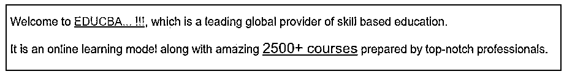

# SASS @ extend

> 原文：<https://www.educba.com/sass-extend/>


## SASS @extend 简介

协调 CSS 样式表对于有效地设计大型网站的样式变得越来越重要，并且随着它们的发展变得越来越大、越来越复杂、越来越难管理。SASS 提供了一个有效的@extend 指令，该指令包含一组 CSS 属性，使用该指令可以将这些属性从一个选择器传输到另一个选择器。也就是说，它需要从另一个选择器继承 CSS 属性。SASS 中的@extend 指令是一个有效的指令，它使得选择器更容易共享规则和关系。在 SASS 中,@extend 指令是一种包含和重用样式的方法。当您的元素几乎具有相似的风格，只是在一些小事情上有所不同时,@extend 指令会很有帮助。

**语法:**

<small>网页开发、编程语言、软件测试&其他</small>

SASS @extend 指令的语法可以写成如下所示:

```
.demo_one {
color: cyan;
border: 1px dotted black;
}
.demo_two {
@extend .demo_one;
background-color: red;
}
```

在上面的 SCSS 代码中。demo_two 类继承了。通过@extend 指令演示 _oneclass。

编译上述代码后，CSS 的样式代码将如下所示:

```
.demo_one, .demo_two{
color: cyan;
border: 1px dotted black;
}
.demo_two {
background-color: red;
}
```

的。demo _ 继承自。demo_one 包含了。demo_oneparent 类。

### @extend 指令如何在 SASS 中工作？

*   @extend 指令将非常有效地为不同的元素重用 CSS，最大限度地减少找到 CSS 困难的根本原因所需的工作，并保持 CSS 结构简单明了。
*   @extend 指令通过更新包含扩展选择器的样式规则来工作，当我们表达语义类之间的连接时,@extend 指令是最佳选择之一。

### SASS @extend 示例

下面是提到的例子:

#### 示例#1

让我们创建一个例子来使用 SASS 中的@extend 指令。这里，我们用下面的代码创建了一个名为 example1.html 的 HTML 文件:

**代码:**

**举例 1.html**

```
<!DOCTYPE html>
<html>
<head>
<meta http-equiv="Content-Type" content="text/html; charset=windows-1252">
<title> SASS @extend Directive Example </title>
<link rel="stylesheet" type="text/css" href="sass_extend1.css"/>
</head>
<body>
<div class="class1"> Welcome to EDUCBA... !!!</div>
<div class="class2"> It is a leading global provider of skill based education. It is an online learning model along with amazing 2500+ courses prepared by top-notch professionals. </div>
<div class="class3">Educba is online teaching providing server which helps various stream people or candidates to upgrade their knowledge respective to their domain. </div>
</div>
</body>
</html>
```

现在用下面的代码创建一个名为 sass_extend1.scss 的文件:

**代码:**

**sass_extend1.scss**

```
body {
font-family:  Arial, Helvetica, sans-serif;
}
.main_class {
color: #333;
border: 1px solid #FF6347;
box-shadow: 3px 5px 0 #00ff99;
margin: 0 0 10px;
padding: 12px;
}
.class1 {
@extend .main_class;
background-color: #ccffcc;
}
.class2 {
@extend .main_class;
background-color: #f2e6ff;
}
.class3 {
@extend .main_class;
background-color: #ffccf2;
}
```

现在，打开命令提示符并运行下面的命令来观察文件，并将其传递给 SASS，并在每次 SASS 文件更改时更新 CSS 文件。

**代码:**

```
sass –watch sass_extend1.scss: sass_extend1.css
```

现在，使用上面的命令执行该文件，它将使用下面的代码创建 sass_extend1.css 文件:

**代码:**

**sass_extend1.css**

```
body {
font-family: Arial, Helvetica, sans-serif;
}
.main_class, .class3, .class2, .class1 {
color: #333;
border: 1px solid #FF6347;
box-shadow: 3px 5px 0 #00ff99;
margin: 0 0 10px;
padding: 12px;
}
.class1 {
background-color: #ccffcc;
}
.class2 {
background-color: #f2e6ff;
}
.class3 {
background-color: #ffccf2;
}
```

**输出:**

*   将上面给出的 html 代码保存在 html 文件中。
*   现在，在浏览器中打开上面的 HTML 文件，您将看到下面的输出，如显示的图像所示。




#### 实施例 2

设计网站时，有时一个类会有另一个类的所有风格。我们还在 HTML 中使用了几个类名来处理这种情况。

现在，用下面的代码创建一个名为 example2.html 的 HTML 文件:

**代码:**

**example2.html**

```
<!DOCTYPE html>
<html>
<head>
<meta http-equiv="Content-Type" content="text/html; charset=windows-1252">
<title> SASS @extend Directive Example </title>
<link rel="stylesheet" type="text/css" href="sass_extend2.css"/>
</head>
<body>
<div class="class2">
EDUCBA : It is a leading global provider of skill based education. It is an online learning model along with amazing 2500+ courses prepared by top-notch professionals.
</div>
</div>
</body>
</html>
```

现在用下面的代码创建一个名为 sass_extend2.scss 的文件:

**代码:**

**sass_extend2.scss**

```
{
font-family: Arial, Helvetica, sans-serif;
}
.main_class {
background-color: #99e6ff;
border: 2px dotted green;
box-shadow: 5px 5px 0 #cc6600;
padding: 15px;
}
.class2 {
@extend .main_class;
background-color: #ffffb3;
color: #ff80ff;
}
```

使用上面的命令执行该文件，如前面的示例所示，它将使用下面的代码创建 sass_extend2.css 文件。

**代码:**

**sass_extend2.css**

```
body {
font-family: Arial, Helvetica, sans-serif;
}
.main_class, .class2 {
background-color: #99e6ff;
border: 2px dotted green;
box-shadow: 5px 5px 0 #cc6600;
padding: 15px;
}
.class2 {
background-color: #ffffb3;
color: #ff80ff;
}
```

**输出:**

*   将上面给出的 html 代码保存在 html 文件中。
*   现在，在浏览器中打开上面的 HTML 文件，您将看到下面的输出，如显示的图像所示。




#### 实施例 3

您还可以将复杂的选择器集成到一个元素中，比如:hover 等等。

用下面的代码创建一个名为 example3.html 的 HTML 文件:

**代码:**

**example3.html**

```
<!DOCTYPE html>
<html>
<head>
<meta http-equiv="Content-Type" content="text/html; charset=windows-1252">
<title> SASS @extend Directive Example </title>
<link rel="stylesheet" type="text/css" href="sass_extend3.css"/>
</head>
<body>
<p> Welcome to <a class="info">EDUCBA... !!!</a>, which is a leading global provider of skill based education. </p>
<p> It is an online learning model along with amazing <a class="class_link">2500+ courses</a> prepared by top-notch professionals. </p>
</div>
</body>
</html>
```

现在用下面的代码创建一个名为 sass_extend3.css 的文件:

**代码:**

**sass_extend3.css**

```
body {
font-family: Arial, Helvetica, sans-serif;
}
a {
text-decoration: underline;
}
.info, .class_link {
color: #ff3385;
}
.info:hover, .class_link {
color: #4747d1;
font-size: 20px;
}
```

**输出:**

*   将上面给出的 html 代码保存在 html 文件中。
*   现在，在浏览器中打开上面的 HTML 文件，您将看到下面的输出，如显示的图像所示。




### 结论

在本文中，我们看到了如何使用@extend 指令以更简单的方式组织每个 HTML 元素中的 CSS 类。该指令在预处理器级别非常有效，在浏览器层甚至会更有效。在 web 创建中重用编写的 CSS 代码可能非常重要。@extend 指令将使我们能够在需要时重用 CSS，并更干净地使用它。

### 推荐文章

这是 SASS @extend 的指南。在这里，我们讨论 SASS @extend 的介绍，该指令是如何工作的，并给出相应的例子以便更好地理解。您也可以看看以下文章，了解更多信息–

1.  [SAAS 云](https://www.educba.com/saas-cloud/)
2.  [什么是 Sass？](https://www.educba.com/what-is-sass/)
3.  [Sass 变量](https://www.educba.com/sass-variables/)
4.  [SASS if else](https://www.educba.com/sass-if-else/)


