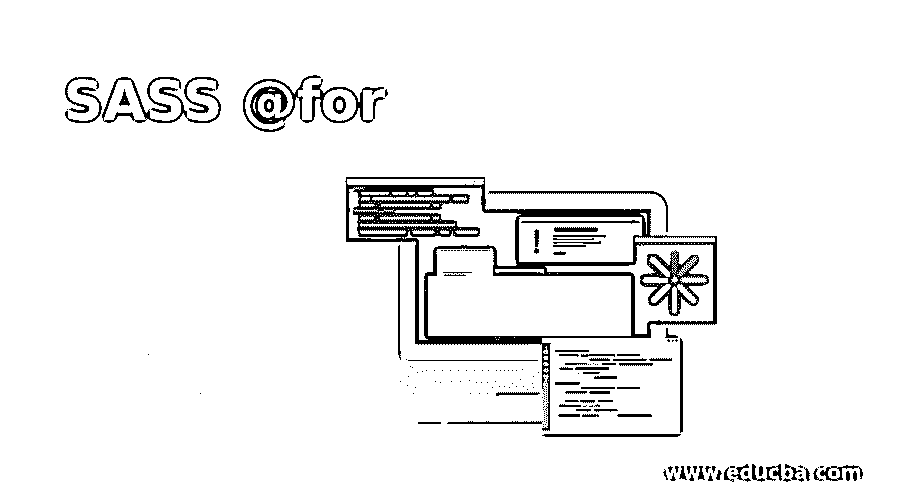
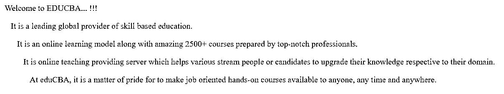
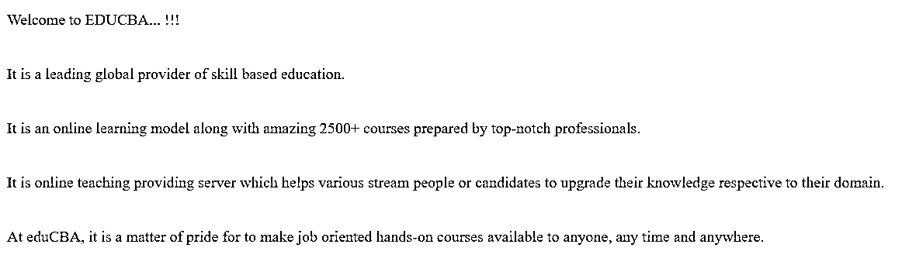
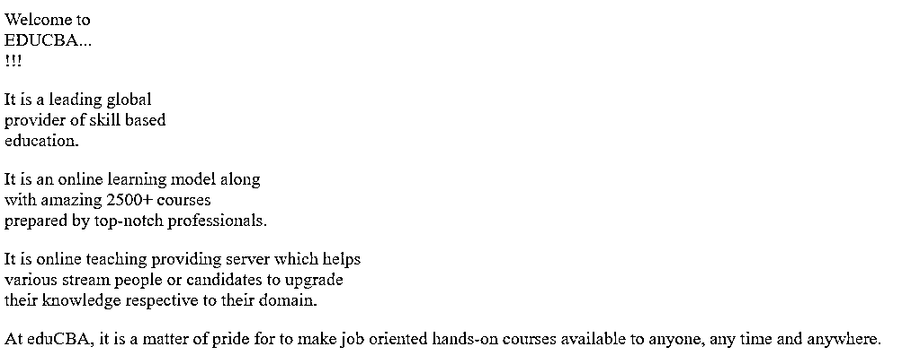

# SASS @for

> 原文：<https://www.educba.com/sass-for/>




## SASS @for 的定义

@for 指令从一个数字向上或向下计算到另一个数字，并为每个数字之间的每个数字检查一个块。指定变量的名称将应用于沿途的每个数字。Sass @for 指令使得在循环中创建样式变得更加简单。当需要一组重复的样式时，可以使用它。对于每次迭代，它使用一个计数器变量来设置输出。

@for 指令利用关键字为< start >和< end >值定义范围。through 关键字将在 Sass @for 指令中用于确定范围，包括和的值。(它的类名)。

<small>网页开发、编程语言、软件测试&其他</small>

**语法:**

SASS 中@for 指令的语法可以写成如下所示:

```
@for $var from <start> through <end>
```

语法可以解释为:

*   **$var:** 表示变量的名称，如$m，$a 或$i。
*   **<开始>和<结束> :** 这些将是返回整数的 SassScript 表达式。如果<开始>大于<结束>则计数器变量值减小，并且<开始>小于<结束>则计数器变量值增大。

### @for 指令在 SASS 中是如何工作的？

@for 指令可用于实现一组语句特定的次数。@for 指令为我们提供了灵活性，使我们可以只在满足某些要求的情况下包含样式，或者在 Sass 代码的各个部分中多次循环

### 实现 SASS @for 指令的示例

让我们创建一个例子来使用 SASS 中的@for 指令。这里，我们用下面的代码创建了一个名为 example1.html 的 HTML 文件:

#### 示例#1

**代码:**

```
<!DOCTYPE html>
<html>
<head>
<meta http-equiv="Content-Type" content="text/html; charset=windows-1252">
<title> SASS @for Directive Example </title>
<link rel="stylesheet" type="text/css" href="sass_for1.css"/>
</head>
<body>
<p class = "p1"> Welcome to EDUCBA... !!! </p>
<p class = "p2"> It is a leading global provider of skill based education. </p>
<p class = "p3"> It is an online learning model along with amazing 2500+ courses prepared by top-notch professionals. </p>
<p class = "p4"> It is online teaching providing server which helps various stream people or candidates to upgrade their knowledge respective to their domain. </p>
<p class = "p5"> At eduCBA, it is a matter of pride for to make job oriented hands-on courses available to anyone, any time and anywhere. </p>
</div>
</body>
</html>
```

现在用下面的代码创建一个名为 sass_for1.scss 的文件:

**sass_for1.scss**

```
@for $m from 1 through 5 {
.p#{$m} {
padding-left : $m * 12px;
color:#27772F;
}
}
```

现在，打开命令提示符并运行下面的命令来观察文件，并将其传递给 SASS，并在每次 SASS 文件更改时更新 CSS 文件。

```
sass –watch sass_for1.scss: sass_for1.css
```

现在，使用上面的命令执行该文件，它将使用下面的代码创建 sass_for1.css 文件:

**sass_for1.css**

```
.p1 {
padding-left: 12px;
color: #27772F;
}
.p2 {
padding-left: 24px;
color: #27772F;
}
.p3 {
padding-left: 36px;
color: #27772F;
}
.p4 {
padding-left: 48px;
color: #27772F;
}
.p5 {
padding-left: 60px;
color: #27772F;
}
```

**输出**:

*   将上面给出的 html 代码保存在 html 文件中。
*   现在，在浏览器中打开上面的 HTML 文件，您将看到下面的输出，如显示的图像所示。




在上面的例子中，我们可以看到每一行的开头都有 12 像素的填充。

#### 实施例 2

我们也可以使用变量来处理@for 指令。现在用下面的代码创建一个名为 example2.html 的 HTML 文件:

**代码:**

```
<!DOCTYPE html>
<html>
<head>
<meta http-equiv="Content-Type" content="text/html; charset=windows-1252">
<title> SASS @for Directive Example </title>
<link rel="stylesheet" type="text/css" href="sass_for2.css"/>
</head>
<body>
<p class = "txt1"> Welcome to EDUCBA... !!! </p>
<p class = "txt2"> It is a leading global provider of skill based education. </p>
<p class = "txt3"> It is an online learning model along with amazing 2500+ courses prepared by top-notch professionals. </p>
<p class = "txt4"> It is online teaching providing server which helps various stream people or candidates to upgrade their knowledge respective to their domain. </p>
<p class = "txt5"> At eduCBA, it is a matter of pride for to make job oriented hands-on courses available to anyone, any time and anywhere. </p>
</div>
</body>
</html>
```

现在用下面的代码创建一个名为 sass_for2.scss 的文件:

**sass_for2.scss**

```
$lines: 5;
@for $i from 1 through $lines {
.txt#{$i} {
height: 8px * $lines;
}
}
```

使用上面的命令执行文件，如前面的示例所示，它将使用下面的代码创建 **sass_for2.css** 文件:

**sass_for2.css**

```
.txt1 {
height: 40px;
}
.txt2 {
height: 40px;
}
.txt3 {
height: 40px;
}
.txt4 {
height: 40px;
}
.txt5 {
height: 40px;
}
```

**输出**

*   将上面给出的 html 代码保存在 html 文件中。
*   现在，在浏览器中打开上面的 HTML 文件，您将看到下面的输出，如显示的图像所示。




#### 实施例 3

现在我们将使用@for 指令设置内容的宽度。要实现这一点，用下面的代码创建一个名为 example3.html 的 HTML 文件:

**代码:**

```
<!DOCTYPE html>
<html>
<head>
<meta http-equiv="Content-Type" content="text/html; charset=windows-1252">
<title> SASS @for Directive Example </title>
<link rel="stylesheet" type="text/css" href="sass_for3.css"/>
</head>
<body>
<p class = "p1"> Welcome to EDUCBA... !!! </p>
<p class = "p2"> It is a leading global provider of skill based education. </p>
<p class = "p3"> It is an online learning model along with amazing 2500+ courses prepared by top-notch professionals. </p>
<p class = "p4"> It is online teaching providing server which helps various stream people or candidates to upgrade their knowledge respective to their domain. </p>
<p class = "p5"> At eduCBA, it is a matter of pride for to make job oriented hands-on courses available to anyone, any time and anywhere. </p>
</div>
</body>
</html>
```

现在用下面的代码创建一个名为 sass_for3.scss 的文件:

**sass_for3.scss**

```
@for $i from 1 to 5 {
.p#{$i} {
width: 80px * $i;
}
}
```

现在用下面的代码创建一个名为 sass_for3.css 的文件:

**sass_for3.css**

```
.p1 {
width: 80px;
}
.p2 {
width: 160px;
}
.p3 {
width: 240px;
}
.p4 {
width: 320px;
}
```

**输出:**

*   将上面给出的 html 代码保存在 html 文件中。
*   现在，在浏览器中打开上面的 HTML 文件，您将看到下面的输出，如显示的图像所示。




### 结论

在本文中，我们看到了如何使用@for 指令以更简单的方式组织 HTML 元素中的 CSS 类。SASS 使用@for 指令循环，可用于快速生成大量 CSS。@for 循环是一个基本指令，它使 SASS 更像一种真正的编程语言。

### 推荐文章

这是一个指南 SASS @for。这里我们还讨论了定义以及@for 指令在 sass 中是如何工作的？以及不同的示例及其代码实现。您也可以看看以下文章，了解更多信息–

1.  [SASS if else](https://www.educba.com/sass-if-else/)
2.  [SASS 导入](https://www.educba.com/sass-import/)
3.  [萨斯评论](https://www.educba.com/sass-comments/)
4.  [SASS 选择器](https://www.educba.com/sass-selectors/)


