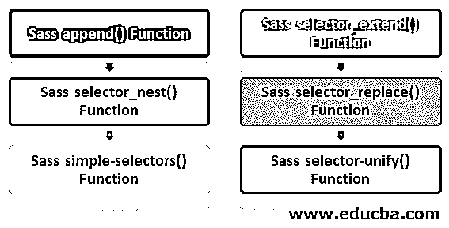
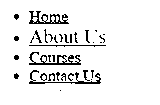
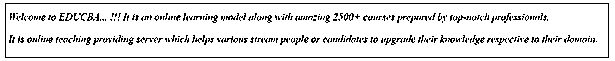
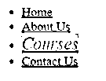
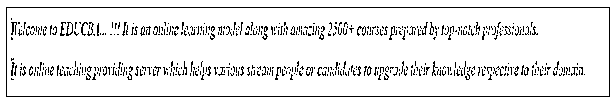
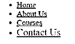

# SASS 选择器

> 原文：<https://www.educba.com/sass-selectors/>


## SASS 选择器简介

SASS 选择器函数允许在样式表中检查和操作 CSS 选择器。这些函数检查和管理 SASS 模块中的选择器。无论何时返回选择器，它总是一个逗号分隔的列表(选择器列表)，包含空格分隔的列表(复合选择器)，包含未加引号的字符串(复合选择器)。

### SASS 选择器函数的类型

以下是 SASS 中不同类型的选择器功能:

<small>网页开发、编程语言、软件测试&其他</small>

1.  选择器-追加
2.  选择器-扩展
3.  选择器巢
4.  选择器-更换
5.  选择器-统一
6.  简单选择器

以下示例描述了 SASS 选择器函数的用法及其说明和语法。在每个例子中，我们使用插值变量来计算表达式，并产生变量被它们在内存中各自的值替换的结果。

下面我们将借助例子讨论如何在 SASS 中使用选择器函数:




#### 1.Sass 附加()函数

selector-append()函数在它们之间没有任何空格地包含了＄选择器。该函数生成一个新的选择器，第二个和后续的选择器不带空格地附加到第一个选择器上。如果一个选择器列表是$selectors 中的任何一个选择器，那么每个复杂的选择器都是单独集成的。

**语法:**

```
selector-append(selectors)
```

selectors 参数是定义多个 CSS 选择器的必需参数。

**举例:**

使用以下代码创建一个名为 sass_append.html 的 HTML 文件:

**代码:**

```
<!DOCTYPE html>
<html>
<head>
<meta http-equiv="Content-Type" content="text/html; charset=windows-1252">
<title> SASS Selector Functions Example </title>
<link rel="stylesheet" type="text/css" href="sass_append.css"/>
</head>
<body><br>
<nav>
<ul>
<li><a href="/"> Home </a></li>
<li><a href="/aboutus/" class="active"> About Us </a></li>
<li><a href="/courses/"> Courses </a></li>
<li><a href="/contactus/"> Contact Us </a></li>
</ul>
</nav>
</body>
</html>
```

现在用下面的代码创建一个名为 sass_append.scss 的文件:

```
$selector: selector-append("a",".active");
#{$selector}{
font-size: 25px;
color:red;
font-style:bold;
}
```

现在，打开命令提示符并运行下面的命令来观察文件，并将其传递给 SASS，并在每次 SASS 文件更改时更新 CSS 文件。

```
sass –watch sass_append.scss: sass_append.css
```

现在，用上面的命令执行该文件，它将创建 sass_append.css 文件，如下面的代码所示:

```
sa.active {
font-size: 25px;
color: red;
font-style: bold;
}
```

**输出:**

*   将上面给出的 html 代码保存在 sass_append.html 文件中。
*   现在，在浏览器中打开上面的 HTML 文件，您将看到下面的输出，如显示的图像所示。


#### 2.Sass 选择器 _extend()函数

selector-extend()函数将$selector 中的$extendee 替换为所有实例的$extendee，$extender。如果$selector 不包含$extendee，则原样返回所有内容

**语法:**

```
selector-extend (selector, extendee, extender)
```

*   selector 参数是定义 CSS 选择器的必需参数。
*   extendee 参数是定义 extendee 的必需参数。
*   extender 参数是定义扩展器的必需参数。

**举例:**

使用以下代码创建一个名为 sass_extend.html 的 HTML 文件:

**代码:**

```
<!DOCTYPE html>
<html>
<head>
<meta http-equiv="Content-Type" content="text/html; charset=windows-1252">
<title> SASS Selector Functions Example </title>
<link rel="stylesheet" type="text/css" href="sass_extend.css"/>
</head>
<body><br>
<nav>
<ul>
<li><a href="/"> Home </a></li>
<li><a href="/aboutus/" class="active"> About Us </a></li>
<li><a href="/courses/"> Courses </a></li>
<li><a href="/contactus/" class="link"> Contact Us </a></li>
</ul>
</nav>
</body>
</html>
```

使用以下代码创建一个名为 sass_extend.scss 的文件:

```
$selector: selector-extend("a.active","a",".link");
#{$selector}{
font-size: 20px;
color:#F4A460;
font-style:bold;
}
```

使用前面示例中显示的命令执行该文件，它将使用以下代码创建 sass_extend.css 文件:

```
a.active, .active.link {
font-size: 20px;
color: #F4A460;
font-style: bold;
}
```

**输出:**

*   将上面给出的 html 代码保存在 sass_extend.html 文件中。
*   现在，在浏览器中打开上面的 HTML 文件，您将看到下面的输出，如显示的图像所示。




#### 3.Sass 选择器 _nest()函数

selector-nest()函数将$selectors 集成到样式表中，就像它们相互嵌套一样。它根据给定的列表生成一个新的选择器，包括 CSS 选择器的嵌套列表。

**语法:**

```
selector-nest (selectors)
```

selectors 参数是定义多个 CSS 选择器的必需参数。

**举例:**

使用以下代码创建一个名为 sass_nest.html 的 HTML 文件:

**代码:**

```
<!DOCTYPE html>
<html>
<head>
<meta http-equiv="Content-Type" content="text/html; charset=windows-1252">
<title> SASS Selector Functions Example </title>
<link rel="stylesheet" type="text/css" href="sass_nest.css"/>
</head>
<body><br>
<div class="heading">
<p> Welcome to EDUCBA... !!! It is an online learning model along with amazing 2500+ courses prepared by top-notch professionals. </p>
</div>
<div class="heading1">
<p> It is online teaching providing server which helps various stream people or candidates to upgrade their knowledge respective to their domain. </p>
</div>
</body>
</html>
```

使用以下代码创建一个名为 sass_nest.scss 的文件:

```
$selector: selector-nest(".heading, .heading1","p");
#{$selector}{
font-size: 20px;
color:blue;
font-style:italic;
}
```

执行上述文件，它将使用以下代码创建 sass_nest.css 文件:

```
.heading p, .heading1 p {
font-size: 20px;
color: blue;
font-style: italic;
}
```

**输出:**

*   将上面给出的 html 代码保存在 sass_nest.html 文件中。
*   现在，在浏览器中打开上面的 HTML 文件，您将看到下面的输出，如显示的图像所示。




#### 4.Sass 选择器 _replace()函数

selector-replace()函数提供了一个$selector 副本，所有$original 实例都由$replacement 替换。如果$selector 没有原件，$按原样返回。它会生成一个新的选择器，并在替换列表中列出这些选择器，而不是原来的选择器。

**语法:**

```
selector-replace(selector, original, replacement)
```

*   selector 参数是定义 CSS 选择器的必需参数。
*   original 参数是定义原始 CSS 子部分的必需参数。
*   replacement 参数是定义替换 CSS 子部门的必需参数。

**举例:**

使用以下代码创建一个名为 sass_replace.html 的 HTML 文件:

**代码:**

```
<!DOCTYPE html>
<html>
<head>
<meta http-equiv="Content-Type" content="text/html; charset=windows-1252">
<title> SASS Selector Functions Example </title>
<link rel="stylesheet" type="text/css" href="sass_replace.css"/>
</head>
<body><br>
<nav>
<ul>
<li><a href="/"> Home </a></li>
<li><a href="/aboutus/" class="class"> About Us </a></li>
<li><a href="/courses/" class="class1"> Courses </a></li>
<li><a href="/contactus/"> Contact Us </a></li>
</ul>
</nav>
</body>
</html>
```

使用以下代码创建一个名为 sass_replace.scss 的文件:

```
$selector: selector-replace("a.class",".class",".class1");
#{$selector}{
font-size: 22px;
color:#FF4500;
font-style:italic;
background-color: #FFD700;
}
```

执行上述文件，它将使用以下代码创建 sass_replace.css 文件:

```
a.class1 {
font-size: 22px;
color: #FF4500;
font-style: italic;
background-color: #FFD700;
}
```

**输出:**

*   将上面给出的 html 代码保存在 sass_replace.html 文件中。
*   现在，在浏览器中打开上面的 HTML 文件，您将看到下面的输出，如显示的图像所示。




#### 5.Sass 简单选择器()函数

函数 Simple-selectors)(在$selector 中生成一个简单选择器的列表。它显示单个选择器中的选择器列表。

**语法:**

```
simple-selector (selectors)
```

selectors 参数是定义 CSS 选择器的必需参数。

**例子**

使用以下代码创建一个名为 sass_simple_selector.html 的 HTML 文件:

**代码:**

```
<!DOCTYPE html>
<html>
<head>
<meta http-equiv="Content-Type" content="text/html; charset=windows-1252">
<title> SASS Selector Functions Example </title>
<link rel="stylesheet" type="text/css" href="sass_simple_selector.css"/>
</head>
<body><br>
<div class="heading">
<p class="head"> Welcome to EDUCBA... !!! It is an online learning model along with amazing 2500+ courses prepared by top-notch professionals. </p>
</div>
<div class="heading1">
<p> It is online teaching providing server which helps various stream people or candidates to upgrade their knowledge respective to their domain. </p>
</div>
</body>
</html>
```

使用以下代码创建一个名为 sass_simple_selector.scss 的文件:

```
$selector: simple-selectors("div.head");
#{$selector}{
font-size: 22px;
color:#FF4500;
font-style:italic;
background-color: #FFD700;
}
```

执行上述文件，它将使用以下代码创建 sass_ simple_selector.css 文件:

```
div, .head {
font-size: 22px;
color: #FF4500;
font-style: italic;
background-color: #FFD700;
}
```

**输出:**

*   将上面给出的 HTML 代码保存在 sass_simple_selector.html 文件中。
*   现在，在浏览器中打开上面的 HTML 文件，您将看到下面的输出，如显示的图像所示。




#### 6.Sass 选择器-unify()函数

函数 selector-unify()提供了一个只匹配由$selector1 和$selector2 指定的元素的选择器。

**语法:**

```
simple-selector (selector1, selector2)
```

*   selector1 参数是定义第一个 CSS 选择器的必需参数。
*   selector2 参数是定义第二个 CSS 选择器的必需参数。

**例子**

使用以下代码创建一个名为 sass_unify.html 的 HTML 文件:

**代码:**

```
<!DOCTYPE html>
<html>
<head>
<meta http-equiv="Content-Type" content="text/html; charset=windows-1252">
<title> SASS Selector Functions Example </title>
<link rel="stylesheet" type="text/css" href="sass_unify.css"/>
</head>
<body><br>
<nav>
<ul>
<li><a href="/"> Home </a></li>
<li><a href="/aboutus/" class="active"> About Us </a></li>
<li><a href="/courses/"> Courses </a></li>
<li><a href="/contactus/" class="disabled"> Contact Us </a></li>
</ul>
</nav>
</body>
</html>
```

使用以下代码创建一个名为 sass_unify.scss 的文件:

```
$selector: selector-unify("a", ".disabled");
#{$selector}{
font-size: 20px;
color:#F4A460;
font-style:bold;
}
```

执行上述文件，它将使用以下代码创建 sass_unify.css 文件:

```
a.disabled {
font-size: 20px;
color: #F4A460;
font-style: bold;
}
```

**输出:**

*   将上面给出的 HTML 代码保存在 sass_unify.html 文件中。
*   现在，在浏览器中打开上面的 HTML 文件，您将看到下面的输出，如显示的图像所示。




### 结论

到目前为止，我们已经研究了 SASS 选择器函数，它可以用来检查和操作选择器。选择器是 SASS 预处理器的一些非常强大的特性。选择器由其他相应的选择器操纵。尝试使用不同类型的类和值来摆弄选择器。

### 推荐文章

这是一个 SASS 选择器的指南。在这里，我们讨论一个关于 SASS 选择器函数和它的不同例子及其代码实现的简要概述。您也可以浏览我们推荐的其他文章，了解更多信息——

1.  [萨斯 Mixins](https://www.educba.com/sass-mixins/)
2.  [SASS 颜色功能](https://www.educba.com/sass-color-functions/)
3.  [SASS @extend](https://www.educba.com/sass-extend/)
4.  [萨斯评论](https://www.educba.com/sass-comments/)


