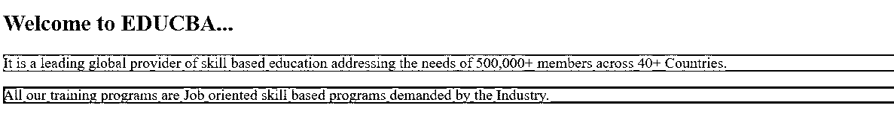
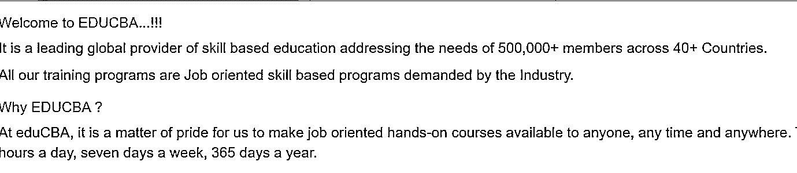
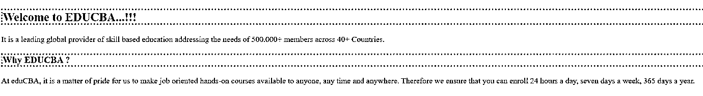

# 萨斯混合食品

> 原文：<https://www.educba.com/sass-mixins/>


## SASS Mixins 简介

近年来，HTML 朝着更加语义化的方向取得了巨大的进步。Sass 通过专门用于提供非语义样式的@mixin 指令提供了一种不同的方式。Mixins 使您能够确定可以通过样式表重用的样式。它们有助于消除使用非语义类，如. float-left，以及在库中分发样式集合。

如果使用了 mixin，那么既可以通过名称传递参数，也可以通过它们在参数列表中的位置传递参数。这对于带有几个可选参数的 mixinss，或者带有布尔型参数的 mixin 特别有用，这些参数的定义在没有名称跟随的情况下并不明显。

<small>网页开发、编程语言、软件测试&其他</small>

### SASS 混合语法

SASS mixins 的语法可以写成如下所示:

```
@mixin <name of the mixin>
{
// code for styling the content
Property 1: value;
Property 2: value;
// till 'n' numbers of properties and values can be added
}
For instance:
@mixin mymixin {
color: red;
}
.myclass {
@include mymixin;
background-color: green;
}
```

当您编译上述 scss 时，您将在 css 中拥有如下样式代码，如下所示:

```
.myclass {
color: red;
background-color: green;
}
```

### Mixins 在 SASS 中是如何工作的？

mixin 的主要目的是呈现可重用的属性集合。像 Sass 变量(其中我们在单个位置指定值)，我们可以使用 Sass 混合在单个位置指定属性。Mixin 的主要工作是创建可重用的 CSS 块，帮助我们避免重复编写代码。

### 在 SASS 中实现 Mixins 的例子

让我们创建一个例子来使用 SASS 中的 mixins。这里，我们用下面的代码创建了一个名为 example1.html 的 HTML 文件:

#### 示例#1

```
<!DOCTYPE html>
<html>
<head>
<title> SASS Mixins </title>
<link rel="stylesheet" type="text/css" href="sass_mixin1.css"/>
</head>
<body>
<h2> Welcome to EDUCBA... </h2>
<p class="class1"> It is a leading global provider of skill based education addressing the needs of 500,000+ members across 40+ Countries.</p>
<p class="class2"> All our training programs are Job oriented skill based programs demanded by the Industry. </p>
</body>
</html>
```

现在用下面的代码创建一个名为 sass_mixin1.scss 的文件:

```
sass_mixin1.scss
@mixin my-mixin {
color:#2F4F4F;
}
.class1 {
@include my-mixin;
background-color: #F4A460;
}
.class2 {
@include my-mixin;
background-color: #FF69B4;
}
```

现在，打开命令提示符并运行下面的命令来观察文件，并将其传递给 SASS，并在每次 SASS 文件更改时更新 CSS 文件。

```
sass –watch sass_mixin1.scss: sass_mixin1.css
```

现在，使用上面的命令执行该文件，它将使用下面的代码创建 sass_mixin1.css 文件:

```
sass_mixin1.css
.class1 {
color: #2F4F4F;
background-color: #F4A460;
}
.class2 {
color: #2F4F4F;
background-color: #FF69B4;
}
```

**输出:**

现在，执行 html 文件并在浏览器中打开，您将获得以下结果:




#### 实施例 2

用下面的代码创建一个名为 example2.html 的 HTML 文件:

```
<html>
<head>
<title> SASS Nesting </title>
<link rel = "stylesheet" type = "text/css" href = "sass_mixin2.css" />
<link rel = "stylesheet" href = "https://maxcdn.bootstrapcdn.com/bootstrap/3.3.5/css/bootstrap.min.css">
</head>
<body>
<div class = "myheading">
<h2> Welcome to EDUCBA...!!! </h2>
<p> It is a leading global provider of skill based education addressing the needs of 500,000+ members across 40+ Countries. </p>
<p> All our training programs are Job oriented skill based programs demanded by the Industry. </p>
<div class = "myclass">
<h3> Why EDUCBA ?</h3>
<p>  AteduCBA, it is a matter of pride for us to make job oriented hands-on courses available to anyone, any time and anywhere. Therefore we ensure that you can enroll 24 hours a day, seven days a week, 365 days a year. </p>
</div>
</div>
</body>
</html>
```

现在用下面的代码创建一个名为 sass_mixin2.scss 的文件:

```
sass_mixin2.scss
@mixin my-mixin {
color:#FA8072;
}
@mixin my-mixin1 {
color:#708090;
}
.myheading{
h2{
font-size: 20px;
@include my-mixin;
}
p {
font-size: 20px;
@include my-mixin1;
}
.myclass{
h3{
font-size: 20px;
@include my-mixin;
}
P{
font-size: 20px;
@include my-mixin1;
}
}
}
```

使用前面示例中显示的命令执行该文件，它将使用下面的代码创建 sass_mixin2.css 文件:

```
sass_mixin2.css
.myheading h2 {
font-size: 20px;
color: #FA8072;
}
.myheading p {
font-size: 20px;
color: #708090;
}
.myheading .myclass h3 {
font-size: 20px;
color: #FA8072;
}
.myheading .myclass p {
font-size: 20px;
color: #708090;
}
```

**输出:**

现在，运行 html 文件并在浏览器中打开，你会得到下面的结果:




#### 实施例 3

用下面的代码创建一个名为 example3.html 的 HTML 文件:

```
<html>
<head>
<title> SASS Nesting </title>
<link rel = "stylesheet" type = "text/css" href = "sass_mixin3.css" />
<body>
<h2> Welcome to EDUCBA...!!! </h2>
<p> It is a leading global provider of skill based education addressing the needs of 500,000+ members across 40+ Countries. </p>
<h3> Why EDUCBA ?</h3>
<p>  AteduCBA, it is a matter of pride for us to make job oriented hands-on courses available to anyone, any time and anywhere. Therefore, we ensure that you can enroll 24 hours a day, seven days a week, 365 days a year. </p>
</body>
</html>
```

现在用下面的代码创建一个名为 sass_mixin3.scss 的文件:

```
sass_mixin3.scss
@mixin myheading($color, $width) {
border: $width dotted $color;
}
h2 {
@include myheading(lightcoral, 3px);  // calling mixin with two values
}
h3 {
@include myheading(greenyellow, 3px); // calling mixin with two values
}
```

使用前面示例中显示的命令执行该文件，它将使用下面的代码创建 sass_mixin3.css 文件:

```
sass_mixin3.css
h2 {
border: 3px dotted lightcoral;
}
h3 {
border: 3px dotted greenyellow;
}
```

**输出:**

现在，运行 html 文件并在浏览器中打开，你会得到下面的结果:




### 结论

到目前为止，我们已经研究了 SASS 中的 mixins，这在 HTML 页面中是不可思议的。SASS mixins 提高了生产率，使 CSS 任务变得非常容易。显然，mixins 非常有用，可以加速工作流程。Mixin 是一个代码块，它使我们能够组合 CSS 声明，我们可以在网站的任何地方重用这些声明。

### 推荐文章

这是一个指南萨斯混合。在这里，我们还将讨论 mixins 的定义以及它在 sass 中是如何工作的？以及不同的示例及其代码实现。您也可以看看以下文章，了解更多信息–

1.  [SASS @extend](https://www.educba.com/sass-extend/)
2.  [SASS @for](https://www.educba.com/sass-for/)
3.  [SASS @at-root](https://www.educba.com/sass-at-root/)
4.  [SASS if else](https://www.educba.com/sass-if-else/)


