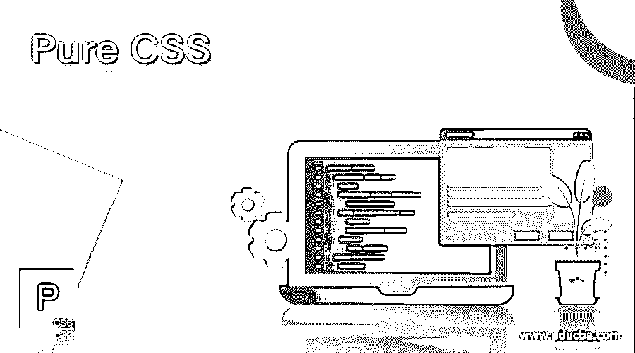

# 纯 CSS

> 原文：<https://www.educba.com/pure-css/>




## 纯 CSS 的定义

pure.css 是一个用于网页设计的反应灵敏、简洁、快速的 css 框架。pure.css 是一个级联样式表框架，用于创建灵活、小巧、空间易于管理的 web 设计。pure.css 是一组级联样式表(css)模块，用于为所有屏幕大小的设备创建网站。pure.css 是一个节省空间的轻量级框架，它使用布局、样式、HTML 元素和 UI 组件来创建一个响应式网站。pure.css 是由雅虎开发的，用于移动设备和其他屏幕大小的设备。

### 为什么我们需要 pure.css？

*   pure.css 是一个小巧轻便的框架，压缩文件的大小不到 4.8KB。
*   pur.css 对于网站来说是必要的，以便在所有屏幕大小的设备上，尤其是在移动设备上轻松适应布局和元素。
*   由于 Normalize.css 的基础，pure.css 有助于消除跨浏览器兼容性问题。
*   pure.css 是一个最小的外观，使用 skin builder 进行简单的一键式定制。
*   pure.css 不仅适用于响应式框架，也适用于框架中的非响应式模块。
*   pure.css 不依赖于任何 JavaScript 和 jQuery 库，但是它的设计是扁平的，只需要最低限度的模块。
*   pure.css 有预构建的主要元素，如按钮、下拉菜单、表单、网格和表格。
*   pure.css 在许多平台上保持稳定或不变的颜色和阴影。
*   pure.css 很简单，用户友好，因为这个框架不需要任何安装。

### pure.css 是如何工作的？

框架中有两个 pure.css 链接。这些有响应和无响应的链接如下。

<small>网页开发、编程语言、软件测试&其他</small>

*   pure.css 响应式框架链接正在添加到 HTML 文件中。

```
<link rel="stylesheet" href="https://unpkg.com/purecss@2.0.3/build/base-min.css">
```

*   HTML 文件中添加了 pure.css 无响应框架链接。

```
<link rel="stylesheet" href="https://unpkg.com/purecss@2.0.3/build/pure-nr-min.css">
```

*   响应框架的 pure.css 备用 CDNs 文件被添加到 HTML 文件中。

```
<link rel="stylesheet" href="https://cdnjs.cloudflare.com/ajax/libs/pure/2.0.3/pure-min.css"/>
```

*   基本链接的 pure.css 响应框架添加在 HTML 文件中。

```
<link rel="stylesheet" href="https://unpkg.com/purecss@2.0.3/build/base-min.css"/>
```

*   在 HTML 文件中添加了按钮链接的 pure.css 响应框架。

```
<link rel="stylesheet" href="https://unpkg.com/purecss@2.0.3/build/buttons-min.css"/>
```

*   响应表单链接的 pure.css 框架被添加到 HTML 文件中。

```
<link rel="stylesheet" href="https://unpkg.com/purecss@2.0.3/build/forms-min.css "/>
```

*   在 HTML 文件中添加了用于无响应表单链接的 pure.css 框架。

```
<link rel="stylesheet" href="https://unpkg.com/purecss@2.0.3/build/forms-nr-min.css"/>
```

*   HTML 文件中添加了基本网格链接的 pure.css 框架。

```
<link rel="stylesheet" href="https://unpkg.com/purecss@2.0.3/build/grids-min.css"/>
```

*   响应网格链接的 pure.css 框架被添加到 HTML 文件中。

```
<link rel="stylesheet" href="https://unpkg.com/purecss@2.0.3/build/grids-responsive-min.css"/>
```

*   HTML 文件中添加了用于响应菜单链接的 pure.css 框架。

```
<link rel="stylesheet" href="https://unpkg.com/purecss@2.0.3/build/menus-min.css"/>
```

*   表格链接的 pure.css 框架添加在 HTML 文件中。

```
<link rel="stylesheet" href="https://unpkg.com/purecss@2.0.3/build/tables-min.css"/>
```

### pure.css 中的响应特性是如何工作的？

下面是基本响应式框架的 pure.css 类。

```
class ="pure-u-*(grid system)"
```

*   pure.css 小屏幕设备适用于高达 568 像素的屏幕设备。
*   pure.css 类在下面。

```
class ="pure-u-sm-*(grid system)"
```

*   pure.css 中等屏幕设备适用于 768 像素大小的屏幕设备。
*   pure.css 类在下面。

```
class ="pure-u-md-*(grid system)"
```

*   pure.css 大屏幕设备用于高达 1024 像素的屏幕设备。
*   pure.css 类在下面。

```
class ="pure-u-lg-*(grid system)"
```

*   pure.css 超大屏幕设备用于高达 1280px 尺寸的屏幕设备。
*   pure.css 类在下面。

```
class ="pure-u-xl-*(grid system)"
```

*   pure.css 正在使用下面的链接创建一个响应迅速、移动优先的框架。

```
<html>
</head> <meta name = "viewport" content = "width=device-width, initial-scale = 1"> </head>
</html>
```

*   下面是基本的 pure.css 程序演示。

```
<html>
<head>
<title> pure.css </title>
<meta name = "viewport" content = "width = device-width, initial-scale = 1">
<link rel="stylesheet" href="https://unpkg.com/purecss@2.0.3/build/pure-min.css">
<link rel="stylesheet" href="https://unpkg.com/purecss@2.0.3/build/grids-responsive-min.css">
<style>
.pure-u-1-1{
border: 1px solid orange;
}
</style>
</head>
<body>
<div class = "pure-g">
<div class = "pure-u-1-3">
<p> First columns of the pure.css |</p>
</div>
<div class = "pure-u-1-3">
<p> Second columns of the pure.css | </p>
</div>
<div class = "pure-u-1-3">
<p> Third columns of the pure.css </p>
</div>
<div class = "pure-u-1-1">
<p> only one columns of the pure.css </p>
</div>
</div>
</body>
</html>
```

### 优点和缺点

*   pure.css 的优点如下。

*   pure.css 的缺点如下。

### pure.css 的用法

*   pure.css 对于简单和移动友好的网站和网页设计很有用。
*   pure.css 是一个适合各种屏幕尺寸的 web 应用程序。
*   pure.css 在 web 应用程序中创建响应表、按钮、表单和下拉列表。
*   这个 pure.css 支持在框架中创建样式、大胆的颜色和阴影。
*   pure.css 是 bootstrap 框架的替代方案，用于为响应式 web 应用程序创建类。

### pure.css 的职业道路

*   网站或 web 应用程序设计部分由 pure.css 框架完成。
*   前端开发人员和网页设计师需要一个纯粹的. css 框架来进行网站风格和设计。
*   UI 设计人员和 UI 开发人员需要 pure.css 用于 web 应用程序。
*   pure.css 正在为 web 应用程序创建一个不同的模板，并成为一个网站开发者。

### 结论

css 是一个用户友好的，有吸引力的，优雅的网站设计框架。对于用户来说，pure.css 是一个笔记本电脑、台式机、平板电脑和移动友好的模块。根据用户的需求，pure.css 对于节省空间的小型网站和网络应用程序非常有用。

### 推荐文章

这是一个纯 CSS 的指南。这里我们讨论一下简介，语法，pure.css 是如何工作的？，我们为什么需要 pure.css？和代码实现示例。您也可以看看以下文章，了解更多信息–

1.  [CSS 单选按钮](https://www.educba.com/css-radio-button/)
2.  [CSS 偏移](https://www.educba.com/css-offset/)
3.  [CSS calc()](https://www.educba.com/css-calc/)
4.  [CSS 向右浮动](https://www.educba.com/css-float-right/)


