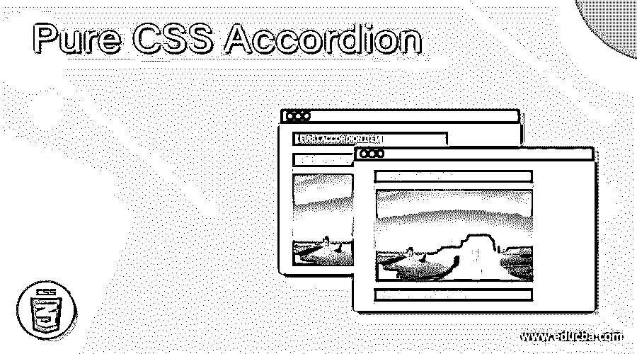
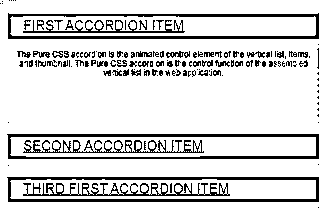
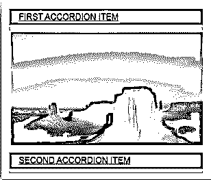
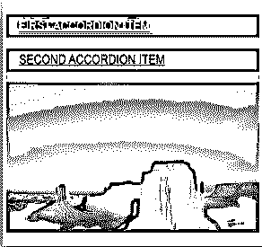

# 纯 CSS 手风琴

> 原文：<https://www.educba.com/pure-css-accordion/>




## 纯 CSS 手风琴的定义

纯 CSS Accordion 是垂直列表、项目和缩略图的动画控件元素。它是 web 应用程序中组装的垂直列表的控制功能。它是用于在 web 应用程序中管理列表空间及其信息的元素。它在 web 应用程序中根据用户的要求显示描述和信息显示的标题。它隐藏堆叠列表的信息，并根据需要显示。这是为了制作一个短尺寸的网页，并使用主题标题创建更多的用户交互。

**语法:**

<small>网页开发、编程语言、软件测试&其他</small>

HTML 页面的语法如下。

```
<div class="accordion">
 
<div class="accordions">
<dl class="accordion1">
<dd>
<a href="#accordion1"> Title of the ACCORDION ITEM… </a>
<div>
<p>
The Description or information of the ACCORDION ITEM…
</p>
</div>
<dd>
</dl>
</div>
</div>
```

**描述:**

*   HTML 页面中使用了 class="accordion"。
*   class="accordions "用于绑定 accordion 元素的标题和信息。
*   带有

    标记的 class="accordion1 "用于在列表中创建数据。

*   id="accordion1 "的标签用于分别连接描述和它们的列表。

样式表语法如下:

```
.accordion {
position: relative;
width: 500px;
color: black;
}
.accordions {
overflow: hidden;
}
.accordions dl dd a {
background-color: grey;
border: 1px solid;
display: block;
}
.accordions dl dd div {
overflow: hidden;
}
.accordions dl dd div {
text-align: center;
}
.accordions dl dd a:hover {
box-shadow: 0px 1px 5px rgba(0, 0, 0.5, 0.6) inset;
}
#accordion1:target ~ .accordions .accordion1 dd div {
height: 110px;
}
```

**描述:**

*   的。手风琴设置在隐藏的描述框中，并在悬停效果后显示。
*   带有标签的。手风琴设置描述框的高度。
*   它根据用户要求和网站管理设置其他样式。

### 纯 CSS 手风琴是如何工作的？

框架中有两个 pure.css 链接。accordion 的这些响应和非响应链接如下。

*   accordion 的 pure.css responsive framework 链接被添加到 HTML 文件中。

```
<link rel="stylesheet"
 href="https://unpkg.com/purecss@2.0.3/build/base-min.css">
```

*   accordion 的 pure.css 非响应框架链接被添加到 HTML 文件中。

```
<link rel="stylesheet" href="https://unpkg.com/purecss@2.0.3/build/pure-nr-min.css">
```

*   accordion 的 pure.css 备用 CDNs 文件被添加到 HTML 文件中。

```
<link rel="stylesheet" href="https://cdnjs.cloudflare.com/ajax/libs/pure/2.0.3/pure-min.css"/>
```

*   网页语法。

```
<body>
<div class="accordion">
 
 
<div class="accordions">
<dl class="accordion1">
<dd>
<a href="#accordion1"> FIRST ITEM </a>
<div>
<p>
```

纯 CSS accordion 是用于在 web 应用程序中管理列表空间及其信息的元素。

```
</p>
</div>
<dd>
</dl>
</div>
</div>
</body>
```

*   HTML 页面中添加的样式表语法。

```
`<style>
.accordion {
position: relative;
width: 500px;
color: black;
margin: 52px auto;
}
.accordions {
background-color: white;
overflow: hidden;
}
.accordions dl dd a {
background-color: grey;
border: 1px solid;
display: block;
font-size: 20px;
padding: 5px 22px;
}
.accordions dl dd div {
height: 0;
overflow: hidden;
box-shadow: 0 0 2px rgba(0, 0, 1, 1) inset;
}
.accordions dl dd div {
color: blue;
font-size: 12px;
padding: 5px;
text-align: center;
}
.accordions dl dd a:hover {
box-shadow: 0px 1px 5px rgba(0, 0, 0.5, 0.6) inset;
-webkit-box-shadow: 0px 1px 5px rgba(0, 0, 0.5, 0.6) inset;
}
#accordion1:target ~ .accordions .accordion1 dd div {
height: 110px;
}
</style>`
```

### 例子

让我们讨论几个例子。

#### 示例#1:基本示例和输出如下

**代码:**

```
<!DOCTYPE html>
<html lang="en">
<head>
<meta charset="utf-8" />
<title> Pure CSS Accordion </title>
<meta name="viewport" content="width=device-width, initial-scale=1">
<link rel="stylesheet" href="https://unpkg.com/purecss@2.0.3/build/pure-min.css">
<style>
.accordion {
position: relative;
width: 500px;
color: black;
margin: 52px auto;
}
.accordions {
background-color: white;
overflow: hidden;
}
.accordions dl dd a {
background-color: grey;
border: 1px solid;
display: block;
font-size: 20px;
padding: 5px 22px;
}
.accordions dl dd div {
height: 0;
overflow: hidden;
box-shadow: 0 0 2px rgba(0, 0, 1, 1) inset;
}
.accordions dl dd div {
color: blue;
font-size: 12px;
padding: 5px;
text-align: center;
}
.accordions dl dd a:hover {
box-shadow: 0px 1px 5px rgba(0, 0, 0.5, 0.6) inset;
-moz-box-shadow: 0px 1px 5px rgba(0, 0, 0.5, 0.6) inset;
-webkit-box-shadow: 0px 1px 5px rgba(0, 0, 0.5, 0.6) inset;
}
#accordion1:target ~ .accordions .accordion1 dd div {
height: 110px;
}
#accordion2:target ~ .accordions .accordion2 dd div {
height: 240px;
}
#accordion3:target ~ .accordions .accordion3 dd div {
height: 200px;
}
</style>
</head>
<body>
<div class="accordion">
 
 
 
<div class="accordions">
<dl class="accordion1">
<dd>
<a href="#accordion1"> FIRST ACCORDION ITEM </a>
<div>
<p>
```

它是垂直列表、项目和缩略图的动画控件元素。它是 web 应用程序中组装的垂直列表的控制功能。

```
</p>
</div>
<dd>
</dl>
<dl class="accordion2">
<dd>
<a href="#accordion2"> SECOND ACCORDION ITEM </a>
<div>
<p>
```

它是用于在 web 应用程序中管理列表空间及其信息的元素。它在 web 应用程序中根据用户的要求显示描述和信息显示的标题。

```
</p>
</div>
</dd>
</dl>
<dl class="accordion3">
<dd>
<a href="#accordion3"> THIRD FIRST ACCORDION ITEM </a>
<div>
<p>
```

纯 CSS accordion 隐藏了堆叠的 standing list 的信息，并根据需要显示它。这是为了制作一个短尺寸的网页，并使用主题标题创建更多的用户交互。

```
</p>
</div>
</dd>
</dl>
</div>
</div>
</body>
</html>
```




#### 示例 2:图像、示例和输出如下

**代码:**

```
<!DOCTYPE html>
<html lang="en">
<head>
<meta charset="utf-8" />
<title> Pure CSS Accordion </title>
<meta name="viewport" content="width=device-width, initial-scale=1">
<link rel="stylesheet" href="https://unpkg.com/purecss@2.0.3/build/pure-min.css">
<style>
.accordion {
position: relative;
width: 500px;
color: black;
margin: 52px auto;
}
.accordions {
overflow: hidden;
}
.accordions dl dd a {
background-color: grey;
border: 1px solid;
display: block;
font-size: 20px;
padding: 5px 22px;
}
.accordions dl dd div {
height: 0;
overflow: hidden;
box-shadow: 0 0 2px rgba(0, 0, 1, 1) inset;
}
.accordions dl dd a:hover {
box-shadow: 0px 1px 5px rgba(0, 0, 0.5, 0.6) inset;
-moz-box-shadow: 0px 1px 5px rgba(0, 0, 0.5, 0.6) inset;
-webkit-box-shadow: 0px 1px 5px rgba(0, 0, 0.5, 0.6) inset;
}
#accordion1:target ~ .accordions .accordion1 dd div {
height: 250px;
}
#accordion2:target ~ .accordions .accordion2 dd div {
height: 240px;
}
</style>
</head>
<body>
<div class="accordion">
 
 
 
<div class="accordions">
<dl class="accordion1">
<dd>
<a href="#accordion1"> FIRST ACCORDION ITEM </a>
<div>
<p>

</p>
</div>
<dd>
</dl>
<dl class="accordion2">
<dd>
<a href="#accordion2"> SECOND ACCORDION ITEM </a>
<div>
<p>

</p>
</div>
</dd>
</dl>
</div>
</div>
</body>
</html>
```







#### 示例#3:组合的信息和图像示例和输出如下

**代码:**

```
<!DOCTYPE html>
<html lang="en">
<head>
<meta charset="utf-8" />
<title> Pure CSS Accordion </title>
<meta name="viewport" content="width=device-width, initial-scale=1">
<link rel="stylesheet" href="https://unpkg.com/purecss@2.0.3/build/pure-min.css">
<style>
.accordion {
position: relative;
width: 500px;
color: black;
margin: 52px auto;
}
.accordions {
background-color: white;
overflow: hidden;
}
.accordions dl dd a {
background-color: grey;
border: 1px solid;
display: block;
font-size: 20px;
padding: 5px 22px;
}
.accordions dl dd div {
height: 0;
overflow: hidden;
box-shadow: 0 0 2px rgba(0, 0, 1, 1) inset;
}
.accordions dl dd a:hover {
box-shadow: 0px 1px 5px rgba(0, 0, 0.5, 0.6) inset;
-moz-box-shadow: 0px 1px 5px rgba(0, 0, 0.5, 0.6) inset;
-webkit-box-shadow: 0px 1px 5px rgba(0, 0, 0.5, 0.6) inset;
}
#accordion1:target ~ .accordions .accordion1 dd div {
height: 100px;
}
#accordion2:target ~ .accordions .accordion2 dd div {
;
}
</style>
</head>
<body>
<div class="accordion">
 
 
 
<div class="accordions">
<dl class="accordion1">
<dd>
<a href="#accordion1"> FIRST ACCORDION ITEM </a>
<div>
<p>
```

它是垂直列表、项目和缩略图的动画控件元素。它是 web 应用程序中组装的垂直列表的控制功能。

```
</p>
</div>
<dd>
</dl>
<dl class="accordion2">
<dd>
<a href="#accordion2"> SECOND ACCORDION ITEM </a>
<div>
<p>

</p>
</div>
</dd>
</dl>
</div>
</div>
</body>
</html>
```


### 结论

这是一个动画，用户友好，节省空间的网站功能。与用户互动并根据需要获取信息是很有帮助的。它也有助于创建优雅而有吸引力的 web 应用程序。

### 推荐文章

这是一个纯 CSS 手风琴指南。这里我们讨论 Map Foreach 函数的介绍、工作原理以及 Map Foreach 的规则和规定。您也可以看看以下文章，了解更多信息–

1.  [CSS 单选按钮](https://www.educba.com/css-radio-button/)
2.  [CSS 偏移](https://www.educba.com/css-offset/)
3.  [CSS calc()](https://www.educba.com/css-calc/)
4.  [CSS 网格布局](https://www.educba.com/css-grid-layout/)

 `


`