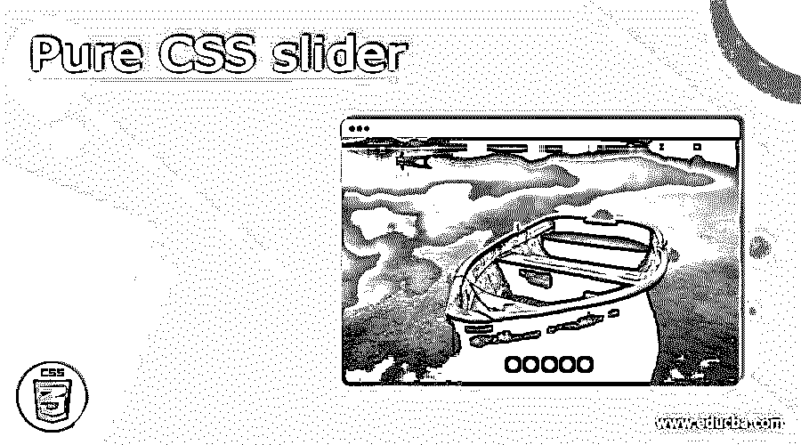
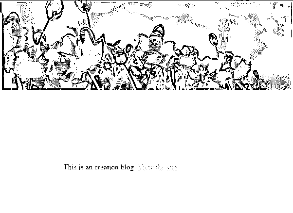
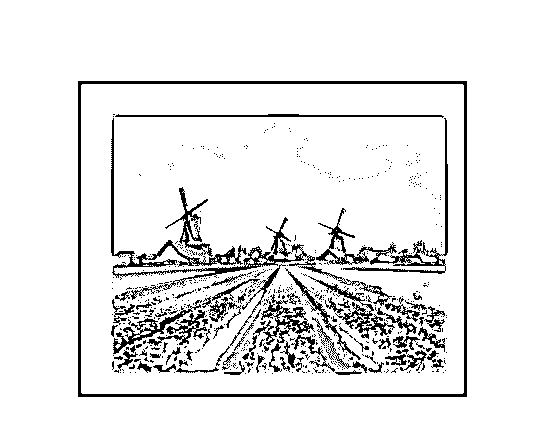

# 纯 CSS 滑块

> 原文：<https://www.educba.com/pure-css-slider/>




## 纯 CSS 滑块介绍

纯 CSS 滑块被定义为一个丰富的滑块，有助于在滑块容器上添加文本链接或任何其他元素，允许创建箭头导航并满足客户需求，同时非常容易理解。此外，它是用户友好的，有助于适应并排滚动的网站布局。CSS slider 非常灵敏，并且支持所有设备。

**语法**

<small>网页开发、编程语言、软件测试&其他</small>

这里没有格式语法，但是当创建一个盒子和图像放置器时，它采用不同的形式。让我们看看这个，

```
<div class = "slider name"> </div>
// To have CSS Styles
.slidername
{ // width and height declaration ;
}
// Next buttons to be clicked
.slider
{ transform : ….
}
```

### 如何在纯 CSS 中创建滑块？

在我们开始之前，这篇文章应该有一个关于 CSS 和功能图像滑块的基本理解的后续。纯 CSS 的潜力是在图像的滑块上创建一个格式良好的动画。在这里，它使用一个复选框用于活动幻灯片和导航目的。CSS3 和过渡效果一起使用幻灯片。

当我们改变代码中的 CSS 值时，会立即发生变化。为了从新状态回到旧状态，我们有一个包含四个类别的转换属性。

*   过渡属性
*   过渡持续时间
*   计时功能
*   过渡延迟

要了解如何在纯 CSS 中创建一个滑块，应该将动画实现为一个滑块部件。滑块充当放置图像的容器。一般来说，滑动概念部分通过从左向右移动来工作，并且图像被放置在前面。如果相应的对象被调整大小，则图像被拉开。为了适应，我们需要做一些随意的改变。第一步是在

元素中定义主包装器，并定义按钮或复选框来处理幻灯片部分。要定义关键帧间隔，使用 translateX 和 translate 属性是显而易见的。

### 例子

在下一节中，我们将看到 CSS 和 HTML 中的代码实现以及动画效果。

#### 示例#1

带文本的简单滑块

**。html**

```

<div class="s_container sli">

<div class="t_cont">
<p> hi,this is an image which has tulip flowers to view.</p>
</div>
<imgsrc="https://chrome.google.com/webstore/detail/spring-flowers-hd-wallpap/eaamhhinficbcjelgmkdpmigmombilna"/>
<p> This Image has an nature feel </p>

</div>

<p class="p">This is an creation blog. <a href="http://www.sitepoint.com/you-dont-need-javascript-for-that" target="_blank">View the site</a>.</p>
```

**。css**

```
body{padding: 4em;background-color: #00bfff;}
html {box-sizing: border-box;}
*, *:before, *:after {box-sizing: inherit;}
.demoslide {
width: 700px;
margin: 0.1 auto;
overflow: hidden;
border: solid 1.5px white;
}
.s_container {
width: 3000px;
font-size: 0.5;
transition: 1s ease;
height: 500px;
}
.s_container:hover {
animation-play-state: paused;
}
img, .t-cont {
width: 615px;
height: auto;
display: inline-block;
font-size: 14px;
text-align: center;
}
.t-cont {
height: 215px;
position: relative;
}
p {
position: relative;
top: -42%;
padding: 4px;
}
.sli {
animation: slide 22s ease infinite;
}
@keyframes sli {
0% {
transform: translateX(0%);
}
11.5% {
transform: translateX(0%);
}
22% {
transform: translateX(-22%);
}
36.1% {
transform: translateX(-22%);
}
45% {
transform: translateX(-45%);
}
60.5% {
transform: translateX(-46%);
}
71% {
transform: translateX(-71%);
}
87.5% {
transform: translateX(-75%);
}
95% {
transform: translateX(-71%);
}
100% {
transform: translateX(0);
}
}
.p {
margin-top: 150px;
text-align: center;
}
```

**解释**

在上面的代码片段中，我们将位置设置为绝对和相对，并使用背景图像和尺寸来扩展区域。所有元素都设置为默认起点。

**输出:**




#### 实施例 2

**。html**

```
<ul class="demotwo">
<li>
<input type="checkbox" id="sli1" name="image" checked>
<label for="sli1"></label>

</li>
<li>
<input type="checkbox" id="sli2" name="image2">
<label for="sli2"></label>

</li>
<li>
<input type="checkbox" id="sli3" name="image3">
<label for="sli3"></label>

</li>
<li><a href="http://cssslider.com/">
<input type="checkbox" id="sli4" name="image4">
<label for="sli4"></label>
</a>
</li>
</ul>
```

**。css**

```
* {
margin: 0.1;
padding: 0.1;
}
html {
background-color: #ffcccc;
background-image: radial-gradient(oval, hsla(0,0%,100%,.2), hsla(0,0%,0%,.72)),
linear-gradient(left, transparent 48%, hsla(0,0%,0%,.02) 48%);
background-position: 45% 70%, 51% 52%;
background-repeat: no-repeat, repeat;
background-size: 140% 140%, 2em 2em;
font-size: 90%;
min-height: 95%;
}
.demotwo {
background-color: #00ffbf;
box-shadow: inset 1 1 3px hsla(0,0%,0%,.3),
0 2px 3px hsla(0,0%,100%,.70),
0 -2px 2px 3px hsla(0,0%,0%,.2);
height: 17.1em;
left: 51%;
margin: -6.775em -12em;
padding: .4em;
position: absolute;
top: 45%;
width: 22em;
}
.demotwo:before {
background-color:   #996666 ;
bottom: -2em;
box-shadow: inset 1 1px 2px 2px hsla(0,0%,90%,.1),
inset 0 -1px 2px hsla(0,0%,0%,.5),
0 6px 49px hsla(0,0%,0%,.21),
0 15px 15px -12px hsla(0,0%,0%,.2),
0 28px 22px -16px hsla(0,0%,0%,.12),
0 35px 21px -16px hsla(0,0%,0%,.2);
content: '';
left: -2.1em;
position: absolute;
right: -2.1em;
top: -2.1em;
z-index: 0;
}
.demotwo:after {
background-color: #fff5e5;
bottom: -1.5em;
box-shadow: 0 2px 1px hsla(0,0%,100%,.2),
0 -1px 1px 1px hsla(0,0%,0%,.4),
inset 0 2px 3px 1px hsla(0,0%,0%,.2),
inset 0 4px 3px 1px hsla(0,0%,0%,.2),
inset 0 6px 3px 1px hsla(0,0%,0%,.1);
content: '';
left: -1.5em;
position: absolute;
right: -1.5em;
top: -1.5em;
z-index: -1;
}
.demotwo li {
box-shadow: 0 -1px 0 2px hsla(0,0%,0%,.03);
list-style:none;
position: absolute;
}
.demotwo input {
display: none;
}
.demotwo label {
background-color: #111;
background-image: linear-gradient(transparent, hsla(0,0%,0%,.25));
border: .2em solid transparent;
bottom: .5em;
border-radius: 100%;
cursor: pointer;
display: block;
height: .5em;
left: 24em;
opacity: 0;
position: absolute;
transition: .25s;
width: .5em;
visibility: hidden;
z-index: 10;
}
.demotwo label:after {
border-radius: 100%;
bottom: -.2em;
box-shadow: inset 0 0 0 .2em #111,
inset 0 2px 2px #000,
0 1px 1px hsla(0,0%,100%,.25);
content: '';
left: -.2em;
position: absolute;
right: -.2em;
top: -.2em;
}
.demotwo:hover label {
opacity: 1;
visibility: visible;
}
.demotwo input:checked + label {
background-color: #bfff00;
}
.demotwo:hover li:nth-child(1) label {
left: .8em;
}
.demotwo:hover li:nth-child(2) label {
left: 2.5em;
}
.demotwo:hover li:nth-child(3) label {
left: 3em;
}
.demotwo:hover li:nth-child(4) label {
left: 4em;
}
.demotwo img {
height: 17.75em;
opacity: 1;
transition: .22s;
width: 23em;
vertical-align: top;
visibility: hidden;
}
.demotwo li input:checked ~ img {
opacity: 1.2;
visibility: visible;
z-index: 8;
}
```

**解释**

上面的代码有更多的幻灯片图像。因此输出看起来像这样

**输出:**




### 结论

结束时，本文的大纲是关于现代浏览器中的纯 CSS，我们探索了创建 CSS 及其样式。我们也使用了许多支持新版本浏览器的 CSS 属性。

### 推荐文章

这是一个纯 CSS 滑块的指南。这里我们讨论如何用纯 CSS 创建一个滑块，并给出例子和输出。您也可以看看以下文章，了解更多信息–

1.  [CSS 清除浮动](https://www.educba.com/css-clear-float/)
2.  [CSS 加载器](https://www.educba.com/css-loader/)
3.  [CSS calc()](https://www.educba.com/css-calc/)
4.  [CSS 偏移](https://www.educba.com/css-offset/)


