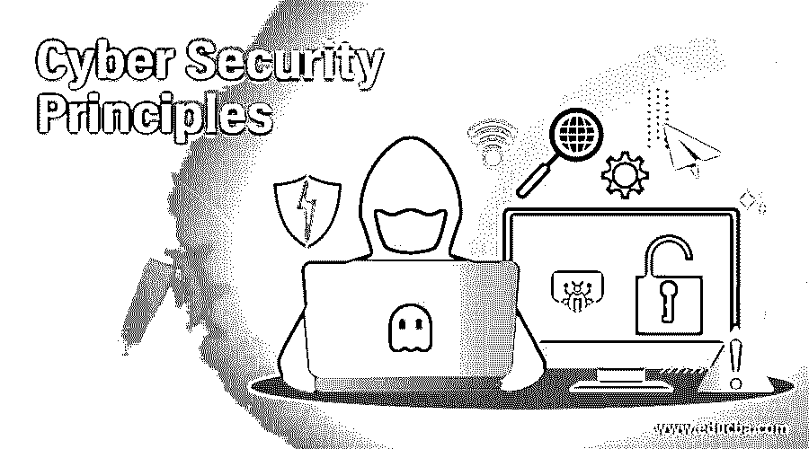
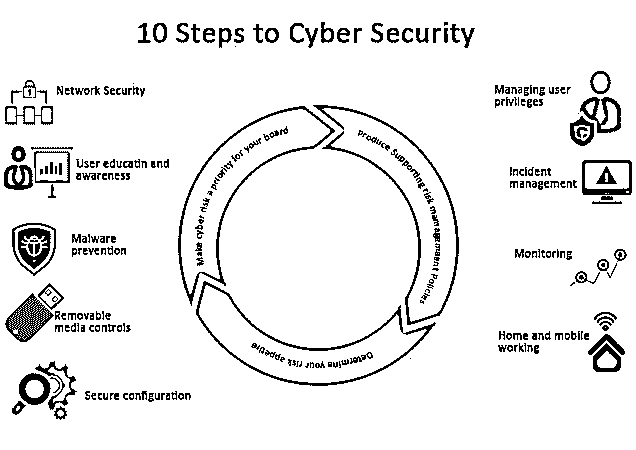

# 网络安全原则

> 原文：<https://www.educba.com/cyber-security-principles/>

## 网络安全原则介绍

网络安全的原则或步骤是为那些寻求保护自己免受网络攻击的企业和商业服务的。这是一个 10 步指南，最初由 NCSC(国家网络安全中心)制作。因此，任何企业或任何人如果想知道如何有效地实现网络安全，都应该考虑 NCSC 提出的这 10 个步骤。在这个话题中，我们[将学习网络安全](https://www.educba.com/cybersecurity-framework/)原则。

它最初发布于 2012 年，现在被富时 350 指数下的大多数组织使用。

<small>网页开发、编程语言、软件测试&其他</small>

### 网络安全原则

让我们看看，这 10 步原则是什么:

#### 1.风险管理制度

应建立风险管理制度，该制度主要包括必须建立、简化的适用政策和实践，并应有效传达给所有员工、承包商和供应商，以确保每个人都了解该方法，例如，如何做出决策、风险界限等。
风险管理制度应得到治理结构的支持，治理结构应足够强大，并应由在特定领域拥有专业知识的成员和高级成员组成董事会。

#### 2.安全配置

建立策略来保护组织的安全边界，应制定安全基准和流程来确保配置管理。人们还必须从系统中禁用或删除不必要的功能，这些功能总是处于安全漏洞的高端。所有的软件和系统都应该定期打补丁，以修复导致安全漏洞的漏洞。未能采取上述任何策略都可能导致系统和信息受损的风险增加。

#### 3.网络安全性

例如，通过互联网连接到一个不安全的网络——HTTP,会给你的系统带来被位于另一端的漏洞攻击或感染的巨大风险。因此，必须建立策略和适当的体系结构和技术响应，作为网络的基线。它将确保必须实施的入站和出站网络规则，以保护您的网络边界。例如，入站连接(从外向内)应该首先面对网络防火墙，并且应该针对威胁进行过滤，然后最终应该被传递到目标系统。通过实施这些政策，任何组织都可以减少成为网络攻击受害者的机会。此外，应进一步实施 SIEM(安全信息和事件管理)解决方案；应建立 SOC 中心，以利用技术有效监控您的网络。

#### 4.管理用户权限

应该为所有用户提供合理的(和最低限度的)访问权限，让他们能够正常工作。如果用户被授予比他们需要的更多的访问权限，这将是滥用，对信息安全构成更大的风险。此外，应该非常小心地控制和管理高度提升的特权的授予。

#### 5.用户教育和意识

最终用户和组织人员在保持组织安全方面发挥着至关重要的作用。如果最终用户不了解组织制定和定义的政策和风险管理机制，这些政策将无法实现其目的。必须为最终用户提供安全意识培训，并且应定期进行培训，以确保用户了解组织的政策以及可能导致安全违规的威胁。另一方面，该组织的网络安全专业人员应受过良好的培训，并应准备好在任何时间点应对任何违规行为。

#### 6.事故管理

SIEM 解决方案总是会给您带来与安全相关的事件。组织应建立有效的事件管理策略来支持业务，并确保整个组织和所有终端的安全，包括静止终端(如台式机)和移动终端(如笔记本电脑、手机等)。).

#### 7.恶意软件防范

它需要建立直接解决业务流程问题的策略，这些业务流程最容易受到恶意软件(如电子邮件、web、个人设备、USB)的感染。例如，应该建立限制 USB 访问计算机的策略，类似地，其他策略可以限制出站互联网请求等。，都取决于情况和需要。应实施单独的专业解决方案来保护每个前沿免受[恶意软件](https://www.educba.com/types-of-malware/)的攻击，例如针对电子邮件的电子邮件威胁保护、针对网络和任何 web 请求的网络分析器(如 IDS、IPS 和防火墙)、管理配置文件以监控最终用户移动设备上的组织数据等。应该通过实施可以检测、阻止和修复来自终端的恶意软件的防病毒解决方案来非常有效地保护终端。

#### 8.监视

应该创建一个监控策略和解决方案，以便帮助组织全面了解安全状况。当安全漏洞被我们的检测和预防系统发现，但监控解决方案检测到并造成安全事故时，它还可用于创建另一层安全。例如，您的终端解决方案能够检测到恶意软件，但无法阻止或删除该恶意软件，在这种情况下，监控解决方案将创建一个安全事件。该解决方案将监控所有入站和出站流量，并将与来自防火墙、端点、NIPS、NIDS、HIPS、HIDS 和其他解决方案的日志集成。

#### 9.可移动媒体控件

每个组织都必须定义其可移动介质策略，并应尽可能限制可移动介质的使用。如果在某些情况下不可避免地要使用它们，则策略应该限制可以使用的媒体类型和可以共享的信息类型。

#### 10.家庭和移动网络

当用户在家或移动时，他们不再连接到公司的局域网或广域网。在组织无法控制互联网的情况下，这会带来网络风险。因此，应该建立支持移动办公和在家办公的基于风险的政策。该公司还可以选择在手机上管理用户的个人资料，并控制他们存储在手机或家用电脑上的数据。

### 结论

在本文中，我们讨论了将引导组织建立强大的威胁防御体系结构的原则和步骤，但归根结底，这一切都与用户防止任何安全漏洞发生的意识有关。

### 推荐文章

这是一份网络安全原则指南。在这里，我们以简明的方式讨论网络安全的 10 步原则的基本概念。您也可以看看以下文章，了解更多信息–

1.  [网络安全职业](https://www.educba.com/careers-in-cyber-security/)
2.  [网络安全面试问题](https://www.educba.com/cyber-security-interview-questions/)
3.  [网络营销](https://www.educba.com/cyber-marketing/)
4.  [网络安全事件](https://www.educba.com/cyber-security-incidents/)

