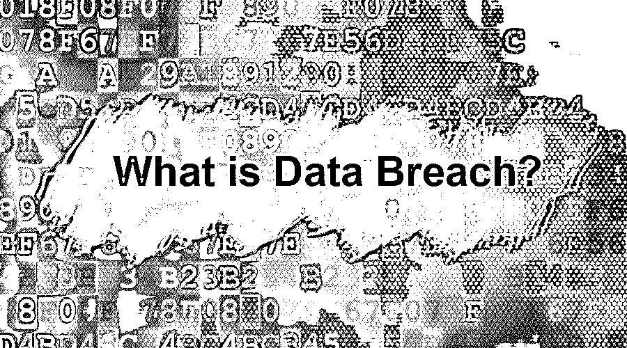

# 什么是数据泄露？

> 原文：<https://www.educba.com/what-is-data-breach/>

## 数据泄露简介

数据泄露是指检测到受保护数据从安全区域泄漏到非安全位置的事件。这是由于数据库或应用程序的安全性设计较弱、故意侵入数据库、安全应用程序与应用程序的不安全模块集成失败等原因造成的。数据泄露的其他名称是“数据溢出”、“数据泄漏”和“信息泄漏”。在数据泄露的情况下，它被确定为紧急安全事件，尽早找到修复泄露的解决方案至关重要。

### 什么是数据泄露？

它是一种行为或过程，其中一些未经授权的人或资源试图访问某人的 else 数据，而不考虑后者。这只是一个安全事故，其中数据被访问使用未经授权的手段。未经授权访问此类数据可能有不同的直觉。

<small>网页开发、编程语言、软件测试&其他</small>

根据维基百科，它被定义为“数据泄露是指敏感、受保护或机密数据被未经授权的个人复制、传输、查看、窃取或使用的安全事件。”它可能涉及金融信息，如信用卡或银行详细信息，也可能是其他形式的敏感数据。简而言之，它是指访问未经授权的数据，而不管数据所有者或数据最初直接或间接属于谁。

### 了解数据泄露

其背后的基本意图是通过应用安全和访问一个组织的知识，私人数据或一组人。目的可能有所不同，如出于研究目的、欺诈或其他目的。

这不是一个简单的概念。这是一个包含许多阶段的复杂过程。根据每个阶段下进行的攻击，可以将这些阶段划分为不同的部分。这些阶段可能包括研究部分、分析部分、攻击部分、数据误用等。

#### 1.阶段

大致来说，数据泄露可以分为四个不同的阶段，分别是:

**a .研究:**这基本就是在找系统的漏洞。入侵者试图找到系统中的任何漏洞或弱点，并利用这些漏洞或弱点攻击特定的数据集。

**b .攻击:**在这个阶段，入侵者或网络攻击者试图通过网络或社交攻击进行初步接触。这是最重要的阶段之一，因为入侵者有时也会试图进行友好的接触，以便受害者不会对数据泄露的可能性产生任何怀疑。

c .网络/社交攻击:这可以进一步分为两种攻击:网络攻击和社交攻击。

让我们一个一个地看看他们:

*   **网络攻击:**当入侵者试图利用一些组织弱点进入某个机构、网络、系统或组织时，就会发生[网络攻击](https://www.educba.com/types-of-network-attacks/)。入侵者试图渗透进一个组织的网络。
*   **社交攻击:**社交攻击包括通过直接或间接获取人们的信任来欺骗他们，让他们访问组织的网络。例如，受害者可能被欺骗传递敏感信息，如凭据或其他重要数据。

**d .反过滤:**一旦入侵者接入组织网络，入侵者很容易接触到高度机密的敏感数据，从而误用。入侵者可以以任何想要的方式使用这些敏感数据。

#### 2.为什么会发生？

好吧，我认为这是不言自明的，有许多理由来讨论为什么数据泄露实际上会发生？嗯，发生数据泄露的原因可能不止一个，而是很多。这可能是出于研究目的、数据滥用、[在线欺诈](https://www.educba.com/fraud-detection-analytics/)，或者可能是无数的原因。

#### 3.数据泄露会发生什么？

数据泄露通常遵循一个共同的过程:入侵者检查网络，找到系统中的漏洞，最后利用[网络](https://www.educba.com/what-is-network-security/)或社交攻击来利用它。一旦入侵者进入组织内部，他就可以在没有任何监督的情况下访问敏感数据。

#### 4.如何防止数据泄露？

防止这种情况的几种常见方法如下:

*   仅在网络上保留相关数据。
*   保护数据。
*   处置未使用的数据。
*   定期审查和更新流程。
*   教育用户。
*   保持密码受到保护。
*   使用授权软件。
*   使用更新的软件。
*   避免使用公共网络。

#### 5.数据泄露后该怎么办？

好吧，一旦它发生了，我们需要通过以下步骤来尽量减少影响。

首先，应该做以下事情:

*   评估哪些数据被窃取。
*   用更安全的密码更新所有密码。
*   通知相关机构。
*   使用最新更新来更新软件。

**举例:**

大多数人都遇到过的一个常见例子是，入侵者打电话给一个随机的人，并自称是银行员工。入侵者通常试图赢得受害者的信任，然后询问敏感信息，如信用卡号码、CVV 号码等。

### 结论

随着我们对互联网需求的增加，数据共享存在数据泄露的漏洞。入侵者试图利用系统中的漏洞来滥用数据。可以遵循不同的机制来最小化数据泄露的机会。我们可以部署最佳实践，以最大限度地减少数据泄露和数据丢失。

### 推荐文章

这是什么是数据泄露的指南？在这里，我们讨论数据泄露的基本概念、示例和不同阶段。您也可以浏览我们推荐的其他文章，了解更多信息——

1.  [什么是大型机？](https://www.educba.com/what-is-mainframe/)
2.  [什么是自举？](https://www.educba.com/what-is-bootstrap/)
3.  什么是 Ansible？
4.  [什么是胡迪尼？](https://www.educba.com/what-is-houdini/)

