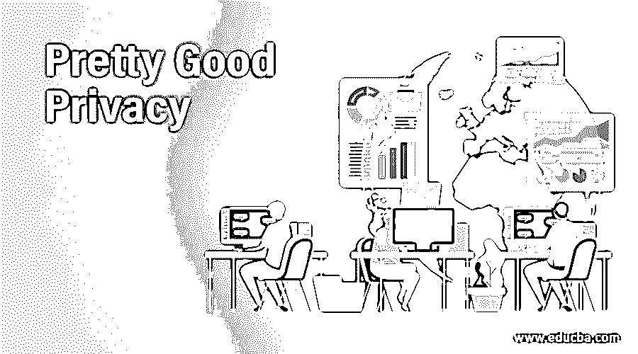

# 相当好的隐私

> 原文：<https://www.educba.com/pretty-good-privacy/>

## 非常好的隐私介绍

Pretty Good Privacy (PGP)是一种加密技术，用于为数据通信提供加密身份验证和隐私，用于文本、签名、电子邮件、文件的加密和解密，以及保护电子邮件对话的安全。菲尔·齐默曼是相当好的隐私之父。它非常容易使用，并且完全免费，包括它的源代码和文档。需要支持的组织也可以使用 PGP 的低成本商业版本。

### 相当好的隐私是如何工作的？

在 PGP 中，发送方必须包括消息中使用的算法的标识符以及密钥的值。

<small>网页开发、编程语言、软件测试&其他</small>

相当好的隐私包括 5 个基本步骤，如下所示:

*   数字签名
*   压缩
*   加密
*   数字包络
*   Base-64 编码

让我们详细讨论这些步骤

#### 步骤# 1–数字签名

在这一步，发送者的数字签名被创建。它由电子邮件组成，其中发件人的电子邮件使用 SHA 1 算法加密以生成邮件摘要。然后，使用发送方的私钥对该消息摘要进行加密。这个过程的结果是发送者的数字签名。

#### 第 2 步–压缩

在这一步中，输入消息和数字签名被一起压缩，以减小将通过邮件传输的最终消息的大小。在压缩过程中，使用了 ZIP 程序，它是基于伦佩尔齐夫算法的。
莱姆佩尔齐夫算法找到重复的单词或字符串，然后将它们存储在一个变量中。然后，它用指向相应变量的指针替换实际出现的重复单词或字符串。由于指针比原始字符串需要更少的内存，这种方法会导致数据压缩。

#### 第 3 步–加密

在此步骤中，使用 IDEA 算法用对称密钥对步骤 2 中生成的压缩文件进行加密。

#### 第 4 步–数字信封

在此步骤中，步骤中使用的对称密钥用接收方的公钥加密。步骤 3(加密)和步骤 4(数字包络)产生的输出一起形成数字包络。

#### 步骤# 5–Base-64 编码

在此步骤中，步骤 4 的最终输出被用作 Base-64 编码。

### 非常好的隐私算法

相当不错的隐私支持多种算法。其中最常见的如下。

*   **加密**:对于加密过程，使用了 IDEA、AES、DES 3 等算法。
*   **报文摘要:**报文摘要使用 MD5、SHA1、RIPE-MD
*   **非对称密钥:**对于非对称密钥，使用 RSA 和 DSS，其中 RSA 用于加密和签名，DSS 仅用于签名。
*   **Keyrings:** 当发件人想给另一个单个收件人发邮件时，没有问题，但当用户想给多个收件人发邮件时，复杂性就增加了。如果 A 要给 10 个人发消息，他需要这 10 个人的公钥全部。即需要一个 10 人的钥匙圈。相当好的隐私指定了一个公私密钥环。这是因为 A 可能想要改变他的公钥-私钥对，或者可能想要为不同的用户组使用不同的密钥对。换句话说，我们可以说，每个相当好的隐私用户都需要有两套密钥环，一套是他的公私钥对的一环，另一套是其他用户的公钥的一环。

**Note:** A maintains the set of key pairs in one of the keyrings, while in other keyrings, he maintains the public key of other users. A cannot have access to the private keys of other users. Similarly, other users will have two key rings.

这些钥匙圈很容易理解。我们举个例子详细了解一下这些价格。

#### 案例 1

需要向系统中的另一个用户发送消息

*   创建原始消息的消息摘要，使用他的私钥对其进行加密，并生成数字签名。
*   创建一次性对称密钥。
*   用接收方的公钥加密对称密钥。
*   用一次性对称密钥加密原始消息
*   用一次对称密钥加密数字签名
*   a 向接收者发送加密的数字签名和原始消息。

#### 案例 2

从系统中的一个用户接收到的消息

*   为了获得由发送者 A 创建的一次性对称密钥，A 使用他的私钥。
*   使用一次性对称密钥，对消息进行解密
*   计算原始消息的消息摘要(MD1)
*   使用一次性对称密钥 A 试图获得原始数字签名
*   为了解密数字签名，A 使用来自密钥环的公钥并获得原始消息摘要(MD2)
*   a 比较 MD1 和 MD2。如果匹配，它确定消息完整性和消息发送者的身份验证

### 相当不错的隐私证明

为了信任用户的公钥，我们需要拥有该用户的数字证书。PGP 可以使用由 CA 颁发的证书，也可以使用自己的证书。在 X.509 的情况下，CA 是谁给别人颁发证书的根。在 PGP 中，事情有所不同。没有 CA。任何人都可以签署属于循环中其他人的证书。没有等级、信任或结构。用户可以拥有由不同用户颁发的证书。
例如，用户 A 可能有一个由用户 B 签名的证书，另一个由用户 c 签名，所以如果用户 X 想要验证用户 A 的证书，他有两个选择:用户 A 和用户 B；还有一个是用户 A 和用户 c。

在相当好的隐私中，发布证书的用户被称为介绍者，相当于 X.509 中的 CA。

### 结论

本文介绍了什么是相当好的隐私:用于身份验证的加密方法及其工作和加密方法。

### 推荐文章

这是一个很好的隐私指南。在这里，我们讨论一个不错的隐私介绍，它是如何与各种算法和证书的步骤。您也可以浏览我们的其他相关文章，了解更多信息——

1.  [渗透测试服务](https://www.educba.com/penetration-testing-services/)
2.  [木偶替代品](https://www.educba.com/puppet-alternatives/)
3.  [集成架构](https://www.educba.com/integration-architecture/)
4.  [模型驱动架构](https://www.educba.com/model-driven-architecture/)

