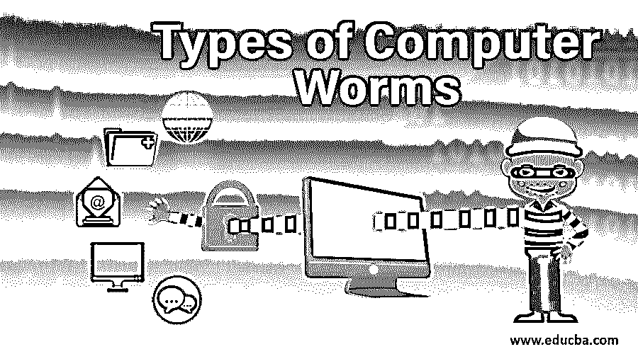

# 计算机蠕虫的类型

> 原文：<https://www.educba.com/types-of-computer-worms/>

## 计算机蠕虫概述

计算机蠕虫可以根据它们在计算机之间的分布方式进行分类。蠕虫的类型如下:

*   **邮件蠕虫:**邮件蠕虫通过恶意邮件作为恶意网站的附件或链接进行传播。
*   **即时通讯蠕虫:**即时通讯蠕虫通过向 Messenger、WhatsApp、Skype 等即时通讯应用的联系人列表发送链接进行传播。
*   **互联网蠕虫:**互联网蠕虫使用本地操作系统服务搜索所有可用的网络资源和/或扫描互联网上被入侵的计算机。
*   **IRC 蠕虫:** IRC 蠕虫通过互联网中继聊天(IRC)聊天渠道传播，向受感染的网站发送受感染的文件或链接。
*   **文件共享蠕虫**:文件共享蠕虫将它们的副本放在共享文件夹中，并通过对等网络分发。

### 什么是电脑蠕虫？

*   带宽被消耗，服务器过载，对网络造成损害。
*   此外，不是传播和破坏网络，而是在蠕虫内部编写代码，以便用这些代码破坏系统。这些代码窃取数据或创建后门，以便其他系统可以控制系统。
*   这些代码也称为有效载荷，以某种方式破坏系统，被感染的系统被用来传播垃圾邮件并破坏整个网络。
*   计算机蠕虫不需要帮助，而且它们会自己复制。
*   蠕虫利用受感染系统的联系人发送邮件，通过打开这些邮件，其他系统也受到感染。
*   一旦邮件被打开，蠕虫就会被下载，并在一段时间内完成它的工作，而无需任何进一步的操作。
*   只有在系统被感染后，用户才会知道这个蠕虫。
*   电脑蠕虫不需要附在任何软件上。他们通过各种手段传播到其他系统。
*   蠕虫会修改或删除系统文件，从而使系统和网络过载。
*   蠕虫为黑客进入系统并破坏整个网络创造了空间。
*   计算机蠕虫会破坏价值数年的数据，而且非常恶意。保护我们的数据免受蠕虫侵害非常重要。
*   安全特性大多被蠕虫利用。
*   一些蠕虫还试图改变系统设置。
*   蠕虫的例子有 Morris 蠕虫，Storm 蠕虫，SQL Slammer 等等。
*   莫里斯开发了几行代码来了解互联网有多大，但这些代码有一些错误，破坏了主机系统，造成了价值数百万的损失。
*   风暴蠕虫，顾名思义，发送关于风暴的新闻报道的邮件。一旦打开系统就会受到影响，其他联系人也会收到电子邮件。这个蠕虫创建于 2007 年。许多人认为系统仍然受到这种用户不知道的蠕虫的影响。
*   SQL Slammer 创建了许多没有任何安全保护的 IP 地址。该蠕虫影响了许多主要网站，因此暴露了系统的漏洞。
*   应该对所有应用程序进行自动更新，以避免蠕虫的潜在攻击。
*   大多数蠕虫都是在抗病毒药物的帮助下被识别出来的，但是由于许多蠕虫每天都在产生，所以有些没有被检测出来。
*   Stuxnet 是一种著名的计算机蠕虫，旨在摧毁伊朗的核计划。

### 前 5 种计算机蠕虫

计算机蠕虫是根据它们在系统中的分布方式来分类的。下面解释一些。

<small>网页开发、编程语言、软件测试&其他</small>

#### 1.电子邮件蠕虫

电子邮箱被蠕虫用作客户端。邮件带有被感染的链接或附件，一旦打开就会下载蠕虫。该蠕虫会搜索受感染系统的电子邮件联系人并发送链接，这样这些系统也会被破坏。这些蠕虫有双重扩展名，如 mp4 或视频扩展名，因此用户认为它是媒体扩展名。这些蠕虫没有可下载的链接，但有一个打开链接的短链接。点击链接，蠕虫就被下载，它要么删除数据，要么修改数据，网络就被破坏了。电子邮件蠕虫的一个例子是 2000 年感染计算机的 ILOVEYOU 蠕虫。

#### 2.网络蠕虫

互联网被用作搜索其他易受攻击的机器并影响它们的媒介。那些没有安装抗病毒药物的系统很容易被这些蠕虫感染。一旦找到这些机器，它们就会被感染，同样的过程会在这些系统中重新开始。这是用来检查最近的更新和安全措施，如果系统没有安装任何。蠕虫通过互联网或局域网连接传播。

#### 3.文件共享网络蠕虫

当下载未知来源的文件时，该文件可能带有蠕虫病毒，它会定位共享文件夹并破坏其他文件。当另一个系统从同一网络下载文件时，蠕虫也会找到该系统并进行复制。并且对网络中的所有系统重复该过程。这些蠕虫是媒体或其他扩展，因此用户可以很容易地下载相同的想法，他们是文件的扩展。2004 年，一种名为“Phatbot”的蠕虫病毒通过共享文件感染了电脑。这种蠕虫窃取了信用卡详细信息等个人信息，并以前所未有的规模破坏了许多系统。

#### 4.即时消息和聊天室蠕虫

这些蠕虫就像电子邮件蠕虫一样，从聊天室获取联系人，然后向这些联系人发送消息。一旦联系人接受邀请并打开邮件或链接，系统就会被感染。这些蠕虫要么有打开网站的链接，要么有可供下载的附件。这些蠕虫不如其他蠕虫有效。用户可以通过更改密码和删除邮件来消灭这些蠕虫。

#### 5.IRC 蠕虫

应用程序互联网中继聊天是一个消息应用程序，曾经是一种趋势。IRC 蠕虫以电子邮件和即时消息蠕虫的方式工作，并破坏 IRC 应用程序的联系人列表中的系统。

一旦您觉得您的系统有蠕虫，运行安全扫描并识别它是非常重要的。只有最好的杀毒软件才能帮你做到这一点。应用程序必须经常更新以避免漏洞。应尽一切办法避免未知链接。

### 推荐文章

这是计算机蠕虫类型的指南。在这里，我们详细讨论了概述和前 5 种不同类型的计算机蠕虫。您也可以阅读以下文章，了解更多信息——

1.  [恶意软件的类型](https://www.educba.com/types-of-malware/)
2.  [大型计算机的种类](https://www.educba.com/types-of-mainframe-computers/)
3.  [计算机内存的类型](https://www.educba.com/types-of-memory-in-computer/)
4.  [计算机语言的种类](https://www.educba.com/types-of-computer-language/)

