# 如何安装 Django

> 原文：<https://www.educba.com/install-django/>

## 安装 Django 简介

Django 是一个基于 Python 编程语言的开源 web 框架。它由一个名为 Django 软件基金会的独立组织维护。Django 的主要目标是为复杂和数据驱动的网站提供便利。该框架用于关注组件的可重用性和可插入性，其中优先考虑较少的代码和与快速开发的低耦合性。要安装 Django，首先需要在本地机器上安装 Python。因此，安装 python 也包含在本文档中。

### 安装 Django 的步骤

为了安装 Django，它需要一个稳定和良好的互联网连接。

<small>网页开发、编程语言、软件测试&其他</small>

让我们讨论安装 Django 所需的步骤:

**第一步:**首先访问 Python 的官方网站，下面给出的是:

[https://www.python.org/](https://www.python.org/)

**第二步:**登陆上述网页后，点击如下所示的下载按钮，选择本地系统中安装的操作系统。

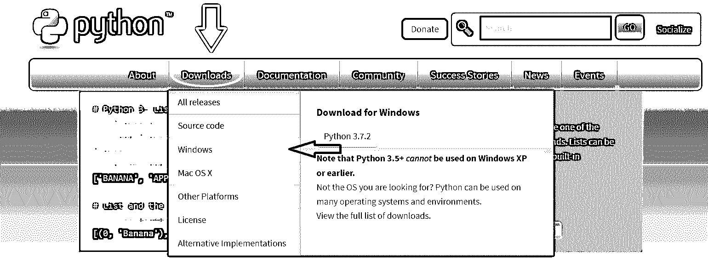

就我而言，我点击了 windows。

**第 3 步:**它将重定向到另一个页面，在该页面的最上方，您将看到标题为 Python Releases for Windows 的页面，在该页面的正下方，您将看到最新的 Python 版本，如下所示:

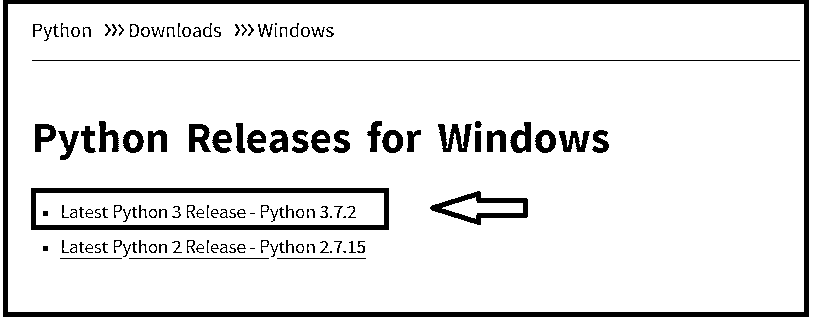

点击第一个链接，这是最新的 Python 3 版本——Python 3 . 7 . 2**。**这是目前可用的最新版本；这一次，你可能会得到更高的版本，但总是使用第一个链接。

**注意:**如果用户使用 Windows XP 或 Vista 等较旧的 Windows，请点击第二个链接，最新的 Python 2 版本- Python 2.7.15。

**步骤 4:** 点击上面的链接后，它会重定向到其他页面，在页面顶部显示 Python 的最新版本。只需向下滚动，您就会看到标题文件，其中包含多个可用的下载选项，如下所示:

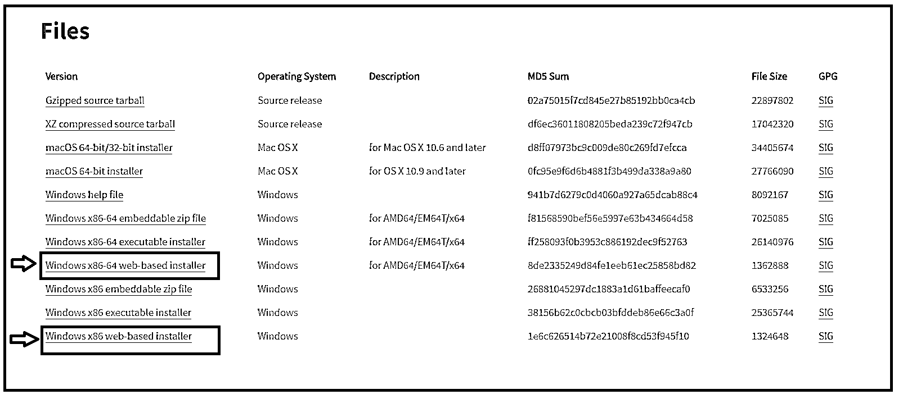

对于 Windows 64 位系统，选择第一个标记为红色的 Windows x86-64 基于 web 的安装程序并单击它，而对于 32 位系统，选择最后一个标记为红色的 Windows x86 基于 web 的安装程序。

**第五步:**下载文件需要一段时间；完成后，保存安装程序文件。然后，请点击安装文件，但为此，应该有一个稳定和良好的互联网连接。

**步骤 6:** 当您点击下载的文件时，它将启动安装程序。第一步是选择复选框并点击勾选“将 Python 3.7 添加到路径”，它显示在下面用红色标记的最末端。然后点击立即安装，如下所示。如果没有选择将 Python 3.7 添加到路径，则每次都必须手动调用 Python，这将花费大量时间，因此请勾选复选框。

接下来，您可以参考下面提供的图像:

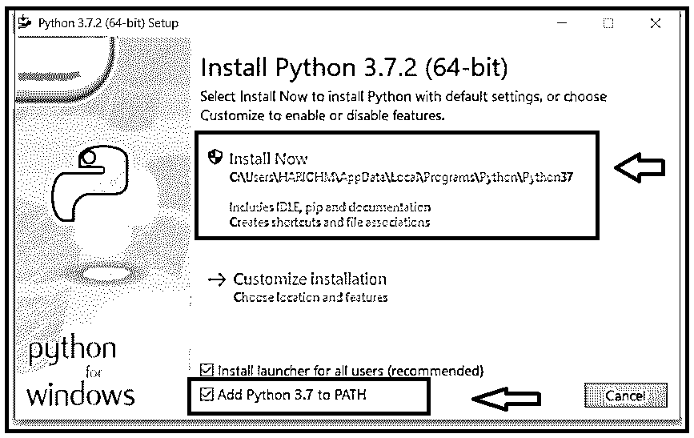

**步骤 7:** 当用户点击安装按钮时，会出现一条警告信息“您是否要对您的系统进行更改”,请点击“是”。它只对少数系统显示，对少数系统则不会；这取决于系统。

然后，安装程序将开始安装，如下所示:

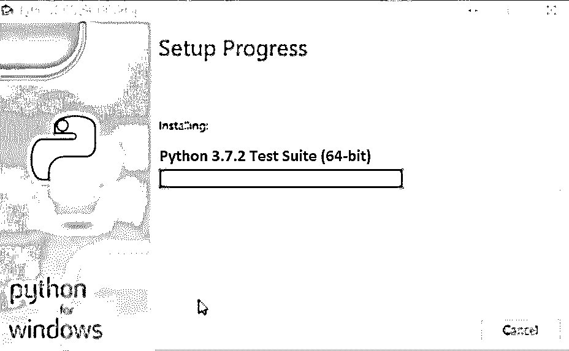

**步骤 8:** 完成后，显示“设置成功”，如下所示:

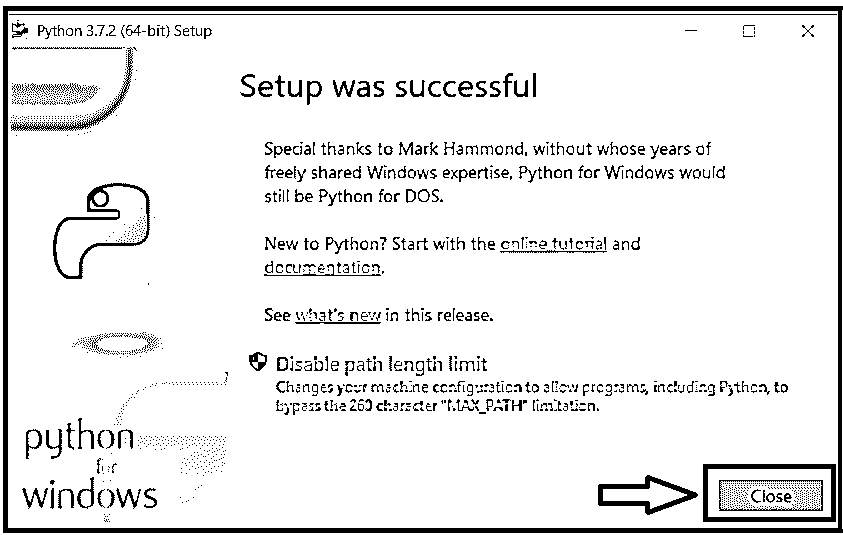

现在点击关闭按钮。

**第九步:**检查 Python 是否安装成功。按下 Windows(然后按住此按钮)+ R(键盘上的按钮)，这将打开运行命令。键入“cmd”并按下 OK 按钮。

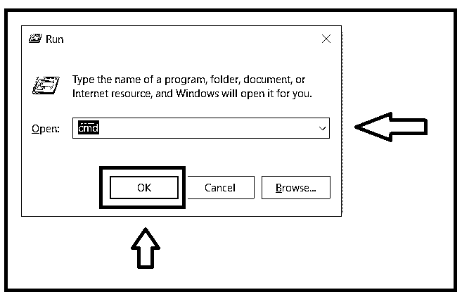

**第十步:**会打开命令提示符。

**代码:**

`Python --version`

**输出:**

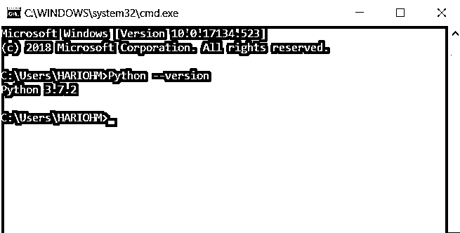

如果 Python 安装成功，则显示版本；否则，它会显示一个错误。在这种情况下，它显示 Python 3.7.2，因此 Python 成功安装在我的系统中。

**步骤 11:** 然后检查 pip 的当前版本。Pip 用于安装 python 环境中的其他包。

**代码:**

`pip --version`

它将显示 pip 的安装版本，如下所示:

**输出:**

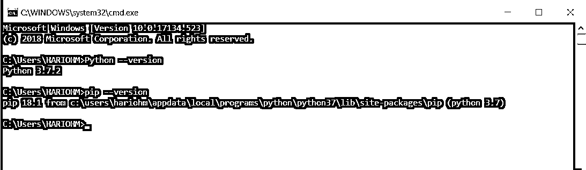

步骤 12: 现在我们已经准备好安装 Django 了，因为我们已经设置好了安装 Django 的环境。请使用给定的 URL 打开 Django 安装的其他网页:【https://docs.djangoproject.com/en/2.1/howto/windows/ T2】

**步骤 13:** 当网页打开后，向下滚动一点，停在显示“安装 virtualenv 和 virtualenvwrapper title”的地方，如上图所示。需要使用三个红色标记的命令。首先，需要安装 virtualenv 和 virtualenvwrapper 来为 Django 提供虚拟专用环境。就在这个标题下面，有安装虚拟包装器的代码。

**代码:**

`pip install virtualenvwrapper-win`

**步骤 14:** 在 windows 搜索栏中键入 Powershell，它会在顶部显示结果 Windows Powershell，然后右键单击 Windows Powershell，并单击以管理员身份运行，如下所示:

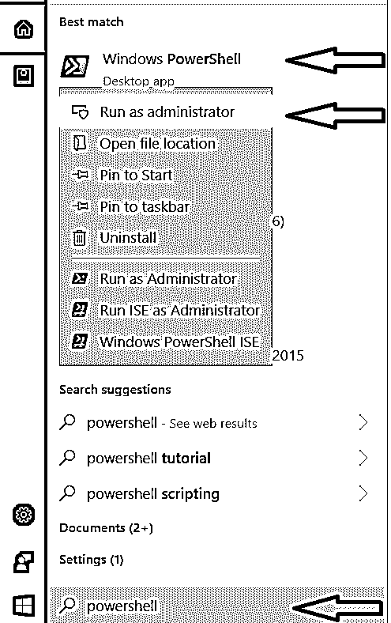

**第 15 步**:打开 power shell，然后输入第 13 步中给出的代码**pip install virtualenvwrapper-win**在 windows 中安装虚拟包装器环境需要一些时间。

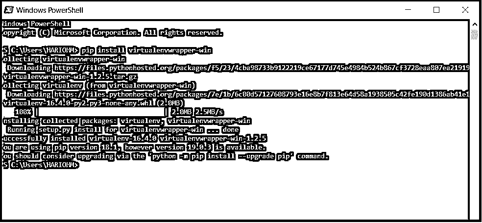

虚拟包装环境安装成功。

**步骤 16:** 然后，为 Django 项目创建一个虚拟环境。该代码可在网址:【https://docs.djangoproject.com/en/2.1/howto/windows/ T2】获得

键入此代码或将代码从网页复制到 Windows Powershell，代码如下所示:

**代码:**

`mkvirtualenv myproject`

它将创建一个虚拟环境，并显示为:

**输出:**

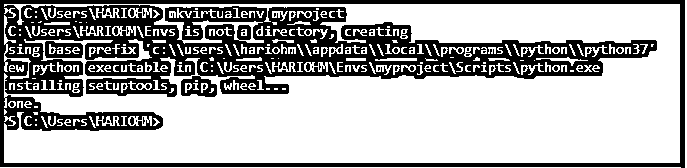

**步骤 17** :现在激活虚拟环境。因此，从给定的 URL 或从下面复制代码，并在 Windows Powershell 中键入。

**代码:**

`workon myproject`

**输出:**

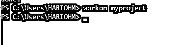

现在我的虚拟环境已经准备好安装 Django 了。

**步骤 18** :现在使用 pip 命令安装 Django，如下所示:

**代码:**

`pip install Django`

**输出:**

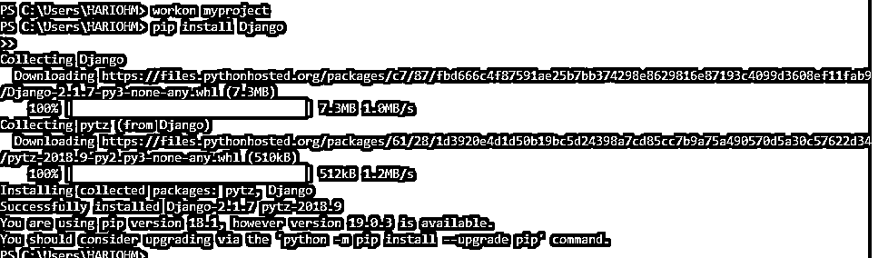

安装需要一些时间，但在安装之前，请确保您的虚拟环境已准备就绪，这在步骤 17 中完成。

**步骤 19** :现在 Django 安装成功。要验证 Django 安装，请在 Windows Powershell 中键入如下代码:

**代码:**

`django-admin --version`

**输出:**

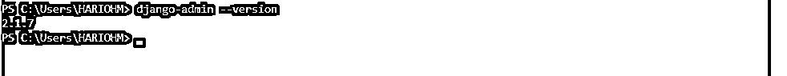

如果它显示 Django 的版本，这意味着 Django 安装成功，如果没有，请检查前一步。这里显示的是现在最新的 Django 版本 2.1.7。

### 推荐文章

这是如何安装 Django 的指南。这里我们已经讨论了在我们的 windows 中安装 Django 的概念和不同的步骤。您也可以阅读以下文章，了解更多信息——

1.  Django 的用途
2.  姜戈 vs 拉腊维尔
3.  Django vs PHP
4.  [Django 外键](https://www.educba.com/django-foreign-key/)

