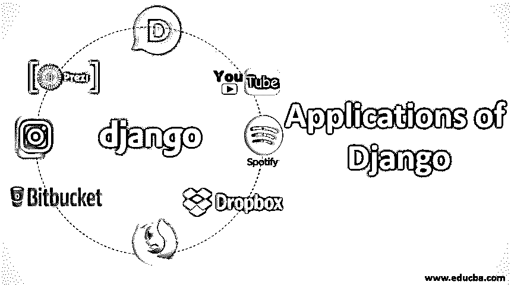

# Django 的应用

> 原文：<https://www.educba.com/applications-of-django/>

## 姜戈是什么？

Django 是一个用 Python 编写的开源免费 web 框架。这个 Django 帮助我们构建一个端到端的完整的 web 应用程序。Django 使用 python 语言，我们可以创建一个网页，通过它用户可以发送任何请求并查看网页的内容。后端和用户界面之间的响应也由 Django 完成，正如我们已经在[的 Django 架构](https://www.educba.com/django-architecture/)中看到的。最后，数据库中的任何更新、选择、插入语句也可以使用与不同数据库集成的 Django 来完成。

### Django 的用途

让我们首先理解为什么以及在什么场景中使用 Django:

<small>网页开发、编程语言、软件测试&其他</small>

*   使用 Django 框架是为了一个完整和快速的开发，就像其他编程语言一样，如 C，C#，Java 等。
*   这可用于处理大量数据、繁重的连续流量和动态数据处理。
*   我们可以证明在 Django 中代码开发会更快，因为它有很好的可重用性，这将减少多次编写相同代码的时间和空间。
*   这个框架很容易定制。
*   设计技术足够清晰，易于理解和管理。

### Django 的应用

现在，我们已经看到了为什么实际上我们可以使用 Django 框架，现在让我们检查一下使用它的所有应用程序:

#### 1.Instagram

这是最常用的社交网络应用程序之一，用于在网络中分享照片/视频。在这个应用程序中，当用户登录时，新闻提要或主页肯定会与其他用户不同。这个提要在技术上是基于用户特定的兴趣的。这个地方需要处理大量的数据。这个应用程序必须能够轻松地更新现有的功能，即使没有完整的后端数据库的详细知识。通过它我们可以获得快速更新和新功能。

处理如此庞大的数据必须确保安全无处可失。Django 在这里抵抗 [SQL 注入](https://www.educba.com/what-is-sql-injection/)。Instagram 完全基于 Django 框架，具有非凡的可扩展性和可用性。

#### 2.迪斯克斯

这个应用程序是使用最多的。但是为什么呢？这是一个全球博客评论应用程序。该应用程序正在与任何社交媒体平台集成。使用这个应用程序，任何用户都可以在任何文章、新闻、照片、视频等下发表评论。所以很明显，这需要处理大量的用户信息并维护一个大型数据库。反过来，这可以用于审查和执行分析。这是在包含在 Postgre SQL 或 MySql 中的 Django 框架的帮助下完成的，它也可以工作。

#### 3.Spotify

我们中的许多人可能正在使用这个应用程序。这是一个音乐应用程序。它主要是用 Django 技术开发的，带有使用 python 的机器学习算法。我们可以创建自己的播放列表，根据我们喜欢听的歌曲，会有很多推荐涌入。因此，可以理解，即使这个应用程序也有自己的提要，在所有用户之间进行区分。这也可以作为 UI 应用程序使用。它需要大型数据库存储来显示每个用户的选择，并在他们登录应用程序时显示这些选择。

#### 4.视频网站（可以让用户免费上传观赏的网站）

是的，Django 应用程序也用于这个趋势视频共享应用程序。以前这个应用程序一直使用 PHP，但现在为了更好的可伸缩性，它被转移到 python。Django 需要处理大量数据，并向数十亿用户提供适当的内容，在这方面，Django 是首选。我们不能说整个应用程序都与 Django 一起使用，但是其中的一部分是在 Django 中完成的。Google 拥有的这个应用程序 Django 将是一个更好的框架，可以轻松完美地处理快速开发。

#### 5.DropBox

正如你已经知道的，这个应用程序可以让你在任何地方访问你的文件。这个应用程序是使用 Python 开发的。在这个场景中，我们的 Django 应用程序将帮助存储、共享和同步所有这些不同类型的文件。无论是 UI 层面还是手机 app 层面，开发都是使用 Python 本身完成的。使用 Django 使得开发在很多方面都变得快速和简单。

#### 6.钻头桶

这也是一个在 2008 年左右推出的著名存储库，但它在 2017 年变得更加有名。这是使用 Python 和 Django 框架开发的。所以任何新特性的开发都很容易，因为从头开始的编码只使用 python 就完成了。这是一个开发者放入代码的地方，这样任何人都可以使用它们并从中获得知识。

#### 7.浏览器名

这是一个众所周知的 web 浏览器，你相信这个应用程序是在 python 上运行的吗？现在几乎所有正在开发的网络浏览器都在使用 python，Djangotto 维护着服务器上的负载。这些浏览器使用这种趋势框架，因为 Django 能够处理网站上任意数量的浏览或大量点击。

#### 8\. Prezi

这是 powerpoint 的替代品，还有许多其他内置功能。Django 的可扩展性成就了应用开发。

### 结论

因为我们已经检查了所有这些应用程序，所以我们可以确定 Django 框架完全能够承受大量的数据。Django 的这个功能具有所有的可伸缩性，这使得许多应用程序更喜欢这个 web 框架。由于其灵活且易于部署，nature 使该框架成为所有即将出现的应用程序的选择。所以，让我们用 Django 框架来学习和练习 python 吧。

### 推荐文章

这是 Django 的应用指南。在这里，我们讨论 Django 的 Django 用途，并详细解释 Django 的 8 大应用。您也可以浏览我们的其他相关文章，了解更多信息——

1.  什么是 Django？
2.  Django 的用途
3.  [如何安装 Django](https://www.educba.com/install-django/)
4.  [姜戈饼干](https://www.educba.com/django-cookies/)

