# 姜戈饼干

> 原文：<https://www.educba.com/django-cookies/>


## Django Cookies 简介

Django 是一个框架，它为我们提供了处理 cookies 的选项。Cookies 提供了存储和检索存储在会话中的数据的选项。这些曲奇有有效期，过了一段时间后就会丢失。我们已经知道，每当我们登录任何网页或应用程序时，网站默认会要求存储用户 id 和密码，自动填充有关上次登录会话的一些细节都是由 cookies 完成的。同样，我们可以将 cookies 存储在客户端，帮助最终用户简化他们的工作。

### 创建 Cookies

我们可以使用函数 set_cookie()创建 Django cookie，并且忘记我们还需要 get()函数的响应。

<small>网页开发、编程语言、软件测试&其他</small>

**语法:**

```
set_cookie(name, value, max_age=None)
```

这里，name 是 cookie 集的名称，value 是我们希望存储在 cookie 中的数据，max 是 cookie 必须过期的最大时间限制。这是一个可选字段，因此如果没有设置时间，cookie 将一直存在，直到浏览器关闭。

### 如何使用 Django 设置 Cookie？

让我们看一个如何使用 Django 手动设置 cookie 的小例子:

#### 1.view.py

**代码:**

```
from django.shortcuts import render
from django.http import HttpResponse
# Create your views here.
def home(request):
return HttpResponse("Welcome")
def setting_cookie(request):
response = HttpResponse("We are setting a cookie")
response.set_cookie('Learning', 'Django',5)
return response
def getting_cookie(request):
first_test  = request.COOKIES['Learning']
return HttpResponse("Practice: "+  first_test);
```

**对上面代码的解释:**通过上面的代码，我们可以看到，为了在屏幕上显示任何输出，我们使用了 HttpResponse 函数。为了显示或获取设置的 cookie，我们在不同的函数中定义它，然后使用添加了变量/表达式 COOKIE 的请求函数。从今以后，我们用 cookie 设置的值来设置一个变量。

#### 2\. urls.py

**代码:**

```
from django.urls import path
from . import views
urlpatterns = [
path('', views.home, name='home'),
path('setc', views.setting_cookie, name='setc'),
path('getc', views.getting_cookie, name='getc')
]
```

**对上述代码的解释:**在 python 文件的 URL 中，我们定义了所有要链接的路径，这些路径与视图文件中编写的每个函数相关。

通过命令行运行服务器后:python manage.py runserver

**输出:**

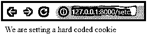


**获取 Cookie 响应:**

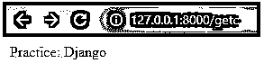


正如上面 views.py 代码中强调的，我们已经保存了 cookie 必须保存的最长时间。一旦超过时间限制，我们会得到以下错误:

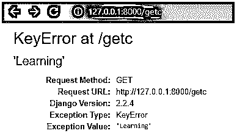


下面有大量的错误描述，请自己尝试，并检查已获得的总错误。

### 修改 Cookie

现在让我们看看如何修改 cookie。

#### 1.view.py

```
from django.shortcuts import render
from django.http import HttpResponse
# Create your views here.
def home(request):
return HttpResponse("Welcome")
def setting_cookie(request):
response = HttpResponse("We are setting cookie")
response.set_cookie('Learning', 'Django')
return response
def updating_cookie(request):
response = HttpResponse("We are updating  the cookie which is set before")
response.set_cookie(Learning, 'Happy')
return response
def getting_cookie(request):
first_test  = request.COOKIES['Stay']
return HttpResponse("Always be: "+  first_test);
```

我们可以理解，我们编写了另一个函数来设置一个新的 cookie 值，该值反过来更新了旧的值。

#### 2\. urls.py

```
from django.urls import path
from . import views
urlpatterns = [
path('', views.home, name='home'),
path('setc', views.setting_cookie, name='setc'),
path('updc', views.updating_cookie, name='updc'),
path('getc', views.getting_cookie, name='getc')
]
```

**对上面代码的解释:**在 views.py 中我们添加了一个新的函数，这个函数正在更新我们已经设置好的 cookie。然后在我们的 get 函数中，我们返回更新后设置的 cookie。

**输出 1:**

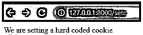


**输出 2:**


**输出 3:**

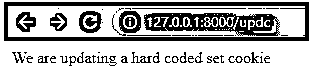


**输出 4:**

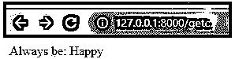


如果您可以在这里观察到，cookie 的值已经从之前设置的值更新为更新后的值。通过这种方式，我们可以修改或更新 cookie 值。

### 更新 Django Cookies

我们有另一种更新 cookie 的方法，使用重定向函数代替 Httpresponse。但是，我们仍然只使用 set_cookie 函数。下面是它的代码，因为我们在

#### view.py

**代码:**

```
def updating_cookie1(request):
response = redirect(home)
response.set_cookie('Learning', 'Practising')
return response
```

**输出 1:**

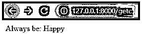


**输出 2:**

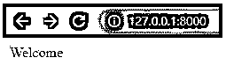


**输出 3:**

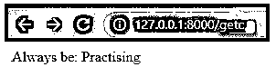


### 删除 Cookie

这里让我们来看看如何删除一个已经设置好的 cookie。

我们已经知道 set cookie 函数有一个名为 max_age 的可选参数，它会在默认情况下删除 cookie 会话。为了更简单，我们在上面的代码中添加了下面提到的代码。

#### 1.view.py

**代码:**

```
def deleting_cookie(request):
response = HttpResponse("We are now finally deleting the cookie which is set")
response.delete_cookie('Learning')
return response
```

上述代码被添加到视图文件中，位于 getting_cookie 函数的上方。

#### 2\. urls.py

**代码:**

```
from django.urls import path
from . import views
urlpatterns = [
path('', views.home, name='home'),
path('setc', views.setting_cookie, name='setc'),
path('updc', views.updating_cookie, name='updc'),
path('getc', views.getting_cookie, name='getc'),
path('delc', views.deleting_cookie, name='delc')
]
```

**输出 1:**

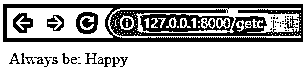


**输出 2:**

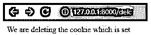


**输出 3:**

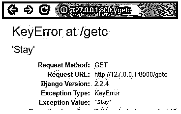


*   我们甚至有一个名为“expires”的属性，用于处理 cookie 的结束会话。
*   作为练习，尝试使用 expire 函数并处理删除 cookie。
*   代码可以按照下面的格式编写:
*   response . cookie[' cookie _ name '][' expires ']= datetime . today()+time delta(days = number _ of _ days)
*   这就是我们删除 cookie 的方法。

### 启用和禁用 Django Cookies

cookies 的启用和禁用基于 python 文件的设置。会话变量存在于可以处理会话 cookies 的设置文件中。cookie 的启用和禁用是通过设置、更新和删除 cookie 来手动完成的。还有会话级 cookies，需要时可以设置为 true。默认情况下，它们被设置为 FALSE。这些会话 cookies 是加密的，并确保它们是安全的。通过使用不同的技术，我们可以使用会话 cookies，并在访问特定网站时更新计数。

### 结论

在这里，我们学习了什么是 cookie 以及如何处理它们。我们创建了 Django cookies，更新了它们，甚至删除了那些 cookie。我们可以用登录用户 id 和密码设置我们的 cookie，就像许多网站现在描述的那样。这些 cookies 有助于轻松检索数据，因为每当用户请求数据时，它并不总是去数据库中搜索，然后为用户获取详细信息。但与此同时，在处理这些 cookies 时，我们必须小心黑客。

### 推荐文章

这是姜戈饼干的指南。在这里，我们讨论一个介绍，如何创建，修改和删除 cookies 及其适当的代码和输出。您也可以浏览我们的其他相关文章，了解更多信息——

1.  Django 的应用
2.  [如何安装 Django](https://www.educba.com/install-django/)
3.  [Django 框架](https://www.educba.com/django-framework/)
4.  什么是 Django？


