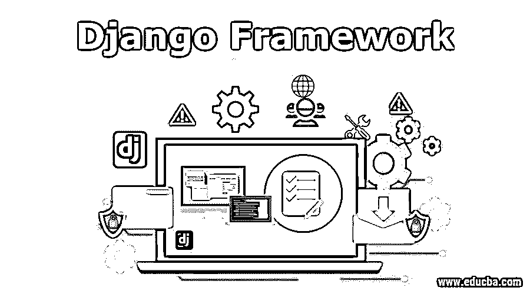
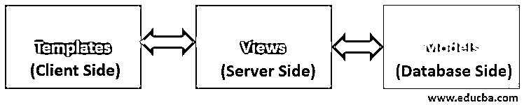

# Django 框架

> 原文：<https://www.educba.com/django-framework/>

## Django 框架介绍

Django 是一个基于 Python 的服务器端 web 框架，在全球范围内用于制作 web 应用程序。使用 Django 的一些顶级公司有:

*   国家航空与航天局
*   谷歌(Youtube)
*   Instagram
*   用它

由于 Django 采用了 Python，我们不仅可以部署常规网站，还可以部署[机器学习模型](https://www.educba.com/machine-learning-models/)，例如语音识别、网络欺诈检测等。Django 有一个非常模块化的方法，叫做 MVT(模型-视图-模板)架构。遵循这种架构使得代码非常容易开发、部署和维护。

<small>网页开发、编程语言、软件测试&其他</small>

Django 还提供了一个内置的管理模块，可以用来在网站中存储主值。例如，在处理贷款申请时，可能会有一个名为“新贷款”的屏幕，那么在这个表单中，假设有一个贷款类型的下拉菜单，个人贷款、汽车贷款、住房贷款等。然后通过管理面板维护这些值。

### 了解 Django 框架

现在我们知道 Django 有一个 MVT 架构，我们将一步一步解释每个术语。

当我们安装 Django 框架，并创建一个新项目时，下面的文件(最重要和最常用的)会自动创建，以便我们编写代码:

*   models.py
*   views.py
*   settings.py
*   urls.py

这些文件中的每一个都是为了代码模块化。settings.py 文件存储所有自定义配置，如数据库连接参数、应用程序将托管的服务器详细信息、可在整个应用程序中访问的全局变量等。

urls.py 文件包含所有自定义 URL 的列表，这些 URL 将在应用程序中用于访问不同的页面。让我们看看模型、视图和模板。

#### 模型

Django 中的模型指的是根据存储数据的需求创建的数据库表。例如，如果我们想创建一个银行网站，那么我们需要表来存储客户数据，如客户姓名、帐号、银行余额等。编写这些模型的代码放在 models.py 文件中。

现在您可能想知道使用哪个数据库来创建 Django 模型。放松点。Django 支持所有主流数据库(Oracle、PostgreSQL、MS SQL Server、MySQL ),您不必担心不同数据库的 SQL 类型不同。因为 Django 可以隐式的把你的 Python 代码翻译成[对应的数据库 SQL](https://www.educba.com/database-in-sql/) 。

#### 视角

Django 中的视图指的是从客户端接收到服务器的请求需要做什么/处理什么。这些 http 请求(GET、POST 等)可以用于特定目的，例如帐户借记、帐户贷记、创建新帐户等。

视图反过来与模型交互，以存储/检索/删除数据。编写这些视图的代码放在 views.py 中

#### 模板

模板是指用户看到的 HTML 页面。它包含背景图像、文本框、按钮等，这些都呈现在客户端的浏览器中，提供了网站的外观和感觉。

模板没有. py 文件，因为模板是 HTML 代码。因此，我们必须明确地创建一个模板文件夹，并保存所有的。html 文件放入该文件夹。

### 为什么用 Django？

Django 被普遍认为是“有期限的完美主义者的网络框架”。这是一个非常贴切的说法，因为构建 web 应用程序所需的所有组件都与这个框架捆绑在一起，即。内置 web 服务器和 SQLite 数据库。此外，管理面板只是防止重新发明整个轮子，开发人员可以专注于编写核心应用程序代码，而不是创建基本的必需品。

Django 的另一个最重要的特点是“安全”。Django 迫使开发人员在应用程序中实现与安全相关的特性，否则代码无法成功执行。例如 csrf(跨站点请求伪造)。csrf 是我们每次提交表单数据时生成的随机令牌。Django 服务器在收到每个 Http POST 请求时都会验证这个令牌。如果某个黑客试图攻击，那么这个令牌就会失效，而我们的应用程序仍然是安全的。

Django 的另一个有趣的特性是——模板扩展和标签。 [Django 为](https://www.educba.com/what-is-django/)提供了大量可以直接在模板中使用的模板标签(。html 代码)，从而避免了开发工作并减少了模板的大小。一个模板(例如:base.html)可以很容易地扩展到另一个模板，因此，这个模板减少到只有几行 html 代码。

### Django 框架的重要性

到目前为止，你一定已经对 Django 的用处有了大致的了解。Django 的重要性可以从世界顶级公司使用 Django 进行应用的事实中体会到。这包括 Mozilla、NASA、Instagram、Pinterest、Dropbox 等等。市场充满了 Django 的机会，但只有少数人可以利用，因此 Django 人很容易占上风。

此外，云服务提供商如 [AWS 有一个专用的](https://www.educba.com/what-is-aws/)服务来托管 Django 应用程序，称为 Elastic Beanstalk，它为重负载应用程序提供托管的 Apache 服务器、PostgreSQL、负载平衡器和自动伸缩。Django 应用程序也可以公开为 API，供第三方软件使用。这是通过使用 Django REST 框架来完成的。

### Django 先决条件

Python 是学习 Django 最重要的先决条件。更具体地说，与类、继承、函数、数据结构(列表、字典、元组)相关的概念应该非常清楚，因为整个 Django 框架都围绕着类和函数。

此外，开发前端(模板部分)，html，Javascript 和 AJAX 的知识将被证明是巨大的帮助。要安装 Django，你只需要你的电脑安装了 Python 的 Linux/Windows。然后用一个简单的命令(pip install Django)，Django 就变成了你的游乐场。

### 结论

Django 开发速度极快，设计上可扩展、灵活，安全性和可靠性极高。庞大的 Django 社区为您在 Django 开发过程中可能遇到的任何问题提供了解决方案。如果您练习并掌握了 Django 的基本概念，那么您可以在几天之内构建生产就绪的 web 应用程序。

### 推荐文章

这是 Django 框架的指南。这里我们讨论 Django 框架的基本概念、理解、重要性、用途和先决条件。您也可以阅读以下文章，了解更多信息——

1.  [安装 Django](https://www.educba.com/install-django/)
2.  Django 的应用
3.  [Django 建筑公司](https://www.educba.com/django-architecture/)
4.  [姜戈饼干](https://www.educba.com/django-cookies/)

