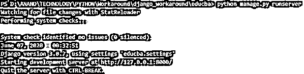
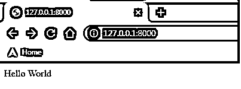
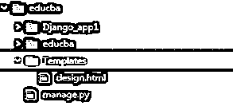
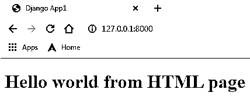
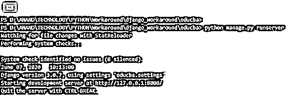
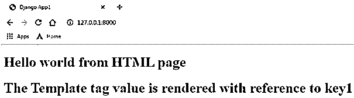

# Django 观点

> 原文：<https://www.educba.com/django-views/>

## Django 观点介绍

Django 应用程序的所有视图都放在 views.py 文件中。这里的视图是一个 python 函数，它接收请求并返回响应。响应可以是面向 HTML 的网页，也可以是 XML 文档，甚至是错误消息或图像。这种观点本身认为任何主观的东西在逻辑上都是必不可少的，要作为一种回应回去。代码可以放在任何需要的地方，直到它与 python 路径相关联。每个视图都是可调用的，并且具有接受请求和响应的能力。它不仅仅是一个功能。

### 如何创建一个普通的 Django 视图？

下面我们学习如何创建一个普通的 Django 视图:

<small>网页开发、编程语言、软件测试&其他</small>

**1。** **在 Django 应用程序的 views.py 文件中声明函数**

为了在 Django 中声明视图，我们需要一个 HTTP 请求和一个响应。HTTP 请求将由 Django 框架自动创建。这个请求的响应需要由程序员创建。这个响应将放在 Django.http 包的 HttpResponse()方法中。HttpResponse 有计数流 HttpResponse、JsonResponse 和 FileResponse 的子类。

在 views.py 文件中创建的每个函数都将被视为该应用程序的一个单独视图。

**代码:**

`from Django.shortcuts import render
from Django.http import HttpResponse
def view1(request):
return HttpResponse ("Hello World")`

**2。在 urls.py 文件**中标记视图

这是为视图创建 url 的过程。此处提到的 url 将用于到达提到的网页。

*   从 django.conf.urls 导入库导入 url。
*   在 urlpatterns 列表中声明 url 条目

url(url_path，view_to_be_tagged，name_for_this_view)

**代码:**

`from django.contrib import admin
from django.conf.urls import url
from Django_app1 import views
urlpatterns = [
url(r'^$',views.index,name='index'),
url(r'admin/', admin.site.urls), ]`

**3。** **使用 python manage.py runserver 命令重新加载服务器，并验证网页。**

**4。在运行服务器时，下面提到的系统消息将被打印到控制台上，从给定的消息中，我们可以注意到服务器被启动的时间，所使用的** **Django 设置的版本，以及服务器被启动的 HTTP 链接。**

**代码:**

`Watching for file changes with StatReloader
Performing system checks...
System check identified no issues (0 silenced).
June 07, 2020 - 10:13:00
Django version 3.0.7, using settings 'educba.settings'
Starting development server at http://127.0.0.1:8000/
Quit the server with CTRL-BREAK.`

**输出:**

### 从模板呈现的 Django 视图

这些模板对于理解 Django 的功能非常有帮助。这些模板保存 HTML 页面中的静态项。它可能是这一页的梗概。要从模板渲染视图，请遵循以下步骤。

**1。** **创建一个模板文件夹:**所有与模板相关的 HTML 代码都可以放在这个文件夹中。必须在主项目文件夹下创建模板文件夹。

**2。** **在 settings.py 文件中标记模板文件夹:**创建的模板文件夹需要在 settings.py 文件中进行标记。因此，一旦被标记，它允许放在 templates 文件夹下的每个 HTML 文件都可以在 veiws.py 文件周围访问。

**代码:**

`import os
# Build paths inside the project like this: os.path.join(BASE_DIR, ...)
BASE_DIR = os.path.dirname(os.path.dirname(os.path.abspath(__file__)))
Template_DIR = os.path.join(BASE_DIR,'Templates')
TEMPLATES = [
{
'BACKEND': 'django.template.backends.django.DjangoTemplates',
'DIRS': [Template_DIR,],
'APP_DIRS': True,
'OPTIONS': {
'context_processors': [
'django.template.context_processors.debug',
'django.template.context_processors.request',
'django.contrib.auth.context_processors.auth',
'django.contrib.messages.context_processors.messages',
],
},
},
]Template_DIR = os.path.join(BASE_DIR,'Templates')`

**3。在模板文件夹**中放置一个 HTML 文件

**代码:**

`<!DOCTYPE html>
<html lang="en" dir="ltr">
<head>
<meta charset="utf-8">
<title>Django App1</title>
</head>
<body>
<h1> Hello world from HTML page <h1>
</body>
</html>`

**4。使用()方法渲染 views.py 中的 HTML 文件:**Django 的 Render 函数用于将新创建的 HTML 内容赋予 render 方法结合一个模板和上下文字典返回一个 HttpResponse 对象。

**语法:**

`render(request, template_name, context=None, content_type=None, status=None, using=None)`

| **自变量** | **描述** |
| **请求** | 这用于生成响应。这是一个强制性的论点。 |
| **模板名称** | 用于此视图的模板的名称。这是一个强制性的论点。 |
| **语境** | 上下文是作为字典维护的变量名和变量值映射。默认情况下，这是一个空字典。因此，如果传递了键，就可以从字典中检索并呈现相应的值。这是一个可选参数。 |
| **内容 _ 类型** | 要使用的 MIME(多用途互联网邮件扩展)。默认值为“文本/html”。这是一个可选参数。 |
| **状态** | 要使用的响应代码。默认响应代码是 200。 |
| **使用** | 此参数用于表示用于加载模板的模板引擎的名称。这是一个可选参数。 |

**代码:**

`from django.shortcuts import render
from django.http import HttpResponse
def index(request_iter):
return render(request_iter,'design.html')`

**5。** **使用 python manage.py runserver 命令重新加载服务器，并验证网页。**

**输出:**

### 从模板标签呈现的 Django 视图

模板标签用于向 Django 视图注入动态生成的内容。这是模板标签的关键功能之一。他们可以灵活地向文件中注入动态内容。

**代码:**

`<!DOCTYPE html>
<html lang="en" dir="ltr">
<head>
<meta charset="utf-8">
<title>Django App1</title>
</head>
<body>
<h1> Hello world from HTML page <h1>
{{ Key1 }}
</body>`

**2。在视图中添加一个上下文模板字典，并将字典标记到上下文中。**

**代码:**

`from django.shortcuts import render
from django.http import HttpResponse
def index(request_iter):
dict_Var = {"Key1" : "The Template tag value is rendered with reference to key1"}
return render(request_iter,'design.html',context=dict_Var)`

**输出:**

### 结论

Django 是基于 web 的应用程序最主要的方法。在 Django 框架中，视图的概念是非常明确的，因此这些视图可以以最灵活的方式生成响应。Django views 中的模板和模板标签流程等概念增加了额外的稳定性，使其成为最常用的 web 应用程序框架之一。

### 推荐文章

这是 Django 观点的指南。在这里，我们讨论 Django 视图的介绍，以及如何创建普通的 Django 视图，并给出例子和代码实现。您也可以浏览我们推荐的其他文章，了解更多信息——

1.  [JavaScript 字符串格式](https://www.educba.com/javascript-string-format/)
2.  [JavaScript 匿名函数](https://www.educba.com/javascript-anonymous-function/)
3.  [Javascript 嵌套函数](https://www.educba.com/javascript-nested-functions/)
4.  [JavaScript 日期函数](https://www.educba.com/javascript-date-function/)

