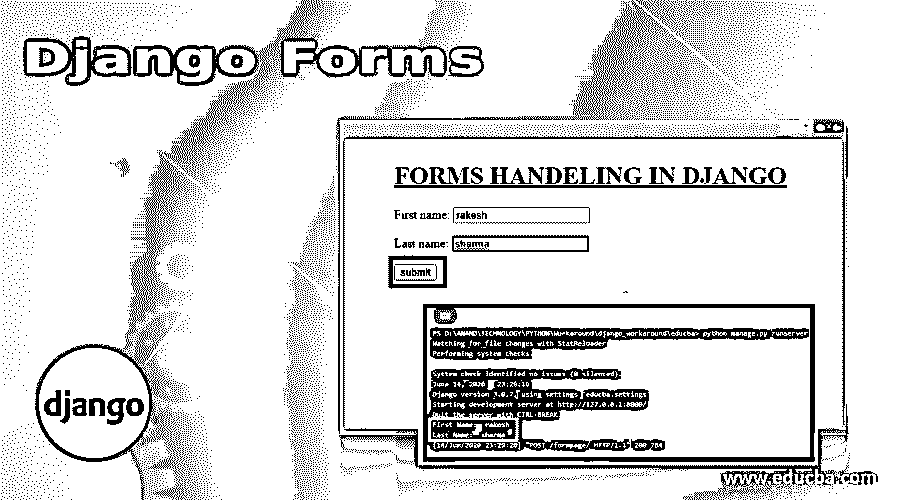
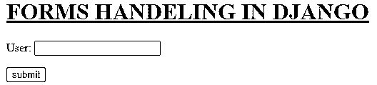
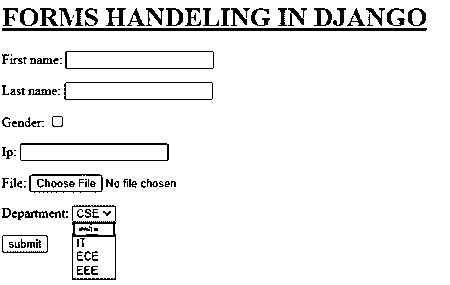
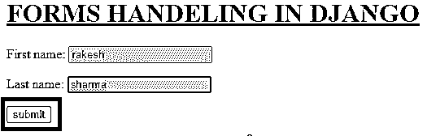
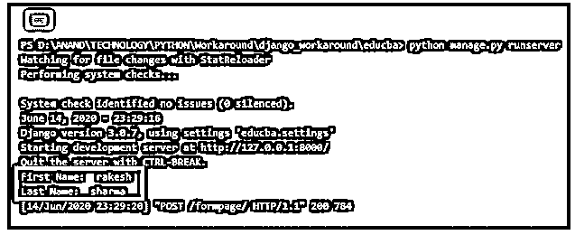

# Django 表单

> 原文：<https://www.educba.com/django-forms/>

## Django 表单介绍

对于一个 web 应用程序来说，创建表单是一项关键的功能，这些表单充当了用户键入输入到应用程序中的关键来源。该用户键入的输入可以以精确的方式被进一步验证和处理。这些都是表单处理中的关键功能。Django 提供了一套分类的方法来表达表单实体。

### 如何创建 Django 表单？

创建 Django 表单说明如下:

<small>网页开发、编程语言、软件测试&其他</small>

#### 1.在应用程序中创建一个 forms.py 文件

forms.py 文件类似于 models.py，表单中使用的所有字段都将在 form 类下声明。

##### 示例—**forms . py**

`from django import forms
class Valueform(forms.Form):
user = forms.CharField(max_length = 100)`

#### 2.为表单创建视图

在 views.py 文件中为表单创建一个 Django 视图方法。这里创建了一个 form 类的对象。该对象在模板呈现中用作上下文字典的值。

##### 示例—**views . py**

`from django.shortcuts import render
from django.http import  HttpResponse
from Django_app1.forms import Valueform
defform_view(request_iter):
form = Valueform()
return  render(request_iter,'Form_Handeling.html', {"form": form})`

#### 3.为显示表单制定一个 HTML 文件

需要在 templates 目录中创建一个 HTML 文件来显示表单，这里使用 below 标签对文件进行模板标记，

`{{ form.as_p}}`

这里“as_p”用于更好地设计表单元素。行用于证明 django 执行的内部安全验证。

##### 例子

`<!DOCTYPE html>
<html lang="en" dir="ltr">
<head>
<meta charset="utf-8">
<title>Django App1</title>
</head>
<body>
<h1><u> FORMS HANDELING IN DJANGO </u></**h1**

{{ form.as_p }}

<input type="submit" class="btnbtn-primary" value="submit">

</body>
</html>`

#### 4.在 urls.py 文件中标记视图

这是为视图创建 url 的过程。

*   从 django.conf.urls 导入库导入 url
*   在 url 模式列表中声明一个 url 条目
    url(url_path，view_to_be_tagged，name_for_this_view)

##### 例子

`from django.contrib import admin
from django.conf.urls import url
from Django_app1 import views
urlpatterns = [
url(r'^$',views.index,name='index'),
url(r'formpage/',views.form_view,name='form'),
url(r'admin/', admin.site.urls), ]`

**输出:**

### Django 表单中所有可用的表单字段

django 表单中可用的表单字段如下所示:

| **字段类型** | **Django 表单字段类型** | **HTML 输出** | **描述** | **Django Widget** |
| 布尔代数学体系的 | 表格。布尔字段() | <input type="’checkbox’"> | 创建布尔型字段 | forms.widgets.CheckboxInput() |
| 布尔代数学体系的 | 表格。NullBooleanField() | <select><option value = " 1 " selected = " selected ">未知</option><option value = " 2 ">Yes</option><option value = " 3 ">No</option></select></select> | 非常类似于布尔字段，但也允许未知值 | forms . widgets . nullbooleanselect() |
| 文本 | 表格。夏菲尔德() | <input type="”text”"> | 创建简单的字符字段 | forms.widgets.TextInput() |
| 文本 | 表格。电子邮件字段() | <input type="”email”"> | 创建用于电子邮件输入的字段 | forms.widgets.EmailInput() |
| 文本 | 表格。GenericIPAddressField() | <input type="”text”"> | 允许插入 ip 地址 | forms.widgets.TextInput() |
| 文本 | 表格。regex field(regex = ' regular _ expression ') | <input type="”text”"> | 一个基本的字符字段，但是这里的验证发生在服务器端 | forms.widgets.TextInput() |
| 文本 | 表格。斯拉格菲尔德() | <input type="”text”"> | 基本字符字段，但只允许输入小写值 | forms.widgets.TextInput() |
| 文本 | 表格。URLField() | <input type="”url”"> | 允许插入 url | forms.widgets.URLInput() |
| 文本 | 表格。UUIDField() | <input type="”text”"> | 一个基本的字符字段，但是服务器端的 django 验证这些值是否可以转换为 UUID(通用唯一 ID) | forms.widgets.TextInput() |
| 文本 | 表格。组合字段(字段=[字段类型#1，字段类型#2]) | <input type="”text”"> | 就像 CharField，Heredjango 表单域一样，在服务器端使用数据传递规则来执行。 | forms.widgets.TextInput() |
| 文本 | 表格。多值字段(字段=[字段类型#1，字段类型#1]) | <input type="”text”"> | 允许以自定义方式创建表单域。 | forms.widgets.TextInput() |
| 文本/文件 | 表格。文件路径字段(路径= '目录') | <select><选项值= "目录/文件 _ 1">文件 _ 1</选项> <选项值= "目录/文件 _ 2">文件 _ 2</选项> <选项值= "目录/文件 _ 3">文件 _ 3</选项></选择></select> | 该字段用于保存目录的路径 | forms.widgets.Select() |
| 文件 | 表格。文件字段() | <input type="”file”"> | 创建一个字段，用户可以通过该字段将文件附加到表单 | forms . widgets . clearable file input() |
| 文件 | 表格。图像字段() | <input type="”file”"> | 创建一个字段，用户可以通过该字段将图像附加到表单 | forms . widgets . clearable file input() |
| 日期/时间 | 表格。日期字段() | <input type="”text”"> | 类似于基本的字符字段，但是在服务器端，django 设置验证插入的值是否是日期格式。(如 2020-11-23，11/23/20)。 | forms.widgets.DateInput() |
| 日期/时间 | 表格。时间字段() | <input type="”text”"> | 类似于基本的字符字段，但是在服务器端，django 设置验证插入的值是否是时间格式的。(如 15:41:32，11:44)。 | forms.widgets.TextInput() |
| 日期/时间 | 表格。日期时间字段() | <input type="”text”"> | 类似于基本的字符字段，但是在服务器端，django 设置验证插入的值是否是 datetime 格式。(如 2020-11-15 12:30:59，11/15/20 13:30)。 | forms.widgets.DateTimeInput() |
| 日期/时间 | 表格。DurationField() | <input type="”text”"> | 类似于基本的字符字段，但是在服务器端，django 设置验证插入的值是否要转换为时间增量。 | forms.widgets.TextInput() |
| 数字 | 表格。IntegerField() |  | 在服务器端，django 验证输入字段是否是有效的整数。 | forms.widgets.NumberInput() |
| 数字 | 表格。十进制菲尔德() |  | 在服务器端，django 验证输入字段是否是有效的小数。 | forms.widgets.NumberInput() |
| 数字 | 表格。浮动字段() |  | 在服务器端，django 验证输入字段是否是 float 类型。 | forms.widgets.NumberInput() |

#### 示例–forms . py

下面的 forms.py 文件包含了上面提到的作为应用程序声明和执行的几个表单字段。

`#-*- coding: utf-8 -*-
from django import forms
class Valueform(forms.Form):
first_name = forms.CharField(max_length = 100)
last_name = forms.SlugField()
gender =  forms.BooleanField()
Ip = forms.GenericIPAddressField()
file =  forms.FileField()
department = forms.ChoiceField(choices = (('1','CSE'),('2','IT'),('3','ECE'),('4','EEE')))`

**输出:**

### 处理视图中的表单字段

可以在表单的 view 方法中使用下面的表单处理代码来捕获和处理表单字段中输入的值

#### 示例–views . py

`from django.shortcuts import render
from django.http import  HttpResponse
from Django_app1.forms import Valueform
defform_view(request_iter):
form = Valueform()
if request_iter.method == "POST":
value = Valueform(request_iter.POST)
if value.is_valid():
print("First Name: ",value.cleaned_data['first_name'])
print("First Name: ",value.cleaned_data['last_name'])
return  render(request_iter,'Form_Handeling.html', {"form": form})`
在这里，当从表单提交“POST”时，它作为请求线程的一部分在方法参数中传递，因此这在下面的语句中得到验证。

`if request_iter.method == "POST":`

因此，当提交“POST”时，通过引用 forms.py 中声明的 form 类，与 POST 请求相关联的值被捕获到一个对象中。使用该对象的 cleaned_data[]参数并使用相应字段的名称，从该字段键入的值被捕获。在本例中，捕获的值被打印到控制台上。在实时情况下，将对这些值进行进一步处理，如数据库存储或服务器验证等。

**输出:**

### 推荐文章

这是 Django 表单的指南。在这里，我们还讨论了介绍和如何在 Django 中创建表单，以及不同的例子和代码实现。您也可以看看以下文章，了解更多信息–

1.  [Django 中的表单验证](https://www.educba.com/form-validation-in-django/)
2.  Django 的用途
3.  姜戈 vs 拉腊维尔
4.  WordPress vs Django

