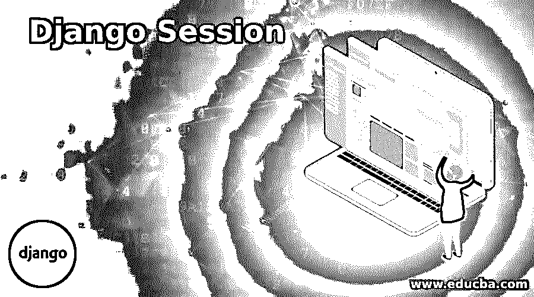
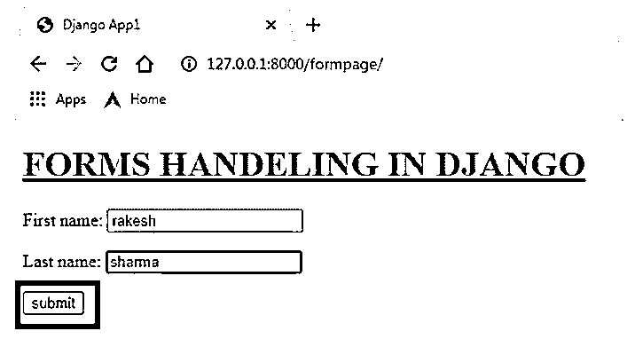
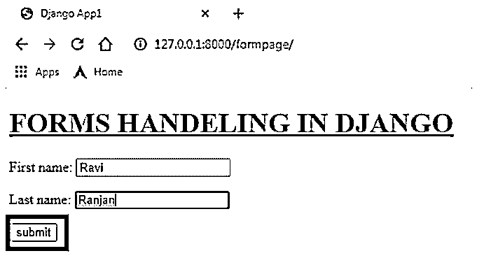
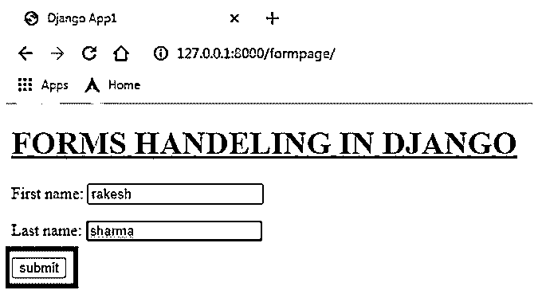
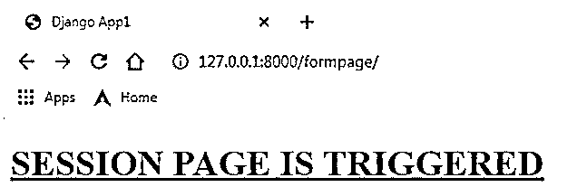
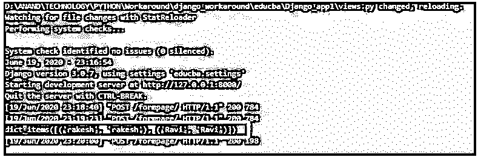

# 姜戈会议

> 原文：<https://www.educba.com/django-session/>

## Django 会议简介

会话是服务器端 cookies。在每个 web 应用程序中，某些面向用户的输入将存储在服务器和客户端(Web 浏览器)上。这些数据存储在服务器端时被命名为会话。存储在客户端的数据称为 cookies。这些会话在 Django 框架中发挥作用，以确保应用程序的安全性。这些会话有助于抽象出 cookies 是如何生成、发送和接收的。因此，基于数据的重要性，可以通过实现这些会话来成功地证明为节省大量安全漏洞而考虑的数据。

### 捕获会话数据的方法

Django 会话可以通过三种方式在服务器端捕获和存储。

<small>网页开发、编程语言、软件测试&其他</small>

*   将会话存储到连接的中间件数据库中。
*   将会话存储到文件中。
*   将会话存储到临时缓存中。

#### 1.将会话存储到连接的中间件数据库中

这是捕获会话数据的主要方法。触发此设置需要以下设置。

**代码:**

`INSTALLED_APPS = [
'django.contrib.admin',
'django.contrib.auth',
'django.contrib.contenttypes',
'django.contrib.sessions',
'django.contrib.messages',
'django.contrib.staticfiles',
'Django_app1',
] MIDDLEWARE = [
'django.middleware.security.SecurityMiddleware',
'django.contrib.sessions.middleware.SessionMiddleware',
'django.middleware.common.CommonMiddleware',
'django.middleware.csrf.CsrfViewMiddleware',
'django.contrib.auth.middleware.AuthenticationMiddleware',
'django.contrib.messages.middleware.MessageMiddleware',
'django.middleware.clickjacking.XFrameOptionsMiddleware',
]`

#### 2.将会话存储到文件中

在这里，会话被捕获到输入文件中。服务器 id 必须有足够的访问规范，以便通过这种技术捕获会话。

#### 3.将会话存储到缓存中

在这种技术中，会话是在临时缓存中捕获的。如果应用程序或服务器重新启动，由捕获的所有会话数据都将被擦除。还可以创建持久缓存服务。

激活面向缓存的会话需要以下设置参数。

**代码:**

`SESSION_ENGINE = 'django.contrib.sessions.backends.cache'
CACHES = {
'default': {
'BACKEND': 'django.core.cache.backends.locmem.LocMemCache'
}
}
INSTALLED_APPS = [
'django.contrib.admin',
'django.contrib.auth',
'django.contrib.contenttypes',
'django.contrib.sessions',
'django.contrib.messages',
'django.contrib.staticfiles',
'Django_app1',
] MIDDLEWARE = [
'django.middleware.security.SecurityMiddleware',
'django.contrib.sessions.middleware.SessionMiddleware',
'django.middleware.common.CommonMiddleware',
'django.middleware.csrf.CsrfViewMiddleware',
'django.contrib.auth.middleware.AuthenticationMiddleware',
'django.contrib.messages.middleware.MessageMiddleware',
'django.middleware.clickjacking.XFrameOptionsMiddleware',
]`

### 在 Django 创建会话

下面给出了创建会话的过程:

#### 1.设置。PY 更改

我们使用基于缓存的会话捕获，所以这些行被插入到 SETTINGS.py 文件中。

**举例:**

(SETTINGS.py)

**代码:**

`SESSION_ENGINE = 'django.contrib.sessions.backends.cache'
CACHES = {
'default': {
'BACKEND': 'django.core.cache.backends.locmem.LocMemCache'
}
}
INSTALLED_APPS = [
'django.contrib.admin',
'django.contrib.auth',
'django.contrib.contenttypes',
'django.contrib.sessions',
'django.contrib.messages',
'django.contrib.staticfiles',
'Django_app1',
] MIDDLEWARE = [
'django.middleware.security.SecurityMiddleware',
'django.contrib.sessions.middleware.SessionMiddleware',
'django.middleware.common.CommonMiddleware',
'django.middleware.csrf.CsrfViewMiddleware',
'django.contrib.auth.middleware.AuthenticationMiddleware',
'django.contrib.messages.middleware.MessageMiddleware',
'django.middleware.clickjacking.XFrameOptionsMiddleware',
]`

#### 2.在应用程序中创建一个 forms.py 文件

forms.py 文件类似于 models.py。表单中使用的所有字段都将在 form 类下声明。

**例子** **:**

(forms.py)

**代码:**

`from django import forms
class Valueform(forms.Form):
user = forms.CharField(max_length = 100)
last_name = forms.SlugField()`

#### 3.为表单创建视图

在 views.py 文件中为表单创建一个 Django 视图方法。这里创建了一个 form 类的对象。该对象在模板呈现中用作上下文字典的值。

*   在呈现的页面中执行 post。
*   通过 ValueForm 类，文章的数据被捕获到一个变量中。
*   is_valid()是一个强制检查，用于验证捕获的数据是否有效。这里的验证过程将由 Django 内部执行。此外，如果没有执行 value.is_valid()，则不能使用 cleaned_data[]。
*   first name 的会话值在下面的实例中捕获。

**request _ ITER . session[名字] =名字**

*   在本例中，会话是按逻辑组合的，因此相同的名字输入两次，它将进入会话页面。

**举例:**

(views.py)

**代码:**

`from django.shortcuts import render
from django.http import  HttpResponse
from Django_app1.forms import Valueform
defformView(request_iter):
form = Valueform()
if request_iter.method == "POST":
value = Valueform(request_iter.POST)
if value.is_valid():
first_name = value.cleaned_data['first_name'] if request_iter.session.has_key(first_name):
print(request_iter.session.items())
return render(request_iter, 'Session.html' )
else:
request_iter.session[first_name] = first_name
return render(request_iter, 'Form_Handeling.html', {"form":form})
return render(request_iter, 'Form_Handeling.html', {"form":form})`

#### 4.为显示表单制定一个 HTML 文件

需要在 templates 目录中创建一个 HTML 文件来显示表单，这里使用 below 标签对文件进行模板标记，

**{{ form.as_p }}**

这里“as_p”用于更好地设计表单元素。

行用于证明 Django 执行的内部安全验证。

**举例:**

**代码:**

`<!DOCTYPE html>
<html lang="en" dir="ltr">
<head>
<meta charset="utf-8">
<title>Django App1</title>
</head>
<body>
<h1><u> FORMS HANDELING IN DJANGO </u></**<u>h1</u>**

{{ form.as_p }}

<input type="submit" class="btnbtn-primary" value="submit">

</body>
</html>`

#### 5.制定一个 HTML 文件，用于显示激活会话时触发的页面

需要在 templates 目录中创建一个 HTML 文件来显示会话页面。

**举例:**

**代码:**

`<!DOCTYPE html>
<html lang="en" dir="ltr">
<head>
<meta charset="utf-8">
<title>Django App1</title>
</head>
<body>
<h1><u> SESSION PAGE IS TRIGGERED </u></h1>
</body>
</html>`

#### 6.在 urls.py 文件中标记视图

这是为视图创建 url 的过程。

*   从 django.conf.urls 导入库导入 url。
*   在 urlpatterns 列表中声明一个 url 条目。

**url(url_path，view_to_be_tagged，name_for_this_view)**

**举例:**

**代码:**

`from django.contrib import admin
from django.conf.urls import url
from Django_app1 import views
urlpatterns = [
url(r'^$',views.index,name='index'),
url(r'formpage/',views.form_view,name='form'),
url(r'admin/', admin.site.urls), ]`

**输出:**

**尝试 1:**

**尝试 2:**

**最终结果:**

**输出说明:**

这里，名字和姓氏由用户提交，当第二次提交姓名 Rakesh Sharma 时，将重新收集会话值并触发会话页面。raviranjan 这个名字是在这两次插入之间触发的。打印到控制台上的服务器端数据也被粘贴为最后的快照。在最后这张快照中，我们可以看到捕获的会话的值。

我们可以注意到，用户输入的名字值被捕获为字典中的单独条目，所标识的名字本身作为每个条目的字典值的键和值。更重要的是，当第二次输入名字中的 rakesh 值时，会呈现会话页面。这准确地解释了如何重新收集和处理会话数据。

### 结论

会话总是提高 web 应用程序效率的一种令人印象深刻的方法。它为用户提供了灵活性，这样他们就可以非常流畅地遍历应用程序。Django 提供了以非常精确的方式处理这些会话的最复杂的方法。上述示例显示了基于缓存的会话如何高效地帮助捕获用户数据以进行高效处理。

### 推荐文章

这是 Django 会话的指南。这里我们分别讨论在 Django 中捕获会话数据和创建会话的方法。您也可以看看以下文章，了解更多信息–

1.  [Django 中的表单验证](https://www.educba.com/form-validation-in-django/)
2.  [姜戈饼干](https://www.educba.com/django-cookies/)
3.  Django 的应用
4.  [Django 建筑公司](https://www.educba.com/django-architecture/)

