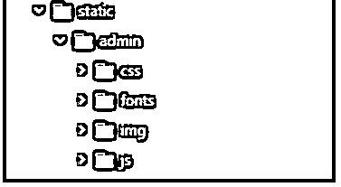
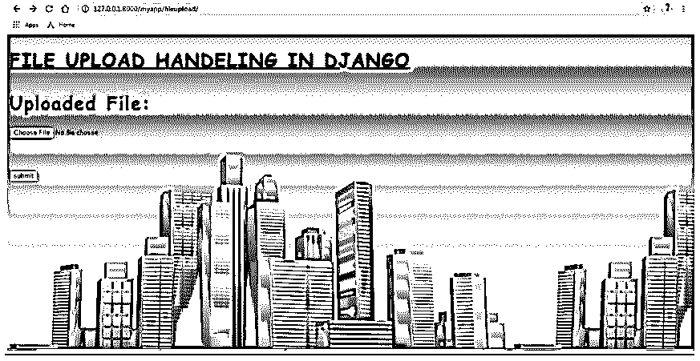
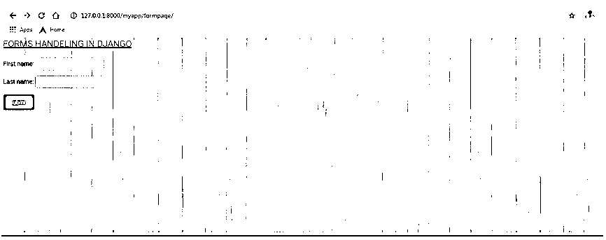

# Django 静态文件

> 原文：<https://www.educba.com/django-static-files/>

## Django 静态文件介绍

静态文件是应用程序中的图像、CSS 脚本。Django 提供了灵活的技术将这些静态文件引入到应用程序中。这种管理这些静态文件的灵活方式将有助于更好地维护应用程序的性能。django.contrib.staticfiles 负责维护 django 中的静态文件。django 静态文件在所用项目的内容管理中发挥着广泛的作用。从 Django 的角度来看，该框架提供了方便的方法，通过这些方法可以非常有效地处理这些面向文件的资源。在生产中精确地服务这些静态文件也是当前派生的 Django 框架的关键功能之一。

### Django 中静态文件是如何工作的？

让我们看看静态文件在 django 中是如何工作的？

<small>网页开发、编程语言、软件测试&其他</small>

#### 1.确保 django.contrib.staticfiles

首先，我们需要确保 django.contrib.staticfiles 作为已安装应用程序的一部分添加到 SETTINGS.py.
`INSTALLED_APPS = [
'django.contrib.admin',
'django.contrib.auth',
'django.contrib.contenttypes',
'django.contrib.sessions',
'django.contrib.messages',
'django.contrib.staticfiles',
'django.contrib.postgres',
'Django_app1'
]`

#### 2.确保静态 url

接下来，我们需要确保静态 url 被设置为“/static/”。所有的静态文件都将通过一个 url 提供给网页，这个 url 将会附加这个/static/基本上所有收集在 STATICFILES_DIRS 或者 STATIC_ROOT 中的静态文件都是网页使用这个 url
<u>访问的</u>

 <u>**SETTINGS.py:**

`STATIC_URL = '/static/'`

#### 3.确保 STATICFILES_DIRS 或 STATIC_ROOT

STATICFILES_DIRS 或 STATIC_ROOT 变量负责指出静态文件的存储路径。STATIC_ROOT 最好用在生产系统中，而 STATICFILES_DIRS 用在测试系统中。这两个变量不能在同一个 SETTINGS.py 文件中声明。

 <u>**SETTINGS.py:**

`STATICFILES_DIRS = [os.path.join(BASE_DIR, 'static'), ] #STATIC_ROOT = os.path.join(BASE_DIR, 'static')`

#### 4.Python manage.py 采集静态命令

该命令用于收集系统中的所有静态文件，并将它们与静态目录相关联。

`python manage.py collectstatic`

#### 5.模板文件更改

最后，必须在模板文件中进行以下更改。这些更改将在渲染过程中加载模板文件中的静态文件。

*   所有这些变化都与 html 文件的头部分有关。
*   在模板头部分添加静态文件加载命令。



*   以上更改将成功地从静态文件夹中提取静态文件。

### Django 静态文件的例子

下面是一些例子:

#### 示例#1

**css 文件:**

`STATICFILES_DIRS = [os.path.join(BASE_DIR, 'static'), ] #STATIC_ROOT = os.path.join(BASE_DIR, 'static') body {
font-family: "Comic Sans MS", cursive, sans-serif;
font-size: 36px;
letter-spacing: 2px;
word-spacing: 1.8px;
color: #02071C;
font-weight: 700;
text-decoration: none;
font-style: normal;
font-variant: normal;
text-transform: capitalize;
}
h1 {
font-family: "Comic Sans MS", cursive, sans-serif;
font-size: 34px;
letter-spacing: 2px;
word-spacing: 1.8px;
color: #02071C;
font-weight: 650;
text-decoration: none;
font-style: normal;
font-variant: normal;
text-transform: capitalize;
}
h2 {
font-family: "Comic Sans MS", cursive, sans-serif;
font-size: 32px;
letter-spacing: 1px;
word-spacing: 2.0px;
color: #02071C;
font-weight: 600;
text-decoration: none;
font-style: normal;
font-variant: normal;
text-transform: capitalize;
}
h3{
font-family: "Comic Sans MS", cursive, sans-serif;
font-size: 30px;
letter-spacing: 1px;
word-spacing: 2.1px;
color: #02071C;
font-weight: 400;
text-decoration: none;
font-style: normal;
font-variant: normal;
text-transform: capitalize;
}`

**图像位置:**

**文件处理. html:**

`<!DOCTYPE html>
<html lang="en" dir="ltr">
<head>
<meta charset="utf-8">
<title>Django App1</title>

<link href="" rel="stylesheet">

</head>
<body>
<h1> <u> FILE UPLOAD HANDELING IN DJANGO </u> </h1>

<ul>

<li>{{ message }}</li>

</ul>


<form method =  'POST' enctype="multipart/form-data">
{{ file.as_p }}

<input type="submit" class="btn btn-primary" value="submit">
</form>

</body>
</html>`

**输出:**

#### 实施例 2

**css 文件:**

`@import url(fonts.css);
body {
margin: 0;
padding: 0;
font-size: 45px;
font-family: "Roboto","Lucida Grande","DejaVu Sans","Bitstream Vera Sans",Verdana,Arial,sans-serif;
color: grey;
background: #fff;
}
a:link, a:visited {
color: #447e9b;
text-decoration: none;
}
a:focus, a:hover {
color: #036;
}
a:focus {
text-decoration: underline;
}
a img {
border: none;
}
a.section:link, a.section:visited {
color: #fff;
text-decoration: none;
}
a.section:focus, a.section:hover {
text-decoration: underline;
}
/* GLOBAL DEFAULTS */
p, ol, ul, dl {
margin:.2em 0.8em 0;
}
p {
padding: 0;
line-height: 140%;
}
h1,h2,h3,h4,h5 {
font-weight: bold;
}
h1 {
margin: 0 0 20px;
font-weight: 300;
font-size: 20px;
color: #666;
}
h2 {
font-size: 16px;
margin: 1em 0.5em 0;
}
h2.subhead {
font-weight: normal;
margin-top: 0;
}
h3 {
font-size: 14px;
margin:.8em 0.3em 0;
color: #666;
font-weight: bold;
}
h4 {
font-size: 12px;
margin: 1em 0.8em 0;
padding-bottom: 3px;
}
h5 {
font-size: 10px;
margin: 1.5em 0.5em 0;
color: #666;
text-transform: uppercase;
letter-spacing: 1px;
}
ul li {
list-style-type: square;
padding: 1px 0;
}
li ul {
margin-bottom: 0;
}
li, dt, dd {
font-size: 13px;
line-height: 20px;
}
dt {
font-weight: bold;
margin-top: 4px;
}
dd {
margin-left: 0;
}
form {
margin: 0;
padding: 0;
}
fieldset {
margin: 0;
padding: 0;
border: none;
border-top: 1px solid #eee;
}
blockquote {
font-size: 11px;
color: #777;
margin-left: 2px;
padding-left: 10px;
border-left: 5px solid #ddd;
}
code, pre {
font-family: "Bitstream Vera Sans Mono", Monaco, "Courier New", Courier, monospace;
color: #666;
font-size: 12px;
}
pre.literal-block {
margin: 10px;
background: #eee;
padding: 6px 8px;
}
code strong {
color: #930;
}`

**formhandeling.html:**

`<!DOCTYPE html>
<html lang="en" dir="ltr">
<head>
<meta charset="utf-8">
<title>Django App1</title>

<link href="" rel="stylesheet">

</head>
<body>
<h1> <u> FORMS HANDELING IN DJANGO </u> </h1>

<form method =  'GET'>
{{ form.as_p }}

<input type="submit" class="btn btn-primary" value="submit">
</form>

<ul class="messages">

<li class="{{ message.tags }}">{{ message }}</li>

</ul>
</body>
</html>`

**输出:**

### 推荐文章

这是 Django 静态文件的指南。在这里，我们还讨论了 Django 中静态文件的介绍和工作原理，以及不同的例子和代码实现。您也可以看看以下文章，了解更多信息–

1.  [姜戈回应](https://www.educba.com/django-response/)
2.  [姜戈会议](https://www.educba.com/django-session/)
3.  [Django 过滤器查询集](https://www.educba.com/django-filter-queryset/)
4.  [姜戈邮件](https://www.educba.com/django-mail/)

</u></u>