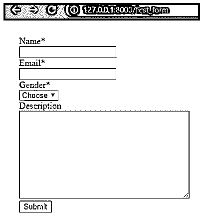
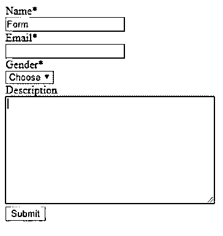
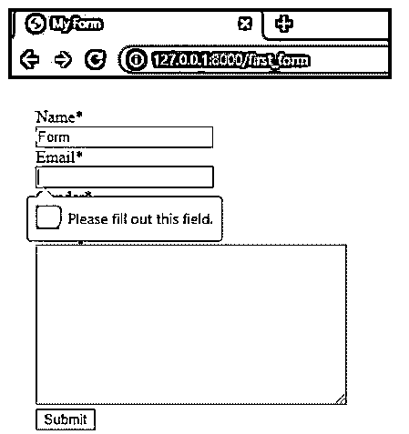
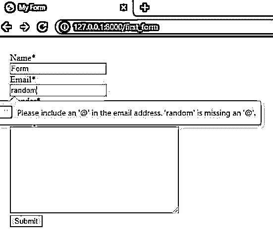
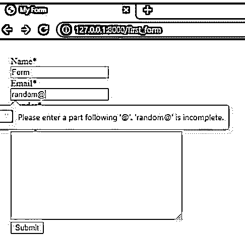
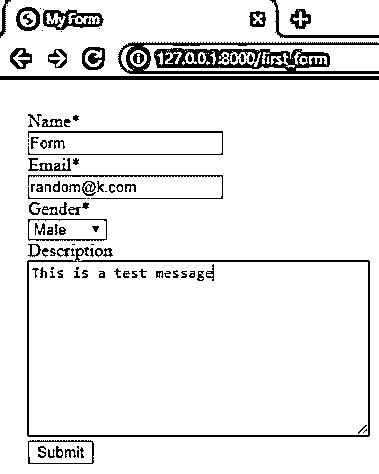
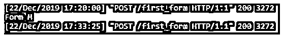

# Django 中的表单验证

> 原文：<https://www.educba.com/form-validation-in-django/>

## Django 中的表单验证介绍

下面的文章提供了 Django 中表单验证的概要。Django 是一个框架，它提供了内置的方法来验证表单中的数据。这种验证可以使用这些 Django 方法自动完成。这些只能通过使用和提交 CSRF 令牌来完成。有一些函数可以用来处理这些验证。在这里，我们可以根据需求从用户那里获取许多输入，并相应地进行表单验证。

### 表单验证

为了验证表单，我们首先需要创建一个表单，然后使用不同的验证技术来验证表单中写入的数据。为了创建表单，每个标签将对应于与必须加载的数据格式相关的数据类型。

<small>网页开发、编程语言、软件测试&其他</small>

下面给出几个例子:

*   卡菲尔德
*   电子邮件字段
*   布尔菲尔德
*   日期字段
*   德西马菲尔德
*   选择字段等。

### Django 中的表单验证示例

下面是创建表单的一个小示例:

**forms.py**

`class MyForm(forms.Form):
Name=forms.CharField()
email=forms.EmailField(label='Email')
Gender=forms.ChoiceField(choices=[(' ','Choose'),('M','Male'),('F','Female')])
Description=forms.CharField(widget=forms.Textarea,required=False)
def __init__(self, *args, **kwargs):
super().__init__(*args, **kwargs)
self.helper=FormHelper
self.helper.form_method = 'post'
self.helper.layout = Layout(
'Name','email','Gender','Description', Submit('submit','Submit',css_class='btn-success')
)`

**views.py**

`from django.shortcuts import render
from django.http import HttpResponse
from .forms import MyForm
# Create your views here.
def first_form(request):
if request.method=='POST':
form=MyForm(request.POST)
if form.is_valid():
Name=form.cleaned_data['name'] Email=form.cleaned_data['email'] Gender=form.cleaned_data['gender'] Description=form.cleaned_data['description'] print(Name,Gender)
form=MyForm()
return render(request,'form.html',{'form':form})`

**form.html**

`
<!DOCTYPE html>
<html lang="en">
<head>
<meta charset="UTF-8">
<meta name="viewport" content="width-device-width, initial-scale=1.0">
<meta http-equiv="X-UA-Compatible" content="ie=edge">
<title>My Form </title>
</head>
<body style="padding: 20px;">

</body>
</html>`

**Urls.py**

`from django.contrib import admin
from django.urls import path,include
from . import views
urlpatterns = [
path('first_form',views.first_form,name='first_form'),
]`

在 settings.py 的主项目中，我们需要添加新的应用程序名称，在 urls.py 文件中，我们也需要有一个新创建的应用程序的链接。下面我们也添加了这些文件的代码片段。

**Urls.py:项目级别**

`from django.contrib import admin
from django.urls import path,include
urlpatterns = [
path('',include('Third.urls')),
path('admin/', admin.site.urls),
]`

**Settings.py :**

我们已经添加了我们的应用程序和脆形式模块，我们已经在 forms.html 用于造型的目的。可以使用 pip 安装方法将该库添加到 Django 中。

`INSTALLED_APPS = [
'django.contrib.admin',
'django.contrib.auth',
'django.contrib.contenttypes',
'django.contrib.sessions',
'django.contrib.messages',
'django.contrib.staticfiles',
'Third',
'crispy_forms'
]`

可以使用表单模型和表单 html 文件来创建表单，同时还可以使用模型功能。这里我们已经使用表单完成了。

观察时，我们可以看到在编写的视图文件中，有我们在这里使用的表单验证器方法。

`cleaned_data[‘field_name’]`

这是验证的重要方法之一。这将包含从表单接收的已清理数据。这意味着我们为特定的变量指定了特定的数据类型，这有助于数据的存储。我们甚至可以提出定制的错误。

主要部分，其中清理的数据函数，合并在函数 is_valid 下。

**语法:**

`form.is_valid()`

该函数用于验证整个表单数据。表单中上传的任何内容都可以使用上面声明的函数进行验证。该验证将返回验证完整表单数据类型的布尔表达式。

**上述代码的输出:**

让我们检查一下这个简单表单中出现的不同错误。

给出名称后，如果我们简单地点击提交，如下所示:

系统将发出如下错误提示:

正如我们所提到的上述强制字段，我们得到警告，这些字段必须填写。

现在关于电子邮件功能，如果我们直接给出一些随机的字母，让我们看看会得到什么。

现在，如果我们也包含“@”符号，如果我们不指定任何域名(不一定是正确的)，我们仍然会得到一个错误。

因此，在给出如下所有细节后:

可以填写任何内容，也可以将描述部分留空，因为它不是必填字段。点击提交后，我们可以在我们的 python 模块中得到下面的代码输出。

在编写代码时，我们希望打印姓名和性别——这就是我们在 python 开发 shell 中打印的内容。我们有所有这些 python 文件之间的链接。Form.py 文件与 views.py 文件有链接，而这两个文件又与模板中的 html 文件有链接。众所周知，我们必须拥有与 urls.py 和 views.py 的链接，才能通过 http web URL 显示 UI 级别的输出。这是在生成表单和执行表单验证时编写的所有 python 文件的基本流程。

为了处理表单，我们甚至有像验证器这样的属性。这些用于对表单进行模型级更改的情况。甚至对于引发自定义错误，也可以通过引发 ValidationError 函数来完成。这些是 Django 中默认提供的用于不同表单验证的函数。有了这些，我们甚至可以编写单独的函数来对表单进行不同的验证。

### 结论

这就是我们如何在 Django 中拥有不同的表单验证。我们又创建了一个简单的表单，使用这些 python 文件添加了我们的内置验证，并链接它们来创建完美的表单验证。可以进行许多级别的验证。但是在这里，我们已经创建了一个表单，并对它进行了基本的验证。我们已经在上面提到的同一个例子中介绍了两种方法。正如已经列出的，我们可以使用 Models by models.py python 文件创建表单，并包含所有需要的定制验证。

### 推荐文章

这是 Django 中表单验证的指南。这里我们讨论介绍、表单验证和示例。您也可以看看以下文章，了解更多信息–

1.  [Django 建筑公司](https://www.educba.com/django-architecture/)
2.  Django 的应用
3.  Django 的用途
4.  [姜戈饼干](https://www.educba.com/django-cookies/)

