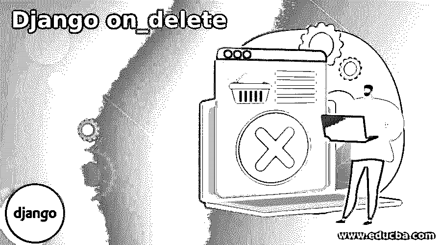
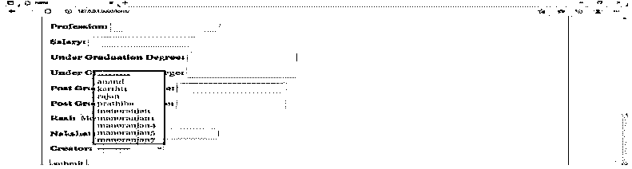
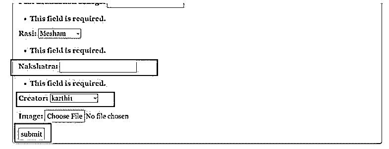
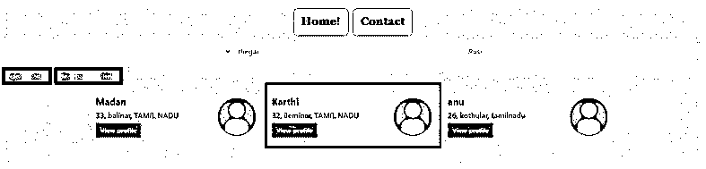

# 姜戈 on_delete

> 原文：<https://www.educba.com/django-on_delete/>

## 姜戈简介 on_delete

下面的文章提供了 Django on_delete 的概要。Django 的一个主要优势是它能够修改数据库。基于 Django 框架的应用程序的后端可以非常灵活地处理，所有过程，如数据库添加、删除，甚至更新，都可以通过 Django 模型非常灵活地执行。数据库中的变化也可以以一种容易和简单的方式与模型集成。on delete 是控制 Django 提供的灵活性的参数之一。这是在 Django 中建立关系时放置的参数之一，这意味着 on delete 函数允许灵活地操作外键。

因此，每当出现类似外键的概念时，这些 on delete 参数都应该被声明为外键中使用的参数之一。这些 ondelete 参数决定删除引用的对象或父值时是否必须进行删除或需要遵循什么。这意味着当引用的 foreignkey 值被删除时，需要对引用主键的表产生的影响是 Django delete 参数中提到的上下文。像这样的选项为面向数据库的操作提供了很大程度的灵活性。

<small>网页开发、编程语言、软件测试&其他</small>

### Django on_delete 的语法

下面给出了 Django on_delete 的语法:

`Field Name = models.ForeignKey(WASD, on_delete = OPERATION TYPE)`

*   此处最左边的值表示将要在引用中创建的字段，这意味着该字段将用于在后台引用该操作，因此这里需要提到用作引用字段的字段或用于从父字段提取数据的字段。这将是通过框架进一步引用的字段。在数据库术语中，左边给出的字段将作为继承外键字段值的字段。
*   接下来是模特。Foreignkey 是提到这个操作是外键创建操作的函数。这个函数调用是必须使用的项目。它提到了在本节中还将创建一个外键。该语法意味着从模型程序中调用和使用外键函数。参数必须放在这些函数名的旁边。从 Django 的角度来看，这个函数调用是预定义的函数调用。让我们进一步讨论使用的论点。
*   在模特之后。Foreignkey 函数调用需要提到函数的参数。这就是 on_delete 方法发挥作用的地方。首先，WASD 参数表示预期被继承的外键，接下来将使用 on_delete 函数。on_delete 函数将把它等同于与之相关联的各种选项。

### on_delete 选项

on_delete 参数的各种选项如下所示:

#### 1.串联

当 on_delete 参数设置为 cascade 时，删除被引用对象将对被引用对象产生重大影响。这意味着当引用的对象从数据库中删除时，该对象的所有条目也将从整个数据库中删除。这就是级联选项在后台的工作方式。因此，就级联选项而言，对数据完整性有一些影响。

#### 2.保护

PROTECT 与 cascade 选项正好相反，在这里，如果对实际对象有影响，则不会删除被引用对象上的所有数据实例。因此，不会发生删除。这使得数据在被引用对象上的删除处理之前受到保护。

#### 3.限制

RESTRICT 与 PROTECT 选项非常相似，它做的工作与 deletion 选项一样。这里唯一的区别是，当删除的目标是被引用的对象时，ON_DELETE 将引发一个名为 RestrictedError 的错误。但是当引用对象和作为被引用对象的对象被分配了对不同公共对象的引用时，限制将允许删除发生。

#### 4\. SET_NULL

该选项的功能与名称所暗示的一样，当被引用对象发生删除时，引用对象的值将被更新为 NULL。因此将为引用对象放置一个空值。这就是 SET NULL 的基本操作方式。

#### 5.设置默认值

该选项的功能与名称所暗示的相同，当被引用对象发生删除时，引用对象的值将被更新为分配给它的默认值，因此引用对象的所有实例都将被分配此默认值。因此将为引用对象设置一个默认值。这是默认设置的基本操作方式。

### 创建 Django on_delete 参数

下面给出了创建 Django on_delete 的参数:

**Models.py 文件中的变更:**应用于 models . py 文件的变更描述如下:这些变化将反映在所用表单的前端。

这里使用了两个不同的 ondelete 参数，即 RESTRICT 和 CASCADE 选项。

**举例:**

(models.py)

**代码:**

`from django.db import models
from django.contrib.auth.models import User
# Model variables
# Create your models here.
class Bride(models.Model):
models.CharField(max_length=200,null=True)
…..
Example_Post_Graduation_college = models.CharField(max_length=400,null=True)
Example_Rasi = models.CharField(max_length=200,null=True)
Example_Nakshatra = models.ForeignKey(User, null=True, on_delete=models.RESTRICT)
Example_Creator = models.ForeignKey(User, null=True, on_delete=models.CASCADE)
def __str__(self):
return self.name`

**输出:**

**说明:**

*   我们可以注意到，当在记录 karthi 的创建者上调用删除时，由于使用了 RESTRICT 参数，这并不意味着记录被放在用户表上。

### 结论

本文提到了如何灵活地使用 on_delete 这样的选项来灵活地删除记录，并控制删除对所涉及的引用记录的影响。这是与 Django 应用程序相关的数据库操作的主要优点之一。

### 推荐文章

这是 Django on_delete 的指南。这里我们讨论一下简介，on_delete 选项并创建一个 Django on_delete 参数。您也可以看看以下文章，了解更多信息–

1.  [姜戈集团由](https://www.educba.com/django-group-by/)
2.  [姜戈回应](https://www.educba.com/django-response/)
3.  [Django 静态文件](https://www.educba.com/django-static-files/)
4.  [姜戈邮件](https://www.educba.com/django-mail/)

