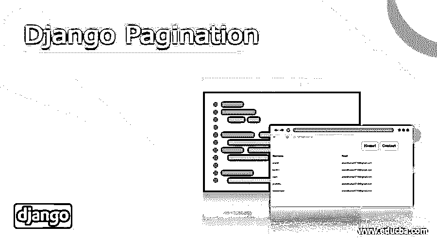
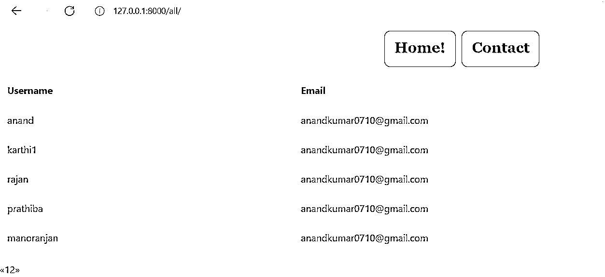

# 决哥分页

> 原文：<https://www.educba.com/django-pagination/>

## Django 分页介绍

分页用于设置页面和显示页面。它有助于设置页数。django.core.paginator 用于声明分页器。分页有助于设置页面细节和使用的总页数。所以可以使用分页的过程。分页允许声明关联的页面和与之关联的页面。Django 生成内置分页包的能力是在 Django 设置中设计页面的一个关键优势。分页是声明项的有效方法之一。用于分页过程的导入代码更改部分位于所有用户部分。

**语法:**

<small>网页开发、编程语言、软件测试&其他</small>

`Table_object = Table_name.objects.all()
Paginator_object = Paginator(Table_object, page_number)
Page_object = paginator.page(paginator_object)`

### 分页是如何工作的？

*   检索要显示到变量中的对象。所以所有的对象都将被检索到指定的变量中。
*   声明一个 paginator 对象，并设置要在对象声明中显示的页数和对象。
*   将页面细节分配给一个呈现变量，并将该呈现变量传递给 HTML 模板。这将使网页显示在网址中。对象的检索和设置变量。

### Django 分页示例

以下是 django 分页的示例:

#### 1.(Forms.py)

表单文件将包含所有要声明的字段。这些与 forms.py 文件相关联的字段将包含所有需要成为表声明一部分的字段。像这样的一列将负责显示。

`from django import forms
from. models import Bride
from django.contrib.auth.forms import UserCreationForm
from django.contrib.auth.models import User
from django.core.exceptions import ValidationError
# Create your forms here.
Rasi_CHOICES =(
("1", "Mesham"),
("2", "Rishabam"),
("3", "Mithunam"),
("4", "Kadakam"),
("5", "Simmam"),
("6", "Kanni"),
("7", "Thulam"),
("8", "Viruchikam"),
("9", "Thanusu"),
("10", "Makaram"),
("10", "Kumbam"),
("10", "Meenam"),
)
State_Choices = (
("1", "Mesham"),
("1", "Mesham"))
class Valueform(forms.ModelForm):
Rasi = forms.ChoiceField(choices = Rasi_CHOICES)
class Meta:
model = Bride
fields = "__all__"
class NewUserForm(UserCreationForm):
email = forms.EmailField(required=True,error_messages={'required': 'Please enter your name'})
def clean(self):
cleaned_data = super(NewUserForm, self).clean()
email_passed = cleaned_data.get("email")
if not "gmail.com" in email_passed:
print("came here")
raise forms.ValidationError("Sorry, the email submitted is invalid. All emails have to be registered on this domain only.")
return email_passed
class Meta:
model = User
fields = ("username", "email", "password1", "password2")
def save(self, commit=True):
user = super(NewUserForm, self).save(commit=False)
user.email = self.cleaned_data['email'] if commit:
user.save()
return user`

#### 2.(models.py)

模型文件将包含所有要声明的字段。这些与 models.py 文件相关联的字段将包含所有需要成为表声明一部分的字段。像这样的列将负责显示。

`from django.db import models
from django.contrib.auth.models import User
# Model variables
# Create your models here.
class Bride(models.Model):
Django_Paginators_Example_name = models.CharField(max_length=200,null=True)
Django_Paginators_Example_thegai = models.CharField(max_length=200,null=True)
Django_Paginators_Example_State =  models.CharField(max_length=50,null=True)
Django_Paginators_Example_District = models.CharField(max_length=50,null=True)
Django_Paginators_Example_Address = models.TextField(null=True)
Django_Paginators_Example_Phone = models.BigInteger_Example_Field(null=True)
Django_Paginators_Example_profession = models.CharField(max_length=200,null=True)
Django_Paginators_Example_salary = models.BigInteger_Example_Field(null=True)
Django_Paginators_Example_Under_Graduation_Degree = models.CharField(max_length=200,null=True)
Django_Paginators_Example_Under_Graduation_college = models.CharField(max_length=400,null=True)
Django_Paginators_Example_Post_Graduation_Degree = models.CharField(max_length=200,null=True)
Django_Paginators_Example_Post_Graduation_college = models.CharField(max_length=400,null=True)
Django_Paginators_Example_Rasi = models.CharField(max_length=200,null=True)
Django_Paginators_Example_Nakshatra = models.CharField(max_length=200,null=True)
def __str__(self):
return self.name`

#### 3.Views.py

用于分页过程的导入代码更改部分位于所有用户部分。这里，期望显示对象或元素的表的内容被检索到一个对象中。因此，将检索所有的对象条目。然后创建分页器对象。paginator 对象定义了正在使用的页面。因此，将创建一个页面对象。页面对象将与表格对象和要关联的页数相关联。因此，总页数和表细节将在 paginator 类中声明。这是分页过程中非常重要的一部分。

`def All_users(request):
User_entries =  User.objects.all()
page = request.GET.get('page', 1)
paginator = Paginator(User_entries, 5)
users = paginator.page(page)
print(" Has other pages : ",users.has_other_pages())
print(" Has next page : ",users.has_next())
print(" Has previous page : ",users.has_previous())
print(" Has previous page : ",users.has_previous())
print(" Start Index : ",users.start_index())
print(" End Index : ",users.end_index())
if users.has_next():
print(" Next page Number: ",users.next_page_number())
elif users.has_previous():
print(" Has Previous page Number: ",users.previous_page_number())
print(paginator,users)
return render(request,"All_users.html",{'users':users})`

#### 4.超文本标记语言

下面是对分页的 HTML 更改，该过程包括从引用表中用用户名和电子邮件声明一个表结构。接下来，列出了用于将页面设置为可移动对象的代码部分。这里，第二部分允许在页面之间灵活移动。第一部分提到了页面的内容。

`<html style="font-size: 16px;">
<head>
<title>Home</title>

<link rel="stylesheet" href="" media="screen">
<meta name="viewport" content="width=device-width, initial-scale=1, maximum-scale=1, minimum-scale=1" . . .  />
<link rel="stylesheet" href="https://stackpath.bootstrapcdn.com/bootstrap/4.4.1/css/bootstrap.min.css" integrity="sha384-Vkoo8x4CGsO3+Hhxv8T/Q5PaXtkKtu6ug5TOeNV6gBiFeWPGFN9MuhOf23Q9Ifjh" crossorigin="anonymous">
<!-- - -  Script -- - - >

</head>
<body class="body">
<nav class='navbar'>

<a class="navbar" onclick="redirect2()" >Home! </a>
<a class="navbar" onclick="redirect2()" >Contact</a>

</nav>
<table class="table table-bordered">
<thead>
<tr>
<th>Username</th>
<th>Email</th>
</tr>
</thead>
<tbody>

<tr>
<td>{{ user.username }}</td>
<td>{{ user.email }}</td>
</tr>

</tbody>
</table>
<body>

</body>
</html>`

**输出:**

### 结论

所以，分页在 Django 中是一个被很好分配的过程。Django 的分页过程有助于 Django 设置中页面的平滑声明。这有助于以非常灵活的方式设置和访问页面。这是 Django 进程的主要优势之一。

### 推荐文章

这是 Django 分页指南。在这里，我们还讨论了介绍和分页是如何工作的？以及不同的示例及其代码实现。您也可以看看以下文章，了解更多信息–

1.  [姜戈集团由](https://www.educba.com/django-group-by/)
2.  [Django 静态文件](https://www.educba.com/django-static-files/)
3.  [姜戈回应](https://www.educba.com/django-response/)
4.  [姜戈邮件](https://www.educba.com/django-mail/)

