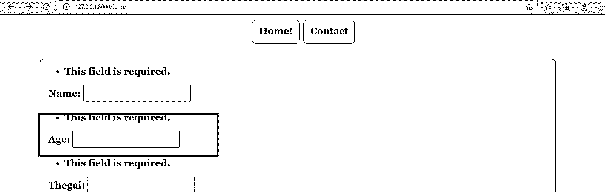
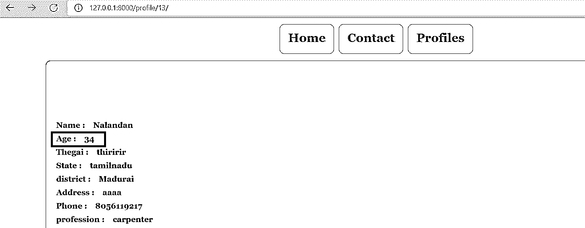

# Django 获取或创建字段

> 原文：<https://www.educba.com/django-get_or_create-field/>

## Django Get_or_Create 字段介绍

在某些情况下，可能会出现对象或值未被默认传递的情况。因此，在这些情况下，当值不是从用户或上游传递时，将需要从源获取值，在该情况下，当值不是从源导出时，则可能需要创建值。因此，这些实例当值被期望检索时，将使用 get 或 create。当 get 不返回任何值时，get 或 create 方法将创建给定值。

**语法:**

<small>网页开发、编程语言、软件测试&其他</small>

`Object_Name = model_name.objects.Get_or_CreateField(values)`

要创建的对象被放置在最左侧。所以最左边的项目将是对象。然后放置需要在 get 或 create 上触发对象的模型。get 或 create 的值必须在 arguments 区域中关联。get 或 create 之类的方法在声明对象和实例化对象的值时提供了很大的灵活性。这些是 GetorCreate 函数的优点。

### 如何获得或创作作品？

获取或创作作品的方式非常有趣。实际上，get 或 create 基本上涉及一个 get 调用。将基于该值触发 get 进程。当初始 get()本身返回预期值时，将返回一个带有布尔值 false 的元组。当调用返回多个对象时，将引发 Multipleobjects returned 错误。当出现未找到对象的情况时，get_or_create 将实例化一个保存新对象进程，该进程将返回一个元组和一个布尔值 True。因此，新值将按预期存储，get 或 create 将被实例化。

### 创建一个 Django Get_Or_Create 字段

创建 Django Get_Or_Create 字段解释如下:

#### 1.Models.py 文件中的更改

如语法部分所述，Get_or_Create 字段需要在 models.py 文件中声明。我们可以注意到 Get_or_Create 字段在模型中被声明为 age 字段。

**(模型. py)**

`from django.db import models
from django.contrib.auth.models import User
# Model variables
# Create your models here.
class Bride(models.Model):
Get_or_create_Example__Example_name = models.CharField(max_length=200,null=True)
Get_or_create_Example__Example_age = models.Get_or_create_Example_Field(null=True)
Get_or_create_Example__Example_thegai = models.CharField(max_length=200,null=True)
Get_or_create_Example__Example_State =  models.CharField(max_length=50,null=True)
Get_or_create_Example__Example_District = models.CharField(max_length=50,null=True)
Get_or_create_Example__Example_Address = models.TextField(null=True)
Get_or_create_Example__Example_Phone = models.BigGet_or_create_Example_Field(null=True)
Get_or_create_Example__Example_profession = models.CharField(max_length=200,null=True)
Get_or_create_Example__Example_salary = models.BigGet_or_create_Example_Field(null=True)
Get_or_create_Example__Example_Under_Graduation_Degree = models.CharField(max_length=200,null=True)
Get_or_create_Example__Example_Under_Graduation_college = models.CharField(max_length=400,null=True)
Get_or_create_Example__Example_Post_Graduation_Degree = models.CharField(max_length=200,null=True)
Get_or_create_Example__Example_Post_Graduation_college = models.CharField(max_length=400,null=True)
Get_or_create_Example__Example_Rasi = models.CharField(max_length=200,null=True)
Get_or_create_Example__Example_Nakshatra = models.CharField(max_length=200,null=True)
def __str__(self):
return self.name`

#### 2.Settings.py 文件中的更改

确保在 settings.py 记录中很好地设置了所有值和数据库连接，以便可以灵活地执行任务。下所述的中间件对象必须在 settings.py 记录中很好地声明，因为这些中心软件在处理 GET 和 PUT 消息的同时也要对软件的功能收费。此外，所使用的模板需要额外的填充，以便模板处理在后台进行。

**(Settings.py):**

`MIDDLEWARE = [
'django.middleware.security.SecurityMiddleware',
'django.contrib.sessions.middleware.SessionMiddleware',
'django.middleware.common.CommonMiddleware',
'django.middleware.csrf.CsrfViewMiddleware',
'django.contrib.auth.middleware.AuthenticationMiddleware',
'django.contrib.messages.middleware.MessageMiddleware',
'django.middleware.clickjacking.XFrameOptionsMiddleware',
] ROOT_URLCONF = 'Matrimony.urls'
TEMPLATES = [
{
'BACKEND': 'django.template.backends.django.DjangoTemplates',
'DIRS': [Template_DIR,],
'APP_DIRS': True,
'OPTIONS': {
'render_dict_processors': [
'django.template.render_dict_processors.debug',
'django.template.render_dict_processors.request',
'django.contrib.auth.render_dict_processors.auth',
'django.contrib.messages.render_dict_processors.messages',
],
},
},
]`

#### 3.url.py 文件中的更改

媒体根和文档根变量需要在 url.py 文件中实例化，如下所示。url.py 文件的更改如下所述。

**url.py:**

`from django.contrib import admin
from django.urls import path
from django.conf.urls import url
from matrimony_pages import views
from django.conf import settings
from django.conf.urls.static import static
urlpatterns = [
url(r'^$',views.Welcome_page,name='Welcome_page'),
url(r'Mainpage/',views.Main_page,name='Main_page'),
url(r'form/',views.form_view,name='form_view'),
url(r"signup/", views.Sign_up_request, name="register"),
url(r"login/", views.login_request, name="login"),
path(r'profile/<str:pk>/',views.Get_or_create_Example_page,name='profile'),
url(r'logout/',views.logout_request,name='logout'),
url(r'reg/',views.Get_or_create_Example_reg_user,name='reg'),
path(r'update/<str:pk>/',views.form_update,name='update'),
path('admin/', admin.site.urls),
]+ static(settings.MEDIA_URL,document_root=settings.MEDIA_ROOT)`

#### 3.为表单创建视图

Get_or_Create 费用在提交时必须保存，在检索时必须从数据库中提取。这可以通过为模型创建的项目来执行。在 under given views.py 部分中定义了这样做的方式。

**Ex: views.py**

`@login_required
def Get_or_create_Example_page(request,pk):
dict_to_render = {}
Get_or_create_key_variable_ = Bride.objects.get(id=pk)
Get_or_create_Example_name =  Get_or_create_key_variable_.name
Get_or_create_Example_Age =  Bride.objects.get_or_create(first_name='Nalandan', last_name='Ranjan',defaults={'birthday': date(1990, 10, 9)})
Get_or_create_Example_Thegai =  Get_or_create_key_variable_.thegai
Get_or_create_Example_state =  Get_or_create_key_variable_.State
Get_or_create_Example_district =  Get_or_create_key_variable_.District
Get_or_create_Example_Address =  Get_or_create_key_variable_.Address
Get_or_create_Example_Phone =  Get_or_create_key_variable_.Phone
Get_or_create_Example_Profession =  Get_or_create_key_variable_.profession
Get_or_create_Example_Salary =  Get_or_create_key_variable_.salary
Get_or_create_Example_UG =  Get_or_create_key_variable_.Under_Graduation_Degree
Get_or_create_Example_UGC =  Get_or_create_key_variable_.Under_Graduation_college
Get_or_create_Example_PG =  Get_or_create_key_variable_.Post_Graduation_Degree
Get_or_create_Example_PGC =  Get_or_create_key_variable_.Post_Graduation_college
Get_or_create_Example_UG =  Get_or_create_key_variable_.Under_Graduation_Degree
Get_or_create_Example_UGC =  Get_or_create_key_variable_.Under_Graduation_college
Get_or_create_Example_PG =  Get_or_create_key_variable_.Post_Graduation_Degree
Get_or_create_Example_PGC =  Get_or_create_key_variable_.Post_Graduation_college
Get_or_create_Example_Rasi =  Get_or_create_key_variable_.Rasi
Get_or_create_Example_Nakshatra =  Get_or_create_key_variable_.Nakshatra
dict_to_render['Age'] = Get_or_create_Example_Age
dict_to_render['name'] = Get_or_create_Example_name
dict_to_render['thegai'] = Get_or_create_Example_Thegai
dict_to_render['State'] = Get_or_create_Example_state
dict_to_render['district'] = Get_or_create_Example_district
dict_to_render['Address'] = Get_or_create_Example_Address
dict_to_render['Phone'] = Get_or_create_Example_Phone
dict_to_render['profession'] = Get_or_create_Example_Profession
dict_to_render['Under_Graduation_Degree'] = Get_or_create_Example_UG
dict_to_render['Under_Graduation_college'] = Get_or_create_Example_UGC
dict_to_render['Post_Graduation_Degree'] = Get_or_create_Example_PG
dict_to_render['Post_Graduation_college'] = Get_or_create_Example_PGC
dict_to_render['Rasi'] = Get_or_create_Example_Rasi
dict_to_render['Nakshatra'] = Get_or_create_Example_Nakshatra
print(Get_or_create_key_variable_.Creator)
print(dict_to_render)
return  render(request,'Profilepage.html',dict_to_render)`

#### 4.为显示表单制定一个 HTML 文件

必须对 HTML 页面进行相应的更改。

**Profilepage.html**

`<!DOCTYPE html>
<html style="font-size: 16px;">
<head>
<title>Profile</title>
</head>
<body class="body">
<nav class='navbar'>

<a class="navbar" onclick="redirect2()" >Home </a>
<a class="navbar" onclick="redirect2()" >Contact</a>
<a class="navbar" onclick="redirect1()" >Profiles</a>

</nav>

 






  
<h6><strong>Name :  &nbsp&nbsp {{name}}</strong></h6>
<h6><strong>Age  :  &nbsp&nbsp {{Age}}</strong></h6>
<h6><strong>Thegai : &nbsp&nbsp {{thegai}}</strong></h6>
<h6><strong>State :  &nbsp&nbsp   {{State}}</strong></h6>
<h6><strong>district  : &nbsp&nbsp {{district}}</strong></h6>
<h6><strong>Address : &nbsp&nbsp {{Address}}</strong></h6>
<h6><strong>Phone :  &nbsp&nbsp {{Phone}}</strong></h6>
<h6><strong>profession  : &nbsp&nbsp {{profession}}</strong></h6>
<h6><strong>Under Graduation Degree : &nbsp&nbsp {{Under_Graduation_Degree}}</strong></h6>
<h6><strong>Post_Graduation_Degree : &nbsp&nbsp {{Post_Graduation_Degree}}</strong></h6>
<h6><strong>Post_Graduation_college : &nbsp&nbsp {{Post_Graduation_college}}</strong></h6>
<h6><strong>Rasi  : &nbsp&nbsp  {{Rasi}}</strong></h6>
<h6><strong>Nakshatra : &nbsp&nbsp {{Nakshatra}}</strong></h6>


</script>
</body>
</html>`

**输出:**

### 结论

上面很好地说明了如何实例化 get 或 create 以及为 get 或 create 设置值的过程。get 或 create 方法中涉及的语法和编码变化在上面的文章中有深入的讨论，并附有适当的参考资料。所有代码都以详细的方式生成。

### 推荐文章

这是 Django Get_or_Create 字段的指南。在这里我们还讨论了引进和如何获得或创造作品？并附有示例。您也可以看看以下文章，了解更多信息–

1.  [姜戈集团由](https://www.educba.com/django-group-by/)
2.  [Django 静态文件](https://www.educba.com/django-static-files/)
3.  [姜戈回应](https://www.educba.com/django-response/)
4.  [姜戈会议](https://www.educba.com/django-session/)

