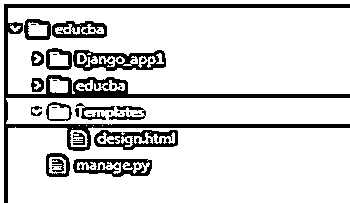
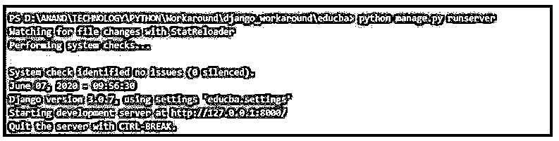
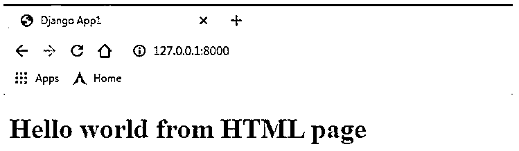
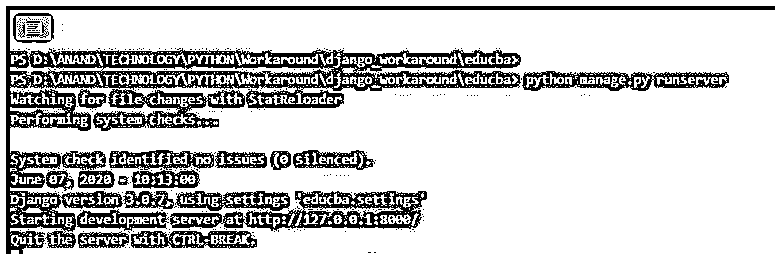
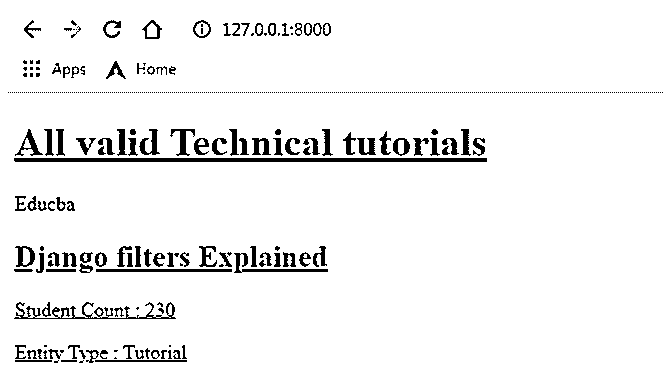

# Django 模板

> 原文：<https://www.educba.com/django-templates/>

## Django 模板介绍

为了理解和操作 Django 应用程序的流程，这些模板扮演了一个重要的角色，用 Django 设计的网页中的所有静态项目都包含了用于构建静态实体的模板。换句话说，可以说模板负责构建网页的骨架。这些模板使得 Django 的设置成为面向 MVT 的架构。其中 M 代表涉及的模型，V 代表设计的视图，T 代表模板。在标准方式下，python 设置中使用的模板是使用 Django 视图呈现的。

### 使用模板呈现 Django 视图

下面是呈现 Django 视图的模板:

<small>网页开发、编程语言、软件测试&其他</small>

#### 1.创建模板文件夹

所有与模板相关的 HTML 代码都可以放在这个文件夹中。必须在主项目文件夹下创建模板文件夹。

#### 2.**标记 settings.py 文件中的模板文件夹**

settings.py 文件用于将这些模板标记到它们的关联视图。当标记过程完成时，它允许放置在文件夹中的所有 HTML 内容都属于此模板部分。

**代码:**

`import os
# Build paths inside the project like this: os.path.join(BASE_DIR,...)
BASE_DIR = os.path.dirname(os.path.dirname(os.path.abspath(__file__)))
Template_DIR = os.path.join(BASE_DIR,'Templates')
TEMPLATES = [
{
'BACKEND': 'django.template.backends.django.DjangoTemplates',
'DIRS': [Template_DIR,],
'APP_DIRS': True,
'OPTIONS': {
'context_processors': [
'django.template.context_processors.debug',
'django.template.context_processors.request',
'django.contrib.auth.context_processors.auth',
'django.contrib.messages.context_processors.messages',
,
},
},
]Template_DIR = os.path.join(BASE_DIR,'Templates')`

为了实现 Django 模板的 API 后端，使用了后端键中的 python 路径。在 Django 中构建的一些后端有 Django . template . backends . Django . Django templates 和 Django . template . backends . jinja 2 . jinja 2。

*   模板引擎需要定位模板相关搜索文件的目录位于 DIRS 目录中。
*   而 APP_DIRS 有助于提及引擎必须在已安装的应用程序内验证模板的位置。对于应用程序中的每个子目录，由每个定义的后端提供一个常规名称。

#### 3.将 HTML 文件放在 templates 文件夹中

**代码:**

`<!DOCTYPE html>
<html lang="en" dir="ltr">
<head>
<meta charset="utf-8">
<title>Django App1</title>
</head>
<body>
<h1> Hello world from HTML page <h1>
</body>
</html>`

**语法:**

`render(request,template_name,context=None,content_type=None,status=None,using=None)`

| **。自变量** | **描述** |
| 请求 | 这用于生成响应。这是一个强制性的论点。 |
| 模板名称 | 用于此视图的模板的名称。这是一个强制性的论点。 |
| 语境 | 上下文是作为字典维护的变量名和变量值映射。默认情况下，这是一个空字典。因此，如果传递了键，就可以从字典中检索并呈现相应的值。这是一个可选参数。如果没有为上下文提供任何内容，则呈现一个空上下文。 |
| 内容类型 | 要使用的 MIME(多用途互联网邮件扩展)。默认值为“文本/html”。这是一个可选参数。 |
| 状态 | 要使用的响应代码。默认响应代码是 200。 |
| 使用 | 此参数用于表示用于加载模板的模板引擎的名称。这是一个可选参数。 |

**举例:**

**代码:**

`from django.shortcuts import render
from django.http import  HttpResponse
def index(request_iter):
return  render(request_iter,'design.html')`

#### 4.在 urls.py 文件中标记视图

这是为视图创建 url 的过程。此处提到的 url 将用于到达提到的网页。

*   从 django.conf.urls 导入库导入 url。
*   在 urlpatterns 列表中声明一个 url 条目。

url(url_path，view_to_be_tagged，name_for_this_view)

**举例:**

**代码:**

`from django.contrib import admin
from django.conf.urls import url
from Django_app1 import views
urlpatterns = [
url(r'^$',views.index,name='index'),
url(r'admin/',admin.site.urls),]`

#### 5.使用 python manage.py runserver 命令重新加载服务器，并验证网页

加载运行服务器时，下面的系统消息将在项目控制台中打印出来。该消息包含服务器启动时间、使用的 Django 版本以及服务器启动的 http 链接的详细信息。

**代码:**

`Watching for file changes with StatReloader
Performing system checks...
System check identified no issues (0 silenced).
June 10, 2020 - 11:23:00
Django version 3.0.7, using settings 'educba.settings'
Starting development server at http://127.0.0.1:8000/
Quit the server with CTRL-BREAK.`

**输出:**

### 从模板标签呈现的 Django 视图

下面给出了从模板标签呈现的 Django 视图:

1.模板标签用于向 Django 视图注入动态生成的内容。这是模板标签的关键功能之一。他们可以灵活地向文件中注入动态内容。

模板标签过滤器可以使用下列选项:

| **模板过滤器中的所有选项** |
| 增加 | addslashes | capfirst |
| 中心 | 切口 | 日期 |
| 系统默认值 | 字典排序 | 被...整除 |
| 逃跑 | 文件大小格式 | 第一 |
| 加入 | 最后的 | 长度 |
| 行号 | 降低 | 制作列表 |
| 随意 | 薄片 | slugify |
| 时间 | 时间自 | 标题 |
| 无序列表 | 上面的 | 字数 |

2.在这个例子中，我们已经将 if 标签和 filter 标签添加到模板中。

*   在 HTML 文件中添加一个模板标签。

**代码:**

`<!DOCTYPE html>
<html lang="en" dir="ltr">
<head>
<meta charset="utf-8">
<title>Django App1</title>
</head>
<body>
<h1> <u> All valid Technical tutorials </u> </h1>

{{ Entity_name }}

{{ Error_Message }}

<h2> <u> Django filters Explained <u> </h2>

 Student Count: {{ Entity_students_count | add:"230"}}  

 Entity Type: {{ Entity_type | capfirst}}  

</body>
</html></html></html>`

**举例:**

`from django.shortcuts import render
from django.http import  HttpResponse
def index(request_iter):
dict_Var =  {
"Entity_name": "Educba",
"Entity_type": "tutorial",
"Entity_students_count": 345,
"Error_Message": "No Valid Entity found"
}
return  render(request_iter,'design.html',context=dict_Var)`

3.使用 python manage.py runserver 命令重新加载服务器，并验证网页。

**输出:**

### 结论

模板的使用是 Django 在 web 开发框架中最大的能力之一。这些模板允许 Django 设置在前端和中间流之间灵活地传输动态内容。

### 推荐文章

这是 Django 模板的指南。这里我们讨论 Django 模板的介绍，使用模板来呈现 Django 视图和从模板标签呈现的 Django 视图。您也可以看看以下文章，了解更多信息–

1.  [Django 中的表单验证](https://www.educba.com/form-validation-in-django/)
2.  [姜戈饼干](https://www.educba.com/django-cookies/)
3.  [Django 建筑公司](https://www.educba.com/django-architecture/)
4.  [Django 框架](https://www.educba.com/django-framework/)

