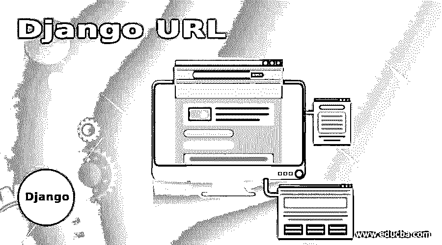
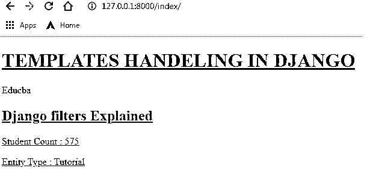
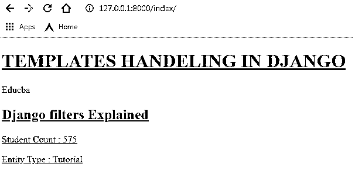
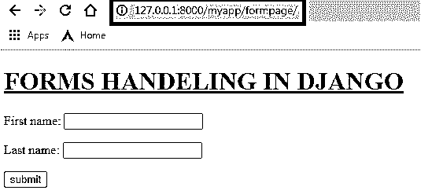
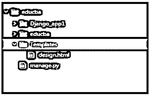
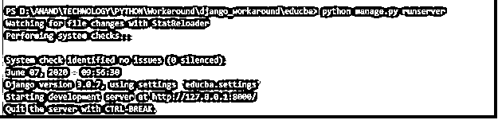
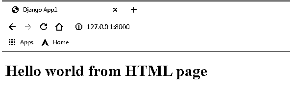

# Django URL

> 原文：<https://www.educba.com/django-url/>

## Django URL 简介

URL 是一个路径，通过它可以访问特定的基于 web 的应用程序和该 web 应用程序中的一个特定页面。因此，对于任何面向 web 的应用程序来说，设置这些 url 路径都是非常必要的。这同样适用于 Django，因此从 Django 的角度来看，在框架的 urls.py 部分处理必要的 URL，并且有几种技术可以通过应用程序维护 URL。关于可分类的 Django 如何处理它的 URL 以及保持这些 URL 集合的技术的信息将在下面描述。

### 如何创建 Django URL？

下面给出了如何创建 Django url:

<small>网页开发、编程语言、软件测试&其他</small>

#### 1.使用 PATH()创建 url

path 方法允许返回将被包含在 url 模式元组中的元素，该元素将被用作 URL 模式。这是在 Django 版中与 re_path()方法一起引入的。

**语法:**

`path(route, view, kwargs=None, name=None)`

##### 例子

**urls.py:**

`from django.contrib import admin
from django.conf.urls import url,include
from django.urls import path
from Django_app1 import views
admin.autodiscover()
urlpatterns = [
path('index/',views.template_view,name='template'),
url(r'^myapp/', include('Django_app1.urls')),
url(r'admin/', admin.site.urls),
]`

**输出:**

#### 2.使用 RE_PATH()创建 Django URL

re_path()方法允许在 URL 中使用 python 正则表达式。这是在 2.0 版中与 path()方法一起引入的。

**语法:**

`path(route, view, kwargs=None, name=None)`

##### 例子

**urls.py:**

`rom django.contrib import admin
from django.conf.urls import url,include
from django.urls import path , re_path
from Django_app1 import views
admin.autodiscover()
urlpatterns = [
re_path('^indexs??/$',views.template_view,name='template'),
url(r'^myapp/', include('Django_app1.urls')),
url(r'admin/', admin.site.urls),
]`

**输出:**

**注意:**regex 中的问号允许索引页面只加载其中提到的索引。

#### 3.通过 INCLUDE 创建 Django url

这项技术包括在每个应用程序中创建 url 模式。当应用程序需要插入不同的应用程序时，这将带来更大的灵活性。只要在主项目 urls.py 文件中包含这些 URL，就有助于轻松访问与 Django 应用程序相关的 web 页面。下面是与制作面向包含的 Django urls.py 相关的步骤。

**Django app urls.py:** 首先需要在应用程序中创建一个 urls.py 文件。因此，这意味着每个被期望作为 Django 项目的一部分开发的 Django 应用程序都被认为包含一个单独的 urls.py 文件。这个单独的 urls.py 文件将为应用程序带来灵活性，这样它们可以很容易地从主项目中插入和拔出。

与通常的 urls.py 一样，这个文件包含了从 django.conf.urls 库中导入的 URL 类，最重要的是，这个应用程序的视图文件应该从这里提到的 django 应用程序中导入。在从 Django 应用程序导入视图时，需要指定已经导入的视图方法。此外，如上面 url 声明中所提到的，这里还放置了与 URL 映射相关联的名称和映射的路径。因此，这一部分充当了单个 Django 应用程序中 urls.py 文件的公式。

`from django.contrib import admin
from django.conf.urls import url
from Django_app1 import views
urlpatterns = [
url(r'formpage/',views.formView,name='form'),
]`

**主项目 urls.py:** 这个 urls.py 文件将作为链接整个应用程序库的首要 URL。这里可以包含 Django 应用程序的所有 URL，这意味着这些应用程序中的每个页面都可以在这里复杂地访问。要注意的第一个主要元素是 include 方法是从 django.conf.urls 库中导入的。这是需要处理的第一个关键问题。接下来，确保 admin 类也被导入。这个 admin 类在设置自动发现方法时很有用。最后，需要确保 Django 应用程序中的 urls.py 文件作为一个条目包含在 urlpatterns 元组中。使其包含将自动从相应的应用程序中导入所有的 URL。

`from django.contrib import admin
from django.conf.urls import url,include
from Django_app1 import views
admin.autodiscover()
urlpatterns = [
url(r'^$',views.template_view,name='template'),
url(r'^myapp/', include('Django_app1.urls')),
url(r'admin/', admin.site.urls),
]`

**输出:**

#### 4.在 URL 中设置转换器

转换器负责将 URL 中的动态值转换成所需的值格式。

##### 例子

下面的例子展示了如何将 url 值转换成字符串格式并传递到相应的视图中。

**URLs . py:**
T0】

**Views.py:**

`from django.shortcuts import render
from django.http import  HttpResponse
from Django_app1.forms import Valueform
from django.core.exceptions import ViewDoesNotExist
from django.contrib.auth.models import User
def template_view(request_iter,uname):
template_Var =  {
"Entity_name" : "Educba",
"Entity_type"  : "tutorial",
"Entity_students_count" : 345,
"Error_Message" : "No Valid Entity found"
}
print("Username:",uname)
return  render(request_iter,'design.html',context=template_Var)`

**输出:**

#### 5.通过 URL()创建 Django URL

1.**创建模板文件夹:**首先要保存网页的 html 设计，需要创建必要的模板。这些模板存储在 template 文件夹中，所以对于一个 Django 项目来说所有的代码都是关联的。必须在主项目文件夹下创建模板文件夹。

2.**在 settings.py 文件中标记 Template 文件夹:**settings . py 文件需要有 templates 文件夹的标记，以便整个 Django 项目可以访问所有模板。这带来了访问作为模板文件夹一部分的所有 html 文件的能力。

3.**将一个 HTML 文件放在 Templates 文件夹中:**网页的 HTML 内容被起草。

`<!DOCTYPE html>
<html lang="en" dir="ltr">
<head>
<meta charset="utf-8">
<title>Django App1</title>
</head>
<body>
<h1> Hello world from HTML page <h1>
</body>
</html>`

4.**使用 render()方法渲染 views.py 中的 html 文件:**为了将新创建的 HTML 内容传递到网页，或者换句话说，为了将内容连接到网页，使用 Render()方法。render 方法将模板与上下文字典结合起来，返回一个 HttpResponse 对象。

`from django.shortcuts import render
from django.http import  HttpRespons
def index(request_iter):
return  render(request_iter,'design.html')`

*   从 django.conf.urls 导入库导入 url。
*   在 urlpatterns 列表中声明一个 url 条目。

url(url_path，view_to_be_tagged，name_for_this_view)

`from django.contrib import admin
from django.conf.urls import url
from Django_app1 import views
urlpatterns = [
url(r'^$',views.index,name='index'),
url(r'admin/', admin.site.urls), ]`

*   使用 python manage.py runserver 命令重新加载服务器，并验证网页。
*   控制台将粘贴以下列出的服务器消息，因此可以从中识别服务器启动的时间，还会显示 http 链接和所使用的 Django 服务器的版本。

`Watching for file changes with StatReloader
Performing system checks...
System check identified no issues (0 silenced).
June 23, 2020 - 13:33:00
Django version 3.0.7, using settings 'educba.settings'
Starting development server at http://127.0.0.1:8000/
Quit the server with CTRL-BREAK.`

*   使用 python manage.py runserver 命令重新加载服务器，并验证网页。

**输出:**

#### 6.Django URL 错误代码

| **错误代码** | **意为** |
| Four hundred | 错误的请求 |
| Four hundred and three | 权限被拒绝 |
| Four hundred and four | 找不到页面 |
| Five hundred | 服务器错误 |

### 推荐文章

这是一个 Django URL 的指南。在这里，我们还讨论了简介和如何创建 Django URL，以及不同的例子和代码实现。您也可以看看以下文章，了解更多信息–

1.  [姜戈饼干](https://www.educba.com/django-cookies/)
2.  Django vs Ruby On Rails
3.  WordPress vs Django
4.  姜戈 vs 拉腊维尔

