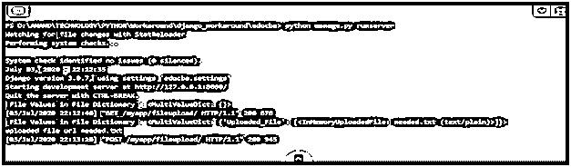
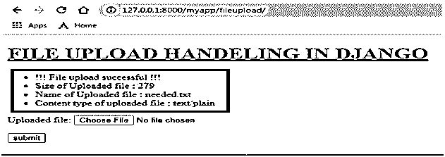

# Django 文件上传

> 原文：<https://www.educba.com/django-file-upload/>

## Django 文件上传简介

每个 web 应用程序都会有表单处理，上传文件作为表单处理的一部分是非常常见的操作。作为表单处理的一部分，上传这些文件的方法至关重要。Django 中的文件上传处理讨论了作为 Django 中文件级处理一部分的所有方法。上传的文件可以被检索、处理、存储等。像存储和文件系统存储这样的库在文件上传过程中对存储级的需求非常有帮助。Django 中用于文件上传的这些文件字段是从 Django 框架的表单处理部分发展而来的。

**设置文件上传**

<small>网页开发、编程语言、软件测试&其他</small>

当一个文件被上传到 Django 时，这个文件通过 request 被标记到请求中。文件[]。Thes 请求。文件负责捕获正在上传的文件详细信息，并在其中标记这些信息。需要从该请求中检索上传文件的详细信息和内容。Files[]部分，然后通过提及请求来进一步处理。文件参考文件名，这将创建对象，该对象在文件设置和存储过程中更像是基于文件的对象。关于文件的所有细节都可以从这个基于文件的对象中提取。

### 如何上传 Django 文件？

基本上，文件上传过程由以下主要步骤组成，以下衍生步骤是在 Django 中如何实现文件上传期间的文件处理的逐步过程。

**1。**在 Forms.py 文件中声明文件字段。这是更关键的部分，因为该字段将被用作表示模板中用于处理表单的文件的参考。这里表单库用于导入 FileField()类，为这些元素创建的对象将充当文件字段的对象。在下面的示例中，它被表示为“uploaded_File”。

`#-*- coding: utf-8 -*-
from django import forms
class fileform(forms.Form):
Uploaded_File = forms.FileField()`

**2。**创建用于处理文件的视图，该视图是渲染和处理文件的最关键部分，这里上面创建的字段将是在创建该视图时需要考虑的以下要点。

**3。**上传的文件将被标记为请求的一部分。文件，所有关于文件和文件本身的细节都可以使用这个请求来处理。文件部分。该文件可以通过下面的行被捕获到基于文件的对象中，

`uploaded_file = request.FILES['Uploaded_File']`

**4。**要访问文件和有关文件的详细信息，可使用以下方法，因此对文件的所有操作，如确定文件大小、确定文件名称、识别标记到所请求文件的文件内容类型，甚至读取文件，均可通过这些方法完成，还有一些名为 chunks 的方法，可用于将文件读取为较小的块。

**5。**Django 文件上传的方法

下面是 Django 文件上传的方法及其描述:

| **方法** | **描述** |
| UploadedFile.name | 显示上传文件的名称。 |
| UploadedFile.size | 显示上传文件的大小。 |
| 上传文件.内容类型 | 提到文件正在处理的内容类型。 |
| 上传文件.内容类型额外 | 提到与内容类型相关联的附加标题。 |
| UploadedFile.charset | 提到浏览器提供的字符集 |
| UploadedFile.read() | 此方法用于从文件中读取全部数据。 |

**6。FileSystemStorage 类可用于在本地区域的文件系统上执行基本的文件存储操作。**

**语法:**

FileSystemStorage(位置、基本 url、文件权限模式、目录权限模式)。

| **自变量** | **描述** |
| 位置 | 这表示存储文件的目录 |
| base_url | 文件存储位置的 URL |
| 文件权限模式 | 与文件关联的权限 |
| 目录许可模式 | 目录在保存时将获得的文件系统权限。 |

7 .**。**下面的视图显示了对该文件执行的所有文件级操作。视图中涉及的过程解释如下。首先，创建表单文件的对象。模型文件字段用作从 request.files[]头中检索消息的参考。的请求。文件分配给一个对象。该对象用于文件的所有进一步操作。所以识别文件大小、内容头、文件名等的过程都是从这个关联到 request.file 方法的对象中实现的。

**代码:**

**Views.py**

`from django.shortcuts import render
from django.http import HttpResponse
from Django_app1.forms import fileform
from django.contrib.auth.models import User
from django.core.files.storage import FileSystemStorage
from django.contrib import messages
def file_upload(request):
file = fileform()
print(" File Values in File Dictionary:", request.FILES)
if request.method == 'POST' and request.FILES['Uploaded_File']:
uploaded_file = request.FILES['Uploaded_File'] fs = FileSystemStorage()
filename = fs.save(uploaded_file.name, uploaded_file)
uploaded_File_Size = 'Size of Uploaded file: ' + str(uploaded_file.size)
content_type_of_uploaded_file = 'Content type of uploaded file: ' + str(uploaded_file.content_type)
uploaded_file_name = 'Name of Uploaded file: ' + str(uploaded_file.name)
uploaded_file_url = fs.url(filename)
print("uploaded file url",uploaded_file_url)
messages.success(request, '!!! File upload successful !!!')
messages.success(request,uploaded_File_Size)
messages.success(request,uploaded_file_name)
messages.success(request,content_type_of_uploaded_file)
return render(request, 'filehandeling.html', {"file":file})
return render(request, 'filehandeling.html',{"file":file})`

**8。**需要制定文件的 HTML 模板，在下面显示的代码片段中，文件上传字段是从应用程序的 forms.py 部分呈现的。HTML 文件另外包括用于显示消息的代码，该消息作为文件上传过程的一部分被触发。

**消息框架方法:**

1.  messages.debug(请求，“预期消息”)
2.  messages.info(请求，“预期消息”)
3.  messages.success(请求，“预期消息”)
4.  messages.warning(请求，“预期消息”)
5.  messages.error(请求，“预期消息”)

**代码:**

`<!DOCTYPE html>
<html lang="en" dir="ltr">
<head>
<meta charset="utf-8">
<title>Django App1</title>
</head>
<body>
<h1> <u> FILE UPLOAD HANDELING IN DJANGO </u> </h1>

<ul>

<li>{{ message }}</li>

</ul>


<form method = 'POST' enctype="multipart/form-data">
{{ file.as_p }}

<input type="submit" class="btn btn-primary" value="submit">
</form>

</body>
</html>`

**输出:**

### 结论

我们可以从上面给出的例子中注意到，从 Django 框架的可用方法集合中，可以多么灵活地实现文件级处理。

### 推荐文章

这是 Django 文件上传指南。在这里，我们讨论了 Django 文件上传的介绍，以及如何上传 Django 文件，并给出了一些例子和不同的方法。您也可以浏览我们推荐的其他文章，了解更多信息——

1.  [JavaScript 字符串格式与方法](https://www.educba.com/javascript-string-format/)
2.  [JavaScript 中匿名函数是如何工作的？](https://www.educba.com/javascript-anonymous-function/)
3.  [Javascript 嵌套函数介绍](https://www.educba.com/javascript-nested-functions/)
4.  [JavaScript 日期函数(示例)](https://www.educba.com/javascript-date-function/)

