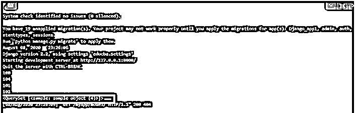
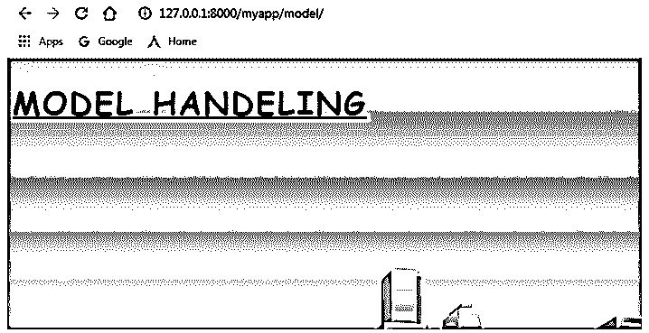
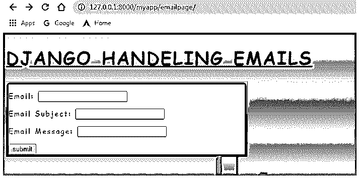

# Django 过滤器查询集

> 原文：<https://www.educba.com/django-filter-queryset/>

## Django 滤波器查询集简介

当在 django 中建立数据库连接时，总是需要从数据库中单独提取所需的列及其相应的行，基本上，Django 模型过滤器中的过滤器查询集用于实现这一点。当期望从数据库中检索一个值时，面向查询集的提取的过滤器查询集部分开始起作用。提到特定列的筛选器将有助于我们从检索到的 queryset 中筛选和提取相应的值。django 中的这个选项帮助我们实现所需值的抽象级过滤。

**语法:**

<small>网页开发、编程语言、软件测试&其他</small>

filter queryset 的语法如下所示，

`model.objects.filter(condition)`

### 创建查询集

以免讨论如何创建查询集。

**1。在应用程序中创建一个 models.py 文件:**这里需要提到一个数据库的示意图结构在 moedels.py 文件中。

**示例:** (models.py)

`from django.db import models
# Create your models here.
class sample(models.Model):
name =  models.CharField(max_length=20,unique=True)
card_no =    models.IntegerField()
def _str_(Self):
return self.name, self.id`

我们可以注意到，原理图结构是作为引用模型导入的类创建的。模型的所有预期字段都需要在这个类中声明。还要确保数据库配置到位，以便在访问数据库时不会产生任何问题，

**示例:** (SETTINGS.py)

`TEMPLATES = [
{
'BACKEND': 'django.template.backends.django.DjangoTemplates',
'DIRS': [Template_DIR,],
'APP_DIRS': True,
'OPTIONS': {
'context_processors': [
'django.template.context_processors.debug',
'django.template.context_processors.request',
'django.contrib.auth.context_processors.auth',
'django.contrib.messages.context_processors.messages',
],
},
},
] WSGI_APPLICATION = 'educba.wsgi.application'
DATABASES = {
'default': {
'ENGINE': 'django.db.backends.postgresql',
'NAME': 'postgres',
'USER': 'postgres',
'PASSWORD' : 'anand',
'HOST': '127.0.0.1',
'PORT': '5432',
}
}`

2.**检查迁移**:在创建模型文件之后，使用 make migrations 命令验证预期的迁移。

`python manage.py makemigrations`

3.**应用迁移**:接下来，使用 migrate 命令应用所有需要的迁移。

`python manage.py migrate`

4.**在 views.py 文件中创建需要的视图**:需要生成所有需要的视图。

**views.py**

`from django.shortcuts import render
from django.http import  HttpResponse
from Django_app1.forms import Valueform,fileform,emailform,requestcheckform
from django.core.exceptions import ViewDoesNotExist
from django.contrib.auth.models import User
from django.core.files.storage import FileSystemStorage
from django.contrib import messages
from django.core.mail import send_mail,EmailMessage
from Django_app1.models import sample
import requests
def requestmethods(request):
form = requestcheckform()
if request.method == 'POST':
# REQUEST OBJECT ATTRIBUTES
if request.POST['request_attribute'] == 'Request Header':
data_content = "data content of request method : " + str(request.headers)
messages.success(request,data_content)
elif request.POST['request_attribute'] == 'Request POST':
post_content = "post content of request method : " + str(request.POST)
messages.success(request,post_content)
elif request.POST['request_attribute'] == 'Request Files':
FILES_content = "FILES in request method : " + str(request.FILES)
messages.success(request,FILES_content)
elif request.POST['request_attribute'] == 'Request GET':
GET_content = "GET Content in request method : " + str(request.GET)
messages.success(request,GET_content)
elif request.POST['request_attribute'] == 'Request User':
Request_User = "User Details : " + str(request.user)
messages.success(request,Request_User)
elif request.POST['request_attribute'] == 'Request Body':
Request_body = "Request Body : " + str(request.body)
messages.success(request,Request_body)
elif request.POST['request_attribute'] == 'Request Content Type':
Request_Content_Type = "Request Content type : " + str(request.content_type)
messages.success(request,Request_Content_Type)
elif request.POST['request_attribute'] == 'Request Encoding':
Request_Encoding = "Request Encoding Used : " + str(request.encoding)
messages.success(request,Request_Encoding )
elif request.POST['request_attribute'] == 'Request Method':
Request_method = "Request Method posted : " + str(request.method)
messages.success(request,Request_method )
elif request.POST['request_attribute'] == 'Request Path':
Request_path = "Path of the request : " + str(request.path)
messages.success(request,Request_path )
elif request.POST['request_attribute'] == 'Request Cookies':
Request_Cookies = "Cookies associated to the Request : " + str(request.COOKIES)
messages.success(request,Request_Cookies )
elif request.POST['request_attribute'] == 'Request META':
Request_META = "HTTP headers info : " + str(request.META)
messages.success(request,Request_META )
# REQUEST METHODS
elif request.POST['request_attribute'] == 'Request port':
Request_port =  "Request port number: " + str(request.get_port())
messages.success(request,Request_port )
elif request.POST['request_attribute'] == 'Request host':
Request_host =  "Requested Host: " + str(request.get_host())
messages.success(request,Request_host)
elif request.POST['request_attribute'] == 'Request is_secure':
Request_secure =  "Security level of the request: " + str(request.is_secure())
messages.success(request,Request_secure)
return  render(request,'Request_methods_check.html',{"form":form})
def file_upload(request):
file = fileform()
print(" File Values in File Dictionary :", request.FILES)
if request.method == 'POST' and request.FILES['Uploaded_File']:
uploaded_file = request.FILES['Uploaded_File'] fs = FileSystemStorage()
filename = fs.save(uploaded_file.name, uploaded_file)
uploaded_File_Size = 'Size of Uploaded file : ' + str(uploaded_file.size)
content_type_of_uploaded_file = 'Content type of uploaded file : ' + str(uploaded_file.content_type)
uploaded_file_name = 'Name of Uploaded file : ' + str(uploaded_file.name)
uploaded_file_url = fs.url(filename)
print("uploaded file url",uploaded_file_url)
messages.success(request, '!!! File upload successful !!!')
messages.success(request,uploaded_File_Size)
messages.success(request,uploaded_file_name)
messages.success(request,content_type_of_uploaded_file)
return render(request, 'filehandeling.html', {"file":file})
return render(request, 'filehandeling.html',{"file":file})
def email_sending(request):
email = emailform()
if request.method == 'POST':
email_id =  request.POST['email'] email_subject =  request.POST['email_subject'] email_message =  request.POST['email_message'] mail = send_mail(email_subject,email_message,'testmysmtpconnection@gmail.com',[email_id],fail_silently = False)
response = HttpResponse(mail)
print("Content of the resposne: ",response.content)
print("Charecterset of the response: ",response.charset)
print("Status code of the response: ",response.status_code)
print("Reason phrase of the response: ",response.reason_phrase)
print("Reason close status: ",response.closed)
return response
return render(request, 'emailpage.html',{"email":email})
def db_hit(request):
all_objects =  sample.objects.all()
for i in all_objects:
print(i.card_no)
print(sample.objects.filter(card_no = 102))
return render(request, 'model.html')`

6.**生成需要的模板:**需要创建提到网页的模板。

**model.html:**

`<!DOCTYPE html>
<html lang="en" dir="ltr">
<head>
<meta charset="utf-8">
<title>Django App1</title>

<link href="" rel="stylesheet">

</head>
<body>
<h1> <u> MODEL HANDELING </u> </h1>
</body>
</html>`

**email_page.html:**

`<!DOCTYPE html>
<html lang="en" dir="ltr">
<head>
<meta charset="utf-8">
<title>Django App1</title>

<link href="" rel="stylesheet">

</head>
<body>
<h1> <u> DJANGO HANDELING EMAILS </u> </h1>

<form method =  'POST' ">
{{ email.as_p }}

<input type="submit" class="btn btn-primary" value="submit" style="text-align:center">
</form>

</body>
</html>`

7.**在 urls.py 文件中标记视图:**这是为视图创建 url 的过程。

*   从 django.conf.urls 导入库导入 url
*   在 urlpatterns 列表中声明 url 条目

`url(url_path, view_to_be_tagged, name_for_this_view)`

**urls.py:**

`from django.contrib import admin
from django.conf.urls import url
from Django_app1 import views
urlpatterns = [
url(r'formpage/',views.formView,name='form'),
url(r'fileupload/',views.file_upload,name='file_upload'),
url(r'emailpage/',views.email_sending,name='email_sending'),
url(r'requests/',views.Httpmethods,name='Request_check'),
url(r'requestmethod/',views.requestmethods,name='request_method'),
url(r'model/',views.db_hit,name='db_hit'),
]`

**输出:**

### 推荐文章

这是 Django 过滤器查询集的指南。在这里，我们还讨论了简介以及如何在数据库模型上以复杂的方式在查询集上生成过滤器，并给出了示例。您也可以看看以下文章，了解更多信息–

1.  [CSS 文本效果](https://www.educba.com/css-text-effects/)
2.  [CSS 旋转文本](https://www.educba.com/css-rotate-text/)
3.  [CSS 偏斜()](https://www.educba.com/css-skew/)
4.  [CSS 水平对齐](https://www.educba.com/css-horizontal-align/)

