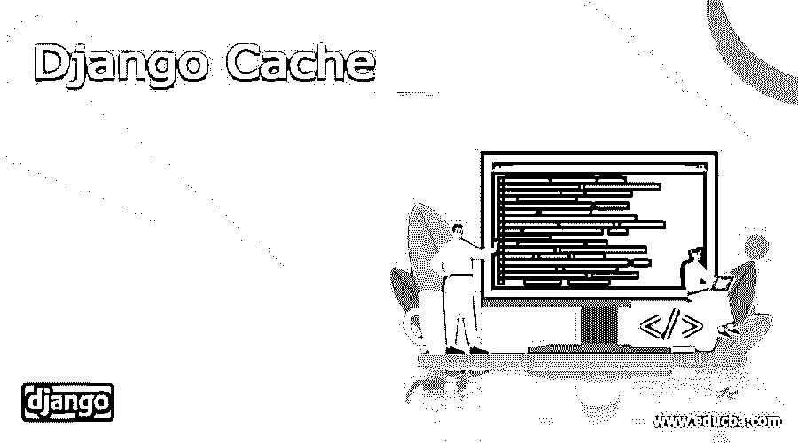
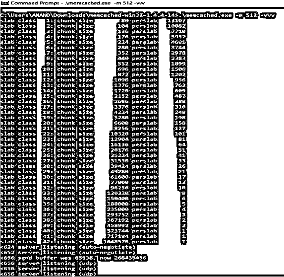
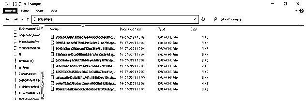

# Django Cache

> 原文：<https://www.educba.com/django-cache/>

## Django 缓存简介

当在 web 应用程序中请求一个页面时，应该在后端执行几个过程来将页面提供给请求者。这个过程可能是命中数据库查询、调用模板、执行若干计算等。对于流量大的网站来说，对每个页面调用从头开始执行这些操作可能会变得很昂贵。解决这个问题的一个方法是设置缓存系统。高速缓存系统将保存昂贵操作的结果，以便在下一个实例中可以省略该计算。

### Django 缓存的类型

就 Django 而言，Django 分为 5 个主要类型，这 5 个主要类型是 Django 缓存过程中的关键分类。每种类型都有自己的缓存数据的方式。另一方面，意图是很好地存储数据，进行认知处理。下面讨论了各种类型的缓存:

<small>网页开发、编程语言、软件测试&其他</small>

*   Memcached
*   文件系统缓存
*   本地内存缓存
*   虚拟缓存
*   数据库缓存

### 缓存是如何工作的？

缓存过程可以通过数据库、内存或文件系统等多种方式执行。每种方法都可能比另一种更有效。下面解释了各种缓存方法，

Memcahed: Memcached 是一个守护服务器，它将执行缓存过程。Memcached 将作为一个守护进程运行，并为其分配内存 RAM。市场上有几种内存缓存。这里列出了一些流行的，

1) pylibmc
2) pymemcache
3) memcachedcache

下面的例子展示了基于 memcachedcache 的 Django 缓存系统，

1)下载 Memcached 软件并将该软件解压缩到桌面位置。

2)要查看 Memcached 的各种选项，可以使用下面的命令。确保在执行命令查看选项之前切换到 Memcached 目录。

`Cd C:\Users\ANAND\Downloads\memcached-win32-1.4.4-14
.\memcached.exe -h`

3)使用 Memcached 的命令将它设置为活动的，下面给出了一个示例命令。

`.\memcached.exe -m 512 -vvv
slab class 32: chunk size 96256 perslab 10
slab class 33: chunk size 120320 perslab 8
slab class 34: chunk size 150400 perslab 6
slab class 35: chunk size 188000 perslab 5
slab class 36: chunk size 235000 perslab 4
slab class 37: chunk size 293752 perslab 3
slab class 38: chunk size 367192 perslab 2
slab class 39: chunk size 458992 perslab 2
slab class 40: chunk size 573744 perslab 1
slab class 41: chunk size 717184 perslab 1
slab class 42: chunk size 1048576 perslab 1
<624 server listening (auto-negotiate)
<652 server listening (auto-negotiate)
<656 send buffer was 65536, now 268435456
<656 server listening (udp)
<656 server listening (udp)
<656 server listening (udp)
<656 server listening (udp)
<660 send buffer was 65536, now 268435456
<660 server listening (udp)
<660 server listening (udp)
<660 server listening (udp)
<660 server listening (udp)`

4)用 python 安装 Memcached 客户端

`pip install python-memcached`

6)在 Django 项目的 settings.py 文件中设置缓存值，

`CACHES = {
'default': {
'BACKEND': 'django.core.cache.backends.memcached.MemcachedCache',
'LOCATION': '127.0.0.1:11211',
}
}`

**输出:**

文件系统缓存:在文件系统缓存中，缓存文件将被缓存在一个文件/文件夹位置。要设置文件系统缓存，请执行以下步骤，

1)在 settings.py 文件中进行以下更改，在下面的“更改位置”中，提到了要存储更改的位置。

`CACHES = {
'default': {
'BACKEND': 'django.core.cache.backends.filebased.FileBasedCache',
'LOCATION': 'D:\sample',
}
}`

*   这里确保位置是绝对的，因为位置需要是绝对的，它必须从根目录开始。

2)以相同的顺序将突出显示的组件添加到中间件中。

`MIDDLEWARE = [
'django.middleware.security.SecurityMiddleware',
'django.contrib.sessions.middleware.SessionMiddleware',
'django.middleware.cache.UpdateCacheMiddleware',
'django.middleware.common.CommonMiddleware',
'django.middleware.cache.FetchFromCacheMiddleware',
'django.middleware.csrf.CsrfViewMiddleware',
'django.contrib.auth.middleware.AuthenticationMiddleware',
'django.contrib.messages.middleware.MessageMiddleware',
'django.middleware.clickjacking.XFrameOptionsMiddleware',
]`

3)现在访问网站将触发缓存文件被缓存在提到的位置。

**输出:**

Local-Memorycache:当没有进一步明确定义缓存服务时，本地内存缓存是 Django 使用的默认缓存服务。

`CACHES = {
'default': {
'BACKEND': 'django.core.cache.backends.locmem.LocMemCache',
'LOCATION': 'test',
}
}`

这里的位置指的是记忆库。只有当使用一个以上的存储器时，才能提到它。

虚拟缓存:如果 web 应用程序不希望后端有任何缓存，那么可以启动虚拟缓存。虚拟缓存将不缓存任何东西，而是不做任何事情就启动缓存接口。

`CACHES = { 'default': {
'BACKEND': 'django.core.cache.backends.dummy.DummyCache',
} }`

数据库缓存:数据库缓存是一个在数据库中捕获缓存值的过程。这里必须提到数据库缓存类，然后应该提到目标表。首先，数据库缓存类被放在核心库内的 Django 库中，以及 db 中后端部分的缓存库中和数据库缓存中。从那里开始，必须在缓存服务的位置部分提到该表。

`CACHES = { 'default': {
'BACKEND': 'django.core.cache.backends.db.DatabaseCache',
'LOCATION': 'cache_table',
} }`

在上面的代码示例中，后端值被设置为基于数据库的库“django . core . cache . backends . db . database cache”，而位置值被设置为预期存储该值的表。需要在数据库中创建缓存表。缓存表很可能是使用 python manage.py cachetable 命令创建的。上述命令本身将创建预期的表。更有趣的是，不止一个表可以用于存储缓存。这意味着在一个时间实例中，多个表可以用于缓存服务。这是 Django 中数据库缓存工作方式的另一个例子。数据库级别的缓存过程非常类似于文件和内存分配级别的服务缓存。

### 结论

给定的文章讨论了如何在 Django 中处理这些值。它还解释了与 Django 相关的各种类型的缓存服务。所有这些类型的 Django 服务都进行了比较，并用合适的例子来说明它们的操作。

### 推荐文章

这是 Django Cache 的指南。这里我们分别讨论简介、缓存如何工作以及代码实现的例子。您也可以看看以下文章，了解更多信息–

1.  Django OneToOneField
2.  [姜戈 on_delete](https://www.educba.com/django-on_delete/)
3.  [Django 日期时间字段](https://www.educba.com/django-datetimefield/)
4.  [姜戈集团由](https://www.educba.com/django-group-by/)

