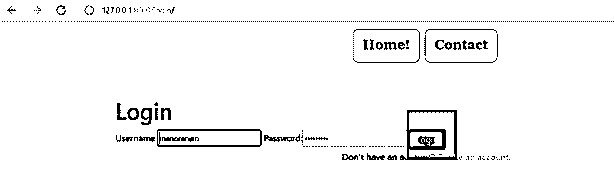
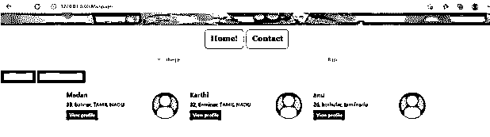

# 姜戈反向

> 原文：<https://www.educba.com/django-reverse/>

## Django Reverse 简介

通常，所有的 web 应用程序都包含大量的 url。基于 web 应用程序，url 的数量可以是数千甚至数十万。随着这么多页面的部署，在每个页面或每个视图或每个模板中硬编码 url 在将来可能会变得非常繁忙。当 url 的使用有任何变化时，将来可能会产生很多问题。为了克服这一点，可以使用相反的功能。reverse 函数允许通过提供的名称值从 url 的. py 文件中检索 url 细节。这是 Django 中 reverse 函数的主要用途。

**语法:**

<small>网页开发、编程语言、软件测试&其他</small>

`from django.urls import reverse
Redirect_Variable = reverse(redirect_url_name)`

重定向变量在这里是具有相反值的变量。所以反转后的 url 值会放在这里。所以对于 redirect_url_name 中提到的 url 名称，会在后端分配一个 url 值。在后端分配的这个 url 值将与重定向变量相关联。接下来，使用实际的反向功能。实际反向功能用于执行反向发生。该方法将负责反转新的 url 值。使用反向函数，必须指定重定向 url 的名称。此处指定的 url 值的名称将用于 url 的. py 文件中的重定向 url 名称。

### 反函数是如何工作的？

反向函数在 url 处理中非常有用，它有助于避免应用程序将来崩溃，因为它能够保存 url 值。反向功能的运行可以分为如下三种简单的方法:

1)在 url 的. py 文件中声明要加框的 url。这是最关键的部分。该 url 的所有未来引用将仅从这里发生。

2)接下来，从 url 的. py 文件转到视图，在新视图中，必须用硬编码的 url 变量名声明反向函数。这个部分负责将 url 字段名称转换为有效的 url 值。

3)最后一部分涉及实际的重定向，这里重定向将被触发和处理。所以当这个部分被调用时，重定向将发生在页面上。

### 创建 DJANGO 反向函数

1)URL . py 文件中的更改:

下面是 url 的文件，这将是 url.py 文件，所有的 url 都在这个文件中声明，这些 url 都是用 name 参数编码的。这个 name 参数负责调用 reverse 函数并返回实际的 url 值。我们可以从下面的例子中注意到，声明的每个 url 都与其中的一个 URL 值相关联，这触发了后端中基于逆向的存储。

**url.py:**

`from django.contrib import admin
from django.urls import path
from django.conf.urls import url
from matrimony_pages import views
from django.conf import settings
from django.conf.urls.static import static
urlpatterns = [
url(r'Jsoncheck/',views.Json_Response,name='Json_Response'),
url(r'^$',views.Entry_page,name='Entry_page'),
url(r'Mainpage/',views.Main_page,name='Main_page'),
url(r'all/',views.All_users,name='all'),
url(r'form/',views.form_view,name='form_view'),
url(r"signup/", views.Sign_up_Call, name="register"),
url(r"login/", views.login_Call, name="login"),
path(r'profile/<str:pk>/',views.profile_page,name='profile'),
url(r'logout/',views.logout_Call,name='logout'),
url(r'reg/',views.profile_reg_user,name='reg'),
path(r'update/<str:pk>/',views.form_update,name='update'),
path('admin/', admin.site.urls),
]+ static(settings.MEDIA_URL,document_root=settings.M`

3)为表单创建一个视图:

提交时必须存储整数值，检索时必须从数据库中提取整数值。这可以通过为模型创建的对象来实现。下面的 views.py 部分解释了这样做的过程。

例如:views.py

`from django.shortcuts import render, redirect
from django.http import HttpResponse
from .models import *
from .forms import NewUserForm,Valueform
from django.contrib.auth import login,authenticate,logout
from django.contrib import messages
from django.contrib.auth.forms import AuthenticationForm
from django.contrib.auth.models import User
from django.contrib.auth.decorators import user_passes_test,login_required
from django.core.paginator import Paginator
from django.http import JsonResponse
from django.urls import reverse
def All_users(request):
User_entries = User.objects.all()
page = request.GET.get('page', 1)
paginator = Paginator(User_entries, 5)
users = paginator.page(page)
print(" Has other pages : ",users.has_other_pages())
print(" Has next page : ",users.has_next())
print(" Has previous page : ",users.has_previous())
print(" Has previous page : ",users.has_previous())
print(" Start Index : ",users.start_index())
print(" End Index : ",users.end_index())
if users.has_next():
print(" Next page Number: ",users.next_page_number())
elif users.has_previous():
print(" Has Previous page Number: ",users.previous_page_number())
print(paginator,users)
return render(request,"All_users.html",{'users':users})
def Sign_up_request(request):
if request.method == "POST":
form = NewUserForm(request.POST)
print(form.is_valid())
if form.is_valid():
user = form.save()
login(request, user)
print(User.objects.all())
messages.success(request, "Registration successful." )
named_redirect = reverse('Welcome_page')
return redirect(named_redirect)
messages.error(request, "Unsuccessful registration. Invalid information.")
form = NewUserForm
return render (request,template_name="Signup.html", context={"Sign_up_form":form})
def login_request(request):
if request.method == "POST":
username = request.POST.get('username', '')
password = request.POST.get('password', '')
user = authenticate(request,username=username, password=password)
if user is not None:
print('1',request.user.is_authenticated, request.user)
login(request, user)
# logout(request)
print('1',request.user.is_authenticated, request.user)
messages.info(request, f"You are now logged in as {username}.")
named_redirect = reverse('Welcome_page')
return redirect(named_redirect)
else:
messages.error(request,"Invalid username or password.")
form = AuthenticationForm()
return render(request=request, template_name="login.html", context={"login_form":form})
def logout_request(request):
if request.user.is_authenticated:
logout(request)
print('2',request.user.is_authenticated, request.user)
messages.info(request, "Logged out successfully!")
named_redirect = reverse('Welcome_page')
return redirect(named_redirect)
@login_required
def Reverse_Redirect_Example_page(request,pk):
render_dict2 = {}
Key_details = Bride.objects.get(id=pk)
Reverse_Redirect_Example_name = Key_details.name
Reverse_Redirect_Example_Age = Key_details.age
Reverse_Redirect_Example_Thegai = Key_details.thegai
Reverse_Redirect_Example_state = Key_details.State
Reverse_Redirect_Example_district = Key_details.District
Reverse_Redirect_Example_Address = Key_details.Address
Reverse_Redirect_Example_Phone = Key_details.Phone
Reverse_Redirect_Example_Profession = Key_details.profession
Reverse_Redirect_Example_Salary = Key_details.salary
Reverse_Redirect_Example_UG = Key_details.Under_Graduation_Degree
Reverse_Redirect_Example_UGC = Key_details.Under_Graduation_college
Reverse_Redirect_Example_PG = Key_details.Post_Graduation_Degree
Reverse_Redirect_Example_PGC = Key_details.Post_Graduation_college
Reverse_Redirect_Example_UG = Key_details.Under_Graduation_Degree
Reverse_Redirect_Example_UGC = Key_details.Under_Graduation_college
Reverse_Redirect_Example_PG = Key_details.Post_Graduation_Degree
Reverse_Redirect_Example_PGC = Key_details.Post_Graduation_college
Reverse_Redirect_Example_Rasi = Key_details.Rasi
Reverse_Redirect_Example_Nakshatra = Key_details.Nakshatra
render_dict2['Age'] = Reverse_Redirect_Example_Age
render_dict2['name'] = Reverse_Redirect_Example_name
render_dict2['thegai'] = Reverse_Redirect_Example_Thegai
render_dict2['State'] = Reverse_Redirect_Example_state
render_dict2['district'] = Reverse_Redirect_Example_district
render_dict2['Address'] = Reverse_Redirect_Example_Address
render_dict2['Phone'] = Reverse_Redirect_Example_Phone
render_dict2['profession'] = Reverse_Redirect_Example_Profession
render_dict2['Under_Graduation_Degree'] = Reverse_Redirect_Example_UG
render_dict2['Under_Graduation_college'] = Reverse_Redirect_Example_UGC
render_dict2['Post_Graduation_Degree'] = Reverse_Redirect_Example_PG
render_dict2['Post_Graduation_college'] = Reverse_Redirect_Example_PGC
render_dict2['Rasi'] = Reverse_Redirect_Example_Rasi
render_dict2['Nakshatra'] = Reverse_Redirect_Example_Nakshatra
print(Key_details.Creator)
print(render_dict2)
return render(request,'Profilepage.html',render_dict2)`

**输出:**

在下面的输出示例中，单击登录按钮会将用户重定向到应用程序的主页。这种重定向是通过反向功能实现的。

### 结论

上面的文章清楚地提到了 Django 反向函数的使用，如何在 Django 中使用反向函数来避免 url 的硬编码，以及解释在 Django 中反向函数的使用和执行的合适例子。

### 推荐文章

这是一个姜戈反向指南。这里我们讨论一下入门，反函数是如何工作的？代码实现示例有助于更好地理解。您也可以看看以下文章，了解更多信息–

1.  Django OneToOneField
2.  [姜戈 on_delete](https://www.educba.com/django-on_delete/)
3.  [Django 日期时间字段](https://www.educba.com/django-datetimefield/)
4.  [Django 静态文件](https://www.educba.com/django-static-files/)

