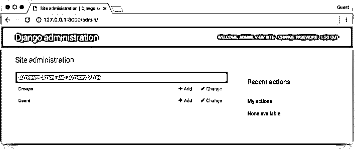

# Django 创建超级用户

> 原文：<https://www.educba.com/django-create-superuser/>

## Django 创建超级用户简介

下面的文章提供了 Django 创建超级用户的概要。从管理员的角度来看，在 Django 中一切都可以轻松处理。此外，Django 框架本身提供了一个管理面板。这个管理面板可以被复杂地处理，以管理相应于该网站的管理员和其他用户。所以在 Django 中可以有一个单独设置超级用户的过程。这个过程是通过 Django 创建超级用户过程实现的。这个过程包括创建超级用户表，然后在其中生成超级用户。这就是 Django 中超级用户创建过程的处理方式。

**语法:**

<small>网页开发、编程语言、软件测试&其他</small>

`Python manage.py createsuperuser`

以上命令用于设置超级用户创建过程。上面的面板将涉及在后端声明的表数据库上创建一个超级用户。上面显示的命令如下所示。首先，python 关键字用于创建 python 设置，然后 manage.py 关键字允许在后端的超级用户表中为当前项目启动超级用户设置过程。最后，create 超级用户是实例化创建的命令。

### 创建超级用户是如何工作的？

*   执行超级用户创建命令，语法中的上述命令用于超级用户创建。

`Python manage.py runserver`

*   将请求超级用户的用户名，我们需要在这里为这个项目设置超级用户值。超级用户的用户名将是预期的超级用户值。
*   接下来需要提到的是邮箱 id。在这个过程中，将在后端建立用户 id 和电子邮件 id 之间的映射。换句话说，在这种情况下，用户 id 将被标记为电子邮件 id。
*   最后，用户需要输入并确认密码。此过程允许您输入密码，并让用户确认密码。在 Django 中，超级用户设置过程就是这样进行的。

以下日志显示了管理员用户设置过程:

**代码:**

`C:\Users\ANAND\Desktop\ANAND\Websites\Matrimony\Matrimony\matrimony_pages\admin.py changed, reloading.
Watching for file changes with StatReloader
Performing system checks...
System check identified no issues (0 silenced).
July 30, 2021 - 13:54:32
Django version 3.2.3, using settings 'Matrimony.settings'
Starting development server at http://127.0.0.1:8000/
Quit the server with CTRL-BREAK.
[30/Jul/2021 13:39:03] "GET /static/admin/img/Groom.jpg HTTP/1.1" 304 0
[30/Jul/2021 13:39:03] "GET /static/admin/img/Register.jpg HTTP/1.1" 304 0
[30/Jul/2021 13:39:08] "GET /admin/ HTTP/1.1" 302 0
[30/Jul/2021 13:39:08] "GET /admin/login/?next=/admin/ HTTP/1.1" 200 2615
[30/Jul/2021 13:39:08] "GET /static/admin/css/Formpage.css HTTP/1.1" 304 0`

**创建快照:**

### Django 创建超级用户的示例

下面是提到的例子:

**Models.py 文件**

**a. (models.py):**

**代码:**

`from django.db import models
from django.contrib.auth.models import User
# Model variables
# Create your models here.
class Bride(models.Model):
Super_user_example_name = models.CharField(max_length=200,null=True)
Super_user_example_age = models.IntegerField(null=True)
Super_user_example_thegai = models.CharField(max_length=200,null=True)
Super_user_example_State = models.CharField(max_length=50,null=True)
Super_user_example_District = models.CharField(max_length=50,null=True)
Super_user_example_Address = models.TextField(null=True)
Super_user_example_Phone = models.BigIntegerField(null=True)
Super_user_example_profession = models.CharField(max_length=200,null=True)
Super_user_example_salary = models.BigIntegerField(null=True)
Super_user_example_Under_Graduation_Degree = models.CharField(max_length=200,null=True)
Super_user_example_Under_Graduation_college = models.CharField(max_length=400,null=True)
Super_user_example_Post_Graduation_Degree = models.CharField(max_length=200,null=True)
Super_user_example_Post_Graduation_college = models.CharField(max_length=400,null=True)
Super_user_example_Rasi = models.CharField(max_length=200,null=True)
Super_user_example_Nakshatra = models.CharField(max_length=200,null=True)
Image = models.ImageField(null=True,blank=True,upload_to="img/%y")
def __str__(self):
return self.name`

**b. (Settings.py):**

**代码:**

`MIDDLEWARE = [
'django.middleware.security.SecurityMiddleware',
'django.contrib.sessions.middleware.SessionMiddleware',
'django.middleware.common.CommonMiddleware',
'django.middleware.csrf.CsrfViewMiddleware',
'django.contrib.auth.middleware.AuthenticationMiddleware',
'django.contrib.messages.middleware.MessageMiddleware',
'django.middleware.clickjacking.XFrameOptionsMiddleware',
] ROOT_URLCONF = 'Matrimony.urls'
TEMPLATES = [
{
'BACKEND': 'django.template.backends.django.DjangoTemplates',
'DIRS': [Template_DIR,],
'APP_DIRS': True,
'OPTIONS': {
'context_processors': [
'django.template.context_processors.debug',
'django.template.context_processors.request',
'django.contrib.auth.context_processors.auth',
'django.contrib.messages.context_processors.messages',
],
},
},
] DATABASES = {
'default': {
'ENGINE': 'django.db.backends.sqlite3',
'NAME': BASE_DIR / 'db.sqlite3',
}
}
STATIC_URL = '/static/'
MEDIA_URL =img/'
STATICFILES_DIRS = [os.path.join(BASE_DIR, 'static'), ] print(STATICFILES_DIRS)
STATIC_ROOT = os.path.join(BASE_DIR, 'static')
MEDIA_ROOT = os.path.join(BASE_DIR, 'static/images')
print(STATIC_ROOT)`

**c. url.py:**

**代码:**

`from django.contrib import admin
from django.urls import path
from django.conf.urls import url
from matrimony_pages import views
from django.conf import settings
from django.conf.urls.static import static
urlpatterns = [
url(r'Jsoncheck/',views.Json_Response,name='Json_Response'),
url(r'^$',views.Welcome_page,name='Welcome_page'),
url(r'Mainpage/',views.Main_page,name='Main_page'),
url(r'all/',views.All_users,name='all'),
url(r'form/',views.form_view,name='form_view'),
url(r"signup/", views.Sign_up_request, name="register"),
url(r"login/", views.login_request, name="login"),
path(r'profile/<str:pk>/',views.profile_page,name='profile'),
url(r'logout/',views.logout_request,name='logout'),
url(r'reg/',views.profile_reg_user,name='reg'),
path(r'update/<str:pk>/',views.form_update,name='update'),
path('admin/', admin.site.urls),
url(r'^$',views.Welcome_page,name='Welcome_page'),
url(r'Mainpage/',views.Main_page,name='Main_page'),
url(r'all/',views.All_users,name='all'),
url(r'form/',views.form_view,name='form_view'),
url(r"signup/", views.Sign_up_request, name="register"),
url(r"login/", views.login_request, name="login"),
path(r'profile/<str:pk>/',views.profile_page,name='profile'),
url(r'logout/',views.logout_request,name='logout'),
url(r'reg/',views.profile_reg_user,name='reg'),
path(r'update/<str:pk>/',views.form_update,name='update'),
]`

**d. views.py:**

**代码:**

`@login_required
def Super_user_example_page(request,pk):
Super_user_dict = {}
Super_user_details = Bride.objects.get(id=pk)
Super_user_example_name = Super_user_details.name
Super_user_example_Age = Super_user_details.age
Super_user_example_Thegai = Super_user_details.thegai
Super_user_example_state = Super_user_details.State
Super_user_example_district = Super_user_details.District
Super_user_example_Address = Super_user_details.Address
Super_user_example_Phone = Super_user_details.Phone
Super_user_example_Profession = Super_user_details.profession
Super_user_example_Salary = Super_user_details.salary
Super_user_example_UG = Super_user_details.Under_Graduation_Degree
Super_user_example_UGC = Super_user_details.Under_Graduation_college
Super_user_example_PG = Super_user_details.Post_Graduation_Degree
Super_user_example_PGC = Super_user_details.Post_Graduation_college
Super_user_example_UG = Super_user_details.Under_Graduation_Degree
Super_user_example_UGC = Super_user_details.Under_Graduation_college
Super_user_example_PG = Super_user_details.Post_Graduation_Degree
Super_user_example_PGC = Super_user_details.Post_Graduation_college
Super_user_example_Rasi = Super_user_details.Rasi
Super_user_example_Nakshatra = Super_user_details.Nakshatra
Super_user_example_Image = Super_user_details.Image
Super_user_dict['Age'] = Super_user_example_Age
Super_user_dict['name'] = Super_user_example_name
Super_user_dict['thegai'] = Super_user_example_Thegai
Super_user_dict['State'] = Super_user_example_state
Super_user_dict['district'] = Super_user_example_district
Super_user_dict['Address'] = Super_user_example_Address
Super_user_dict['Phone'] = Super_user_example_Phone
Super_user_dict['profession'] = Super_user_example_Profession
Super_user_dict['Under_Graduation_Degree'] = Super_user_example_UG
Super_user_dict['Under_Graduation_college'] = Super_user_example_UGC
Super_user_dict['Post_Graduation_Degree'] = Super_user_example_PG
Super_user_dict['Post_Graduation_college'] = Super_user_example_PGC
Super_user_dict['Rasi'] = Super_user_example_Rasi
Super_user_dict['Nakshatra'] = Super_user_example_Nakshatra
Super_user_dict['Image'] = Super_user_example_Image
print(Super_user_details.Creator)
print(Super_user_dict)
return render(request,'Profilepage.html',Super_user_dict)`

**e. Profilepage.html:**

**代码:**

`<!DOCTYPE html>
<html style="font-size: 16px;">
<head>
<title>Home</title>

<link rel="stylesheet" href="" media="screen">
<meta name="viewport" content="width=device-width, initial-scale=1, maximum-scale=1, minimum-scale=1" />
<link rel="stylesheet" href="https://stackpath.bootstrapcdn.com/bootstrap/4.4.1/css/bootstrap.min.css" integrity="sha384-Vkoo8x4CGsO3+Hhxv8T/Q5PaXtkKtu6ug5TOeNV6gBiFeWPGFN9MuhOf23Q9Ifjh" crossorigin="anonymous">
<!-- Script -->

</head>
<body class="body">

<nav class='navbar'>

<a class="navbar" onclick="redirect2()" >Home! </a>
<a class="navbar" onclick="redirect2()" >Contact</a>

</nav>
<form method="GET" action=".">

<input class="form-control py-2 border-right-0 border" type="search" name="thegai" placeholder="thegai..." />
<input class="form-control py-2 border-right-0 border" list="Rasi" type="search" name="Rasi" placeholder="Rasi..." />

<i class="fa fa-search"></i>

<button type="submit" class="btn btn-primary">Apply filters</button>
<button type="submit" onclick=redirect1() class="btn btn-primary">Remove All filters</button>
</form>

 










<h5><strong>{{bride.name}}</strong></h5>
<h6>{{bride.age}}, {{bride.thegai}}, {{bride.State}}</h6>
<form action="" method="POST">

<a class="btn btn-sm btn-info" href="" name="{{bride.id}}"><strong>View profile</strong></a>
</form>

  

 



</body>
</html>`

**输出:**

### 结论

这篇文章描述了如何在 Django 中高效地创建超级用户。此外，在超级用户创建的每个步骤中，都用适当的示例解释了这些更改。此外，还会创建超级用户，并显示页面的输出。

### 推荐文章

这是 Django 创建超级用户的指南。这里我们讨论一下入门，创建超级用户是如何工作的？和示例。您也可以看看以下文章，了解更多信息–

1.  [姜戈分页](https://www.educba.com/django-pagination/)
2.  Django OneToOneField
3.  [Django 日期时间字段](https://www.educba.com/django-datetimefield/)
4.  [姜戈回应](https://www.educba.com/django-response/)

