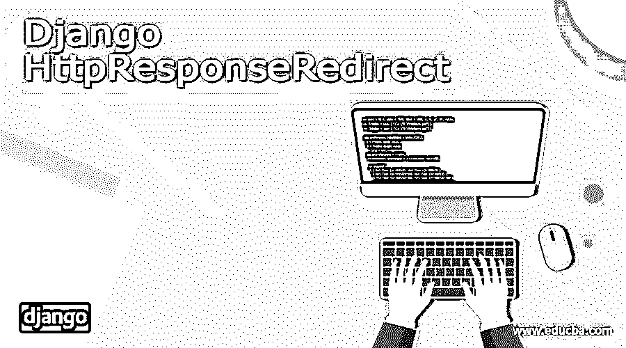
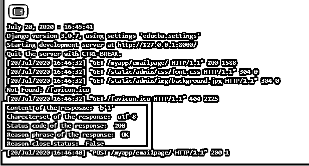

# Django HttpResponseRedirect

> 原文：<https://www.educba.com/django-httpresponseredirect/>

## Django HttpResponseRedirect 简介

一个过程的最终结果可能被指定为一个反应。这种反应可以是任何对象的反应，该对象被公式化并预期被定位为网页的输出。从那里开始，响应项被分配给一个变量。该变量将用于设置响应。反应技术和属性在很大程度上是有用的。它们在放置可能使用的属性和值时非常有用。

**语法:**

<small>网页开发、编程语言、软件测试&其他</small>

`response = Httpresponseredirect(response item)`

按照上面的语法，作为响应的响应项被封装在 Httpresponseredirect 方法中。一旦这个输出被公式化，那么它就可以被封装成一个 httpresponseredirect 方法来产生反应项。一旦反应项被生成，它就被赋给一个变量并作为输出被调度。

### HttpResponseRedirect 方法

| **Httpresponse 属性** | **描述** |
| HttpResponse_redirect。__init__ *(content=，content_type=None，status=200，reason=None，charset=None)* | 内容页面和内容类型与响应对象相关联 |
| HttpResponse_redirect。__setitem__ *(header，value)* | 该值与标头名称相关联 |
| HttpResponse_redirect。__delitem__ *(表头)* | 删除特定标题 |
| HttpResponse_redirect。__getitem__ *(表头)* | 返回特定标头名称的值 |
| HttpResponse _ redirect . has _ header*(header)* | 基于对具有所提供名称的标头的不区分大小写检查，它返回 True 或 False。 |
| HttpResponse _ redirect . set default*(header，value)* | 允许制定默认标题值 |
| HttpResponse_redirect.write *(内容)* | 文件类对象的响应是用这个创建的。 |
| HttpResponse_redirect.flush() | 允许刷新响应对象 |
| HttpResponse_redirect.tell() | 响应中将创建一个类似文件的对象 |
| httpresponse _ 重定向. getvalue() | 它用于获取 HttpResponse_redirect.content 的值。 |
| HttpResponse_redirect.readable() | 在响应中将创建一个类似流的对象 |
| HttpResponse_redirect.seekable() | 使响应对象可达 |

#### Models.py 文件中的更改:

`from Django.db import models
from Django.contrib.auth.models import User
# Model variables
# Create your models here.
class Object(models.Model):
Django_response_redirect__Example_name = models.CharField(max_length=200,null=True)
Django_response_redirect__Example_thegai = models.CharField(max_length=200,null=True)
Django_response_redirect__Example_State = models.CharField(max_length=50,null=True)
Django_response_redirect__Example_District = models.CharField(max_length=50,null=True)
Django_response_redirect__Example_Address = models.TextField(null=True)
Django_response_redirect__Example_Phone = models.BigInteger_Example_Field(null=True)
Django_response_redirect__Example_profession = models.CharField(max_length=200,null=True)
Django_response_redirect__Example_salary = models.BigInteger_Example_Field(null=True)
Django_response_redirect__Example_Under_Graduation_Degree = models.CharField(max_length=200,null=True)
Django_response_redirect__Example_Under_Graduation_college = models.CharField(max_length=400,null=True)
Django_response_redirect__Example_Post_Graduation_Degree = models.CharField(max_length=200,null=True)
Django_response_redirect__Example_Post_Graduation_college = models.CharField(max_length=400,null=True)
Django_response_redirect__Example_Rasi = models.CharField(max_length=200,null=True)
Django_response_redirect__Example_Nakshatra = models.CharField(max_length=200,null=True)
Django_response_redirect__Example_Post_Graduation_Degree = models.CharField(max_length=200,null=True)
Django_response_redirect__Example_Post_Graduation_college = models.CharField(max_length=400,null=True)
Django_response_redirect__Example_Rasi = models.CharField(max_length=200,null=True)
def __str__(self):
return self.name`

**为表单创建视图:**

商店技术将使用 shape.shop()方法进行定位。然后，现代登录的个人信息可以被获取并保存到该形状上。这是形状车库将采取的位置。在形状被有效地保存后，它可能会通过 render 方法直接呈现给浏览器。

`def Main_page(request):
Post_keys = [] Object_id_str_list = [] Objects = Object.objects.all()
# Object_Image = Objects.Image
# context2['Image'] = Object_Image
context = {'Objects':Objects}
if request.method == 'GET':
State = request.GET.get('state', '')
District = request.GET.get('district', '')
thegai = request.GET.get('thegai', '')
Rasi = request.GET.get('Rasi', '')
print(len(State),len(District),District, Rasi)
if len(State) > 0:
Filter_context = {}
Object = Object.objects.filter(State=str(State))
Filter_context = {'Objects':Object}
return render(request,'Mainpage.html',Filter_context)
if len(District) > 0:
Filter_context = {}
Object = Object.objects.filter(District=str(District))
print(Object)
Filter_context = {'Objects':Object}
return render(request,'Mainpage.html',Filter_context)
if len(thegai) > 0:
Filter_context = {}
Object = Object.objects.filter(thegai=str(thegai))
print(Object)
Filter_context = {'Objects':Object}
return render(request,'Mainpage.html',Filter_context)
if len(Rasi) > 0:
Filter_context = {}
Object = Object.objects.filter(Rasi=str(Rasi))
print(Object)
Filter_context = {'Objects':Object}
return render(request,'Mainpage.html',Filter_context)
print("Content of the resposne: ",responseredirect.content)
print("Charecterset of the response: ",responseredirect.charset)
print("Status code of the response: ",responseredirect.status_code)
print("Reason phrase of the response: ",responseredirect.reason_phrase)
print("Reason close status: ",responseredirect.closed)
return render(request,'Mainpage.html',context)
@login_required
def profile_reg_user(request):
Filter_context = {}
current_user = request.user
Object = Object.objects.filter(Creator=current_user)
Filter_context = {'Objects':Object}
print("Content of the resposne: ",responseredirect.content)
print("Charecterset of the response: ",responseredirect.charset)
print("Status code of the response: ",responseredirect.status_code)
print("Reason phrase of the response: ",responseredirect.reason_phrase)
print("Reason close status: ",responseredirect.closed)
return render(request,'Profiles_reg_user.html',Filter_context)
@login_required
def form_update(request,pk):
update_profile = Object.objects.get(id=pk)
form = Valueform(instance=update_profile)
context = {'form':form}
if request.method == 'POST':
form = Valueform(request.POST,instance=update_profile,files=request.FILES)
print(form)
if form.is_valid():
post = form.save()
post.Creator = request.user
print('Creator user stored',request.user)
post.save()
obj = form.instance
return render(request,'form.html', {"obj": obj,"form": form})
print("Content of the resposne: ",responseredirect.content)
print("Charecterset of the response: ",responseredirect.charset)
print("Status code of the response: ",responseredirect.status_code)
print("Reason phrase of the response: ",responseredirect.reason_phrase)
print("Reason close status: ",responseredirect.closed)
return render(request,'form.html', {"form": form})`

**url.py:**

`from django.contrib import admin
from django.urls import path
from django.conf.urls import url
from matrimony_pages import views
from django.conf import settings
from django.conf.urls.static import static
urlpatterns = [
url(r'Jsoncheck/',views.Json_Response,name='Json_Response'),
url(r'^$',views.Welcome_page,name='Welcome_page'),
url(r'Mainpage/',views.Main_page,name='Main_page'),
url(r'all/',views.All_users,name='all'),
url(r'form/',views.form_view,name='form_view'),
url(r"signup/", views.Sign_up_request, name="register"),
url(r"login/", views.login_request, name="login"),
path(r'profile/<str:pk>/',views.profile_page,name='profile'),
url(r'logout/',views.logout_request,name='logout'),
url(r'reg/',views.profile_reg_user,name='reg'),
path(r'update/<str:pk>/',views.form_update,name='update'),
path('admin/', admin.site.urls),
]+ static(settings.MEDIA_URL,document_root=settings.MEDIA_ROOT)`

**Form.html:**

`<!DOCTYPE html>
<html lang="en" dir="ltr">
<head>
<meta charset="utf-8">
<title>Django App1</title>

<link href="" rel="stylesheet">

</head>
<body>
<h1> <u> DJANGO HANDELING EMAILS </u> </h1>
<nav class='navbar'>

<a class="navbar" onclick="redirect2()" >Home! </a>
<a class="navbar" onclick="redirect2()" >Contact</a>

</nav>

 

<form method="PUT" class='formarea' enctype="multipart/form-data">

{{ form.as_p }}

<input type="submit" class='button' value="Update">

</form>


<form method = 'POST' ">
{{ email.as_p }}

<input type="submit" class="btn btn-primary" value="submit" style="text-align:center">
</form>

</body>
</html>`

**输出:**

### 结论

现实中的文章提到了如何在 Django 框架中创建 HTTP responseredirect 对象，此外，文章还解释了在控制台内部再次打印反应成本的方法。这些值显示在控制台内。

### 推荐文章

这是 Django HttpResponseRedirect 的指南。这里我们讨论介绍，语法，HttpResponseRedirect 方法，代码实现的例子。您也可以看看以下文章，了解更多信息–

1.  [姜戈分页](https://www.educba.com/django-pagination/)
2.  Django OneToOneField
3.  [姜戈 on_delete](https://www.educba.com/django-on_delete/)
4.  [Django 日期时间字段](https://www.educba.com/django-datetimefield/)

