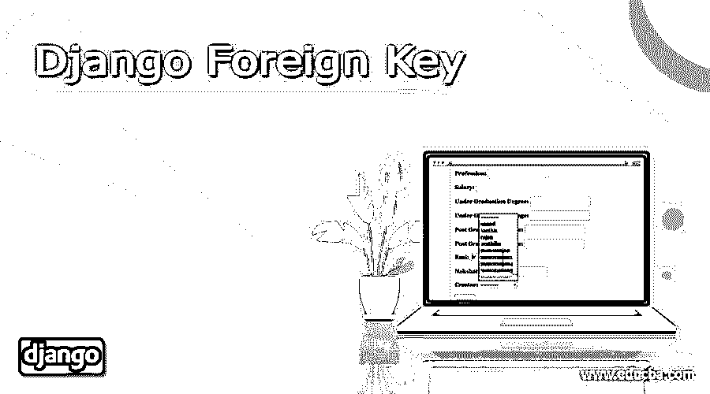
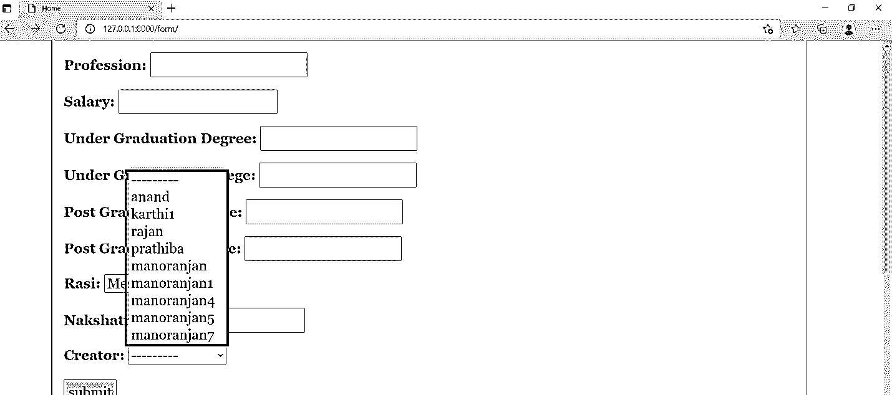

# Django 外键

> 原文：<https://www.educba.com/django-foreign-key/>

## Django 外键介绍

外键是一个过程，通过这个过程，一个表中的字段可以灵活地用在另一个表中。因此，两个不同的表可以通过外键很容易地链接起来。这两个表的链接可以通过外键过程轻松实现。它将被强制允许通过相关的键在两个表之间进行链接。在某些情况下，外键也作为引用键。外键允许不同表的主键之间的匹配。根据生成的关系类型，外键字段将允许多对一关系。因此，多张桌子可以灵活地与另一端的一张桌子连接。因此，通过外键可以有效地将多个字段合并为一个字段。外键字段的参数可以在其中赋值。因此，根据这些字段属性的分配，外键字段将像。

**语法:**

<small>网页开发、编程语言、软件测试&其他</small>

`Foreignkey name = models.ForeignKey(Table_name, null_argument, Ondelete_arguemnt)`

这里第一个参数代表一个表名。因此，作为外键模型的第一个参数分配的表名允许提及从哪个表借用了相应的键。因此这里将提到获取外键值的表。这是该方法的第一个参数。接下来，null 参数用于表示值 null，该值与表中将来的或已经存在的记录相关联。将该记录称为 null 允许已经在后面的记录或添加的新记录在没有为其提及值时用 Null 值填充。

下一个论点是最重要的论点。该参数决定删除对临时表的影响需要如何影响父表。所以，当一个父表记录被删除时，那么这里的相应记录应该承受这种影响还是这种影响可以被忽略是这里的决定因素。因此，基于这一确定，对父表的改变将相应地反映在这里。此外，等式的左侧是外键列的名称。这个名称指的是新创建的列的名称。因此这里给出的名称-值将是以后列的名称。

### 创建 Django Jsonfield

下面解释了如何创建 Django Jsonfield:

#### 1.Models.py 文件中的更改

外键必须在 modelys.py 文件中声明，在下面的示例中，我们可以注意到外键被称为 example_creator。此外，该字段被声明为 foreignkey，因为它的值是从原始表 User 中集成的，此外还有一些属性，如将 null 值关联为 True，以及使用 CASCADE 实现 ondelete 函数。

**举例:**

`from django.db import models
from django.contrib.auth.models import User
# Model variables
# Create your models here.
class Bride(models.Model):
Example_name = models.CharField(max_length=200,null=True)
Example_age = models.IntegerField(null=True)
Example_thegai = models.CharField(max_length=200,null=True)
Example_State =  models.CharField(max_length=50,null=True)
Example_District = models.CharField(max_length=50,null=True)
Example_Address = models.TextField(null=True)
Example_Phone = models.BigIntegerField(null=True)
Example_profession = models.CharField(max_length=200,null=True)
Example_salary = models.BigIntegerField(null=True)
Example_Under_Graduation_Degree = models.CharField(max_length=200,null=True)
Example_Under_Graduation_college = models.CharField(max_length=400,null=True)
Example_Post_Graduation_Degree = models.CharField(max_length=200,null=True)
Example_Post_Graduation_college = models.CharField(max_length=400,null=True)
Example_Rasi = models.CharField(max_length=200,null=True)
Example_Nakshatra = models.CharField(max_length=200,null=True)
Example_Creator  =  models.ForeignKey(User, null=True, on_delete=models.CASCADE)
def __str__(self):
return self.name`

#### 2.Forms.py 文件中的更改

模型的记录被集成到 forms.py 文件中的一个表单中。在这里，模型新娘的整合被执行。因此，在这里继承新娘模型将允许新娘模型的记录与这个表单页面相关联。

**举例:**

`from django import forms
from .models import Bride
from django.contrib.auth.forms import UserCreationForm
from django.contrib.auth.models import User
class Valueform(forms.ModelForm):
#   Rasi = forms.ChoiceField(choices = Rasi_CHOICES)
class Meta:
model = Bride
fields = "__all__"`

#### 3.为表单创建视图

希望形成 Django 视图，以便通过注册在其中的外键字段为表单提供中间件。单击提交按钮将保存表单。render 函数是 Django 库中第一个导入的项目。这个导入过程将允许 HTML 文件被呈现给所呈现的浏览器。在此之后，将执行 HTTP 响应的导入。在 views 方法中，期望值表单被实例化，这进一步允许表单被灵活地呈现。实例化将在名为 form 的值上执行。保存过程将与表单一起进行。Save()方法。然后，当前登录的用户详细信息将被获取并存储在表单中。这就是表单存储的方式。表单成功存储后，它将通过 render 方法呈现在浏览器上。

**举例:**

`def form_view(request):
form = Valueform(request.POST or None)
if form.is_valid():
post = form.save()
post.Creator = request.user
print('Creator user stored',request.user)
post.save()
return  render(request,'form.html', {"form": form})
def form_edit(request):
form = Valueform(request.POST or None)
if form.is_valid():
post = form.save()
post.Creator = request.user
print('Creator user updated',request.user)
post.save()
return  render(request,'form_edit.html', {"form": form}
def form_update(request):
form = Valueform(request.POST or None)
if form.is_valid():
post = form.save()
post.Creator = request.user
print('Creator user updated',request.user)
post.save()
return  render(request,'form_edit.html', {"form": form}`

#### 4.为显示表单制定一个 HTML 文件

必须对 HTML 页面进行相应的更改。

**Form.html**

`
<form method="POST" class='formarea'>

{{ form.as_p }}

<input type="submit" class='button' value="submit">

</form>
`

**输出:**

### 结论

本文描述了如何在 Django 设置中灵活地声明外键，如何将更改呈现给表单项，以及如何从那里传递输入值。在应用程序中创建的外键连接的数量没有限制。此外，Django 设置的模型允许非常复杂地维护这些字段，而不需要对数据库进行任何大的修改。这是 Django 设置的主要优势。

### 推荐文章

这是 Django 外键的指南。在这里，我们还讨论了介绍和如何创建 django jsonfield，以及不同的例子和它的代码实现。您也可以看看以下文章，了解更多信息–

1.  [姜戈集团由](https://www.educba.com/django-group-by/)
2.  [Django 静态文件](https://www.educba.com/django-static-files/)
3.  [姜戈会议](https://www.educba.com/django-session/)
4.  [Django 文件上传](https://www.educba.com/django-file-upload/)

