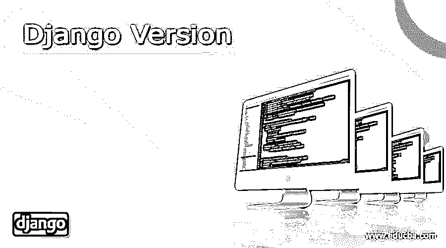

# Django 版本

> 原文：<https://www.educba.com/django-version/>

## Django 版本介绍

一个基于 Python 的免费框架叫做 Django framework，它有一个模型到模板的模式，可以帮助开发网站，在这里它充当了所有应用程序开发级别的工具包。完美的网站可以在 Python 库的帮助下创建，代码可以用于前端和后端。面向对象的概念在 Django 中非常重要，因此在 Django 中使用 Python 的基础知识是必要的。无需太多代码就可以轻松创建定制应用程序，这使得网站对用户来说非常完美。

### 顶级 Django 版本

*   Django 是在 2003 年开发的一个 web 应用程序，在 Python 的帮助下创建网站。Adrian Holovaty、Simon Willison 和 Jacob Kaplan-Moss 三人参与了 2005 年向市场发布的开发。姜戈这个名字是以吉他手坦哥·雷恩哈特的名字命名的。web 服务器可用于 web 应用程序的开发和测试，以及基于 OOPs 概念的模板系统。模板本身具有继承性。它也可以与其他应用程序一起使用。此外，还提供了一个框架来收集有助于天气预测的地理数据。
*   初始版本 0.90 于 2005 年 11 月 16 日发布。下一个版本 0.91 于 2006 年 1 月发布，几乎没有什么变化，比如向应用程序添加新的管理员。下一个版本 0.95 是在 7 月，帮助用户删除模板或任何其他功能添加到网站比以往任何时候都快。在 2007 年 3 月发布的下一个版本 0.96 中，在应用程序本身内部提供了测试工具。2008 年，Django 软件基金会成立，负责与 Django 相关的所有版本发布和问题。
*   1.0 版于 2008 年 9 月发布，支持 API 和多管理员。此外，Unicode 可以在这个版本中使用。1.1 是在一年后发布的，它有助于进行基于事务的测试，并有助于聚合代码，以便为用户开发的 web 应用程序添加更多功能。1.2 版本于 2010 年 5 月发布，有助于连接不同的数据库，并有助于验证任何类型的 web 模型。在 CSRF 或跨站请求伪造的帮助下，该版本为网站提供了更多的安全性。2011 年 3 月发布了 1.3 版本，帮助维护静态文件，并帮助用户基于类查看 web 应用程序。
*   第一个长期支持版本 1.4 于 2021 年 3 月发布，具有不同的时区，帮助用户为来自不同国家的用户设置他们的应用程序。这个版本还支持在浏览器中测试 web 应用程序，并管理 web 应用程序中的应用程序模板。那时 Python 3 已经开发出来了，所以一年后发布的下一个版本 1.5 看到了框架中对 Python 3 的支持。此外，可以在这个版本中创建一个定制模型，它可以在 Python 2 和 3 中进行配置。
*   6 版本 2013 年 11 月帮助用户进行数据库事务和与不同数据库的连接。这个版本和许多其他版本都有 Malcolm Tredinnick 的签名，因此 1.6 版本是献给他的。2014 年 9 月发布的 1.7 版本帮助在 Django 中配置其他应用程序并将 Django 迁移到其他平台。1.8 版本于 2015 年 4 月发布，长期支持于 2018 年结束。1.8 支持不同的模板引擎。2015 年 12 月的 1.9 版本有了新的用户界面和自动验证密码。2016 年 8 月发布了 1.10 版本，该版本有助于新型中间件的形成和 PostgreSQL 的自动搜索。到 2017 年，Python 3 版本随处可见，因此 2017 年 4 月发布的下一个版本 1.11 是 Python 2 最后支持的版本。不久之后，用户看到 2017 年 12 月发布了支持 Python 3 的 2.0 版本，更受移动用户欢迎。它有手机友好的语法和管理设置。在 2.0 版本中，URL 得到了简化，这有助于用户以不同的方式了解 web 应用程序模型。2.1 于 2018 年 8 月发布，在应用程序本身中具有模型和查看权限。
*   上面讨论的所有版本现在都不再被支持，因为 Django 已经看到了许多更新的版本。
*   第 2 版于 2019 年 4 月发布，长期支持至 2022 年 4 月。它在这个版本中看到了更多的安全和友好的特性。我们在 2019 年 12 月发布的 3.0 版本中可以看到，上述所有版本都没有 ASGI 支持。此外，3.1 版本于 2020 年 8 月发布，以异步方式提供中间件支持和不同的视图。2.2，3.0，3.1 版本，即使老了也还是由基金会用扩展支持来维护。
*   2 版本于 2021 年 4 月发布，支持到 2024 年 4 月。这些变化可以在用户界面和编码模式中看到。所有这些版本都有助于 Django 成为 web 开发用户的首选应用程序。2023 年之前的其他版本也在计划中，将在同一版本中进行更改。
*   代码存在于 Django 本身中，用户可以使用任何文本编辑器更新相同的代码，并为自己的使用定制相同的代码。最好使用 IDE，因为我们可以很容易地转移代码，如果它是基于 Python 的，它会更有益。对于 Django 来说，社区的支持是巨大的，因为开发者直接看到了 Django 作为一个 web 应用程序的整体变化。

### 结论–Django 版本

虽然 Django 更喜欢使用 Python，但是它也可以移植到其他编程语言，比如 Ruby、Perl、JavaScript 和 Erlang。跨平台确实适用于 Python，但是用户在转换 Django 中使用的所有代码时必须小心。另外，Django 可以轻松地管理整个内容以及数据库事务。

<small>网页开发、编程语言、软件测试&其他</small>

### 推荐文章

这是一个 Django 版本的指南。在这里，我们也讨论了介绍和不同的 Django 版本以及它的详细解释。您也可以看看以下文章，了解更多信息–

1.  [姜戈邮件](https://www.educba.com/django-mail/)
2.  [Django 过滤器查询集](https://www.educba.com/django-filter-queryset/)
3.  [Django 文件上传](https://www.educba.com/django-file-upload/)
4.  [Django 模板](https://www.educba.com/django-templates/)

